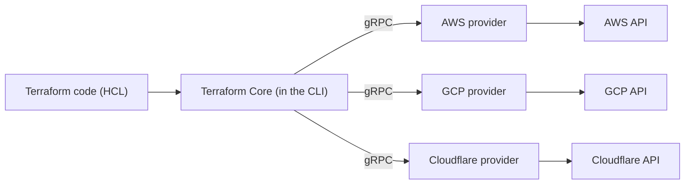

# Chapter 1 — Infrastructure as Code & where Terraform fits

## Learning outcomes

By the end of this chapter you can:

- Explain what Infrastructure as Code is and why it exists.
- Explain in two sentences why Terraform is declarative, and how that differs from Ansible and from CloudFormation.
- Name Terraform's core components (language, CLI/core, providers, vendors, backends, workspaces) and how they fit together.
- Explain the Terraform → OpenTofu fork and give a defensible 2026 answer to "which one should I use?"

## The problem before IaC

Before Infrastructure as Code, provisioning meant working directly on machines — by hand, or with scripts an admin ran locally and rarely reused. Building a VPC (a networking sandbox on AWS) the manual way took hours, even for someone who knew the platform well: click through consoles, remember which subnet needs which route table, hope you didn't skip a step the last time and won't skip one this time.

That manual process doesn't scale. It isn't versioned — there's no diff, no history, no way to know what changed between last Tuesday and today. It isn't repeatable — recreating the same environment for a second team means either redoing the clicking or trusting a wiki page to be accurate. And it isn't reviewable — nobody approves a sequence of console clicks the way they'd approve a pull request.

**Infrastructure as Code (IaC)** solves this by treating infrastructure definitions as software: written in text files, versioned in Git, reviewed through pull requests, and applied through a consistent, repeatable workflow. Once infrastructure is code, every practice that makes software development safer — diffs, code review, CI/CD, automated testing — becomes available for infrastructure too. That's the whole pitch: not "typing instead of clicking," but inheriting decades of software-engineering discipline that manual provisioning never had access to.

IaC isn't the first attempt at solving this. Configuration-management tools (Puppet, Chef) came first, configuring already-running machines. Image builders (Packer) came next, baking a known-good machine image for reuse. IaC frameworks are the next step up the stack: instead of configuring one machine or baking one image, they codify and repeatedly deploy *entire platforms* — networks, compute, databases, DNS, and the relationships between them — from a single source of truth.

## What Terraform is

Terraform is an IaC tool for building, changing, and versioning infrastructure safely and efficiently. It isn't the only one — Pulumi is another vendor-agnostic framework (using general-purpose languages instead of a custom DSL); AWS CloudFormation and GCP Deployment Manager are vendor-specific equivalents, tied to one cloud. Terraform's position: broad vendor coverage, a purpose-built declarative language, and (as of 2026) the largest and most mature provider ecosystem of the group.

Terraform manages this breadth through one architectural idea: **push everything vendor-specific behind a plugin.**

Terraform Core never talks to AWS, GCP, or Cloudflare directly. It talks to **providers** — plugins, written in Go, that speak gRPC to Core on one side and a vendor's API on the other. Providers are typically one-to-one with a vendor (the AWS provider, the GCP provider), though some vendors ship more than one to cover different product lines (Azure has several). This is why Terraform doesn't need to know anything about Cloudflare's DNS API or AWS's EC2 API — the provider owns that knowledge, and Core only needs to know how to call the provider.

The scale here matters: the Terraform Registry passed 3,000 published providers with 250+ partners by early 2026, and third-party trackers put the live count above 4,000 as of this writing. Practically, that means: if a platform has an API, there's a very good chance someone has already written a Terraform provider for it — down to genuinely obscure ones (there's a provider for ordering pizza, and one that reports which McDonald's ice-cream machines are broken).

Terraform's other core pieces, briefly — each gets its own chapter later in this path:

- **HCL** (HashiCorp Configuration Language) — the language you write. Declarative, designed for readability. Covered in depth in B4.
- **Backends** — where a workspace's state is stored. Local by default; remote backends (S3, GCS, HCP Terraform) are what make team collaboration possible. Covered in I6.
- **Workspaces** — one deployment of a codebase against a specific backend and set of inputs, comparable to "one installation" of a program. A single codebase can drive many workspaces (dev, staging, prod) sharing a backend.
- **State** — Terraform's record of the real infrastructure it manages, used to compute what has to change. Covered in depth starting at B9.

## Declarative vs. imperative — and where Terraform sits

This is the distinction the whole IaC landscape hangs on, so it's worth being precise.

**Imperative** tools describe *how* to reach an outcome — a sequence of steps: "check if this exists; if not, create it; then configure it." Bash scripts, most general-purpose languages, and Ansible's execution model (even though its playbooks are written in YAML) all work this way — top to bottom, step by step.

**Declarative** tools describe *what* the outcome should be — the desired end state — and leave the engine to figure out the steps. Terraform doesn't say "create a machine, then attach a disk, then assign an IP." It says "here is the machine I want, with this disk and this IP," and Terraform's planner computes the actions needed to get there, given whatever currently exists.

One useful way to hold this in your head: declarative languages lean on **nouns and adjectives** (this resource, with these properties); imperative languages lean on **verbs** (do this, then do that).

| Tool | Model | Vendor scope | Language |
|---|---|---|---|
| **Terraform** | Declarative | Multi-vendor (via providers) | Custom DSL (HCL) |
| **OpenTofu** | Declarative | Multi-vendor (via providers) | HCL (Terraform-compatible + extensions) |
| **Ansible** | Imperative (procedural playbooks) | Multi-vendor, agentless | YAML playbooks |
| **AWS CloudFormation** | Declarative | AWS-only | YAML/JSON templates |
| **Pulumi** | Declarative (imperative-style code) | Multi-vendor (via providers) | General-purpose (Python, TS, Go, ...) |

Two consequences of being declarative fall out of the DAG Terraform builds from your config:

- **Dependencies are inferred, not declared.** If your application's config reads a value from a database resource, Terraform sees that reference and knows the database has to exist first — no explicit ordering required. This is a directed acyclic graph (**DAG**): a dependency graph of actions with no cycles.
- **Circular dependencies can't be resolved automatically.** If resource A needs resource B, B needs C, and C needs A, there's no valid order — that's the one hard limitation of the declarative model, and it needs a manual workaround (splitting resources, restructuring the reference) rather than a Terraform feature to fix it.

Ansible is genuinely different in kind, not just in style: it's imperative and agentless, designed to configure things that already exist (packages, services, config files on a running machine) rather than to provision infrastructure and track its lifecycle over time via a state file. CloudFormation is declarative like Terraform, but locked to one vendor — you'd need a second, unrelated tool for a second cloud. That's the two-sentence answer the milestone for this chapter is asking for: *Terraform is declarative because you write the desired end state and let the engine compute the steps, unlike Ansible's step-by-step playbooks. Unlike CloudFormation, Terraform's declarative model isn't tied to one vendor — the same language and workflow apply across every provider in the registry.*

## The deployment flow, at a glance

Every Terraform change follows the same shape: write configuration, compute a plan, review it, apply it.

- **init** downloads the providers and modules your config references, and sets up the backend.
- **plan** is where Terraform does the real work: it refreshes its view of real infrastructure, compares that against your code, and computes a DAG of create/update/destroy actions — a diff, not a guess.
- **apply** executes that plan, in dependency order, running independent operations in parallel where the graph allows it.

This is deliberately a preview, not the full picture — B3 covers `init`/`plan`/`apply`/`destroy` command-by-command, with real output and the plan symbols (`+`, `~`, `-/+`) you'll read constantly. What matters here is the shape: **write → plan → apply**, with review sitting between plan and apply as the safety gate. That review step is one of Terraform's biggest practical advantages over imperative tools — you see the diff of *reality vs. intent* before anything changes, every time.

## Where Terraform actually gets used

The declarative, multi-vendor model isn't just architecturally clean — it maps onto real problems teams have:

- **Multi-cloud deployment** — one workflow across AWS, Azure, GCP instead of learning three consoles, useful for fault-tolerance and avoiding vendor lock-in.
- **Multi-tier application infrastructure** — Terraform tracks dependencies between tiers (a web tier depending on a database tier) and orders creation/teardown correctly without you specifying it.
- **Self-service platform teams** — modules encode an organization's standards once; product teams consume them without re-deriving the standards each time.
- **Policy-governed environments** — policy-as-code (Sentinel, OPA) can block a plan before it's ever applied, rather than after infrastructure already exists non-compliant.
- **Disposable environments** — spinning up a full stack for a PR, a demo, or a load test, then tearing it down, is cheap when the whole thing is one `apply`/`destroy` pair.

You don't need to memorize this list. The pattern to notice: everywhere Terraform gets used, the value comes from the same two properties — *one workflow across many vendors*, and *a reviewable diff before every change*.

## Terraform and OpenTofu

In August 2023, HashiCorp relicensed Terraform (and several other products) from the open-source MPL to the Business Source License (BSL), starting with Terraform 1.6. BSL is a "shared source" license: the code stays publicly viewable and auditable, but usage is restricted — specifically, it blocks offering the licensed software to third parties on a hosted or embedded basis that competes with HashiCorp's own products. Ordinary internal use, by individuals or companies, remains permitted.

The community's response was fast and organized: a manifesto published that same month, eventually signed by 150+ companies, 11 software projects, and 750+ individual developers, asked HashiCorp to reconsider — and warned that a fork would follow if it didn't. HashiCorp didn't reconsider. **OpenTofu** launched as that fork, backed by Scalr, env0, Spacelift, and Harness committing roughly 18 developers for five-plus years, and placed under the Linux Foundation specifically so no single company can control its direction again.

Since the fork, OpenTofu has stayed compatible with Terraform-written configuration while adding features the community had wanted for years and Terraform's open-source CLI still doesn't ship: **state encryption**, **provider `for_each`**, **early variable/`.tfvars` evaluation** (including in backend configuration), the **`-exclude` flag**, and **dynamic `prevent_destroy`**. HCL syntax, the provider protocol, and the state-file format remain compatible across both tools — the same providers work with either.

Two events since the initial fork are worth knowing as of 2026:

> 📌 **IBM acquired HashiCorp in December 2024** for $6.4B. Terraform is now developed under IBM.

> 📌 **Current 2026 guidance, per multiple independent comparisons:** OpenTofu is increasingly the lower-risk default for a *new* project — OSI-approved license, multi-vendor governance, full provider compatibility, plus the CLI features listed above. Staying on Terraform still makes sense if you're already invested in HCP Terraform, use Terraform **Stacks** (a Terraform-exclusive capability that lives in HCP Terraform, not the open CLI — covered in E2), or work somewhere procurement specifically requires HashiCorp as vendor. Existing Terraform investment on its own isn't a reason to migrate — evaluate OpenTofu at your next new-project or compliance decision point instead.

Practically, for the rest of this learning path: everything through the Associate-level material (B1–I8) is written to work identically with either tool. `terraform` and `tofu` are interchangeable for shared functionality; OpenTofu-specific features are called out explicitly (and get their own deep dive at E3) rather than assumed.

## Common misconceptions

- **"IaC just means scripting infrastructure."** Scripts are imperative — a sequence of commands. IaC (as Terraform implements it) is declarative: you describe the end state, and a persistent state file lets Terraform detect and reconcile drift on every run. A one-off script has no memory of what it already did; Terraform does.
- **"More providers = safer defaults."** A large registry means high odds a provider *exists*, not that every provider is HashiCorp-maintained or equally mature. Vendor-maintained providers vary in release cadence and quality just like any third-party library — treat provider choice with the same scrutiny you'd give any dependency.
- **"OpenTofu is a lesser Terraform."** By 2026 it's the reverse in several respects — OpenTofu is a strict superset of Terraform's open-source feature set, not a stripped-down copy. The gap that remains (mainly Stacks) is deliberately HCP-Terraform-exclusive, not a maturity gap in the open CLI.

## Summary

- IaC lets infrastructure inherit software-engineering practices — versioning, review, CI/CD — that manual provisioning never had.
- Terraform stays vendor-agnostic by pushing everything vendor-specific into **providers**, which speak gRPC to Terraform Core on one side and a vendor API on the other.
- Terraform is **declarative**: you describe desired end state; Terraform computes the plan (a DAG) to get there. This is the key distinction from imperative tools like Ansible, and the key advantage over vendor-locked declarative tools like CloudFormation.
- The full loop is **write → init → plan → review → apply** — this chapter previews it; B3 covers it command-by-command.
- HashiCorp's 2023 BSL relicense produced the **OpenTofu** fork (Linux Foundation, MPL 2.0); as of 2026, OpenTofu is a strict superset of Terraform's open-source CLI feature set, and is the commonly recommended default for new projects unless you need HCP-Terraform-exclusive features like Stacks.

## Exercises

1. **Recall** — In your own words, what does "declarative" mean, and what's the one thing a declarative engine can't resolve automatically?
2. **Apply** — A colleague says "we should just write a Bash script to provision our VPC, it's faster than learning Terraform." Give two concrete reasons why that script will hurt them in six months that a Terraform config wouldn't.
3. **Extend** — Look up one provider on the Terraform Registry for a system you use at work or in a personal project. Is it HashiCorp-maintained, partner-maintained, or community-maintained? What does that tell you about how much to trust its release cadence?

---

**Next: B2 — Install, providers & your first project.** You now know *why* Terraform exists and how it's shaped. Next you'll get it running — installing the CLI, wiring up cloud credentials, and standing up your first real resource.

## References

- [What is Terraform? (Intro)](../sources/terraform-docs/terraform-intro.md)
- [Terraform Use Cases](../sources/terraform-docs/terraform-use-cases.md)
- [TID Ch 1 — A brief overview of Terraform](../books/tid/chapters/01-brief-overview.md)
- Topic pages: [IaC fundamentals](../topics/iac-fundamentals.md) · [Core workflow](../topics/core-workflow.md) · [Providers](../topics/providers.md)
- [Version & Certification Facts](../research-cache/version-facts.md) (IBM/HashiCorp acquisition, provider count, 2026 OpenTofu guidance)
