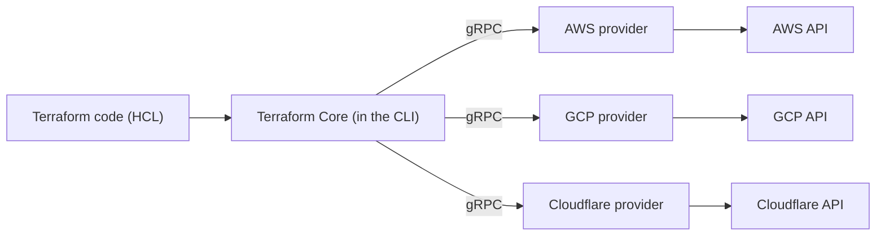

# Chapter 1 — Infrastructure as Code & where Terraform fits

## Learning outcomes

By the end of this chapter you can:

- Explain what Infrastructure as Code is and why it exists.
- Explain in two sentences why Terraform is declarative, and how that differs from Ansible and from CloudFormation.
- Name Terraform's core components (language, CLI/core, providers, vendors, modules, backends, workspaces, HCP Terraform) and how they fit together.
- Explain the Terraform → OpenTofu fork and give a defensible 2026 answer to "which one should I use?"

## The problem before IaC

Before Infrastructure as Code, provisioning meant working directly on machines — by hand, or with scripts an admin ran locally and rarely reused. Building a VPC (a networking sandbox on AWS) the manual way took hours, even for someone who knew the platform well: click through consoles, remember which subnet needs which route table, hope you didn't skip a step the last time and won't skip one this time.

That manual process doesn't scale. It isn't versioned — there's no diff, no history, no way to know what changed between last Tuesday and today. It isn't repeatable — recreating the same environment for a second team means either redoing the clicking or trusting a wiki page to be accurate. And it isn't reviewable — nobody approves a sequence of console clicks the way they'd approve a pull request.

**Infrastructure as Code (IaC)** solves this by treating infrastructure definitions as software: written in text files, versioned in Git, reviewed through pull requests, and applied through a consistent, repeatable workflow. Once infrastructure is code, it can use the same safety practices as software. Diffs. Code review. CI/CD. Automated testing. All of it becomes available for infrastructure too. This got popular enough to earn its own industry shorthand: **TACOS** (Terraform Automation and Collaboration Software). These are CI/CD platforms purpose-built for running Terraform. Examples include HCP Terraform, Terraform Enterprise, Spacelift, and Scalr. A3 covers CI/CD in full: running Terraform non-interactively in a pipeline, saving plans as artifacts, and gating applies through pull requests. For now, just know the term exists. That's the whole pitch: not "typing instead of clicking," but inheriting decades of software-engineering discipline that manual provisioning never had access to.

IaC isn't the first attempt at solving this. Configuration-management tools (Puppet, Chef) came first, configuring already-running machines. Image builders (Packer) came next, baking a known-good machine image for reuse. IaC frameworks are the next step up the stack: instead of configuring one machine or baking one image, they codify and repeatedly deploy *entire platforms* — networks, compute, databases, DNS, and the relationships between them — from a single source of truth.

## What Terraform is

Terraform is an IaC tool for building, changing, and versioning infrastructure safely and efficiently. It isn't the only one — Pulumi is another vendor-agnostic framework (using general-purpose languages instead of a custom DSL); AWS CloudFormation and GCP Deployment Manager are vendor-specific equivalents, tied to one cloud. Terraform's position: broad vendor coverage, a purpose-built declarative language, and (as of 2026) the largest and most mature provider ecosystem of the group.

Terraform manages this vendor breadth through one architectural idea: **push everything vendor-specific behind a plugin.**



Terraform Core never talks to AWS, GCP, or Cloudflare directly. It talks to **providers** — plugins, written in Go, that speak gRPC to Core on one side and a vendor's API on the other. Providers are typically one-to-one with a vendor (the AWS provider, the GCP provider), though some vendors ship more than one to cover different product lines (Azure has several). This is why Terraform doesn't need to know anything about Cloudflare's DNS API or AWS's EC2 API — the provider owns that knowledge, and Core only needs to know how to call the provider.

The scale here matters: the Terraform Registry passed 3,000 published providers with 250+ partners by early 2026, and third-party trackers put the live count above 4,000 as of this writing. Beyond the big three clouds, providers exist for Kubernetes, Helm, GitHub, Splunk, DataDog, and effectively any platform with an API. Practically, that means: if a platform has an API, there's a very good chance someone has already written a Terraform provider for it — down to genuinely obscure ones (there's a provider for ordering pizza, and one that reports which McDonald's ice-cream machines are broken).

Terraform's scope ranges from low-level infrastructure components (compute, storage, networking) up to high-level ones like DNS records and SaaS product features. Its approach to change is deliberately **immutable**: rather than patching a resource in place, its default instinct is to destroy the old one and create a new one. For most resources that's simpler to reason about than in-place mutation — no partial-upgrade states to debug, no drift between "what the patch script did" and "what's actually running."

But blind replacement isn't free, and it isn't always safe. Destroy-then-create means exactly that: the old resource is gone before the new one exists. For a stateless web server, that's a non-event. For a database, it can mean losing every row it held. This is exactly why Terraform's `lifecycle` block exists — `prevent_destroy` refuses to replace a resource by accident, and `create_before_destroy` builds the replacement before tearing down the original, so nothing goes down in between. Full treatment is I2; for now, the takeaway is narrower: immutable-by-default is the right instinct for disposable infrastructure, and the wrong one to apply blindly to anything holding data you can't regenerate.

Terraform's other core pieces, briefly — each gets its own chapter later in this path:

- **HCL** (HashiCorp Configuration Language) — the language you write. Declarative, designed for readability. HCL isn't Terraform-exclusive — Packer, Nomad, and Consul all use it too, each exposing its own resources and quirks. Covered in depth in B4.
- **CLI & Core** — you download one binary, `terraform`. **Core** is the engine inside it: the part that parses your HCL, builds the dependency graph, and computes and executes plans. The **CLI** is the command surface wrapped around that engine — `terraform init`, `validate`, `plan`, `apply`, and the rest. They aren't separate downloads; Core is only reachable *through* the CLI, which is why every workflow (even a CI/CD system like HCP Terraform or Spacelift) ultimately shells out to `terraform` rather than calling the engine directly. The pieces that *are* downloaded separately are the providers — Core fetches those plugin binaries during `init`.
- **Modules** — reusable, configurable collections of infrastructure, sourced from the Registry or authored locally. This is Terraform's answer to "standardize configurations": write the pattern once as a module, and every consuming team gets its improvements for free instead of re-deriving them. Covered in I4 (using modules) and I5 (authoring them).

!!! note "Module vs. provider"
    These two get conflated constantly, but they live at different layers entirely.

    **Provider** — a plugin binary (written in Go), downloaded during `init`. Teaches Terraform *how to talk to a platform's API* (AWS, GCP, Cloudflare). Defines which resource types even exist (`aws_instance`, `aws_s3_bucket`). It's the driver/translation layer between HCL and a vendor.

    **Module** — a bundle of HCL *you* (or someone) wrote: a group of resource/variable/output blocks packaged for reuse. It teaches Terraform nothing new about any platform. It just composes resources the providers already define, into a reusable unit.

    Analogy: the **provider** is the library that gives you the vocabulary (`aws_instance` and its arguments). A **module** is a function you write *using* that vocabulary — "a VPC with three subnets and a NAT gateway" — so callers don't re-assemble the pieces each time.

    Concrete contrast:

    | | Provider | Module |
    |---|---|---|
    | Written in | Go (compiled plugin) | HCL |
    | Comes from | Registry, fetched by `init` | Registry, Git, or local path |
    | Job | Define + manage resource types via a vendor API | Package a reusable grouping of those resources |
    | Talks to | The vendor's API (over gRPC) | Nothing — it's just config Core expands |

    A module almost always *uses* one or more providers; a provider never uses a module.

- **Backends** — where a workspace's state is stored. Local by default; remote backends (S3, GCS, HCP Terraform) are what make team collaboration possible. Some backends — the remote and HCP Terraform ones — go further, exposing APIs Terraform can call to run operations remotely, not just store state. Covered in I6.
- **Workspaces** — an overloaded term, and a common beginner trap. A *CLI workspace* is a named, separate state file living inside one backend and one config directory — good for short-lived throwaway copies of a stack, like a per-PR preview. An *HCP Terraform workspace* is a richer unit: its own config, variables, state, run history, and access controls — but it's a feature of the proprietary HCP Terraform SaaS, not something the open-source tooling gives you (a CLI workspace, by contrast, ships even in open-source OpenTofu). Worth planting early: CLI workspaces are *not* how you isolate long-lived dev/staging/prod. Those share one backend and one set of credentials, so a slip in one can reach another — HashiCorp's own docs say workspaces alone aren't a fit for separating environments. The open-source way to get real isolation is a directory per environment, each with its own backend and state, usually wired up with **Terragrunt** (an open-source wrapper over Terraform or OpenTofu) so the shared config stays DRY. How to lay out real environments is A7's job, with Terragrunt itself in E4.
- **State** — Terraform's record of the real infrastructure it manages, used to compute what has to change. Covered in depth starting at B9.
- **HCP Terraform** — HashiCorp's managed platform for the "Collaborate" side of Terraform: shared state, secret data, RBAC, and a private registry for modules and providers, on top of a consistent run environment. It's a proprietary, paid SaaS (with a self-hosted twin, Terraform Enterprise) — not part of the open-source tooling. Covered in A4.

## Declarative vs. imperative — and where Terraform sits

This is the distinction the whole IaC landscape hangs on, so it's worth being precise.

**Imperative** tools describe *how* to reach an outcome — a sequence of steps: "check if this exists; if not, create it; then configure it." Bash scripts and most general-purpose languages work this way — top to bottom, step by step. **Ansible** is the imperative tool most often compared to Terraform: its playbooks (written in YAML) are explicit step-by-step instructions, executed over SSH against machines that already exist. Ansible holds no persistent state — it re-runs its steps each time and relies on the playbook author to make each step idempotent, rather than diffing against a stored record the way Terraform does. (Being agentless isn't the distinguishing factor here — Terraform is agentless too, just over provider APIs instead of SSH.) Ansible and Terraform are commonly paired rather than treated as strict alternatives: Terraform provisions the infrastructure, Ansible configures what's now running on it.

**Declarative** tools describe *what* the outcome should be — the desired end state — and leave the engine to figure out the steps. Terraform doesn't say "create a machine, then attach a disk, then assign an IP." It says "here is the machine I want, with this disk and this IP," and Terraform's planner computes the actions needed to get there, given whatever currently exists.

One useful way to hold this in your head: declarative languages lean on **nouns and adjectives** (this resource, with these properties); imperative languages lean on **verbs** (do this, then do that).

| Tool | Model | Vendor scope | Language |
|---|---|---|---|
| **Terraform** | Declarative | Multi-vendor (via providers) | Custom DSL (HCL) |
| **OpenTofu** | Declarative | Multi-vendor (via providers) | HCL (Terraform-compatible + extensions) |
| **Ansible** | Imperative (step-by-step playbooks, no stored state) | Multi-vendor, agentless (SSH/API) | YAML playbooks |
| **AWS CloudFormation** | Declarative | AWS-only | YAML/JSON templates |
| **Pulumi** | Declarative outcome, imperative authoring style (loops, conditionals, classes) | Multi-vendor (via providers) | General-purpose (Python, TypeScript, Go, Java, C#) |

Two consequences of being declarative fall out of the DAG Terraform builds from your config:

- **Dependencies are inferred, not declared.** Say you define a VPC (a private network), a subnet carved out of that VPC, and a compute instance (a virtual machine) launched into that subnet. The subnet references the VPC's ID, and the instance references the subnet's ID. Terraform reads those references and infers the order on its own: VPC first, then subnet, then instance. You never write "create the VPC before the subnet" — the reference *is* the dependency. This is a directed acyclic graph (**DAG**): a dependency graph of actions with no cycles.
- **Circular dependencies can't be resolved automatically.** If resource A needs resource B, B needs C, and C needs A, there's no valid order — that's the one hard limitation of the declarative model, and it needs a manual workaround (splitting resources, restructuring the reference) rather than a Terraform feature to fix it.

CloudFormation is declarative like Terraform, but locked to one vendor — you'd need a second, unrelated tool for a second cloud. That's the two-sentence answer the milestone for this chapter is asking for: *Terraform is declarative because you write the desired end state, tracked in a state file, and let the engine compute the steps — unlike Ansible's step-by-step playbooks, which hold no state and re-run their instructions each time. Unlike CloudFormation, Terraform's declarative model isn't tied to one vendor — the same language and workflow apply across every provider in the registry.*

## The deployment flow, at a glance

Every Terraform change follows the same shape: write configuration, compute a plan, review it, apply it.


- **init** downloads the providers and modules your config references, and sets up the backend.
- **plan** is where Terraform does the real work: it refreshes its view of real infrastructure, compares that against your code, and computes a DAG of create/update/destroy actions. Call it a diff, not a guess. It reads the actual current state of your infrastructure and subtracts it from the end state your config describes, so what you see is the exact set of changes needed to close that gap — not an estimate of what might happen. A plan that says "1 to add, 0 to change, 0 to destroy" means precisely that, assuming nothing else moves the infrastructure between plan and apply.
- **apply** executes that plan, in dependency order, running independent operations in parallel where the graph allows it.

You may wonder where `terraform validate` fits, since B2 introduces it. It's not one of the essential phases above, which is why it's not in the diagram. `plan` already validates your config as a side effect — it will refuse to run on invalid HCL. `validate` is a separate, optional *fast* check: it inspects syntax and internal consistency only, with no state access and no calls to a vendor's API, so it returns in a fraction of a second. It slots in after `init` and before `plan`, and earns its keep in editors, pre-commit hooks, and CI pipelines where you want instant feedback on a typo without waiting for a full refresh. It changes nothing, so it never belongs *between* plan and apply.

This is deliberately a preview, not the full picture — B3 covers `init`/`plan`/`apply`/`destroy` command-by-command, with real output and the plan symbols (`+`, `~`, `-/+`) you'll read constantly. What matters here is the shape: **write → plan → apply**, with review sitting between plan and apply as the safety gate. That review step is one of Terraform's biggest practical advantages over imperative tools — you see the diff of *reality vs. intent* before anything changes, every time.

## Where Terraform actually gets used

The declarative, multi-vendor model isn't just architecturally clean — it maps onto real problems teams have:

- **Multi-cloud deployment** — one workflow across AWS, Azure, GCP instead of learning three consoles, useful for fault-tolerance and avoiding vendor lock-in.
- **Multi-tier application infrastructure** — Terraform tracks dependencies between tiers (a web tier depending on a database tier) and orders creation/teardown correctly without you specifying it.
- **Self-service platform teams** — modules encode an organization's standards once; product teams consume them without re-deriving the standards each time.
- **Policy-governed environments** — policy-as-code (Sentinel, OPA) can block a plan before it's ever applied, rather than after infrastructure already exists non-compliant.
- **PaaS application setup** — codifying a Heroku app's add-ons (a database, a DNSimple CNAME, a Cloudflare CDN in front of it) without touching a single web console.
- **Software-defined networking** — Consul-Terraform-Sync (Network Infrastructure Automation) auto-generates Terraform config to reconfigure an SDN whenever a service registers with Consul, replacing a ticket-based network-change process.
- **Kubernetes** — Terraform can both stand up the cluster itself *and* manage what runs inside it (pods, deployments, services) — two different jobs, same tool.
- **Disposable environments** — spinning up a full stack for a PR, a demo, or a load test, then tearing it down, is cheap when the whole thing is one `apply`/`destroy` pair.
- **Software demos** — bootstrapping a full demo environment on whichever cloud a prospect already uses, with parameters (like cluster size) adjustable per audience.

You don't need to memorize this list. The pattern to notice: everywhere Terraform gets used, the value comes from the same two properties — *one workflow across many vendors*, and *a reviewable diff before every change*.

### In practice, from the field

The list above is the official catalog from [[terraform-intro]] and [[terraform-use-cases]]. Hafner's *Terraform in Depth* (TID Ch1 §1.5) adds four more from direct field experience — narrower and more anecdotal, but worth knowing because they show up constantly in practice:

- **Machine learning training** — renting GPU/compute clusters per job instead of owning idle hardware; Terraform lets the cluster design evolve iteratively (add autoscaling later) and lets teams spin whole clusters up and down in moments.
- **API and web services** — the classic stack (load balancers, app instances, TLS certs, DNS, cache, database, subnets) wrapped in a module so application developers never have to touch the networking layer directly.
- **Single sign-on structures** — managing SSO systems (e.g. Okta: users, groups, policies, applications) as Terraform resources, mainly for the audit trail and multi-approver review this buys on permission changes.
- **Rapid prototyping** — hackathons and startups skip the "spend a day standing up infra basics" tax by consuming modules an expert already built, instead of reinventing them under time pressure.

## Terraform and OpenTofu

The tension had been building for a while before it became public: HashiCorp updated its contributor documentation in 2021 to state it would no longer review external pull requests to Terraform — an early signal, in hindsight, of the shift to come. In August 2023, HashiCorp relicensed Terraform (and several other products) from the open-source MPL to the Business Source License (BSL), starting with Terraform 1.6. BSL is a "shared source" license: the code stays publicly viewable and auditable, but usage is restricted — specifically, it blocks offering the licensed software to third parties on a hosted or embedded basis that competes with HashiCorp's own products. Ordinary internal use, by individuals or companies, remains permitted.

The community's response was fast and organized: a manifesto published that same month, eventually signed by 150+ companies, 11 software projects, and 750+ individual developers, asked HashiCorp to reconsider — and warned that a fork would follow if it didn't. Much of the concern centered on how dependent Terraform was on third-party-built tooling — Gruntworks' Terratest and Terragrunt among them — that the community felt the relicense put at risk. HashiCorp didn't reconsider. **OpenTofu** launched as that fork, backed by Scalr, env0, Spacelift, and Harness committing roughly 18 developers for five-plus years, and placed under the Linux Foundation specifically so no single company can control its direction again.

Since the fork, OpenTofu has stayed compatible with Terraform-written configuration while adding features the community had wanted for years and Terraform's open-source CLI still doesn't ship: **state encryption**, **provider `for_each`**, **early variable/`.tfvars` evaluation** (including in backend configuration), the **`-exclude` flag**, and **dynamic `prevent_destroy`**. HCL syntax, the provider protocol, and the state-file format remain compatible across both tools — the same providers work with either. One concrete side-effect of the relicense: several open-source package managers, Homebrew included, stopped shipping Terraform versions beyond **v1.5.7** — the last MPL release — while continuing to carry OpenTofu.

Two events since the initial fork are worth knowing as of 2026:

!!! info "IBM now owns HashiCorp"
    **IBM acquired HashiCorp in December 2024** for $6.4B. Terraform is now developed under IBM.

!!! info "Current 2026 guidance, per multiple independent comparisons"
    OpenTofu is increasingly the lower-risk default for a *new* project — OSI-approved license, multi-vendor governance, full provider compatibility, plus the CLI features listed above. Staying on Terraform still makes sense if you're already invested in HCP Terraform, use Terraform **Stacks** (a Terraform-exclusive capability that lives in HCP Terraform, not the open CLI — covered in E2), or work somewhere procurement specifically requires HashiCorp as vendor. Existing Terraform investment on its own isn't a reason to migrate — evaluate OpenTofu at your next new-project or compliance decision point instead.

Practically, for the rest of this learning path: everything through the Associate-level material (B1–I8) is written to work identically with either tool. `terraform` and `tofu` are interchangeable for shared functionality; OpenTofu-specific features are called out explicitly (and get their own deep dive at E3) rather than assumed.

## Lab setup: a free local AWS (Docker)

Everything so far has been the *why*. Before the next chapters put you on a keyboard, stand up a lab you can practise in without an AWS account, without cloud credentials, and without a bill. The lab is a **local AWS emulator** — a Docker container that answers AWS API calls on your own machine. Point the AWS provider at it and `terraform apply` creates *emulated* S3 buckets, DynamoDB tables, and queues locally. `destroy` costs nothing and risks nothing. Every chapter from here on carries a **🧪 Lab** section that runs against this one environment.

Several emulators fit, and all listen on the same gateway port **4566**, so the labs run identically on any of them — you swap only the `docker run` line. Three worth knowing, in the order this book recommends:

- **Floci** (`floci/floci`) — **MIT, free, no account, no token.** A Quarkus-native emulator with ~68 services, a tiny image, and near-instant startup; it serves the LocalStack API on `:4566`, so the `tflocal` wrapper drives it directly. Ships extras (a local console UI, a CLI, Azure/GCP siblings). **The book's default.**
- **MiniStack** (`ministackorg/ministack`) — **MIT, free forever, no account, no token.** ~270 MB, ~60 services. Another solid zero-signup choice.
- **LocalStack** (`localstack/localstack`) — the established, most-documented emulator. As of March 2026 its image needs a **free account + `LOCALSTACK_AUTH_TOKEN`** (Hobby plan). Most mature; slightly more setup.

All three are MIT/AWS-compatible on `:4566` and work with `tflocal`; Floci and MiniStack skip the signup, LocalStack has the deepest docs. Pick one — the labs don't care which.

!!! warning "Emulation is not AWS — know what the lab does and doesn't prove"
    An emulator *mocks* AWS APIs; it is not AWS. A config can `apply` cleanly against it and still behave differently — or not exist at all — on real AWS. That's fine for what these labs are for: practising the **workflow** (`init`/`plan`/`apply`/`destroy`), **HCL authoring**, state, `for_each`, and modules, where fidelity to AWS's every quirk doesn't matter. It is the wrong tool for learning a service's real-world edge behaviour. The reliable free surface is **S3, DynamoDB, SQS, SNS, IAM, STS** — the labs stay inside it.

### Step 1 — install Docker

The emulator runs as a container, so you need a container runtime. Install **Docker Desktop** (macOS/Windows) or **Docker Engine** (Linux) and confirm it's up:

```shell
docker version      # client + server (daemon) both reported = Docker is running
```

If `docker version` errors on the server line, start Docker Desktop (or `sudo systemctl start docker` on Linux) before continuing.

### Step 2 — start the emulator

**Floci (recommended — nothing to sign up for):**

```shell
docker run -d --name floci \
  -p 4566:4566 \
  -v /var/run/docker.sock:/var/run/docker.sock \
  -u root \
  floci/floci:latest
```

The Docker socket mount lets Floci spin up *real* containers for services like RDS and Lambda; `-u root` is what the project's README uses so it can reach the socket. A `docker-compose.yml`, if you'd rather keep it in the repo:

```yaml
services:
  floci:
    image: floci/floci:latest
    ports:
      - "127.0.0.1:4566:4566"
    volumes:
      - /var/run/docker.sock:/var/run/docker.sock
    user: root
```

```shell
docker compose up -d
```

??? note "Alternative — MiniStack (also MIT, no signup)"
    Another zero-account option, `ministackorg/ministack` (~60 services). Same port, same `tflocal` flow:

    ```shell
    docker run -p 4566:4566 ministackorg/ministack
    # mount -v /var/run/docker.sock:/var/run/docker.sock for real RDS/ECS/Lambda
    ```

    Health at `http://localhost:4566/_ministack/health` (also serves the LocalStack-compatible path).

??? note "Alternative — LocalStack (needs a free account + token as of 2026)"
    Until early 2026 LocalStack shipped a no-signup open-source **Community** image. In **March 2026** that image stopped receiving updates, and development consolidated into a single `localstack/localstack` image that **prompts for an auth token**. It's still free for personal use through the **Hobby plan** (create a free account, export the token as `LOCALSTACK_AUTH_TOKEN`); the current stable is `2026.06.2`, and the friendliest start is the `localstack` CLI:

    ```shell
    pip install localstack
    export LOCALSTACK_AUTH_TOKEN=<your-token>    # from your free Hobby-plan account
    localstack start -d
    ```

    Raw Docker equivalent:

    ```shell
    docker run --rm -it \
      -p 127.0.0.1:4566:4566 \
      -p 127.0.0.1:4510-4559:4510-4559 \
      -e LOCALSTACK_AUTH_TOKEN=${LOCALSTACK_AUTH_TOKEN:?} \
      localstack/localstack:stable          # pin :2026.06 for a fixed version
    ```

    A pre-March-2026 Community tag (`localstack/localstack:4.12`) runs tokenless but is frozen with no security patches — a last resort, not the default. The GitHub Student Developer Pack unlocks a free **Student Plan**.

Everything multiplexes through one gateway port, **4566**. Confirm the container is healthy — the health endpoint returns a JSON map of each service's state. Floci and LocalStack both answer the `/_localstack/health` path (MiniStack answers that *and* its own `/_ministack/health`):

```shell
curl -s http://localhost:4566/_localstack/health
```

```json
{ "services": { "s3": "available", "dynamodb": "available", "iam": "available", ... } }
```

### Step 3 — how Terraform will talk to it

The Terraform **CLI itself** you install in the next chapter (B2) — this section only stands up the *sandbox*. When B2's lab arrives, there are three ways to aim Terraform at the emulator instead of real AWS, all pointing at `localhost:4566`. The labs use `tflocal`, which works against **any** of the three:

- **`tflocal`** — a thin wrapper (`pip install terraform-local`) that runs Terraform and, behind the scenes, drops a temporary override file pointing every AWS endpoint at `localhost:4566` with dummy credentials. Run `tflocal init` / `tflocal plan` / `tflocal apply` exactly like the real commands; your `.tf` files stay untouched, so the *same* config still applies to real AWS with plain `terraform`. It's LocalStack's wrapper, but since it just targets `:4566` (and Floci/MiniStack serve the LocalStack API there), it drives all three.
- **`AWS_ENDPOINT_URL`** — the AWS provider (`~> 6.0`) honours this env var. `export AWS_ENDPOINT_URL=http://localhost:4566` plus dummy keys, then plain `terraform apply`. No wrapper, no config edit.
- **A manual `provider "aws"` block** with an `endpoints` block and dummy keys. Explicit, but it hard-wires the config to the emulator, so keep it in a local override file. B2's lab shows this alongside `tflocal`.

A one-line install for the wrapper and its companion CLIs, ready for the next chapter:

```shell
pip install terraform-local awscli-local   # provides `tflocal` and `awslocal`
```

`awslocal` is the AWS CLI pre-pointed at `:4566` — `awslocal s3 ls` lists the buckets your Terraform labs create, a handy way to confirm an `apply` really did something.

With Docker running, an emulator healthy on 4566, and `tflocal` installed, your lab is ready. Every chapter's **🧪 Lab** from B2 onward assumes exactly this — Floci by default, MiniStack or LocalStack if you prefer.

## Common misconceptions

- **"IaC just means scripting infrastructure."** Scripts are imperative — a sequence of commands, with no memory of what they already did. IaC (as Terraform implements it) is declarative: you describe the end state, and a persistent state file lets Terraform detect and reconcile drift on every run, rather than blindly re-running steps like a script (or, for that matter, like Ansible — see the comparison table above).
- **"OpenTofu is a lesser Terraform."** By 2026 it's the reverse in several respects — OpenTofu is a strict superset of Terraform's open-source feature set, not a stripped-down copy (see [[version-facts]]). The gap that remains (mainly Stacks) is deliberately HCP-Terraform-exclusive, not a maturity gap in the open CLI.

## Summary

- IaC lets infrastructure inherit software-engineering practices that manual provisioning never had: versioning, review, and CI/CD (informally, **TACOS**).
- Terraform stays vendor-agnostic by pushing everything vendor-specific into **providers**, which speak gRPC to Terraform Core on one side and a vendor API on the other. Its approach to change is **immutable** — replace, don't patch in place.
- Terraform is **declarative**: you describe desired end state; Terraform computes the plan (a DAG) to get there. This is the key distinction from imperative tools like Ansible, and the key advantage over vendor-locked declarative tools like CloudFormation.
- **Modules** standardize configuration (write once, every team benefits); **HCP Terraform** is the managed platform for the collaborate side — shared state, secrets, RBAC, private registry.
- The full loop is **write → init → plan → review → apply** — this chapter previews it; B3 covers it command-by-command.
- Terraform shows up everywhere from multi-cloud and Kubernetes to PaaS setup, SDN automation, and ML-training clusters — the constant is *one workflow across vendors* plus *a reviewable diff before every change*.
- HashiCorp's 2023 BSL relicense produced the **OpenTofu** fork (Linux Foundation, MPL 2.0); as of 2026, OpenTofu is a strict superset of Terraform's open-source CLI feature set, and is the commonly recommended default for new projects unless you need HCP-Terraform-exclusive features like Stacks.

## Exercises

1. **Recall** — In your own words, what does "declarative" mean, and what's the one thing a declarative engine can't resolve automatically?
2. **Apply** — A colleague says "we should just write a Bash script to provision our VPC, it's faster than learning Terraform." Give two concrete reasons why that script will hurt them in six months that a Terraform config wouldn't.
3. **Extend** — Look up one provider on the Terraform Registry for a system you use at work or in a personal project. Is it HashiCorp-maintained, partner-maintained, or community-maintained? What does that tell you about how much to trust its release cadence?

---

**Next: B2 — Install, providers & your first project.** You now know *why* Terraform exists and how it's shaped. Next you'll get it running — installing the CLI, wiring up cloud credentials, and standing up your first real resource.

## References

- [What is Terraform? (Intro)](../sources/terraform-docs/terraform-intro.md)
- [Terraform Use Cases](../sources/terraform-docs/terraform-use-cases.md)
- [TID Ch 1 — A brief overview of Terraform](../books/tid/chapters/01-brief-overview.md)
- Topic pages: [IaC fundamentals](../topics/iac-fundamentals.md) · [Core workflow](../topics/core-workflow.md) · [Providers](../topics/providers.md)
- [Version & Certification Facts](../research-cache/version-facts.md) (IBM/HashiCorp acquisition, provider count, 2026 OpenTofu guidance)
- [IaC/config-mgmt tool comparison](../research-cache/iac-tool-comparison.md) (Ansible, Pulumi — verified 2026-07-03)
- [Floci Facts](../research-cache/floci-facts.md) (MIT, Quarkus-native emulator — book's default lab; Docker, Terraform wiring, comparison table — verified 2026-07-09)
- [MiniStack Facts](../research-cache/ministack-facts.md) (MIT, free-forever emulator; Docker, Terraform wiring — verified 2026-07-09)
- [LocalStack Facts](../research-cache/localstack-facts.md) (Docker setup, 2026 packaging/auth-token change, `tflocal` — verified 2026-07-09)
- Web (verified 2026-07-09): [Floci](https://github.com/floci-io/floci) · [floci-io org](https://github.com/floci-io) · [MiniStack](https://github.com/ministackorg/ministack) · [LocalStack install](https://docs.localstack.cloud/aws/getting-started/installation/) · [Terraform with LocalStack](https://docs.localstack.cloud/aws/integrations/infrastructure-as-code/terraform/) · [The Road Ahead for LocalStack](https://blog.localstack.cloud/the-road-ahead-for-localstack/)
