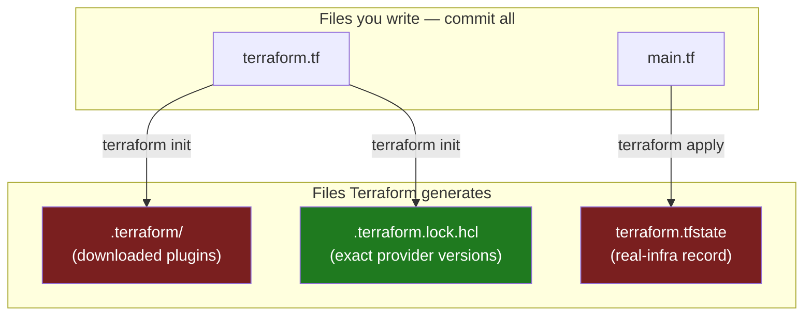
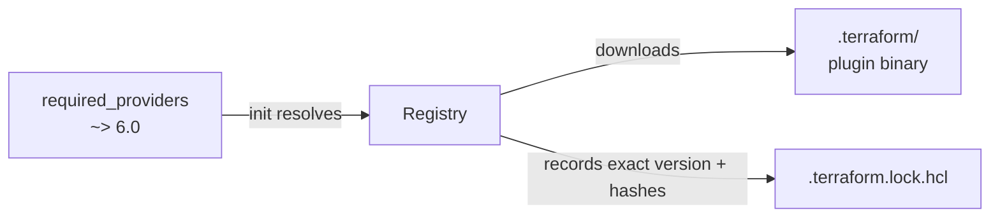

# Chapter 2 — Install, providers & your first project

## Learning outcomes

By the end of this chapter you can:

- Install the Terraform (or OpenTofu) CLI on your platform and verify it.
- Wire cloud credentials so a provider can authenticate, without hard-coding a secret.
- Declare a provider with `required_providers`, understand the `source` address and version constraint, and configure it with a `provider` block.
- Lay out a first working directory, run `terraform init`, and provision one real resource from scratch.
- Recognize the files Terraform generates (`.terraform/`, `.terraform.lock.hcl`, `terraform.tfstate`) and which of them to commit.

## Nothing runs until three things are in place

Chapter 1 was the *why*. This chapter is where you get Terraform running for real. Before a single resource can be created, three pieces must line up:

1. **The CLI** — the `terraform` binary, containing Core (the engine).
2. **A provider plugin** — the Go binary that knows how to talk to your target platform's API. Core fetches it during `init`.
3. **Credentials** — the provider still needs permission to call the vendor's API on your behalf.

Miss any one and nothing works. No CLI, no engine. No provider, and Core has no idea what an `aws_instance` even is. No credentials, and the provider gets a `403` the moment it tries to create anything. This chapter installs all three, then stands up your first resource.

There is a second, quieter lesson here: **project layout**. The mistakes you make in the first directory — where files go, what gets committed, how versions are pinned — are the ones that hurt for months. So this chapter is as much about the four files you write and the three files Terraform generates as it is about the install.

## Install the CLI

Both tools ship as a **single self-contained binary** — no runtime, no dependencies — installable via a package manager or by hand. They differ only in names:

- **Terraform** — package and binary are both `terraform`.
- **OpenTofu** — binary is **`tofu`**, but the package is **`opentofu`** (that mismatch is what makes `choco install tofu` / `brew install hashicorp/tap/tofu` fail).

Configuration is byte-identical between them, so install whichever you'll use; the commands below cover both.

!!! warning "Don't install OpenTofu from HashiCorp's channels"
    `hashicorp/tap` (Homebrew) and `apt.releases.hashicorp.com` ship **HashiCorp products only** — OpenTofu isn't one. Use OpenTofu's *own* packages, always named **`opentofu`** (or the `tofu` binary via the standalone script/Snap).

### Package manager

**macOS (Homebrew)**

```shell
# Terraform — HashiCorp's own tap (see the BSL note below)
brew tap hashicorp/tap
brew install hashicorp/tap/terraform

# OpenTofu — in homebrew-core, no tap needed
brew install opentofu
```

**Windows (Chocolatey)**

```shell
choco install terraform     # Terraform
choco install opentofu      # OpenTofu  (package 'opentofu', installs the 'tofu' binary)
```

**Linux (Debian/Ubuntu)**

```shell
# Terraform — HashiCorp signed apt repo
wget -O- https://apt.releases.hashicorp.com/gpg | \
  gpg --dearmor | \
  sudo tee /usr/share/keyrings/hashicorp-archive-keyring.gpg > /dev/null
echo "deb [signed-by=/usr/share/keyrings/hashicorp-archive-keyring.gpg] \
  https://apt.releases.hashicorp.com $(lsb_release -cs) main" | \
  sudo tee /etc/apt/sources.list.d/hashicorp.list
sudo apt update && sudo apt-get install terraform

# OpenTofu — official convenience script (handles deb/rpm/snap/standalone)
curl -fsSL https://get.opentofu.org/install-opentofu.sh -o install-opentofu.sh
chmod +x install-opentofu.sh
./install-opentofu.sh --install-method deb    # use --install-method rpm on RHEL/Fedora
```

RHEL/CentOS/Amazon Linux/Fedora: Terraform via HashiCorp's `yum`/`dnf` repo (`yum install terraform`); OpenTofu via the same script with `--install-method rpm`, its rpm repo, or a **Snap** (`snap install opentofu`). See [OpenTofu install docs](https://opentofu.org/docs/intro/install/) for every method.

!!! warning "The BSL wrinkle: some package managers freeze Terraform at v1.5.7"
    HashiCorp's 2023 relicense to the BSL (Chapter 1) had a side-effect: several community package managers stopped shipping Terraform past **v1.5.7**, the last MPL release — plain Homebrew's `terraform` formula among them. That is why the macOS command uses **`hashicorp/tap`** (HashiCorp's own, current at 1.15.8). If `terraform version` reports 1.5.7 after a plain `brew install terraform`, this is why. **OpenTofu (MPL 2.0) has no such restriction** — every channel tracks the latest release (1.12.4).

### Manual install

Download the zip for your OS — Terraform from `releases.hashicorp.com`, OpenTofu from `github.com/opentofu/opentofu/releases` — unzip, and put the single executable on your `PATH`:

```shell
echo $PATH                                    # list PATH dirs (macOS/Linux)
mv ~/Downloads/terraform /usr/local/bin/      # or:  mv ~/Downloads/tofu /usr/local/bin/
```

On Windows, run `path` and move `terraform.exe` / `tofu.exe` into one of the listed dirs.

Both projects are Go programs, so a third route exists when no pre-compiled binary matches your platform: build it yourself.

```shell
git clone https://github.com/hashicorp/terraform      # or .../opentofu/opentofu
cd terraform
go install                                            # binary lands in $GOPATH/bin
```

This is the escape hatch for an unusual OS/arch, not a normal install path — you get whatever `main` currently is, not a released version.

### Verify and enable completion

```shell
terraform version      # e.g. 1.15.8
tofu version           # e.g. 1.12.4     (whichever you installed)
```

`-help` lists the subcommands; append it to any subcommand for its flags (`terraform plan -help` / `tofu plan -help`). Enable tab completion once, then restart your shell:

```shell
touch ~/.bashrc                        # or the Zsh equivalent
terraform -install-autocomplete        # tofu -install-autocomplete for OpenTofu
```

!!! note "The compatibility promise"
    Both tools keep backward compatibility across **minor** versions: a config for one 1.x keeps working on any later 1.x. That is what lets `required_version = ">= 1.2"` be an honest floor rather than a gamble — more on that below. OpenTofu also keeps the `terraform {}` block name (there is no `tofu {}` block), so a config is portable between the two without edits.

## Wire up credentials

A provider needs permission to act. **Providers have no standard credential system** — each one authenticates its own way, so always read the provider's docs for a new platform. The important discipline is universal, though: **credentials never go in your `.tf` files.** They land in state and in Git if you hard-code them.

The AWS provider is the common first case. It reuses the **standard AWS credential chain** — the exact same one the AWS CLI and the SDKs use. The simplest route for local development is environment variables:

```shell
export AWS_ACCESS_KEY_ID="AKIA..."
export AWS_SECRET_ACCESS_KEY="..."
export AWS_REGION="us-west-2"
aws configure list                 # verify the chain sees your credentials
```

Running `aws configure` writes the same values to `~/.aws/credentials`, which the provider also reads. Either works. What matters is that the secret lives in your environment or an AWS config file — **not in the config Terraform tracks.**

!!! tip "Static keys are the beginner default, not the destination"
    Exported access keys are fine while you're learning. In a real pipeline they are a top security risk — long-lived keys sitting in CI variables. The production answer is short-lived credentials minted on demand via OIDC (a pipeline assumes a role with no stored secret). That is A6's subject. For now, an exported key in your own shell is acceptable; just never commit one.

### Coming from Python: is there a `.env` for Terraform?

If you've used `python-dotenv`, the reflex is to drop secrets in a `.env` file and have the tool load it. **Terraform has no `.env` autoload.** It never reads a file called `.env`. But two categories of value need feeding in, and each has its own mechanism, so it helps to keep them separate:

1. **Provider credentials** — the cloud API keys from the section above. These ride the provider's own credential chain (`AWS_ACCESS_KEY_ID`, `~/.aws/credentials`), not a Terraform mechanism.
2. **Your own input variables** — a DB password, an environment name, a CIDR block. These are Terraform *variables* (Chapter 6 covers declaring them), and Terraform has three ways to supply their values.

**`TF_VAR_*` environment variables.** Terraform maps any shell variable named `TF_VAR_<name>` onto the input variable `<name>`. This is the direct env-to-config bridge:

```shell
export TF_VAR_db_password="s3cr3t"     # feeds variable "db_password"
```

**`*.auto.tfvars` / `terraform.tfvars` files.** This is the closest thing to a `.env`: a file of `key = value` lines that Terraform **auto-loads** from the working directory with no flag. `terraform.tfvars`, `terraform.tfvars.json`, and any `*.auto.tfvars` are picked up automatically; keep a secret one out of Git.

```hcl
# secrets.auto.tfvars   ← git-ignore this file
db_password = "s3cr3t"
```

```gitignore
# .gitignore
*.tfvars
!example.tfvars      # keep a committed template with dummy values
```

**A real `.env`, via `direnv`.** If you specifically want a literal `.env`-style file auto-sourced into your shell, that is a shell tool's job, not Terraform's. [`direnv`](https://direnv.net/) reads an `.envrc` on `cd` and exports the vars; Terraform then sees them like any other environment variable:

```shell
# .envrc   ← git-ignore this file
export AWS_ACCESS_KEY_ID="AKIA..."
export TF_VAR_db_password="s3cr3t"
```

When the same variable is set more than one way, Terraform resolves it by a fixed precedence. Highest wins:

| Source | Precedence |
|---|---|
| `-var` / `-var-file` on the command line | highest |
| `*.auto.tfvars` (lexical order) |  |
| `terraform.tfvars.json` |  |
| `terraform.tfvars` |  |
| `TF_VAR_*` environment variable |  |
| variable `default` | lowest |

Note the ordering catch: a `terraform.tfvars` file **overrides** a `TF_VAR_*` env var, not the other way round. Files beat the environment.

!!! danger "A variable value still lands in state"
    None of these keeps a secret *safe* — it only keeps it out of your `.tf` files and out of Git. Whatever you feed as a variable, Terraform writes its value into state. Marking the variable `sensitive = true` only masks it in CLI output; the plaintext still sits in the state file. Terraform 1.10+ adds `ephemeral` variables that are omitted from state and plan, and the real production answer is a secret manager or Vault. Chapter 23 (A6) is the full treatment; for now, treat state as sensitive and never commit it.

    OpenTofu users have one extra option here (see the box below), but the same discipline applies: encrypting the file is a safety net, not a licence to relax about what state contains.

!!! info "OpenTofu — encrypted state (and the same `TF_VAR_` vars)"
    OpenTofu reads the **same** `TF_VAR_*` and `TF_*` environment variables as Terraform — there is *no* separate `TOFU_VAR_` prefix, so credentials and variables carry over unchanged (a compatibility win, not a divergence).

    It also ships **native state (and plan) encryption**, which Terraform's open-source CLI lacks — a built-in answer to the plaintext-in-state problem above. Two caveats keep the warning true even so. It is **opt-in and per-target**: you add an `encryption` block with separate `state` and `plan` sections, so state stays plaintext until you configure it, and a plan file stays plaintext unless you encrypt that target too. And it only protects data **at rest**; OpenTofu's own docs note it "cannot protect the sensitive values in the state file from the person running the `tofu` command," since the value is decrypted for the run. Treat it as defence in depth on top of "state is sensitive," not a replacement. E3 covers the setup.

## Anatomy of a project directory

A Terraform project is just a directory of `.tf` files. Terraform loads **every `.tf` file** in the working directory and resolves dependencies by reference, so **filenames are for humans, not for Terraform** — block order and file split are entirely your choice. Convention, not a rule, gives you a clean starting layout:

| File | Holds |
|---|---|
| `terraform.tf` (or `providers.tf`) | the `terraform` block — `required_providers`, version floor, backend later |
| `main.tf` | the `resource` and `data` blocks — the bulk of the logic |
| `variables.tf` | `variable` declarations (Chapter 6) |
| `outputs.tf` | `output` blocks (Chapter 6) |

For a first project, `terraform.tf` and `main.tf` are enough; the other two arrive when you parameterize in B6.

!!! info "OpenTofu — extra file extensions"
    OpenTofu reads the same `.tf` files, and (1.8+) also `.tofu` files — loaded *instead of* a same-named `.tf` when present, so you can ship OpenTofu-only overrides without forking the project. Its CLI config file is `.tofurc` (Terraform's is `.terraformrc`); it reads the same `TF_*` environment variables as Terraform (no separate `TOFU_*` prefix). Keep everything in `.tf` for portable, tool-neutral projects; reach for `.tofu` only when a file must diverge.

Alongside the files you write, Terraform **generates three of its own** on first use. Knowing what each is — and whether to commit it — is half of avoiding beginner pain:



- **`.terraform/`** — a hidden cache holding the downloaded provider (and module) binaries. Recreatable by re-running `init`. **Do not commit it** — it's large and platform-specific.
- **`.terraform.lock.hcl`** — the **dependency lock file**. Records the *exact* provider versions and checksums `init` chose. **Commit it.** It's what makes your teammate and your CI pipeline install the identical provider you tested against.
- **`terraform.tfstate`** — Terraform's record of the real infrastructure (Chapter 9 covers it in depth). **Do not commit it.** It can hold secrets in plaintext, and committing it invites merge conflicts and corruption. Teams move it to a remote backend (I6); for now it stays local and out of Git.

!!! info "OpenTofu — same files, two genuine improvements"
    OpenTofu keeps the **same filenames** (`.terraform/`, `.terraform.lock.hcl`, `terraform.tfstate` — not renamed, for drop-in compatibility), so the `.gitignore` below is identical. Two things it does *better*:

    - **Lock file** — `tofu init` records **full cross-platform checksums automatically** (OT 1.12). Terraform records only *your* platform's hashes, so a macOS-generated lock file breaks a teammate's Linux CI unless you pre-seed with `terraform providers lock -platform=…`. OpenTofu removes that footgun outright.
    - **State encryption** — OpenTofu can **encrypt the state file (and plan files) at rest** natively (OT 1.7), which directly mitigates the "holds secrets in plaintext" risk above. Terraform has **no built-in equivalent** — its state is always plaintext, so the *only* protection is keeping it out of Git and on a secured backend. (Full treatment in E3 / Chapter 9.)

So a first `.gitignore` looks like this:

```gitignore
# Terraform
.terraform/
*.tfstate
*.tfstate.*
*.tfvars          # may hold secrets; commit an example instead
!.terraform.lock.hcl   # NOT ignored — commit the lock file
crash.log
```

!!! warning "The one file people wrongly ignore"
    The single most common layout mistake is `.gitignore`-ing `.terraform.lock.hcl` along with everything else `.terraform*`. Don't. The `.terraform/` **directory** is disposable; the `.terraform.lock.hcl` **file** is not — it's the reproducibility guarantee for your whole team. HashiCorp's official guidance is to commit it. The trailing `!.terraform.lock.hcl` un-ignore line above is there precisely because a broad `.terraform*` pattern would otherwise swallow it.

## Declaring a provider

Setup is three steps: **declare** the provider, **configure** it, then **init** to install and lock. The declare/configure split trips up beginners constantly, so name it plainly:

- **`required_providers`** (inside the `terraform` block) declares *what to install* and at which versions.
- **The `provider` block** *configures* an installed provider — auth and scoping (region, project).

They are two different jobs in two different blocks. Here is a complete first `terraform.tf`:

```hcl
# terraform.tf
terraform {
  required_providers {
    aws = {
      source  = "hashicorp/aws"
      version = "~> 6.0"
    }
  }

  required_version = ">= 1.2"
}
```

### The source address

`source = "hashicorp/aws"` is shorthand. The full form of any source address is:

```
[<HOSTNAME>/]<NAMESPACE>/<TYPE>
```

- **Hostname** (optional) — the registry host; defaults to `registry.terraform.io` when omitted.
- **Namespace** — the publisher/org (`hashicorp`).
- **Type** — the platform's short name (`aws`).

So `hashicorp/aws` expands to `registry.terraform.io/hashicorp/aws`. The key on the left (`aws`) is the **local name** — the identifier you use everywhere else in the module. Nearly every provider has a *preferred* local name that doubles as its resource-type prefix, which is why `aws_instance` implies the `aws` local name. Keep local name = type unless two providers collide (two different `http` providers, say), in which case you give them distinct compound names.

!!! info "OpenTofu — default provider registry"
    The same shorthand `hashicorp/aws` resolves from a **different host** under OpenTofu: `registry.opentofu.org`, not `registry.terraform.io`. The short address is identical, so configs port unchanged; write the full `registry.terraform.io/hashicorp/aws` only if you must pin HashiCorp's registry specifically. Version constraints and the lock file behave the same in both tools.

!!! note "Why some old modules have no `source` at all"
    Terraform v0.12.26–v0.13 **accepted but ignored** the `source` argument, and v0.12 couldn't auto-install third-party providers at all. Modules written to work on both eras therefore omit `source` entirely for `hashicorp`-namespace providers and rely on inference. You'll still meet this in long-lived repos. It isn't a style choice — it's a fossil, and there's no reason to write new code that way.

!!! note "Provider inference — convenient, discouraged"
    If you omit `required_providers` entirely, Terraform will *guess*: it assumes the resource prefix is the local name and the namespace is `hashicorp`, so `aws_instance` → `hashicorp/aws`, `random_id` → `hashicorp/random`. It works, but you lose the ability to pin a version — and an untested provider upgrade can silently break you. Always declare providers explicitly.

!!! note "Vendor vs. provider — why the source address has a namespace"
    Terraform has **no formal `vendor` object** — only **provider** is a language construct. But it's worth separating the two in your head, because they don't map one-to-one and that's exactly why a source address needs a `<namespace>/<type>`:

    - **Vendor** = the external system that owns the real infrastructure (AWS, Cloudflare, Okta). **Provider** = the Go plugin that wraps its API. The SDK analogy: AWS is the vendor, the `aws` provider is Terraform's Boto3.
    - **Core is vendor-agnostic.** The engine only knows the provider plugin interface; it delegates every vendor-specific call to the provider. The provider *is* the abstraction boundary — that's the whole "one engine, pluggable platforms" design from Chapter 1.
    - **Not 1:1.** One vendor can ship several providers (Azure: `azurerm`/`azuread`/`azapi`; AWS: `aws` + `awscc`), and some providers wrap **no vendor at all** — the utility providers `random`, `null`, `time`, `tls`, `terraform_data`. That's why the address carries an explicit namespace: `hashicorp/aws` and a community `someorg/aws` could both exist.
    - **Independent versioning.** A provider is its own artifact with its own release cadence and registry namespace. **Provider version ≠ vendor API version** — the AWS provider is on major 6 while AWS-the-service has no "v6." Which is precisely what the next section pins.

### Providers that don't come from the public registry

Two cases sit outside the `hashicorp/aws`-from-the-registry default, and both explain why the address has an optional hostname at all.

**The built-in provider.** Terraform ships exactly one provider inside the binary, addressed `terraform.io/builtin/terraform`. It backs the **`terraform_remote_state`** data source (Chapter 15's subject — reading one workspace's outputs from another). You never declare it in `required_providers`; it's simply there. The only time you see the address is in an error message.

!!! warning "`terraform.io/builtin/terraform` is not `hashicorp/terraform`"
    There is an old registry provider named `hashicorp/terraform`. It is a **different, long-obsolete thing** and is incompatible with modern Terraform. If a stale config or an error message points you at it, that's a bug to fix, not a provider to install.

**In-house providers.** If your org wraps an internal platform in its own provider, you don't publish it to the public registry. Two distribution routes:

1. **A private registry** — anything implementing the provider registry protocol. You reference it by putting its hostname in the source address, which is exactly what the optional hostname is for:

    ```hcl
    terraform {
      required_providers {
        mycloud = {
          source  = "terraform.example.com/examplecorp/ourcloud"
          version = ">= 1.0"
        }
      }
    }
    ```

2. **A filesystem or network mirror** — drop the plugin binaries into a local mirror directory laid out by address, and `init` finds them with no registry call at all:

    ```
    terraform.example.com/examplecorp/ourcloud/1.0.0/linux_amd64/terraform-provider-ourcloud
    ```

    The same mechanism serves air-gapped environments, where even public providers must come from a mirror rather than the internet.

### The version constraint

`version = "~> 6.0"` is a constraint, not an exact pin. A constraint string is one or more **conditions** — an operator plus a version number — separated by commas, and a version qualifies only if it satisfies **every** condition:

| Constraint | Meaning |
|---|---|
| `>= 6.0` | at least 6.0, no upper bound |
| `> 6.0` / `<= 6.53.0` / `< 7.0` | the other three comparisons |
| `>= 6.0.0, < 7.0.0` | an explicit range — two conditions, comma-separated |
| `~> 6.0` | major 6, any minor ≥ 0 (`>= 6.0, < 7.0`) — blocks the next major |
| `~> 6.53.0` | pessimistic on patch: allows `6.53.x` but **not** `6.54.0` |
| `!= 6.52.0` | everything *except* this version — for dodging one known-bad release |
| `= 6.53.0` (or bare `6.53.0`) | exactly this version; **cannot** be combined with other conditions |
| (omitted) | any version — **not recommended** |

`~>` is the **pessimistic** operator: only the right-most component you wrote may increment. That's the whole rule, and it explains both rows — `~> 6.0` lets the minor move, `~> 6.53.0` lets only the patch move.

`~> 6.0` is the common root-module choice: it accepts safe minor/patch updates within major 6 but blocks major 7, where breaking changes live. (Provider **6** is current — 6.0 went GA in April 2026, latest `6.54.0` as of 2026-07-08. HashiCorp's own AWS tutorial still shows `~> 5.92`; that works but is a major behind. New projects pin `~> 6.0`.)

!!! warning "Pre-release versions are invisible to every operator except `=`"
    A pre-release carries a dash suffix: `6.55.0-beta1`. Terraform will **never** match one on `>`, `>=`, `<`, `<=`, or `~>` — so `~> 6.0` silently skips right past `6.55.0-beta1` and picks the newest stable. That's the sane default, but it means you cannot get a beta by loosening a range. The only way to select one is to name it exactly:

    ```hcl
    version = "= 6.55.0-beta1"
    ```

    The same rule applies to `required_version` and to module versions. If you're wondering why a published beta "isn't being found," this is why.

!!! note "What happens when no version qualifies"
    Terraform checks constraints for itself, its providers, and its modules before doing anything. For providers and modules it takes the **newest already-installed** version that qualifies, and downloads the newest qualifying version only if none is installed. If it can't obtain an acceptable version — or is itself the wrong version — it refuses to run **any** `plan`, `apply`, or `state` operation. There's no partial-run mode; dependency resolution is a gate.

!!! note "Two different pinning disciplines: the CLI floor vs. the provider pin"
    `required_version` and provider `version` look similar but want **opposite** styles.

    | Constraint | Style | Why |
    |---|---|---|
    | `required_version` (the CLI) | a **floor**: `>= X` at the lowest feature you use | don't gratuitously lock out older-but-fine CLIs |
    | provider `version` | a **bounded recent major**: `~> 6.0` | provider majors carry breaking changes; block an untested newer major |

    `required_version = ">= 1.2"` is honest here because this config uses only basic blocks (`terraform`, `provider`, `data`, `resource`), all present since Terraform 1.0. Writing `>= 1.15` would be *wrong* — it locks out everyone on 1.2–1.14 for no benefit, since nothing needs a 1.15 feature. Only raise the floor when you actually use something newer (dynamic module sources, output `type`, `convert()`). Over-pinning bites hardest with **modules**: a module declaring `>= 1.15` can't be consumed by a team on 1.14 even if it needs nothing from 1.15.

There is a *third* pinning discipline, and it's the one most people meet late and painfully: **where** the constraint is written matters as much as what it says. A root module and a reusable child module want opposite styles for the same provider.

| Module kind | Style | Why |
|---|---|---|
| **Root module** (where you run `apply`) | bounded: `~> 6.0` — a lower **and** upper bound | you own the deployment; pin the range you actually tested |
| **Reusable child module** (consumed by others) | minimum only: `>= 6.0` | you don't know your callers' needs; an upper bound forces every one of them to upgrade in lockstep |

The reason the two differ is how Terraform combines them. **Every constraint on a provider — from the root module and from every child module in the tree — is treated as equal, and the selected version must satisfy all of them simultaneously.** They intersect. So a child module that pins `~> 5.0` and a root that pins `~> 6.0` produce an empty intersection and Terraform simply refuses to run. The child module gains nothing from its upper bound and has broken every caller on major 6.

This is the same diamond-dependency problem libraries hit in every ecosystem, and it has the same fix: **applications pin, libraries permit.**

!!! note "Coming from Python? Why not just pin `= 6.53.0`"
    Because you already *are* pinning exactly — in a different file. Terraform splits the two jobs Python bundles differently:

    | Terraform | Python |
    |---|---|
    | `version = "~> 6.0"` in `required_providers` | `pyproject.toml` / `install_requires` — the **abstract** acceptable range |
    | `.terraform.lock.hcl` (committed) | `poetry.lock` / `Pipfile.lock` / `pip freeze` — the **exact** pin + hashes |

    The constraint is the *dependency spec*; the exact pin lives in the committed lock file (`6.53.0` + checksums). **`plan`/`apply` use the locked version, not the newest the constraint allows** — so `~> 6.0` doesn't cause drift, exactly like a `poetry.lock` freezing a `^6.0` range. And `~>` *is* Python's `~=`: `~> 6.0` ≡ `~= 6.0` (`>=6.0,<7.0`); `~> 6.53.0` ≡ `~= 6.53.0` (`>=6.53.0,<6.54.0`).

    Hard-pinning `= 6.53.0` in the constraint is **redundant** (the lock file already does it), removes the safe-upgrade band (`init -upgrade` can't pick up a patch without a hand edit), and — the real cost — **breaks reuse**: a module pinned `= 6.53.0` can't be consumed by a project needing `6.54.0`, the same diamond-conflict you get from pinning exact versions in a library's `install_requires`. Exact pins belong in the application lock file; ranges belong in the dependency spec. `=` is fine occasionally (reproducing an incident, dodging a known-bad patch), but it's a poor default.

### Configuring it

The `provider` block supplies auth and scoping. Its label (`aws`) must match a local name in `required_providers`:

```hcl
# main.tf
provider "aws" {
  region = "us-west-2"
}
```

Here the block sets only `region` (scoping) — the AWS provider gets its **credentials** from the environment/AWS config chain you wired up earlier, so no secret appears in the block. Some providers need explicit auth in the block (a Cloudflare `api_token`, for instance); when they do, feed it from a variable, never a literal. `provider` blocks live **only in the root module** — the directory you actually run `terraform` from.

## `terraform init` — install and lock

With the provider declared and configured, `init` turns the config into a working directory:

```shell
terraform init
```

```
Initializing the backend...
Initializing provider plugins...
- Finding hashicorp/aws versions matching "~> 6.0"...
- Installing hashicorp/aws v6.53.0...
- Installed hashicorp/aws v6.53.0 (signed by HashiCorp)

Terraform has created a lock file .terraform.lock.hcl to record the provider
selections it made above.

Terraform has been successfully initialized!
```

`init` resolves the constraint against the registry, downloads the chosen provider into `.terraform/`, and writes `.terraform.lock.hcl` recording the exact version plus checksums. From then on, plan and apply use the version **in the lock file**, not the newest the constraint allows — that's the whole point of the lock file. Commit it.

!!! note "Committing the lock file matters more once you're on HCP Terraform"
    Locally, `.terraform/` persists between runs, so `init` is a one-off. HCP Terraform and Terraform Enterprise install providers **on every run** in a fresh environment. When a lock file is present in the repo they install the locked versions; when it isn't, every run re-resolves and you get whatever is newest that day. Committing the lock file is what makes a remote run reproducible at all. (Chapter 21 covers HCP Terraform.)



!!! warning "The cross-platform checksum trap"
    By default `init` records checksums only for **your** platform. When a teammate on Linux (or CI) pulls your macOS-generated lock file, the checksums don't match and `init` fails with an *inconsistent dependency lock file* error. Pre-populate hashes for every platform your team uses:

    ```shell
    terraform providers lock \
      -platform=linux_amd64 \
      -platform=darwin_arm64 \
      -platform=windows_amd64
    ```

    OpenTofu **1.12** records the full cross-platform hash set automatically at `tofu init`, so this step is Terraform-specific. In CI, add `terraform init -lockfile=readonly` so a run *fails* rather than silently rewriting the lock file you committed.

When you later change the constraint or want a newer allowed version, the behavior of a plain `init` depends on whether the locked version still satisfies the constraint:

- **Locked version still valid, you want something newer** → run `terraform init -upgrade` (it ignores the lock, re-resolves to the newest allowed, and rewrites the lock file).
- **Locked version now violates the constraint** (you bumped `~> 5.0` to `~> 6.0`) → a plain `init` is *forced* to re-select and rewrites the lock on its own — no `-upgrade` needed.

## Your first resource

Now the payoff: provision something real. Two more blocks in `main.tf` — a **data source** that looks up the latest Ubuntu AMI (so you never hard-code a stale image ID) and a **resource** that launches an instance from it:

```hcl
# main.tf (continued)
data "aws_ami" "ubuntu" {
  most_recent = true

  filter {
    name   = "name"
    values = ["ubuntu/images/hvm-ssd-gp3/ubuntu-resolute-26.04-amd64-server-*"]
  }

  owners = ["099720109477"] # Canonical
}

resource "aws_instance" "app_server" {
  ami           = data.aws_ami.ubuntu.id
  instance_type = "t2.micro" # small, cheap burstable type — see the free-tier note

  tags = {
    Name = "learn-terraform"
  }
}
```

The `ami` argument references `data.aws_ami.ubuntu.id`. That reference is doing real work: it's an **implicit dependency**, telling Terraform to read the AMI *before* creating the instance. You never write "look up the AMI first" — the reference is the ordering. (B5 goes deep on resources and the dependency graph; B8 on data sources.)

!!! warning "\"Free-tier eligible\" changed in July 2025 — check before you apply"
    AWS overhauled its Free Tier on **15 July 2025**. Accounts created *before* that date keep the classic 12-month allowance (750 hrs/month of `t2.micro`/`t3.micro`). Accounts created *after* it get a **credit-based Free Plan** instead — $100 automatically, up to $200 total, expiring after ~6 months or when the credits run out — with no perpetual per-service free hours. So `t2.micro` is still the cheap default, but it is no longer blanket "free-tier eligible" for a brand-new account. The 🧪 Lab below sidesteps this entirely by running against a **local emulator** (no account, no bill); use that for practice and reserve real AWS for when you specifically need fidelity.

The `aws_ami` lookup above is the canonical teaching example — it shows `filter`, `owners`, and `most_recent` in one place. But it carries two sharp edges worth naming, because both bite in production.

First, **`most_recent = true` trusts whatever matches.** It returns the newest image among *all* AMIs the filter matches. Scoping to `owners = ["099720109477"]` (Canonical) is what makes that safe here — drop or fat-finger the owner and a name-glob like `ubuntu-*-server-*` can match a stranger's public AMI, so `most_recent` would happily boot someone else's image. The owner filter is not optional polish; it's the guardrail.

Second, **the name glob chases codenames.** `ubuntu-resolute-26.04-...` hard-codes this LTS's codename. Every new LTS you must edit the string *and* know the codename (`noble`, `resolute`, …). That's avoidable churn.

Canonical also publishes each release's latest AMI id as a **public SSM parameter** under the AWS-managed `/aws/service/canonical/` namespace. Reading that instead removes both edges at once:

```hcl
# main.tf — production-hardened AMI lookup

# Canonical publishes the latest AMI id at a well-known SSM path.
# Trusted namespace: no most_recent to trust, no owner filter to get wrong.
data "aws_ssm_parameter" "ubuntu_ami" {
  name = "/aws/service/canonical/ubuntu/server/26.04/stable/current/amd64/hvm/ebs-gp3/ami-id"
}

resource "aws_instance" "app_server" {
  ami           = data.aws_ssm_parameter.ubuntu_ami.value
  instance_type = "t2.micro" # small, cheap burstable type — see the free-tier note

  tags = {
    Name = "learn-terraform"
  }
}
```

The value comes straight from an AWS-maintained parameter path, so there's no `most_recent` to second-guess and no owner filter to forget. The path is self-describing — `.../server/{release}/stable/current/{arch}/hvm/{vol}/ami-id`, where `current` means the latest serial, `ebs-gp3` applies to releases ≥23.10, and `amd64` becomes `arm64` for Graviton. Moving to the next LTS is a one-number edit (`26.04` → the new release); no codename to look up. One small tradeoff: `aws_ssm_parameter` marks its `value` as `sensitive`, so the AMI id shows up masked in plan output — cosmetic, since an AMI id isn't a secret.

Which to use? The `aws_ami` filter is the better *teaching* tool and the right choice when you genuinely need to match on image attributes (architecture, virtualization type, a specific name pattern). The SSM parameter is the better *production* default when you just want "the current official Ubuntu release," because it removes both the trust and the churn.

!!! tip "How do I know which arguments a resource takes?"
    Two ways to discover a resource's inputs and outputs. The **human** way is the provider's Registry docs — every resource page has an *Argument Reference* (what you set) and an *Attribute Reference* (what it exports). The **machine/offline** way is a CLI command, handy once providers are installed:

    ```bash
    terraform providers schema -json \
      | jq '.provider_schemas["registry.terraform.io/hashicorp/aws"].resource_schemas.aws_instance.block'
    ```

    In the JSON, each field is flagged: `required`/`optional` are **arguments** you set; `computed`-only fields are read-only **attributes** (the `(known after apply)` values); `block_types` are nested sub-blocks. `-json` is the only output format, and it covers data sources (`data_source_schemas`) too.

Before applying, two fast, free checks that touch no infrastructure:

```shell
terraform fmt        # rewrite files to canonical style; prints changed filenames
terraform validate   # syntax + internal-consistency check
```

```
Success! The configuration is valid.
```

Then apply. `apply` computes a plan, shows it, and waits for your `yes` before doing anything:

```shell
terraform apply
```

```
  # aws_instance.app_server will be created
  + resource "aws_instance" "app_server" {
      + ami           = "ami-0026a04369a3093cc"
      + instance_type = "t2.micro"
      + tags          = { + "Name" = "learn-terraform" }
      # ... many attributes (known after apply) ...
    }

Plan: 1 to add, 0 to change, 0 to destroy.

Do you want to perform these actions?
  Enter a value: yes

aws_instance.app_server: Creating...
aws_instance.app_server: Creation complete after 14s [id=i-0c636e158c30e48f9]

Apply complete! Resources: 1 added, 0 changed, 0 destroyed.
```

The `+` means *create*; attributes shown as `(known after apply)` can't be resolved until the resource exists. Reviewing this plan before typing `yes` is the safety gate — cancel here if it shows anything unexpected. That's the whole loop in miniature; **B3 covers `init`/`plan`/`apply`/`destroy` command-by-command**, with every plan symbol (`+`, `~`, `-/+`, `-`) explained. When you're done, `terraform destroy` tears it back down so the instance doesn't quietly run up a bill.

`apply` also writes **`terraform.tfstate`** — the record of what now exists. Confirm it:

```shell
terraform state list
```

```
data.aws_ami.ubuntu
aws_instance.app_server
```

Two entries, and the first one is worth a second look. `data.aws_ami.ubuntu` **manages nothing** — it's a read-only lookup — yet Terraform tracks it in state anyway. State is a record of everything Terraform *knows*, not only of what it *owns*: a plan is computed from three inputs at once — the last-known state, the current config, and fresh reads from the providers — and the data source's recorded result is part of that picture. (Chapter 9 is the full treatment.)

`terraform state list` prints addresses only. For the full record, including every attribute the provider filled in:

```shell
terraform show
```

That's the milestone met: a fresh directory, `init`-ed, with one real resource provisioned from scratch.

## 🧪 Lab: your first resource on LocalStack

The `aws_instance` above assumes a real AWS account. You don't need one to practise. Ch1's [lab setup](ch01-iac-fundamentals.md#lab-setup-a-free-local-aws-docker) prepared a local **AWS emulator** — Floci by default (free, no account), or MiniStack / LocalStack. This lab runs a real `init`→`apply`→`destroy` against it, for free, with no cloud credentials.

**Start the emulator** (from the repo root; skip if it's already running):

```shell
docker compose -f labs/docker-compose.yml up -d      # start Floci on :4566, detached
curl -s http://localhost:4566/_localstack/health     # wait until services read "available"
```

We swap the EC2 instance for an **S3 bucket**. Two reasons: S3 is fully emulated on the free surface (EC2 is only mocked), and a bucket needs no AMI lookup, so the config stays about the *workflow*, not AWS trivia. Create a fresh directory with one file:

```hcl
# main.tf
terraform {
  required_providers {
    aws = {
      source  = "hashicorp/aws"
      version = "~> 6.0"
    }
  }
  required_version = ">= 1.2"
}

provider "aws" {
  region = "us-east-1"
}

resource "aws_s3_bucket" "lab" {
  bucket = "my-first-localstack-bucket"
}
```

Notice the `provider` block has **no endpoints and no keys** — it's an ordinary AWS config. The trick is *how you run it*. `tflocal` (installed in Ch1) injects the `:4566` endpoints and dummy credentials for you, then hands off to Terraform — it targets the gateway port, so it drives Floci, MiniStack, or LocalStack alike:

```shell
tflocal init
tflocal apply      # review the single '+ create', type yes
```

```
  # aws_s3_bucket.lab will be created
  + resource "aws_s3_bucket" "lab" {
      + bucket = "my-first-localstack-bucket"
      + id     = (known after apply)
      ...
    }

Plan: 1 to add, 0 to change, 0 to destroy.

aws_s3_bucket.lab: Creation complete after 0s [id=my-first-localstack-bucket]
Apply complete! Resources: 1 added, 0 changed, 0 destroyed.
```

Confirm the bucket really exists in the emulator, two ways:

```shell
terraform state list        # Terraform's view
awslocal s3 ls              # the emulator's view (awslocal = AWS CLI aimed at :4566)
```

Then tear it down — free, instant, no lingering resource:

```shell
tflocal destroy
```

!!! note "The manual alternative — an `endpoints` block"
    `tflocal` is the clean path because it leaves your `.tf` files portable to real AWS. If you'd rather be explicit (or can't install the wrapper), configure the provider by hand instead — keep it in a separate `emulator.tf` so it's easy to drop later:

    ```hcl
    # emulator.tf — local emulator only; do NOT apply this to real AWS
    provider "aws" {
      region                      = "us-east-1"
      access_key                  = "test"      # dummy — the emulator accepts anything
      secret_key                  = "test"
      s3_use_path_style           = true        # S3 needs path-style here
      skip_credentials_validation = true
      skip_metadata_api_check     = true
      skip_requesting_account_id  = true

      endpoints {
        s3 = "http://localhost:4566"            # LocalStack also accepts http://s3.localhost.localstack.cloud:4566
      }
    }
    ```

    Then run plain `terraform init` / `apply`. The cost of this form is exactly what `tflocal` avoids: the block hard-wires the config to the emulator, so it won't apply to real AWS unchanged. Add one endpoint line per service the config touches. (A third path: skip the block entirely and `export AWS_ENDPOINT_URL=http://localhost:4566` — the `~> 6.0` provider honours it.)

!!! warning "The emulator is a lab, not a substitute for the real thing"
    A green `apply` here proves your **HCL and workflow** are sound — not that the config behaves identically on AWS. Emulation gaps are real, especially for IAM enforcement and advanced services. Use the emulator to iterate fast and for free; validate anything load-bearing against a real (free-tier) AWS account before you trust it. Every later chapter's 🧪 Lab runs on this same environment.

## Common pitfalls

- **CLI stuck at 1.5.7.** A plain `brew install terraform` (or another community package) may be frozen at the last MPL release. Use `hashicorp/tap`, or switch to OpenTofu.
- **Committing `.terraform.lock.hcl` into `.gitignore`.** A broad `.terraform*` pattern eats the lock file. Un-ignore it explicitly. Conversely, **do** ignore `.terraform/`, `*.tfstate`, and `*.tfvars`.
- **Committing state.** `terraform.tfstate` can hold secrets in plaintext and corrupts under concurrent edits. Keep it out of Git; move it to a backend (I6) when a team needs it.
- **Hard-coding credentials in a `provider` block.** They end up in Git and state. Use the environment/credential chain or a variable.
- **Omitting the version constraint.** Without one, `init` grabs whatever's newest, and a breaking major can slip in on the next `init -upgrade`. Always pin `~> MAJOR.0` in a root module.
- **`required_version` set too high.** A floor of `>= 1.15` on a config that needs nothing from 1.15 locks out teammates for no reason. Set the floor at the oldest feature you actually use.
- **An upper bound in a reusable module.** `~> 6.0` inside a child module intersects with every caller's constraint and can make the module uninstallable. Child modules specify a minimum only.
- **Expecting a range to pick up a pre-release.** `~> 6.0` will never select `6.55.0-beta1`. Name it exactly with `=` or you won't get it.
- **Cross-platform lock mismatch.** A macOS-generated lock file breaks Linux CI. Pre-seed hashes with `terraform providers lock -platform=…`, or use OpenTofu 1.12+.

## Exercises

1. **Recall** — Name the three files Terraform generates and state, for each, whether you commit it and why.
2. **Apply** — You inherit a repo whose `.gitignore` contains `.terraform*`. What breaks for a new teammate, and what one line fixes it?
3. **Extend** — Explain why `required_version = ">= 1.2"` and `version = "~> 6.0"` use opposite pinning styles. When would you *raise* the `required_version` floor?

## Summary

- Nothing runs until three things are in place: the **CLI**, a **provider plugin** (fetched by `init`), and **credentials** (which never go in your `.tf` files).
- Terraform is a single binary; install via a package manager (`hashicorp/tap` on macOS to dodge the BSL v1.5.7 freeze) or by hand, then verify with `terraform version`.
- A project is a directory of `.tf` files — filenames are for humans. Convention: `terraform.tf`, `main.tf`, `variables.tf`, `outputs.tf`.
- **Declare** providers with `required_providers` (source address + version constraint); **configure** them with a `provider` block (auth + scoping, root-module only). Two jobs, two blocks.
- Pin the **provider** to a bounded recent major (`~> 6.0`); set the **CLI** floor honestly (`>= 1.2`) — opposite disciplines. A third split cuts across both: **root modules bound, reusable modules set a minimum only**, because all constraints in the tree intersect.
- Constraints are comma-separated conditions over `= != > >= < <= ~>`; `~>` lets only the right-most component increment, and **no operator but `=` ever matches a pre-release**.
- `init` installs the provider into `.terraform/` and writes `.terraform.lock.hcl`. **Commit the lock file; ignore `.terraform/`, `*.tfstate`, and `*.tfvars`.** Pre-seed cross-platform hashes for teams.
- The first-project loop is `fmt` → `validate` → `init` → `apply` → inspect state — one resource created from scratch, with the plan review as the safety gate.

---

**Next: B3 — The core workflow: init / plan / apply / destroy.** You've run the loop once end to end. Next you'll slow it down command by command — reading a plan's `+`/`~`/`-/+`/`-` symbols precisely, using saved plans, and tearing infrastructure back down cleanly.

## References

- [Install Terraform (AWS Get Started)](../sources/terraform-tutorials/tf-install-cli.md)
- [Create infrastructure (AWS Get Started)](../sources/terraform-tutorials/tf-aws-create.md)
- [Provider Requirements](../sources/terraform-docs/provider-requirements.md)
- [Version Constraints](../sources/terraform-docs/tf-expr-version-constraints.md) (operators, comma-separated conditions, pre-releases, root-vs-module discipline)
- [TID Ch 2 — Terraform HCL components](../books/tid/chapters/02-hcl-components.md) §2.3–2.4 (settings block, declare/configure providers)
- Topic page: [Providers](../topics/providers.md)
- [Version & Certification Facts](../research-cache/version-facts.md) (current CLI/provider versions, BSL/package-manager freeze)
- Web (verified 2026-07-06): [Dependency Lock File](https://developer.hashicorp.com/terraform/language/files/dependency-lock) · [Lock & upgrade provider versions](https://developer.hashicorp.com/terraform/tutorials/configuration-language/provider-versioning) · project-layout & `.gitignore` conventions
- 🧪 Lab: [Floci Facts](../research-cache/floci-facts.md) · [MiniStack Facts](../research-cache/ministack-facts.md) · [LocalStack Facts](../research-cache/localstack-facts.md) · [Terraform with LocalStack](https://docs.localstack.cloud/aws/integrations/infrastructure-as-code/terraform/) (verified 2026-07-09)
