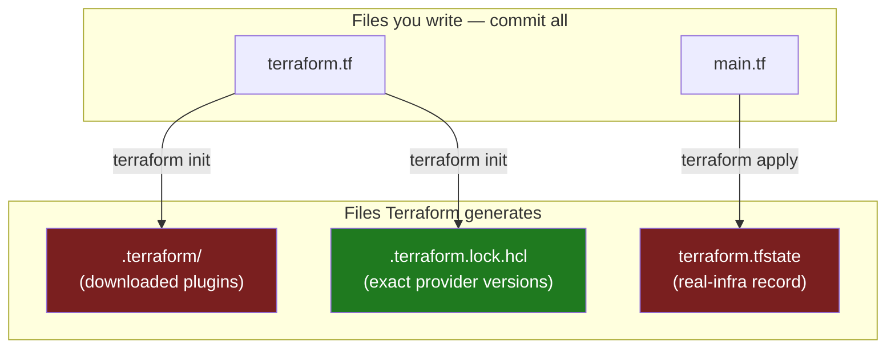
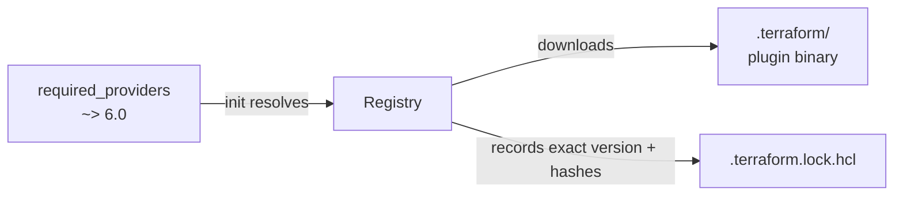

# Chapter 2 — Install, providers & your first project

## Learning outcomes

By the end of this chapter you can:

- Install the Terraform (or OpenTofu) CLI on your platform and verify it.
- Wire cloud credentials so a provider can authenticate, without hard-coding a secret.
- Declare a provider with `required_providers`, understand the `source` address and version constraint, and configure it with a `provider` block.
- Lay out a first working directory, run `terraform init`, and provision one real resource from scratch.
- Recognize the files Terraform generates (`.terraform/`, `.terraform.lock.hcl`, `terraform.tfstate`) and which of them to commit.

## Nothing runs until three things are in place

Chapter 1 was the *why*. This chapter is where you get Terraform running for real. Before a single resource can be created, three pieces must line up:

1. **The CLI** — the `terraform` binary, containing Core (the engine).
2. **A provider plugin** — the Go binary that knows how to talk to your target platform's API. Core fetches it during `init`.
3. **Credentials** — the provider still needs permission to call the vendor's API on your behalf.

Miss any one and nothing works. No CLI, no engine. No provider, and Core has no idea what an `aws_instance` even is. No credentials, and the provider gets a `403` the moment it tries to create anything. This chapter installs all three, then stands up your first resource.

There is a second, quieter lesson here: **project layout**. The mistakes you make in the first directory — where files go, what gets committed, how versions are pinned — are the ones that hurt for months. So this chapter is as much about the four files you write and the three files Terraform generates as it is about the install.

## Install the CLI

Terraform ships as a **single self-contained binary** — no runtime, no dependencies. You can install it via a package manager or by hand. OpenTofu installs the same way; substitute `tofu` for `terraform` throughout.

### Package manager

**macOS (Homebrew)** — add HashiCorp's own tap, then install:

```shell
brew tap hashicorp/tap
brew install hashicorp/tap/terraform
```

**Windows (Chocolatey):**

```shell
choco install terraform
```

**Linux (Ubuntu/Debian)** — HashiCorp maintains signed apt packages. Add the GPG key and repo, then install:

```shell
wget -O- https://apt.releases.hashicorp.com/gpg | \
  gpg --dearmor | \
  sudo tee /usr/share/keyrings/hashicorp-archive-keyring.gpg > /dev/null
echo "deb [signed-by=/usr/share/keyrings/hashicorp-archive-keyring.gpg] \
  https://apt.releases.hashicorp.com $(lsb_release -cs) main" | \
  sudo tee /etc/apt/sources.list.d/hashicorp.list
sudo apt update && sudo apt-get install terraform
```

RHEL/CentOS/Amazon Linux use `yum-config-manager` + `yum install terraform`; Fedora uses `dnf config-manager` + `dnf install terraform`.

!!! warning "The BSL wrinkle: some package managers are frozen at v1.5.7"
    HashiCorp's 2023 relicense to the BSL (see Chapter 1) had a practical side-effect: several community package managers stopped shipping Terraform past **v1.5.7**, the last MPL release. Plain Homebrew's `terraform` formula is one of them. That is exactly why the macOS command above uses **`hashicorp/tap`** — HashiCorp's *own* tap, which stays current (1.15.7 as of this writing). If your `terraform version` reports 1.5.7 after a `brew install terraform`, this is why. OpenTofu (MPL 2.0) has no such restriction and its `tofu` package tracks the latest release everywhere.

### Manual install

Download the zip for your OS from the releases page, unzip it, and put the single `terraform` executable somewhere on your `PATH`:

```shell
echo $PATH                         # list PATH dirs (macOS/Linux)
mv ~/Downloads/terraform /usr/local/bin/
```

On Windows, run `path` to see the `PATH` dirs and move `terraform.exe` into one of them.

### Verify and enable completion

```shell
terraform -help                    # lists the subcommands
terraform version                  # confirms the installed version, e.g. 1.15.7
```

Append `-help` to any subcommand for its flags (`terraform plan -help`). Turn on tab completion once, then restart your shell:

```shell
touch ~/.bashrc                    # or the Zsh equivalent
terraform -install-autocomplete
```

!!! note "The compatibility promise"
    HashiCorp maintains backward compatibility across **minor** versions: a config written for one 1.x version keeps working on any later 1.x. That is what lets `required_version = ">= 1.2"` be an honest floor rather than a gamble — more on that below.

## Wire up credentials

A provider needs permission to act. **Providers have no standard credential system** — each one authenticates its own way, so always read the provider's docs for a new platform. The important discipline is universal, though: **credentials never go in your `.tf` files.** They land in state and in Git if you hard-code them.

The AWS provider is the common first case. It reuses the **standard AWS credential chain** — the exact same one the AWS CLI and the SDKs use. The simplest route for local development is environment variables:

```shell
export AWS_ACCESS_KEY_ID="AKIA..."
export AWS_SECRET_ACCESS_KEY="..."
export AWS_REGION="us-west-2"
aws configure list                 # verify the chain sees your credentials
```

Running `aws configure` writes the same values to `~/.aws/credentials`, which the provider also reads. Either works. What matters is that the secret lives in your environment or an AWS config file — **not in the config Terraform tracks.**

!!! tip "Static keys are the beginner default, not the destination"
    Exported access keys are fine while you're learning. In a real pipeline they are a top security risk — long-lived keys sitting in CI variables. The production answer is short-lived credentials minted on demand via OIDC (a pipeline assumes a role with no stored secret). That is A6's subject. For now, an exported key in your own shell is acceptable; just never commit one.

## Anatomy of a project directory

A Terraform project is just a directory of `.tf` files. Terraform loads **every `.tf` file** in the working directory and resolves dependencies by reference, so **filenames are for humans, not for Terraform** — block order and file split are entirely your choice. Convention, not a rule, gives you a clean starting layout:

| File | Holds |
|---|---|
| `terraform.tf` (or `providers.tf`) | the `terraform` block — `required_providers`, version floor, backend later |
| `main.tf` | the `resource` and `data` blocks — the bulk of the logic |
| `variables.tf` | `variable` declarations (Chapter 6) |
| `outputs.tf` | `output` blocks (Chapter 6) |

For a first project, `terraform.tf` and `main.tf` are enough; the other two arrive when you parameterize in B6.

Alongside the files you write, Terraform **generates three of its own** on first use. Knowing what each is — and whether to commit it — is half of avoiding beginner pain:



- **`.terraform/`** — a hidden cache holding the downloaded provider (and module) binaries. Recreatable by re-running `init`. **Do not commit it** — it's large and platform-specific.
- **`.terraform.lock.hcl`** — the **dependency lock file**. Records the *exact* provider versions and checksums `init` chose. **Commit it.** It's what makes your teammate and your CI pipeline install the identical provider you tested against.
- **`terraform.tfstate`** — Terraform's record of the real infrastructure (Chapter 9 covers it in depth). **Do not commit it.** It can hold secrets in plaintext, and committing it invites merge conflicts and corruption. Teams move it to a remote backend (I6); for now it stays local and out of Git.

So a first `.gitignore` looks like this:

```gitignore
# Terraform
.terraform/
*.tfstate
*.tfstate.*
*.tfvars          # may hold secrets; commit an example instead
!.terraform.lock.hcl   # NOT ignored — commit the lock file
crash.log
```

!!! warning "The one file people wrongly ignore"
    The single most common layout mistake is `.gitignore`-ing `.terraform.lock.hcl` along with everything else `.terraform*`. Don't. The `.terraform/` **directory** is disposable; the `.terraform.lock.hcl` **file** is not — it's the reproducibility guarantee for your whole team. HashiCorp's official guidance is to commit it. The trailing `!.terraform.lock.hcl` un-ignore line above is there precisely because a broad `.terraform*` pattern would otherwise swallow it.

## Declaring a provider

Setup is three steps: **declare** the provider, **configure** it, then **init** to install and lock. The declare/configure split trips up beginners constantly, so name it plainly:

- **`required_providers`** (inside the `terraform` block) declares *what to install* and at which versions.
- **The `provider` block** *configures* an installed provider — auth and scoping (region, project).

They are two different jobs in two different blocks. Here is a complete first `terraform.tf`:

```hcl
# terraform.tf
terraform {
  required_providers {
    aws = {
      source  = "hashicorp/aws"
      version = "~> 6.0"
    }
  }

  required_version = ">= 1.2"
}
```

### The source address

`source = "hashicorp/aws"` is shorthand. The full form of any source address is:

```
[<HOSTNAME>/]<NAMESPACE>/<TYPE>
```

- **Hostname** (optional) — the registry host; defaults to `registry.terraform.io` when omitted.
- **Namespace** — the publisher/org (`hashicorp`).
- **Type** — the platform's short name (`aws`).

So `hashicorp/aws` expands to `registry.terraform.io/hashicorp/aws`. The key on the left (`aws`) is the **local name** — the identifier you use everywhere else in the module. Nearly every provider has a *preferred* local name that doubles as its resource-type prefix, which is why `aws_instance` implies the `aws` local name. Keep local name = type unless two providers collide (two different `http` providers, say), in which case you give them distinct compound names.

!!! note "Provider inference — convenient, discouraged"
    If you omit `required_providers` entirely, Terraform will *guess*: it assumes the resource prefix is the local name and the namespace is `hashicorp`, so `aws_instance` → `hashicorp/aws`, `random_id` → `hashicorp/random`. It works, but you lose the ability to pin a version — and an untested provider upgrade can silently break you. Always declare providers explicitly.

### The version constraint

`version = "~> 6.0"` is a constraint, not an exact pin. The operators:

| Constraint | Meaning |
|---|---|
| `>= 6.0` | at least 6.0, no upper bound |
| `~> 6.0` | major 6, any minor ≥ 0 (`>= 6.0, < 7.0`) — blocks the next major |
| `~> 6.53.0` | pessimistic on patch: allows `6.53.x` but **not** `6.54.0` |
| `= 6.53.0` | exactly this version |
| (omitted) | any version — **not recommended** |

`~> 6.0` is the common root-module choice: it accepts safe minor/patch updates within major 6 but blocks major 7, where breaking changes live. (Provider **6** is current — 6.0 went GA in 2026, latest `6.53.0` as of 2026-07-01. HashiCorp's own AWS tutorial still shows `~> 5.92`; that works but is a major behind. New projects pin `~> 6.0`.)

!!! note "Two different pinning disciplines: the CLI floor vs. the provider pin"
    `required_version` and provider `version` look similar but want **opposite** styles.

    | Constraint | Style | Why |
    |---|---|---|
    | `required_version` (the CLI) | a **floor**: `>= X` at the lowest feature you use | don't gratuitously lock out older-but-fine CLIs |
    | provider `version` | a **bounded recent major**: `~> 6.0` | provider majors carry breaking changes; block an untested newer major |

    `required_version = ">= 1.2"` is honest here because this config uses only basic blocks (`terraform`, `provider`, `data`, `resource`), all present since Terraform 1.0. Writing `>= 1.15` would be *wrong* — it locks out everyone on 1.2–1.14 for no benefit, since nothing needs a 1.15 feature. Only raise the floor when you actually use something newer (dynamic module sources, output `type`, `convert()`). Over-pinning bites hardest with **modules**: a module declaring `>= 1.15` can't be consumed by a team on 1.14 even if it needs nothing from 1.15.

### Configuring it

The `provider` block supplies auth and scoping. Its label (`aws`) must match a local name in `required_providers`:

```hcl
# main.tf
provider "aws" {
  region = "us-west-2"
}
```

Here the block sets only `region` (scoping) — the AWS provider gets its **credentials** from the environment/AWS config chain you wired up earlier, so no secret appears in the block. Some providers need explicit auth in the block (a Cloudflare `api_token`, for instance); when they do, feed it from a variable, never a literal. `provider` blocks live **only in the root module** — the directory you actually run `terraform` from.

## `terraform init` — install and lock

With the provider declared and configured, `init` turns the config into a working directory:

```shell
terraform init
```

```
Initializing the backend...
Initializing provider plugins...
- Finding hashicorp/aws versions matching "~> 6.0"...
- Installing hashicorp/aws v6.53.0...
- Installed hashicorp/aws v6.53.0 (signed by HashiCorp)

Terraform has created a lock file .terraform.lock.hcl to record the provider
selections it made above.

Terraform has been successfully initialized!
```

`init` resolves the constraint against the registry, downloads the chosen provider into `.terraform/`, and writes `.terraform.lock.hcl` recording the exact version plus checksums. From then on, plan and apply use the version **in the lock file**, not the newest the constraint allows — that's the whole point of the lock file. Commit it.



!!! warning "The cross-platform checksum trap"
    By default `init` records checksums only for **your** platform. When a teammate on Linux (or CI) pulls your macOS-generated lock file, the checksums don't match and `init` fails with an *inconsistent dependency lock file* error. Pre-populate hashes for every platform your team uses:

    ```shell
    terraform providers lock \
      -platform=linux_amd64 \
      -platform=darwin_arm64 \
      -platform=windows_amd64
    ```

    OpenTofu **1.12** records the full cross-platform hash set automatically at `tofu init`, so this step is Terraform-specific. In CI, add `terraform init -lockfile=readonly` so a run *fails* rather than silently rewriting the lock file you committed.

When you later change the constraint or want a newer allowed version, the behavior of a plain `init` depends on whether the locked version still satisfies the constraint:

- **Locked version still valid, you want something newer** → run `terraform init -upgrade` (it ignores the lock, re-resolves to the newest allowed, and rewrites the lock file).
- **Locked version now violates the constraint** (you bumped `~> 5.0` to `~> 6.0`) → a plain `init` is *forced* to re-select and rewrites the lock on its own — no `-upgrade` needed.

## Your first resource

Now the payoff: provision something real. Two more blocks in `main.tf` — a **data source** that looks up the latest Ubuntu AMI (so you never hard-code a stale image ID) and a **resource** that launches an instance from it:

```hcl
# main.tf (continued)
data "aws_ami" "ubuntu" {
  most_recent = true

  filter {
    name   = "name"
    values = ["ubuntu/images/hvm-ssd-gp3/ubuntu-noble-24.04-amd64-server-*"]
  }

  owners = ["099720109477"] # Canonical
}

resource "aws_instance" "app_server" {
  ami           = data.aws_ami.ubuntu.id
  instance_type = "t2.micro" # free-tier eligible

  tags = {
    Name = "learn-terraform"
  }
}
```

The `ami` argument references `data.aws_ami.ubuntu.id`. That reference is doing real work: it's an **implicit dependency**, telling Terraform to read the AMI *before* creating the instance. You never write "look up the AMI first" — the reference is the ordering. (B5 goes deep on resources and the dependency graph; B8 on data sources.)

Before applying, two fast, free checks that touch no infrastructure:

```shell
terraform fmt        # rewrite files to canonical style; prints changed filenames
terraform validate   # syntax + internal-consistency check
```

```
Success! The configuration is valid.
```

Then apply. `apply` computes a plan, shows it, and waits for your `yes` before doing anything:

```shell
terraform apply
```

```
  # aws_instance.app_server will be created
  + resource "aws_instance" "app_server" {
      + ami           = "ami-0026a04369a3093cc"
      + instance_type = "t2.micro"
      + tags          = { + "Name" = "learn-terraform" }
      # ... many attributes (known after apply) ...
    }

Plan: 1 to add, 0 to change, 0 to destroy.

Do you want to perform these actions?
  Enter a value: yes

aws_instance.app_server: Creating...
aws_instance.app_server: Creation complete after 14s [id=i-0c636e158c30e48f9]

Apply complete! Resources: 1 added, 0 changed, 0 destroyed.
```

The `+` means *create*; attributes shown as `(known after apply)` can't be resolved until the resource exists. Reviewing this plan before typing `yes` is the safety gate — cancel here if it shows anything unexpected. That's the whole loop in miniature; **B3 covers `init`/`plan`/`apply`/`destroy` command-by-command**, with every plan symbol (`+`, `~`, `-/+`, `-`) explained. When you're done, `terraform destroy` tears it back down so a free-tier instance doesn't quietly run up a bill.

`apply` also writes **`terraform.tfstate`** — the record of what now exists. Confirm it:

```shell
terraform state list
```

```
data.aws_ami.ubuntu
aws_instance.app_server
```

That's the milestone met: a fresh directory, `init`-ed, with one real resource provisioned from scratch.

## Common pitfalls

- **CLI stuck at 1.5.7.** A plain `brew install terraform` (or another community package) may be frozen at the last MPL release. Use `hashicorp/tap`, or switch to OpenTofu.
- **Committing `.terraform.lock.hcl` into `.gitignore`.** A broad `.terraform*` pattern eats the lock file. Un-ignore it explicitly. Conversely, **do** ignore `.terraform/`, `*.tfstate`, and `*.tfvars`.
- **Committing state.** `terraform.tfstate` can hold secrets in plaintext and corrupts under concurrent edits. Keep it out of Git; move it to a backend (I6) when a team needs it.
- **Hard-coding credentials in a `provider` block.** They end up in Git and state. Use the environment/credential chain or a variable.
- **Omitting the version constraint.** Without one, `init` grabs whatever's newest, and a breaking major can slip in on the next `init -upgrade`. Always pin `~> MAJOR.0` in a root module.
- **`required_version` set too high.** A floor of `>= 1.15` on a config that needs nothing from 1.15 locks out teammates for no reason. Set the floor at the oldest feature you actually use.
- **Cross-platform lock mismatch.** A macOS-generated lock file breaks Linux CI. Pre-seed hashes with `terraform providers lock -platform=…`, or use OpenTofu 1.12+.

## Exercises

1. **Recall** — Name the three files Terraform generates and state, for each, whether you commit it and why.
2. **Apply** — You inherit a repo whose `.gitignore` contains `.terraform*`. What breaks for a new teammate, and what one line fixes it?
3. **Extend** — Explain why `required_version = ">= 1.2"` and `version = "~> 6.0"` use opposite pinning styles. When would you *raise* the `required_version` floor?

## Summary

- Nothing runs until three things are in place: the **CLI**, a **provider plugin** (fetched by `init`), and **credentials** (which never go in your `.tf` files).
- Terraform is a single binary; install via a package manager (`hashicorp/tap` on macOS to dodge the BSL v1.5.7 freeze) or by hand, then verify with `terraform version`.
- A project is a directory of `.tf` files — filenames are for humans. Convention: `terraform.tf`, `main.tf`, `variables.tf`, `outputs.tf`.
- **Declare** providers with `required_providers` (source address + version constraint); **configure** them with a `provider` block (auth + scoping, root-module only). Two jobs, two blocks.
- Pin the **provider** to a bounded recent major (`~> 6.0`); set the **CLI** floor honestly (`>= 1.2`) — opposite disciplines.
- `init` installs the provider into `.terraform/` and writes `.terraform.lock.hcl`. **Commit the lock file; ignore `.terraform/`, `*.tfstate`, and `*.tfvars`.** Pre-seed cross-platform hashes for teams.
- The first-project loop is `fmt` → `validate` → `init` → `apply` → inspect state — one resource created from scratch, with the plan review as the safety gate.

---

**Next: B3 — The core workflow: init / plan / apply / destroy.** You've run the loop once end to end. Next you'll slow it down command by command — reading a plan's `+`/`~`/`-/+`/`-` symbols precisely, using saved plans, and tearing infrastructure back down cleanly.

## References

- [Install Terraform (AWS Get Started)](../sources/terraform-tutorials/tf-install-cli.md)
- [Create infrastructure (AWS Get Started)](../sources/terraform-tutorials/tf-aws-create.md)
- [Provider Requirements](../sources/terraform-docs/provider-requirements.md)
- [TID Ch 2 — Terraform HCL components](../books/tid/chapters/02-hcl-components.md) §2.3–2.4 (settings block, declare/configure providers)
- Topic page: [Providers](../topics/providers.md)
- [Version & Certification Facts](../research-cache/version-facts.md) (current CLI/provider versions, BSL/package-manager freeze)
- Web (verified 2026-07-06): [Dependency Lock File](https://developer.hashicorp.com/terraform/language/files/dependency-lock) · [Lock & upgrade provider versions](https://developer.hashicorp.com/terraform/tutorials/configuration-language/provider-versioning) · project-layout & `.gitignore` conventions
