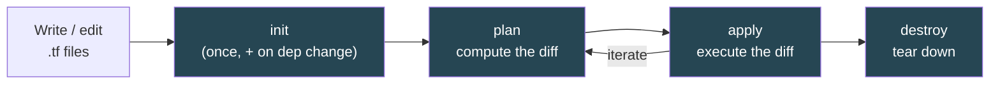
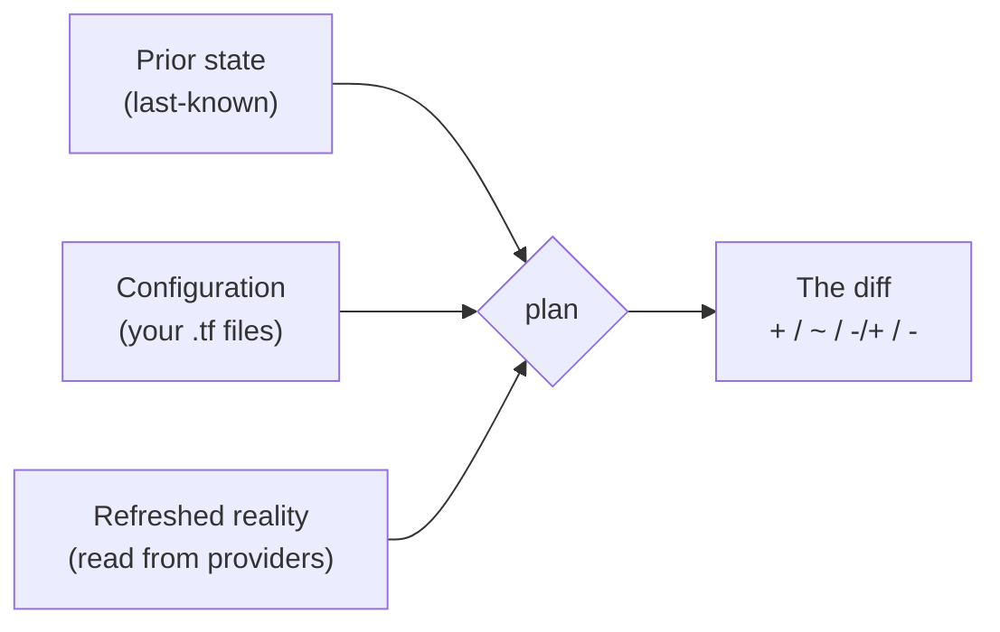

# Chapter 3 — The core workflow: init / plan / apply / destroy

## Learning outcomes

By the end of this chapter you can:

- Run the four-command loop — `init`, `plan`, `apply`, `destroy` — and say what each one reads and writes.
- Read a `terraform plan` and predict, before you apply, what every `+` / `~` / `-/+` / `-` line will do.
- Save a plan with `-out` and apply that exact artifact, so review and execution can't drift apart.
- Tear infrastructure down two ways — remove one resource from config, or destroy the whole workspace — and know which blast radius each has.
- Reach for the everyday utilities (`fmt`, `validate`, `show`, `output`, `graph`) and the escape hatches (`-replace`, `-refresh-only`, `-target`) at the right moment.

## The loop is the whole job

Chapter 2 ran the loop once, end to end, to get a resource on the board. This chapter slows it down.

Everything you will ever do with Terraform is some rotation of four verbs. You **init** a directory once (and again whenever its providers or modules change). You **plan** to see what a change would do. You **apply** to make it happen. You **destroy** when you're done. Modules, remote state, CI pipelines, policy checks — all of it is scaffolding around this loop. Learn to read it precisely and the rest is elaboration.

The single most important skill in this chapter is reading a plan. A plan is a contract: it tells you exactly what Terraform is about to add, change, or remove, *before* it touches anything real. The safety of the entire tool rests on you actually reading that contract and catching the surprise — the in-place edit that is secretly a destroy-and-recreate, the one line that says `1 to destroy` next to a production database. Predicting the plan is the milestone for this topic, so it gets the most room below.



## `terraform init` — prepare the directory

`init` turns a plain directory of `.tf` files into a working directory Terraform can operate in. It is the first command you run in any new project, and it is safe to re-run at any time. It does three things:

1. **Initializes the backend** — decides *where state lives* (locally by default; a remote backend later, in I6).
2. **Installs providers** — resolves each `required_providers` constraint against the registry, downloads the plugin binary into `.terraform/`, and records the exact version and checksums in `.terraform.lock.hcl`.
3. **Installs modules** — downloads any `module` blocks' source into `.terraform/modules/`.

```shell
terraform init
```

```
Initializing the backend...
Initializing provider plugins...
- Finding hashicorp/aws versions matching "~> 6.0"...
- Installing hashicorp/aws v6.53.0...
- Installed hashicorp/aws v6.53.0 (signed by HashiCorp)

Terraform has created a lock file .terraform.lock.hcl to record the provider
selections it made above.

Terraform has been successfully initialized!
```

You re-run `init` when you **add a provider**, **add or change a module**, or **change the backend**. On an existing workspace, `init` detects those changes and installs only what's new:

```shell
terraform init      # after adding a module block
```

```
Initializing modules...
Downloading registry.terraform.io/terraform-aws-modules/vpc/aws 6.6.1 for vpc...
- vpc in .terraform/modules/vpc
Initializing provider plugins...
- Reusing previous version of hashicorp/aws from the dependency lock file
- Using previously-installed hashicorp/aws v6.53.0
Terraform has been successfully initialized!
```

Notice the provider was **reused from the lock file**, not re-resolved. That is the lock file doing its job: once `init` has chosen a version, every later `init`, `plan`, and `apply` uses that exact version until you deliberately upgrade.

!!! warning "The lock file locks **providers only** — never module versions"
    A configuration has two kinds of external dependency, and `.terraform.lock.hcl` records exactly one of them. Module version selections are **not** locked. When `init` installs a module it selects the newest version matching the constraint, and records that choice in `.terraform/modules/modules.json` — which is *not* committed. Within your working directory that manifest holds the version steady, so re-running `init` reuses it. But a teammate's fresh clone, or a CI runner with an empty `.terraform/`, resolves the constraint from scratch and can land on a newer module than you ever tested. Nothing in version control pins it. The fix is an **exact version constraint** — `version = "6.6.1"` rather than a range. Modules can also come from places other than the registry, and those pin differently; that comes with module sources later.

    Three things also make `init` discard the recorded module and re-resolve: `-upgrade`, a changed `source`, or a recorded version that no longer satisfies the constraint.

Commit the lock file — dependency changes then go through code review like configuration changes. In CI, add `terraform init -lockfile=readonly` so a run *fails* rather than silently rewriting the lock you committed.

When you *want* a newer allowed version, a plain `init` won't give it to you — it honors the lock. The two upgrade cases:

- **Locked version still satisfies the constraint, you want the newest allowed** → `terraform init -upgrade`. It ignores the lock, re-resolves to the newest permitted version, and rewrites the lock file.
- **Locked version now violates the constraint** (you bumped `~> 5.0` to `~> 6.0`) → a plain `init` is forced to re-select and rewrites the lock on its own.

Modules follow the same two cases against their own record in `.terraform/modules/modules.json`:

- **Recorded version still satisfies the constraint** → `terraform init -upgrade` re-resolves it. So does `terraform get -update`, which upgrades modules only and leaves providers alone.
- **Recorded version now violates the constraint** → a plain `init` re-selects on its own.

There is a governance consequence. A provider upgrade rewrites the committed `.terraform.lock.hcl`, so it lands in the diff and a reviewer sees it; `-lockfile=readonly` makes CI fail if it changes unexpectedly. A module upgrade rewrites uncommitted `modules.json`, so it leaves no trace in version control and there is nothing for `-lockfile=readonly` to check. That is why the exact constraint above matters more than it looks: it is the only part of a module's version selection that lives in code.

### Checksums: trust on first use

The lock file has been a black box so far. Here is what `init` actually writes, for one provider:

```hcl
provider "registry.terraform.io/hashicorp/azurerm" {
  version     = "2.30.0"
  constraints = "~> 2.12"
  hashes = [
    "h1:FJwsuowaG5CIdZ0WQyFZH9r6kIJeRKts9+GcRsTz1+Y=",
    "h1:c/ntSXrDYM1mUir2KufijYebPcwKqS9CRGd3duDSGfY=",
    "h1:yre4Ph76g9H84MbuhZ2z5MuldjSA4FsrX6538O7PCcY=",
    "zh:04f0a50bb2ba92f3bea6f0a9e549ace5a4c13ef0cbb6975494cac0ef7d4acb43",
    "zh:2082e12548ebcdd6fd73580e83f626ed4ed13f8cdfd51205d8696ffe54f30734",
    ...
  ]
}
```

`version` is the selection `init` made. `constraints` records what the configuration asked for. Then `hashes`, where the thing to notice is that a *single* version carries *many* checksums.

Two things multiply them. A provider ships a separate package per platform. There is one for `linux_amd64`, one for `darwin_arm64`, one for `windows_amd64`, and so on, and each hashes differently. On top of that Terraform is midway through a migration between two hashing schemes, which is what the `zh:` and `h1:` prefixes distinguish. That migration is covered below; for now read them as two ways of fingerprinting the same package.

So the list is not one fingerprint for the provider. It is the **set of packages Terraform will accept** as legitimate for that version, which gives the verification rule: every package `init` installs must match **at least one** entry in its version's set. Your download matches your platform's hash, and the entries for other platforms are what let one committed lock file satisfy a teammate on a different OS. When a package matches nothing, `init` refuses:

```
Error while installing hashicorp/azurerm v2.1.0: the current package for
registry.terraform.io/hashicorp/azurerm 2.1.0 doesn't match any of the
checksums previously recorded in the dependency lock file.
```

That is a **trust-on-first-use** model, and the name is the whole security story. Terraform does not know whether a provider is trustworthy. It knows whether *today's* package matches what you accepted the *first* time. So the verification you owe happens once, when the provider first enters the lock file. That means checking the signing key fingerprint `init` prints, reading who published it, and whatever else your compliance regime demands. After that Terraform enforces your decision for you.

Where the package comes from on that first install decides whether the lock file is portable:

- **From an origin registry with signed checksums** — Terraform treats every signed checksum as valid once one matches, so it records hashes for **your platform and every other published platform** at once. The lock file works everywhere.
- **From a filesystem or network mirror** — Terraform can only verify the platform it is actually running on, so it records only that platform's hashes. **The configuration is now unusable on any other platform.** A macOS-generated lock file then breaks a teammate's Linux CI with an *inconsistent dependency lock file* error.

Pre-seed every platform your team uses, which downloads and verifies the official packages for each:

```shell
terraform providers lock \
  -platform=linux_amd64 \
  -platform=darwin_arm64 \
  -platform=windows_amd64
```

!!! info "OpenTofu — cross-platform checksums, automatically"
    `tofu init` records the **full cross-platform hash set** on its own (OpenTofu 1.12), so the `providers lock -platform=…` step above is Terraform-specific. The gate is that `init` must reach the origin registry directly, which is the default — point `provider_installation` at a mirror and the per-platform behavior above returns. The lock file is still named `.terraform.lock.hcl` and is byte-compatible, so a mixed team can share one. This removes the single most common `init` footgun for teams on mixed operating systems.

### Reading a lock-file diff

`init` rewrites this file on its own, so it shows up in code review constantly. Four diffs, four meanings:

| Diff | What happened |
|---|---|
| A whole new `provider` block | You added a provider requirement (directly, or via a module that has one). Review the version and the signing key. |
| `version` changed, all `hashes` replaced | An upgrade. Each version ships its own packages, so the entire hash set turns over. |
| Only new `hashes` lines, nothing else | Not an upgrade — Terraform is migrating hashing schemes. Safe. |
| A `provider` block deleted | The provider is gone from **both** config and state. Re-adding it later is treated as brand new: no guarantee of the same version, and no checksum continuity. |

The third row is the one that confuses people, and the prefixes explain it. `zh:` ("zip hash") is the legacy scheme — a SHA256 of the official `.zip` package indexed by the registry protocol. `h1:` ("hash scheme 1") is the current one, computed from the package **contents**, which is why it works for an unpacked mirror directory or a recompressed zip while `zh:` does not. Both coexist because the registry protocol still serves `zh:`, so a first install is mostly `zh:` entries, and Terraform opportunistically adds the matching `h1:` each time it installs the provider on a new platform. Running `providers lock -platform=…` records both schemes for every listed platform up front, which stops the drip.

## `terraform plan` — compute the diff

`plan` answers one question: *if I applied right now, what would change?* It computes a diff and shows it. It changes nothing.

To build that diff, Terraform compares three inputs:



1. **Prior state** — what Terraform last recorded as existing.
2. **Configuration** — the desired end state you wrote in `.tf`.
3. **Refreshed reality** — a fresh read of each tracked object from its provider, so out-of-band drift is detected.

That third input matters. `plan` and `apply` run an **implicit in-memory refresh** before computing the diff. If someone resized your instance in the AWS console, the refresh sees it, and the plan proposes to correct the drift back to what your config says. The refresh is in-memory only — a bare `plan` does not write the refreshed values to your state file.

```shell
terraform plan
```

```
data.aws_ami.ubuntu: Reading...
data.aws_ami.ubuntu: Read complete after 1s [id=ami-0026a04369a3093cc]

  # aws_instance.app_server will be created
  + resource "aws_instance" "app_server" {
      + ami           = "ami-0026a04369a3093cc"
      + instance_type = "t2.micro"
      + tags          = { + "Name" = "learn-terraform" }
      # ... many attributes (known after apply) ...
    }

Plan: 1 to add, 0 to change, 0 to destroy.
```

!!! note "Three planning modes, one engine"
    Everything above is the **default** mode: reconcile infrastructure to config. There are two others, and both appear later in this chapter. **Destroy** mode (`plan -destroy`, or the `terraform destroy` alias) plans the removal of everything in the configuration. **Refresh-only** mode (`plan -refresh-only`) updates state from reality and proposes no infrastructure change at all. Same mechanics each time — build the graph, walk it, diff — only the target end state differs. And **every mode begins with a refresh**, which is why refresh-only is the niche one: the other two already did it.

Two things to read here. The `Plan:` summary line is your headline — *add / change / destroy* counts you can sanity-check at a glance. And `(known after apply)` marks attributes AWS won't assign until the resource actually exists (an instance's ARN, its public IP). Terraform can't show you a value it doesn't have yet, so it names it as pending rather than guessing.

### Saved plans: `-out`

A bare `plan` is throwaway. Run it, read it, and if you then run `apply`, Terraform computes a **fresh** plan and asks you to confirm that one. Between the two, your config or the real infrastructure could have shifted. Terraform warns you about exactly this:

```
Note: You didn't use the -out option to save this plan, so Terraform can't
guarantee to take exactly these actions if you run "terraform apply" now.
```

To close that gap, save the plan to a file and apply *that file*:

```shell
terraform plan -out=tfplan     # compute and freeze the plan
terraform apply tfplan         # execute exactly the frozen plan — no new plan, no prompt
```

The saved plan is a frozen artifact. `apply tfplan` executes precisely what you reviewed, with no re-planning and no confirmation prompt (you already confirmed by choosing to apply the file). This is the backbone of a CI/CD pipeline: one job plans and saves, a human reviews the saved plan, a later job applies the exact bytes. Review and execution can't drift apart because they're the same artifact.

!!! warning "A saved plan is frozen — you can't re-plan it"
    Every planning decision is baked into the file when you create it. So `apply tfplan` takes no planning options at all: the options that shape a plan (the escape hatches later in this chapter) are only accepted on an `apply` that plans for itself, never on one handed a saved plan. The saved plan is also perishable: it embeds specific resource states, so apply it soon. If the real infrastructure moves underneath it, `apply tfplan` can fail rather than apply a stale diff — which is the safe outcome.

## `terraform apply` — execute the diff

`apply` makes the plan real. Run without a saved plan, it plans first, shows you the diff, and waits for a literal `yes` before doing anything:

```shell
terraform apply
```

```
  # aws_instance.app_server will be created
  + resource "aws_instance" "app_server" {
      + ami           = "ami-0026a04369a3093cc"
      + instance_type = "t2.micro"
      ...
    }

Plan: 1 to add, 0 to change, 0 to destroy.

Do you want to perform these actions?
  Enter a value: yes

aws_instance.app_server: Creating...
aws_instance.app_server: Creation complete after 14s [id=i-0c636e158c30e48f9]

Apply complete! Resources: 1 added, 0 changed, 0 destroyed.
```

That interactive prompt is the safety gate for a human at a keyboard. It is your last chance to read the diff and cancel. Only the exact word `yes` proceeds; anything else aborts.

Then `apply` writes **`terraform.tfstate`** — the record of what now exists — and prints any `output` values. Later plans compare against this updated state.

!!! danger "`-auto-approve` belongs in CI, never on your keyboard"
    `terraform apply -auto-approve` skips the confirmation prompt. It exists for non-interactive automation, where a saved plan (`apply tfplan`) already served as the review gate. Typing `-auto-approve` in your own shell throws away the one moment that catches an accidental destroy. In examples meant for a human, always let the prompt stand.

## Reading the plan: the four symbols

This is the milestone. Terraform's plan is Git-diff-like, and every proposed action is one of four symbols. Learn to predict them and you can approve a plan with confidence.

| Symbol | Action | What it means |
|---|---|---|
| `+` | create | The resource is in config but not in state. Terraform will build it. |
| `~` | update in-place | An attribute changed, and the provider can patch it live without recreating. |
| `-/+` | destroy then create (replace) | A **forced-new** attribute changed. The provider can't patch it, so Terraform destroys the old resource and creates a new one. |
| `-` | destroy | The resource is in state but no longer in config. Terraform will tear it down. |

The dangerous one is `-/+`. It hides inside what looks like an edit. Change an EC2 instance's `instance_type` and you get a benign in-place `~`:

```
  # aws_instance.app_server will be updated in-place
  ~ resource "aws_instance" "app_server" {
        id                = "i-0c636e158c30e48f9"
      ~ instance_type     = "t2.micro" -> "t2.large"
      ~ public_dns        = "ec2-34-216-...amazonaws.com" -> (known after apply)
      ~ public_ip         = "34.216.162.36" -> (known after apply)
        # (36 unchanged attributes hidden)
    }

Plan: 0 to add, 1 to change, 0 to destroy.
```

The `~` on `instance_type` is the change you asked for. The `~` on `public_dns` and `public_ip` are *consequences* — a resize can reassign them, so they show `old -> (known after apply)`. Nothing is destroyed here.

But move that same instance into a new VPC (by wiring `subnet_id` to a VPC module) and AWS **cannot** relocate a running instance. The `subnet_id` is a forced-new attribute, so the plan flips to a replacement:

```
Resource actions are indicated with the following symbols:
  + create
-/+ destroy and then create replacement

  # aws_instance.app_server must be replaced
-/+ resource "aws_instance" "app_server" {
      ~ arn                         = "arn:aws:ec2:...i-0c63..." -> (known after apply)
      ~ availability_zone           = "us-west-2b" -> (known after apply)
      ~ subnet_id                   = "" -> (known after apply) # forces replacement
      ...
    }

Plan: 16 to add, 0 to change, 1 to destroy.
```

Same intent — "put the instance in the VPC" — but a completely different blast radius. The `1 to destroy` in the summary and the `must be replaced` header are the signal. For a stateless web server, a replacement is fine. For a database holding customer data, `-/+` means data loss unless you take care. This is exactly why you read the plan: the summary counts and the per-resource header tell you whether an "edit" is really a rebuild.

!!! tip "The plan summary is your fastest sanity check"
    Before scrolling the full diff, read the `Plan: N to add, N to change, N to destroy` line. If you renamed a variable and expected zero infrastructure change, but the summary says `2 to destroy`, stop — something forces replacement or a resource fell out of config. The headline number catches the surprise before you read a single attribute.

## Dependency ordering — you declare *what*, the graph decides *when*

You never tell Terraform the order to do things. It derives the order from your references. When one resource reads another's attribute — `subnet_id = module.vpc.private_subnets[0]` — that reference *is* an implicit dependency. Terraform builds a **dependency graph** at plan time and, on apply, walks it: create or update in dependency order, and **in parallel wherever the graph allows** (default up to 10 concurrent operations).

So in the VPC move above, Terraform ran: destroy the old instance, create the VPC and its subnets/routes/gateways, then create the new instance last — because the instance depends on the subnet, which depends on the VPC. You wrote none of that ordering. The references encoded it.

`destroy` walks the same graph in **reverse**. Dependents die before their dependencies: route-table associations first, then subnets and the internet gateway, and the VPC last. It is the mirror image of creation order, for the same reason — you can't delete a VPC while subnets still live inside it.

The graph is *acyclic* by requirement, not by convention. If your references form a loop — A reads an attribute of B, which reads C, which reads A — there is no valid order, and Terraform refuses to plan at all:

```
Error: Cycle: aws_security_group.app, aws_security_group.db
```

The error names every node in the loop, which is usually enough to find it. The fix is to break one edge. Most accidental cycles come from two resources that merely need to *share a value*, wired to each other's attributes to get it; route that value through a `variable` or `locals` instead and the edge disappears without changing behavior. Cycles are rare, and a persistent one usually means the architecture wants simplifying rather than a clever workaround.

!!! info "Cycle errors become readable — 1.16, not yet released"
    The comma-joined single line above is what 1.15 prints, and it is hard to read on a large config where the loop runs to a dozen nodes. A change already merged for **1.16** (unreleased as of this writing; it ships in the 1.16 alphas) renders each node on its own line, reverses the order so it reads in reference order rather than graph-traversal order, and picks a consistent starting node so repeated runs print the same thing. Same error, same fix — just legible.

!!! note "Prefer implicit dependencies to `depends_on`"
    Because a reference creates the dependency, most ordering is automatic and correct. The explicit `depends_on` meta-argument (I1) is a fallback for the rare case where a dependency is real but *invisible* to Terraform — an IAM policy that must exist before an app can use a bucket, with no attribute linking them. Reach for it only when there's no attribute to reference. An over-used `depends_on` serializes work the graph could have parallelized.

## `terraform destroy` — two verbs, two blast radii

There are two distinct ways to destroy, and confusing them is how people delete more than they meant to.

**1. Remove a resource from config, then `apply`.** This is the everyday, surgical teardown — retire one component while the rest of the workspace stays up. Delete (or comment out) the `resource` block. Anything referencing it must go too, or the config is invalid:

```hcl
# main.tf
/*
resource "aws_instance" "app_server" {
  ami           = data.aws_ami.ubuntu.id
  instance_type = var.instance_type
  ...
}
*/
```

```hcl
# outputs.tf — the output referenced the now-removed instance, so it must go too
/*
output "instance_hostname" {
  value = aws_instance.app_server.private_dns
}
*/
```

`apply` now sees a resource in state with no matching config block, and plans a single `-`:

```
Plan: 0 to add, 0 to change, 1 to destroy.

Changes to Outputs:
  - instance_hostname = "ip-10-0-1-75.us-west-2.compute.internal" -> null
```

The output drops to `null` because the value it depended on is gone. Removing a resource from config *is* a destroy operation. This is the `-` symbol in ordinary iteration.

**2. `terraform destroy` — tear down the whole workspace.** For decommissioning an environment or a short-lived test stack. It destroys *everything* the workspace manages, regardless of config:

```shell
terraform destroy
```

```
Plan: 0 to add, 0 to change, 15 to destroy.

Do you really want to destroy all resources?
  Terraform will destroy all your managed infrastructure, as shown above.
  There is no undo. Only 'yes' will be accepted to confirm.

  Enter a value: yes

module.vpc.aws_route_table_association.private[1]: Destroying...
...
module.vpc.aws_vpc.this[0]: Destruction complete after 1s

Destroy complete! Resources: 15 destroyed.
```

Under the hood, `terraform destroy` is `terraform apply` of a plan that removes every managed resource — the two are literally the same engine, and `apply -destroy` is the explicit form. The confirmation is worded harder than a normal apply on purpose: **"There is no undo."** Destroy is irreversible. The only safety gate is reading the plan before you type `yes`.

Data sources are refreshed but never destroyed — they only ever read, so there's nothing to tear down.

!!! note "`destroy` works from state, not config"
    Destroy tears down whatever is **in state**, not what's in your `.tf` files. A resource that exists in state but has been removed from (or edited out of) config still gets destroyed — the reverted or changed configuration doesn't matter. This is why you can always tear a workspace down even after gutting its `.tf`: the state is the record of what's real. (The corollary bites in reverse too — a resource in config but not yet in state is nothing for `destroy` to act on.)

!!! danger "`destroy` does not know what's precious"
    `terraform destroy` deletes whatever the workspace manages, and prod databases look exactly like scratch VMs to it. Two habits protect you. Mark irreplaceable resources with `lifecycle { prevent_destroy = true }` (I2), which makes Terraform *error* rather than destroy them. And never point a `destroy` at a workspace whose state you haven't just read. The recovery story for an accidental destroy is re-running `apply` from config — which recreates the resource but does **not** bring a database's data back.

## `terraform apply -replace` — force one rebuild deliberately

Sometimes you want to recreate a resource that hasn't actually changed — a VM that drifted into a bad state, a certificate you want reissued. The modern way is `-replace`:

```shell
terraform apply -replace="aws_instance.app_server"
```

It shows the recreation as a `-/+` in the plan first, so you review it before it happens.

!!! note "`-replace` supersedes the deprecated `taint` / `untaint`"
    Older material shows `terraform taint <addr>` to force a rebuild. `taint` mutated state out-of-band — it marked the resource for replacement immediately, with no plan to review. `-replace` (Terraform 0.15.2+) is strictly better: the recreation appears in the plan, so you see it before approving. `taint`/`untaint` still exist but are deprecated; use `-replace`.

## The everyday utilities

The four-verb loop is the core, but a fluent operator leans on a handful of supporting commands constantly. None of them touch real infrastructure except through the loop above.

| Command | What it does |
|---|---|
| `terraform fmt` | Rewrite `.tf` files to canonical style. Prints the filenames it changed. Run before every commit. |
| `terraform validate` | Check syntax and internal consistency. No provider calls, no network. Catches typos before you plan. |
| `terraform show` | Render the current state (or a saved plan) as human-readable text. `-json` for machine output. |
| `terraform output` | Print output values from state. `-json` for scripts; `terraform output -raw name` for a single bare value. |
| `terraform graph` | Emit the dependency graph in Graphviz DOT format (pipe to `dot -Tsvg` to see it). |
| `terraform state list` | List every resource address Terraform tracks — your fastest "what's in here?" check. |
| `terraform get` | Download the config's modules only, without the rest of `init`. Already-downloaded modules are reused and not even checked for updates unless you pass `-update`. |
| `terraform providers` | Show the providers the config requires (and `providers lock` / `mirror` / `schema` subcommands). |
| `terraform version` | Show the CLI version and whether a newer one is available. |

`fmt` and `validate` are the two you run reflexively:

```shell
terraform fmt        # canonical formatting
terraform validate   # syntax + consistency, no infrastructure touched
```

```
Success! The configuration is valid.
```

!!! tip "`-chdir` runs a command as if you'd `cd`'d there"
    The global option `terraform -chdir=DIR <cmd>` runs any subcommand as though it were launched in `DIR`. In automation it's cleaner than `cd`-ing around:

    ```shell
    terraform -chdir=environments/production apply
    ```

    Two things still use the original directory: the CLI configuration file, and `path.cwd` in your config (use `path.root` for the module directory). Enable shell tab-completion once with `terraform -install-autocomplete`.

## The escape hatches: `-refresh-only` and `-target`

Two options change *which* resources a plan considers. Both are for exceptional situations, not daily use.

**`-refresh-only`** reconciles state with reality without proposing infrastructure changes. Someone edited a resource in the cloud console; you want your state file to record the drift, but not "fix" it back. A plain `plan` would propose reverting the drift. `plan -refresh-only` instead shows you the drift and offers to update *state* to match reality:

```shell
terraform apply -refresh-only    # update state to match the real world; change no infra
```

This is the correct, supported replacement for the old standalone `terraform refresh` command, because it shows you the drift and asks before writing it.

**`-target=ADDRESS`** restricts the operation to one resource (and its dependencies). It is a recovery tool, not a workflow:

```shell
terraform apply -target="aws_instance.app_server"   # exceptional use only
```

!!! warning "`-target` is for emergencies, and it lies by omission"
    Targeting applies only part of your config, which means the plan you review is *not* the full picture — resources outside the target are ignored, so drift and broken dependencies go undetected. HashiCorp's own docs call it exceptional-circumstances-only. If you find yourself reaching for `-target` routinely, the real fix is to split the configuration into smaller, independently-applied pieces wired together with data sources (A7/E4). Use it to dig out of a mistake, then stop.

!!! info "OpenTofu — negative targeting with `-exclude`"
    OpenTofu (1.9+) adds `-exclude=ADDRESS`, the inverse of `-target`: plan/apply everything **except** the given address and its dependents. When one resource is broken and you want to apply *everything else*, `-exclude=aws_instance.broken` is far safer than enumerating every other resource with `-target`. Terraform's open-source CLI has no equivalent. `-target` and `-exclude` are mutually exclusive in one command, and the same "exceptional circumstances only" caveat applies to both.

## 🧪 Lab: read every plan symbol on LocalStack

The four verbs and four symbols are worth *seeing*, not just reading. This lab drives the whole loop against the local **AWS emulator** (Ch1's [lab setup](ch01-iac-fundamentals.md#lab-setup-a-free-local-aws-docker) — Floci, MiniStack, or LocalStack) and deliberately produces a `+`, a `~`, a `-/+`, and a `-` — for free, no AWS account.

**Start the emulator** (from the repo root; skip if it's already running):

```shell
docker compose -f labs/docker-compose.yml up -d      # start Floci on :4566, detached
curl -s http://localhost:4566/_localstack/health     # wait until services read "available"
```

Then start from this `main.tf`:

```hcl
# main.tf
terraform {
  required_providers {
    aws = { source = "hashicorp/aws", version = "~> 6.0" }
  }
}

provider "aws" {
  region = "us-east-1"
}

resource "aws_s3_bucket" "lab" {
  bucket = "workflow-lab-bucket"
}
```

**`+` create.** `tflocal` supplies the emulator endpoints; the loop is otherwise identical to real AWS:

```shell
tflocal init
tflocal plan -out=tfplan     # freeze the plan (the -out / apply-file discipline from above)
tflocal apply tfplan         # apply exactly what you reviewed — no re-plan, no prompt
```

```
Plan: 1 to add, 0 to change, 0 to destroy.
```

**`~` update in-place.** Add a tag — an attribute the provider can patch without recreating:

```hcl
resource "aws_s3_bucket" "lab" {
  bucket = "workflow-lab-bucket"

  tags = {
    Env = "lab"          # new attribute — patchable in place
  }
}
```

```shell
tflocal plan
```

```
  # aws_s3_bucket.lab will be updated in-place
  ~ resource "aws_s3_bucket" "lab" {
      ~ tags = { + "Env" = "lab" }
    }
Plan: 0 to add, 1 to change, 0 to destroy.
```

**`-/+` replace.** Now change the `bucket` name. A bucket can't be renamed in place — the name is a **forced-new** attribute — so the same-looking edit flips to a destroy-then-create:

```hcl
resource "aws_s3_bucket" "lab" {
  bucket = "workflow-lab-bucket-renamed"   # forced-new → replacement
  tags   = { Env = "lab" }
}
```

```
  # aws_s3_bucket.lab must be replaced
-/+ resource "aws_s3_bucket" "lab" {
      ~ bucket = "workflow-lab-bucket" -> "workflow-lab-bucket-renamed" # forces replacement
    }
Plan: 1 to add, 0 to change, 1 to destroy.
```

That `1 to destroy` in the summary is the whole lesson of the chapter, made concrete and harmless: an "edit" that is really a rebuild. On a bucket holding objects, the replacement would drop them — which is why you read the plan. Apply it, then experiment with `-replace`:

```shell
tflocal apply
tflocal apply -replace="aws_s3_bucket.lab"   # force a rebuild with nothing changed — shows -/+
```

**`-` destroy.** Finally the two teardown blast radii. Delete the `resource` block and `apply` to see the surgical single `-`; or `tflocal destroy` to tear down the whole workspace:

```shell
tflocal destroy
```

```
Plan: 0 to add, 0 to change, 1 to destroy.
Destroy complete! Resources: 1 destroyed.
```

You've now produced all four symbols and both teardown paths against a real API surface, at zero cost and zero risk — the ideal place to build the plan-reading reflex before a production plan is on the line.

!!! warning "The safe-to-be-reckless caveat"
    The emulator is exactly where you *should* apply a scary `-/+` on purpose, because nothing real is lost. Don't let that habit follow you to a real backend: the plan symbols mean the same thing there, but `1 to destroy` next to a production bucket is not a lab.

## Common pitfalls

- **Applying without reading the plan.** The whole safety model is the plan-then-confirm gate. A `~` that's secretly a `-/+` on a stateful resource is the classic loss. Read the summary counts, then the per-resource headers.
- **Assuming a bare `plan` guarantees the apply.** It doesn't — `apply` re-plans. When the two must match (CI, a change window), use `plan -out=FILE` and `apply FILE`.
- **`-auto-approve` in an interactive shell.** It removes the one moment that catches an accidental destroy. Keep it in non-interactive CI, paired with a saved-plan review.
- **`terraform destroy` against a workspace holding production.** It deletes everything, no questions beyond one `yes`. Guard irreplaceable resources with `prevent_destroy`; never destroy a workspace you haven't just inspected.
- **Routine `-target`.** It plans against a partial view and hides drift. It's a recovery tool. If it's part of your normal workflow, split the config instead.
- **Cross-platform lock mismatch.** A lock file whose provider was first installed from a *mirror* records only the installing platform's checksums, so macOS breaks Linux CI. Pre-seed with `terraform providers lock -platform=…`, or use OpenTofu 1.12+.
- **Assuming the lock file pins modules.** It pins providers only. The module manifest that holds a version steady lives in uncommitted `.terraform/`, so a fresh clone or CI runner re-resolves to the newest matching version. Pin with an exact constraint or a Git `ref`.
- **Forgetting to re-`init` after adding a module or provider.** `plan` will tell you the working directory is out of date. Re-run `init`.

## Exercises

1. **Recall** — For each plan symbol (`+`, `~`, `-/+`, `-`), state whether it destroys anything, and give one change that produces it.
2. **Predict** — You change a resource's `name` tag (in-place-able) and its `subnet_id` (forced-new) in the same edit. What does the `Plan:` summary line look like, and which attribute drives the `-/+`?
3. **Apply** — Explain the difference between `terraform plan` then `terraform apply`, versus `terraform plan -out=tfplan` then `terraform apply tfplan`. When does the difference matter?
4. **Extend** — A teammate resized an instance in the AWS console. You want your state to reflect that but don't want Terraform to revert it. Which command, and why not a plain `apply`?

## Summary

- Everything is a rotation of four verbs: **`init`** (prepare the directory, install providers/modules, write the lock file), **`plan`** (compute the diff, change nothing), **`apply`** (execute the diff, write state), **`destroy`** (tear down).
- `.terraform.lock.hcl` locks **providers only** — module versions are held only by the uncommitted `.terraform/modules` manifest, so pin them in the config. Its checksums are **trust-on-first-use**: verify once at first install, and Terraform enforces that decision afterwards. A first install from a mirror records only your platform's hashes — pre-seed with `providers lock -platform=…` (unnecessary on OpenTofu 1.12+). New `h1:` lines in a diff are scheme migration, not an upgrade.
- `plan` diffs three inputs: prior state, your config, and a fresh refresh of reality. `plan` and `apply` refresh in memory before diffing, so drift is detected. Three planning modes share the engine: default, destroy, and refresh-only — each begins with a refresh.
- **Read the plan.** Four symbols: `+` create, `~` update in-place, `-/+` destroy-then-create (a forced-new attribute changed), `-` destroy. The `-/+` is the one that hides inside an "edit" — check the summary counts and the `must be replaced` header.
- Save a plan with `plan -out=FILE` and `apply FILE` to guarantee that what you reviewed is exactly what runs. This is the CI/CD backbone.
- You declare *what*; the **dependency graph** (built from references) decides *when* — create in dependency order, destroy in reverse, parallel where possible. Prefer implicit references to `depends_on`. The graph must be acyclic; a `Cycle:` error names the loop, and the fix is to route a shared value through a variable or local.
- Two teardown blast radii: remove one resource from config + `apply` (surgical), or `terraform destroy` (the whole workspace, irreversible). Guard precious resources with `prevent_destroy`.
- Force one deliberate rebuild with `apply -replace=ADDR` (supersedes deprecated `taint`). Reconcile drift into state with `apply -refresh-only`. Use `-target` only to dig out of a mistake.
- Run `fmt` and `validate` reflexively; lean on `show`, `output`, `state list`, and `graph` to inspect without touching infrastructure.

---

**Next: B4 — HCL language basics.** You can now drive the loop and read its output. Next you'll learn the language that fills the `.tf` files it operates on — blocks, arguments, types, and the top-level block kinds — so you're writing configuration by hand instead of adapting snippets.

## References

- [Create infrastructure (AWS Get Started)](../sources/terraform-tutorials/tf-aws-create.md) — init / validate / apply of the first resource
- [Manage infrastructure (AWS Get Started)](../sources/terraform-tutorials/tf-aws-manage.md) — plan symbols `~` / `-/+`, the `-out` warning, dependency-graph ordering
- [Destroy infrastructure (AWS Get Started)](../sources/terraform-tutorials/tf-aws-destroy.md) — the two teardown paths, `-` symbol, reverse-dependency order
- [Terraform CLI Overview (command index)](../sources/terraform-docs/tf-cli-commands.md) — the full command surface, `-chdir`, tab-completion
- [Dependency Lock File](../sources/terraform-docs/tf-dependency-lock.md) — providers-only locking, trust-on-first-use, `zh:`/`h1:` schemes, the four lock-file diffs
- [TID Ch 5 — The Terraform plan](../books/tid/chapters/05-terraform-plan.md) — the DAG, planning modes, cycles and cascading replacements
- [The `-exclude` flag (OpenTofu)](../sources/opentofu-docs/ot-exclude-flag.md) — negative targeting
- Topic page: [Core workflow](../topics/core-workflow.md)
- [Version & Certification Facts](../research-cache/version-facts.md)
- Web (verified 2026-07-08): [`terraform plan` reference](https://developer.hashicorp.com/terraform/cli/commands/plan) · [`terraform apply` reference](https://developer.hashicorp.com/terraform/cli/commands/apply) · [Use refresh-only mode](https://developer.hashicorp.com/terraform/tutorials/state/refresh)
- 🧪 Lab: [Floci Facts](../research-cache/floci-facts.md) · [MiniStack Facts](../research-cache/ministack-facts.md) · [LocalStack Facts](../research-cache/localstack-facts.md) (Docker setup, `tflocal` — verified 2026-07-09)
