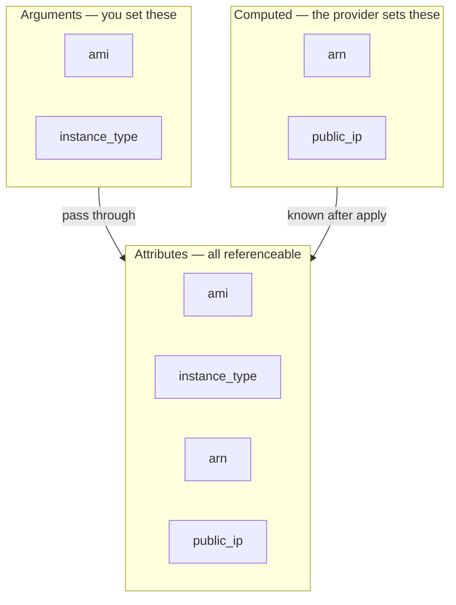

# Chapter 4 — HCL language basics

## Learning outcomes

By the end of this chapter you can:

- Read any `.tf` file as what it is — a set of **blocks** built from **arguments** and **subblocks** — and name every part.
- Tell an argument (`name = value`, once, exported) from a subblock (nested, no `=`, repeatable, not exported), and know why the difference matters.
- Explain how a block's labels form its **reference string**, and how one block feeds another through that reference — the wiring that makes block order irrelevant.
- Recognize every value **type** HCL has (`string`, `number`, `bool`, the collections, `null`, `any`) and pick the right one for an input.
- Reach for the **correct top-level block** for each job — `terraform`, `provider`, `resource`, `data`, `variable`, `output`, `locals`, `module` — and lay a project out across `terraform.tf` / `providers.tf` / `variables.tf` / `main.tf` / `outputs.tf` by convention.

## From copying snippets to writing configuration

You can already drive the loop. Chapter 3 ran `init` / `plan` / `apply` / `destroy` and taught you to read a plan. But every `.tf` file you touched came from a tutorial or an existing project — you adapted it, you didn't author it.

This chapter closes that gap. HCL — **HashiCorp Configuration Language** — is the material every `.tf` file is made of. It is a small language. Once you see that *everything* is one of two constructs, and that there is a fixed, short menu of block types each with one job, you stop pattern-matching against snippets and start writing configuration from the correct block down.

That is the milestone: author a multi-file configuration by hand, choosing the right block type for each purpose, without copy-paste. Nothing here provisions anything new — it is pure language. The chapters that follow drill into individual blocks (`resource` in B5, `variable`/`output`/`locals` in B6, expressions in B7, `data` in B8). This chapter is the map of the whole language so those deep dives have a frame to hang on.

!!! note "One language, two tools"
    Everything in this chapter is byte-identical in Terraform and OpenTofu. HCL, the block types, the type system, and `fmt` are shared. OpenTofu forked the language, not rewrote it. The rare divergences (a `.tofu` file extension, early variable evaluation) belong to later chapters; the *syntax* is the same. Where this chapter says "Terraform," read "or OpenTofu."

## Everything is blocks and arguments

HCL has exactly two syntax constructs. Learn these two and you can parse any configuration you will ever see.

An **argument** assigns a value to a name:

```hcl
instance_type = "t3.micro"
```

The identifier left of the `=` is the argument name; the expression on the right is its value. That is the whole rule.

A **block** is a named container for arguments and other blocks:

```hcl
resource "aws_instance" "hello_world" {
  ami           = data.aws_ami.ubuntu.id
  instance_type = "t3.micro"

  root_block_device {
    volume_size = 20
  }
}
```

Every block has the same anatomy:

- A **type** — the first word (`resource`). It decides how everything inside is interpreted.
- Zero or more **labels** — the quoted words after the type (`"aws_instance"` and `"hello_world"`). How many are required is fixed by the block type.
- A **body** — everything between `{` and `}`. Arguments and nested blocks live here, and can nest to any depth.

If it helps: blocks are the **nouns** of Terraform (a concrete thing — a piece of config or infrastructure), and arguments are the **adjectives** that describe them. Almost all your time is spent writing nouns and wiring them together.

### Arguments vs. subblocks — the distinction that trips everyone

Inside a body you find two things that look similar but behave oppositely: **arguments** and nested blocks (**subblocks**). Getting them confused is the single most common beginner syntax error.

```hcl
resource "aws_instance" "example" {
  instance_type = "t3.micro"        # argument — has '=', appears once

  root_block_device {               # subblock — no '=', repeatable
    volume_size = 20
  }
  ebs_block_device { ... }          # ...another block of the same family
}
```

| | Argument | Subblock |
|---|---|---|
| Syntax | `name = value` | `name { … }` |
| Assignment character | **has** `=` | **no** `=` |
| How many times | **once** per block | **repeatable** |
| Exported as an attribute? | **yes** | **no** |

The `=` is the tell. An argument is a single assignment and may appear only once in a block. A subblock is a nested container, takes no `=`, and can repeat — which is exactly how you stack several of the same thing, like the three `allow` rules on this firewall:

```hcl
resource "google_compute_firewall" "example" {
  name    = "example-firewall"
  network = google_compute_network.example.name

  allow { protocol = "icmp" }
  allow { protocol = "tcp"  ports = ["80", "443"] }
  allow { protocol = "udp"  ports = ["53"] }
}
```

!!! warning "The confusing case: an object-valued argument vs. a subblock"
    An argument whose *value* is an object looks almost like a subblock — both have `{ … }`. The `=` still decides:

    ```hcl
    tags = { Name = "web", Env = "prod" }   # argument: has '=', appears once, is a value
    filter { name = "x"  values = [...] }    # subblock: no '=', repeatable, is a container
    ```

    `tags` is one argument holding a map value. `filter` is a repeatable block. A stray `=` in a block header (`resource "aws_instance" "x" = {`) or a missing one on an argument is the classic "unexpected token" error.

### Attributes — what a block gives back

Blocks don't just take input, they **export attributes** — values other blocks can read. This is the wiring that makes Terraform a graph and not a script. Attributes come from two places:

- **Every argument you set** is automatically readable back as an attribute. Set `ami` on an instance and `aws_instance.hello_world.ami` is available.
- **Computed attributes** the provider fills in only after the resource exists — an instance's `arn`, its `public_ip`, its `instance_state`. These are the `(known after apply)` values you saw in plans in Chapter 3.



One thing that is *not* an attribute: anything inside a subblock. Arguments export; subblock contents do not.

!!! note "“Argument” vs. “attribute” — Terraform's careful wording"
    HCL's own spec calls the `name = value` construct an **attribute**. Terraform's docs deliberately say **argument** instead, and reserve **attribute** for the read-only, *referenceable* kind (like `id` or `arn`) that you can read but never assign. So in Terraform-speak: you *set arguments*; you *reference attributes*. The two overlap — every argument is also readable as an attribute — but a computed attribute like `arn` is only ever an attribute, never an argument.

## Labels, references, and identifiers

Labels are the biggest difference between block types, and they are how blocks get addresses. Block types fall into three label patterns:

| Label pattern | Block types | Why |
|---|---|---|
| **No labels** | `terraform`, `locals` | There's only ever one to talk about — nothing to distinguish. |
| **One label** (you choose it) | `variable`, `output`, `module`, `provider` | The label is the name you reference it by. (`provider`'s label must match a name in `required_providers`.) |
| **Two labels** (subtype + name) | `resource`, `data` | First label is the **subtype** (`aws_instance`) — it ties the block to a provider and says *what kind* of thing it is. Second is a name **you** choose. |

The type plus labels combine into a **reference string** — the unique address you use to pass a value from one block to another:

| Block | Subtype / 1st label | 2nd label | Reference string |
|---|---|---|---|
| `resource` | `aws_instance` | `hello_world` | `aws_instance.hello_world` |
| `data` | `aws_ami` | `ubuntu` | `data.aws_ami.ubuntu` |
| `variable` | `instance_type` | — | `var.instance_type` |
| `output` | (read from outside) | — | `module.<name>.<output>` |
| `locals` | — | — | `local.<name>` |

!!! note "The `output` block *declares*; where it lives decides how it's read"
    An `output "…" {}` block always does one job — it **declares** a value that leaves its module. It is *not* a way to reference an output; `module.<name>.<output>` is. Two sides of one wire: the block is `return x`, the `module.…` read is `y = f()`. And the read path depends on *where* the output sits:

    | Output declared in… | How it's read |
    |---|---|
    | a **child module** (called via `module "<name>" {}`) | the parent reads `module.<name>.<output>` |
    | the **root module** | surfaces on the CLI after `apply` and via `terraform output <name>`; other configs read it through `terraform_remote_state` — **never** through `module.` |

    So a root-level `output "web_server_ip" { value = aws_instance.web.public_ip }` is not read as `module.web_server_ip.…` at all; that syntax only applies to outputs of a *child* module you called. Same keyword, different consumer — pick by which module the block lives in.

Note the leading keyword differs: `resource` references *drop* the `resource.` prefix (just `aws_instance.hello_world`), but `data`, `var`, and `local` keep theirs. For a resource, the subtype and name are enough because two resources can't share both — you can have `aws_instance.web` and `aws_instance.db`, or `aws_instance.web` and `aws_lb.web`, but not two `aws_instance.web`.

Every one of those names — argument names, block types, the labels you pick — is an **identifier**, and identifiers have rules:

- Letters, digits, underscores (`_`), and hyphens (`-`) are allowed.
- The first character **must not be a digit** (so it can't be mistaken for a number).
- Formally: Unicode identifier syntax plus the ASCII hyphen.

## Order doesn't matter — the reference is the dependency

Here is the idea that separates HCL from a shell script: **block order is meaningless.** You can define resources in any order, in any file, and the plan is identical. Terraform does not run top to bottom.

Instead, at plan time Terraform reads which blocks reference which other blocks' attributes and builds a **dependency graph** (a DAG). A reference *is* an edge. When you write:

```hcl
resource "aws_instance" "web" {
  subnet_id = data.aws_subnets.default.ids[0]   # ← this reference creates a dependency
}
```

…you have told Terraform "the instance needs the subnet lookup first" without writing a single ordering instruction. It reads the reference, adds the edge, and orders the work itself — building independent things in parallel and dependent things in sequence. Chapter 3 showed this in action; here is the language reason it works. You describe *what* you want and how things connect; the graph decides *when*.

This is why the same three files can be one `main.tf` or split across five files with no change in behavior. Filenames are for humans. Terraform reads **every `.tf` file in the directory** and treats them as one merged configuration.

## The value vocabulary: HCL's type system

Everything on the right of an `=` has a **type**. You don't have to declare types, but knowing them lets you constrain inputs (B6), read provider docs, and understand error messages. There are three primitives and a family of collections.

**Primitives:**

| Type | Keyword | Notes |
|---|---|---|
| String | `string` | Unicode text (emoji included). Supports interpolation: `"${var.prefix}-web"`. |
| Number | `number` | **One** type for integers, floats, and negatives — unusual. Watch for the "needs an integer, got a float" case. |
| Boolean | `bool` | `true` / `false` (literal, unquoted). |

**Collections and structural types** — the difference is whether elements must share a type and whether keys are fixed:

| Type | Written | Elements | Keys / order |
|---|---|---|---|
| **List** | `list(string)` | all same type | ordered, zero-indexed |
| **Set** | `set(string)` | all same type | unordered, no duplicates |
| **Tuple** | `tuple([string, number])` | each element its own type | fixed length, ordered |
| **Map** | `map(string)` | all values same type | arbitrary keys — great for `tags` |
| **Object** | `object({ name = string, port = number })` | each key its own type | fixed, named keys |

```hcl
example_list   = ["a", "b", "c"]                    # list(string)
example_tuple  = ["alpha", 42]                      # tuple([string, number])
example_map    = { Env = "prod", Team = "data" }    # map(string)
example_object = { name = "web", port = 443 }       # object({name=string, port=number})
```

The map-vs-object distinction is the subtle one: a **map** allows any keys but forces one value type (ideal for tags, where keys are arbitrary); an **object** fixes the set of keys but lets each hold a different type (ideal for a structured config). Terraform silently drops object keys not in the constraint; a map keeps whatever keys you give it.

**Two special types:**

**`any`** — a placeholder that accepts any type; it's what you get when a `variable` has no `type` at all. "Any" describes the *whole* value — a `list`/`map` still resolves to one shared element type:

```hcl
variable "items" {
  type = list(any)
}
# items = ["a", "b"]     ✅  → list(string)
# items = [1, 2]         ✅  → list(number)
# items = ["a", 1, true] ⚠️  unified to list(string): ["a", "1", "true"]
```

Terraform doesn't allow a truly mixed list — it finds one common type every element converts to (strings win here) and coerces silently. For genuinely mixed positions use a `tuple([string, number, bool])` or an `object`, not `list(any)`.

**`null`** — the value meaning "not set / absent," distinct from `""`, `0`, or `false`. The common use is an optional input's `default = null`, so a module can tell *"caller left it out"* from *"caller passed an empty value"*:

```hcl
variable "description" {
  type    = string
  default = null    # sentinel: caller didn't supply one
}

locals {
  final = var.description != null ? var.description : "auto-generated"
}
```

With `default = ""` you couldn't distinguish "unset" from "deliberately empty" — `null` gives that third state. Note `null` is a *value*, never a *type*: `type = null` is invalid; write a real type and set `default = null`.

!!! note "This is a survey — B6 puts it to work"
    You'll define these types on real `variable` blocks in Chapter 6, with defaults, validation, and `optional()` object attributes. Here the goal is just to recognize the vocabulary so you know what can legally go on the right of an `=`.

## The top-level block catalog

A **top-level block** is one that appears outside any other block — the outermost structures in a `.tf` file. Terraform's language has a small, fixed set of them (thirteen at the time of writing). The milestone rests on picking the right one, so here is the whole menu, with the eight you'll use daily called out:

| Block | Labels | Job | Goes deep in |
|---|---|---|---|
| **`terraform`** | none | Configure Terraform itself: `required_providers`, `required_version`, backend/state. | B2, I6 |
| **`provider`** | 1 | Configure a provider plugin: auth + region/scope. Root module only. | B5, I8 |
| **`resource`** | 2 | **Create and manage** one piece of infrastructure. The point of the whole tool. | B5 |
| **`data`** | 2 | **Read-only** lookup of something that already exists — never creates. | B8 |
| **`variable`** | 1 | Declare an **input** to the module (`var.<name>`). | B6 |
| **`output`** | 1 | Expose a value **out** of the module (`module.<name>.<out>`). | B6 |
| **`locals`** | none | Name **internal** intermediate values (`local.<name>`). | B6 |
| **`module`** | 1 | Call a reusable bundle of other blocks. | I4, I5 |
| `import` | none | Bring existing infrastructure under management. | I7 |
| `moved` | none | Record that a resource was renamed/relocated, without recreating it. | I7, A8 |
| `removed` | none | Drop a resource from management **without** destroying it. | I7 |
| `check` | 1 | Validate deployed infrastructure with assertions. | A2 |
| `ephemeral` | 2 | Temporary resource (e.g. a secret/token) that is **never written to state or plan** (Terraform 1.10+). | A6 |

The eight in bold are what "author a configuration by hand" means. A one-line mental model for each:

- **`terraform`** — the project's settings file. What version, which providers, where state lives. One per root module, no label.
- **`provider`** — the vendor connection. Credentials and region. You declare *what* to install in `terraform { required_providers }`; you *configure* it here.
- **`resource`** — a thing you want to exist and keep existing. Everything else is scaffolding around resources.
- **`data`** — a thing that already exists that you want to *read* (the latest AMI, the default VPC) but not own.
- **`variable`** — a knob the caller can turn. Data flowing *in*.
- **`output`** — a value you hand back. Data flowing *out*.
- **`locals`** — a scratchpad for values used in several places, so you compute once and reference `local.name`.
- **`module`** — a call to a reusable package of the above.

!!! note "Meta-arguments are a category you'll meet later"
    A handful of arguments — `count`, `for_each`, `depends_on`, and the `lifecycle` subblock — are **meta-arguments**: they're built into HCL and change how Terraform *plans* a block, not what infrastructure it makes. They work on most block types regardless of provider. They're named here so you recognize the term; they get full treatment in I1 (`count`/`for_each`/`depends_on`) and I2 (`lifecycle`).

## Putting it together: a multi-file configuration

Terraform merges every `.tf` file in a directory, so *where* a block lives is a convention for humans, not a rule for the machine. But the convention is strong and worth following from day one — a maintainer should know instantly where to find any definition. HashiCorp's recommended layout:

| File | Holds |
|---|---|
| `terraform.tf` | the single `terraform` block: `required_version` + `required_providers` |
| `providers.tf` | all `provider` blocks |
| `variables.tf` | all `variable` blocks (alphabetical) |
| `main.tf` | the `resource` and `data` blocks — the substance |
| `outputs.tf` | all `output` blocks (alphabetical) |
| `locals.tf` | local values (if shared across files; otherwise atop the file that uses them) |

As a project grows, split `main.tf` by concern (`network.tf`, `storage.tf`, `compute.tf`). Here is one small configuration that launches a web instance, spread across the convention — each block in the file where you'd expect it:

```hcl
# terraform.tf — what to install, and the CLI floor
terraform {
  required_version = ">= 1.15"

  required_providers {
    aws = {
      source  = "hashicorp/aws"
      version = "~> 6.0"
    }
  }
}
```

```hcl
# providers.tf — how to connect
provider "aws" {
  region = var.region
}
```

```hcl
# variables.tf — the knobs
variable "region" {
  type        = string
  description = "AWS region to deploy into."
  default     = "us-east-1"
}

variable "instance_type" {
  type        = string
  description = "EC2 instance size."
  default     = "t3.micro"
}
```

```hcl
# main.tf — the substance: a data lookup feeding a resource
data "aws_ami" "ubuntu" {
  owners      = ["099720109477"] # Canonical
  most_recent = true

  filter {
    name   = "name"
    values = ["ubuntu/images/hvm-ssd/ubuntu-*-amd64-server-*"]
  }
}

locals {
  tags = {
    ManagedBy = "Terraform"
    Project   = "learn-hcl"
  }
}

resource "aws_instance" "web" {
  ami           = data.aws_ami.ubuntu.id  # ← reference: instance depends on the AMI lookup
  instance_type = var.instance_type       # ← reference: value comes from the variable
  tags          = local.tags              # ← reference: reuse the shared tags
}
```

```hcl
# outputs.tf — what to hand back
output "instance_id" {
  description = "ID of the launched instance."
  value       = aws_instance.web.id
}

output "public_ip" {
  description = "Public IP, known only after apply."
  value       = aws_instance.web.public_ip
}
```

Every block type from the catalog is doing its one job, and the references (`data.aws_ami.ubuntu.id`, `var.instance_type`, `local.tags`, `aws_instance.web.id`) are the wiring. Terraform reads the whole directory, builds the graph from those references — AMI lookup before instance, instance before outputs — and orders the work. You wrote none of that ordering.

That is the milestone. You can now open an empty directory and write this from the block down: pick `terraform` for settings, `provider` for the connection, `variable` for each knob, `data`/`resource` for the substance, `output` for the results — no snippet to copy.

## Style essentials

HCL has an opinionated style. It's advisory — ignoring it won't break a plan — but it's what "writing it right" means, and `terraform fmt` enforces the mechanical parts for you. The rules worth internalizing now:

- **Two-space indent** per nesting level.
- **Align the `=`** for consecutive single-line arguments in the same block.
- **Order inside a block:** meta-arguments (`count`/`for_each`) first, then normal arguments, then subblocks, then meta-argument blocks (`lifecycle`) last.
- **Comments** use `#`. The `//` and `/* */` forms work (HCL backward-compatibility) but aren't idiomatic — `fmt` rewrites `//` to `#`.
- **Naming:** a descriptive noun with underscores, and **don't repeat the resource type** in the name — the address already carries it. `resource "aws_instance" "web"`, not `"web_aws_instance"`.

```hcl
resource "aws_instance" "web" {
  count = 2                       # meta-argument first

  ami           = data.aws_ami.ubuntu.id
  instance_type = var.instance_type   # arguments, '=' aligned

  lifecycle {                     # meta-argument block last
    create_before_destroy = true
  }
}
```

Run `terraform fmt` before every commit (a Git pre-commit hook is ideal) and `terraform validate` to catch structural errors — a stray `=`, a missing brace, a wrong type. One caveat: **`fmt` formats, it does not reorder your arguments** — the ordering convention above is on you.

!!! tip "Files that shouldn't be committed"
    Commit all `.tf` code, the `.terraform.lock.hcl`, a `.gitignore`, and a `README.md`. **Never** commit `terraform.tfstate` (it holds secrets in plaintext), the `.terraform/` directory, saved plan files, or any `.tfvars` containing secrets. A wrong `.gitignore` here leaks credentials — Chapter 9 (state) returns to why.

## Two syntaxes you'll recognize but rarely write

!!! info "JSON-equivalent syntax (`*.tf.json`)"
    Everything above is HCL's **native** syntax. There is also a fully-equivalent **JSON** syntax: a file named `*.tf.json` (or `*.tfvars.json`) is parsed identically to `.tf`. It's harder for humans to read but easier for programs to generate and parse, so you'll see it emitted by codegen tools and other machinery — recognize it, but hand-write the native syntax.

!!! info "Override files"
    A file named `override.tf` or ending in `_override.tf` is loaded **last**, and its blocks *merge into* matching blocks elsewhere, replacing whatever arguments they set. It's handy for a local or temporary tweak without editing the primary files — but it hides configuration from those files, so use it sparingly.

## 🧪 Lab: author the multi-file config by hand on LocalStack

The milestone for this chapter is authoring a multi-file configuration from the block down. This lab proves you can — and then actually applies it, for free, against the local **AWS emulator** (Ch1's [lab setup](ch01-iac-fundamentals.md#lab-setup-a-free-local-aws-docker) — Floci, MiniStack, or LocalStack). The AMI-lookup-plus-EC2 example above won't apply on the free emulator (EC2 is only mocked), so write the same *shape* with an S3 bucket — every block type still doing its one job, wired by references.

**Start the emulator** (from the repo root; skip if it's already running):

```shell
docker compose -f labs/docker-compose.yml up -d      # start Floci on :4566, detached
curl -s http://localhost:4566/_localstack/health     # wait until services read "available"
```

In an empty directory, create the conventional files by hand — no snippet to copy:

```hcl
# terraform.tf — settings
terraform {
  required_version = ">= 1.15"

  required_providers {
    aws = {
      source  = "hashicorp/aws"
      version = "~> 6.0"
    }
  }
}
```

```hcl
# providers.tf — connection (plain AWS block; tflocal points it at LocalStack)
provider "aws" {
  region = var.region
}
```

```hcl
# variables.tf — the knobs
variable "region" {
  type        = string
  description = "AWS region."
  default     = "us-east-1"
}

variable "bucket_name" {
  type        = string
  description = "Name of the lab bucket."
  default     = "hcl-lab-bucket"
}
```

```hcl
# main.tf — the substance: a local feeding a resource
locals {
  tags = {
    ManagedBy = "Terraform"
    Project   = "learn-hcl"
  }
}

resource "aws_s3_bucket" "site" {
  bucket = var.bucket_name    # ← reference: value from the variable
  tags   = local.tags         # ← reference: reuse the shared tags
}
```

```hcl
# outputs.tf — what to hand back
output "bucket_id" {
  description = "ID of the created bucket."
  value       = aws_s3_bucket.site.id
}

output "bucket_arn" {
  description = "ARN, known only after apply."
  value       = aws_s3_bucket.site.arn
}
```

Six blocks across five files, each in the file the convention predicts — `terraform` for settings, `provider` for the connection, two `variable` knobs, a `locals` scratchpad, one `resource`, two `output`s. The references (`var.bucket_name`, `local.tags`, `aws_s3_bucket.site.id`) are the wiring. Apply and confirm:

```shell
tflocal init
tflocal apply          # review the single '+ create', type yes
tflocal output         # bucket_id / bucket_arn
awslocal s3 ls         # LocalStack's own view of the bucket
tflocal destroy
```

Now prove the chapter's central claim — **file order and split are for humans, not Terraform.** Merge all five files into one `main.tf`, in any block order (put `output` first, `terraform` last if you like), and re-plan:

```shell
tflocal plan           # Plan: 0 to add, 0 to change, 0 to destroy.
```

An empty plan. Terraform merged every `.tf`, rebuilt the same graph from the same references, and reached the same desired state — the layout changed nothing. That empty plan *is* the proof.

!!! note "Why S3, not the EC2 example from the chapter"
    The multi-file walkthrough earlier used `aws_ami` + `aws_instance` because it's the canonical teaching shape. On the free emulator *every* service is mocked — nothing here touches real AWS — so a green `apply` proves your HCL and workflow, not that a real VM booted. The default emulator (**Floci**) actually mocks EC2 deep enough that the full hello-world shape (the `aws_ami` lookup, default-VPC and subnet data sources, and `aws_instance`) applies clean; you can run it as-is against Floci. This lab still uses an **S3 bucket** for portability: LocalStack's free Community EC2 mock is shallower, whereas S3 is a reliable mock on all three emulators, so the S3 version runs everywhere the book's labs might. The point being exercised — choosing the right block per job, wiring with references, splitting by convention — is identical regardless of the resource type.

## Common pitfalls

- **`=` in a block header.** `resource "aws_instance" "web" = {` is wrong — block headers have no `=`. Arguments take `=`; block headers don't. This is the most frequent first-day error.
- **Confusing an argument with a subblock.** If it has `=` it's an argument (once only); if it doesn't, it's a nested block (repeatable). Trying to repeat an argument, or putting `=` on a subblock, both fail.
- **Assuming every resource takes the same arguments.** Each resource *subtype* has its own schema, set by its provider. Read the provider's registry docs (or `terraform providers schema -json`) — don't guess an argument name.
- **Forgetting a required argument.** Provider docs mark arguments required or optional; a missing required one errors at plan. `validate` catches most of these before you even plan.
- **Expecting top-to-bottom execution.** Order is meaningless; the *reference graph* decides ordering. If you need A before B, reference A's attribute in B — don't reorder the file.
- **Repeating a resource name.** `aws_instance.web` and a second `aws_instance.web` collide. Two resources may share a *type* or a *name*, but not both.
- **Naming a resource with its type in it.** `"web_instance"` on an `aws_instance` reads as `aws_instance.web_instance` — redundant. Name it `"web"`.

## Exercises

1. **Recall** — Given a line inside a block body, how do you tell in one glance whether it's an argument or a subblock? What does each imply about how many times it can appear and whether it's exported?
2. **Identify** — For each of `terraform`, `resource`, `variable`, `data`, name how many labels it takes and what each label means.
3. **Apply** — Write the reference string you'd use to read: the `id` of `resource "aws_s3_bucket" "logs"`; the value of `variable "region"`; a local named `common_tags`; the `arn` output of a module block named `network`.
4. **Types** — You need an input that accepts arbitrary key/value string tags, and another that is a fixed structure of a name (string) and a port (number). Which type constraint fits each, and why not the other?
5. **Extend** — Take a single-file config with a `terraform`, a `provider`, a `variable`, a `resource`, and an `output` block all in `main.tf`. Split it into the conventional files. Does the plan change? Why or why not?

## Summary

- HCL has exactly two constructs: **arguments** (`name = value`, once, exported as an attribute) and **blocks** (a typed, labeled `{ … }` container). Subblocks are nested blocks — no `=`, repeatable, *not* exported.
- A block is **type + labels + body**. Labels give it a **reference string** (`aws_instance.web`, `var.region`, `data.aws_ami.ubuntu`) — the address other blocks read it by.
- Blocks export **attributes**: every argument, plus provider-**computed** ones that are `(known after apply)`. References between blocks are what wire a configuration together.
- **Order is meaningless.** Terraform builds a dependency graph from references and orders the work itself. You declare *what* and *how things connect*; the graph decides *when*.
- Every value has a **type**: primitives (`string`, `number`, `bool`), collections (`list`, `set`, `tuple`, `map`, `object`), and the specials `null` and `any`. Map = arbitrary keys, one value type; object = fixed keys, mixed types.
- Terraform's language is a fixed menu of **top-level blocks**. The eight everyday ones: `terraform` (settings), `provider` (connection), `resource` (manage), `data` (read), `variable` (in), `output` (out), `locals` (internal), `module` (reuse).
- Lay a project out by convention (`terraform.tf` / `providers.tf` / `variables.tf` / `main.tf` / `outputs.tf`); Terraform merges all `.tf` files anyway, so the split is for humans. Run `fmt` and `validate` reflexively.

---

**Next: B5 — Providers & resources.** You can now write any block by hand and wire blocks together with references. Next you'll go deep on the two block types that do the actual work — how the provider plugin model maps HCL to real cloud APIs, how resource addresses and arguments-vs-attributes play out on a real resource, and how the implicit dependency graph you met here gets built from attribute references.

## References

- [Configuration Syntax (HCDocs)](../sources/terraform-docs/tf-config-syntax.md) — arguments/blocks, labels, identifiers, comments, encoding
- [Style Guide (HCDocs)](../sources/terraform-docs/tf-style-guide.md) — formatting, naming, file layout, `.gitignore`, ordering
- [Provider Requirements (HCDocs)](../sources/terraform-docs/provider-requirements.md) — the `terraform`/`required_providers` block
- TID Ch2 — Terraform HCL components: [book reading notes](../books/tid/chapters/02-hcl-components.md) (block anatomy, the block-type catalog, arguments/subblocks/attributes, order-is-a-DAG)
- TID Ch3 — Terraform variables and modules: [book reading notes](../books/tid/chapters/03-variables-modules.md) (the type system, the three "variables", argument vs. parameter)
- [Feature history](../reference/feature-history.md) — JSON syntax, override files
- [Version & Certification Facts](../research-cache/version-facts.md)
- Web (verified 2026-07-09): [Syntax — Configuration Language](https://developer.hashicorp.com/terraform/language/syntax/configuration) · [Terraform language overview](https://developer.hashicorp.com/terraform/language)
- 🧪 Lab: [Floci Facts](../research-cache/floci-facts.md) · [MiniStack Facts](../research-cache/ministack-facts.md) · [LocalStack Facts](../research-cache/localstack-facts.md) (Docker setup, `tflocal` — verified 2026-07-09)
