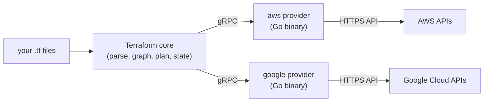
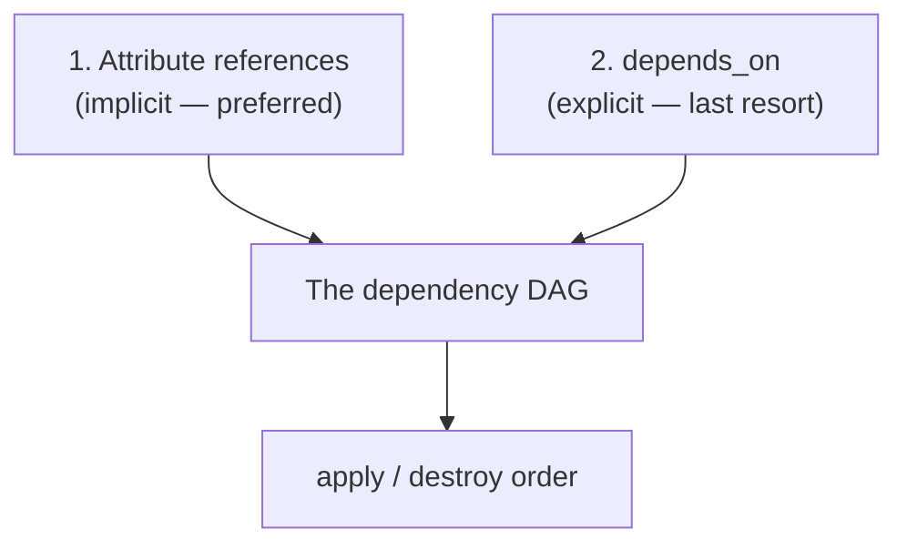

# Chapter 5 — Providers & resources

## Learning outcomes

By the end of this chapter you can:

- Explain the **provider plugin model** — how `resource "aws_instance"` in your HCL becomes a real API call, and why Terraform's core engine knows nothing about AWS.
- Read a **source address** (`hashicorp/aws`) as a `[host/]namespace/type` triple, and read the Registry **tier badge** as a trust signal.
- Navigate a provider's Registry docs and tell a resource's **arguments** (inputs you set) from its **attributes** (values it computes and exports).
- Name every part of a **resource block** — the address, provider-specific arguments, the meta-argument map, and the `timeouts` child block — and know which come from the provider and which from Terraform core.
- Chain three resources so that each reads the previous one's attributes, and **predict the apply order** from those references alone — no `depends_on`.

## Two machines behind one resource block

By the end of Chapter 4 you could write any block by hand and wire blocks together with references. But writing `resource "aws_instance" "web" { … }` and getting a running EC2 instance are two very different things. What actually happens between the `.tf` file and the live VM?

Two machines do the work, and this chapter is about both:

1. **The provider plugin** turns your declarative HCL into concrete API calls against a vendor. It is the thing that knows what an `aws_instance` *is*, which arguments it takes, and how to create one. Terraform core does not.
2. **The dependency graph** decides *when* each resource is created relative to the others. It is built entirely from the references you write — and getting those references right is the whole milestone for this topic.

Miss the first and you'll expect Terraform to know your infrastructure out of the box — it doesn't; every resource type comes from a provider, bar the handful built into core. Miss the second and you get race conditions — flaky create-order that works from your local state and breaks on a clean apply in CI. Resources are the unit of everything Terraform manages, so both machines are worth understanding before you build anything real.

---

## Part 1 — The provider plugin model

### Core is vendor-agnostic; the provider is the whole abstraction

Terraform core is a single, statically-compiled binary. It parses HCL, builds a graph, computes a plan, and manages state. It does **not** know what AWS, Cloudflare, or GitHub are. Every vendor-specific fact — that an EC2 instance takes an `ami`, what arguments an `aws_s3_bucket` accepts, how to authenticate — lives in a **provider**.

A provider is a plugin: a standalone binary, written in Go, that Terraform core launches as a subprocess and talks to over **gRPC**. Core sends the provider a desired-state description; the provider translates it into calls against the vendor's API and reports back. The provider *is* the boundary between "one core" and "any platform."



This design is why one tool manages everything: core stays small and vendor-neutral, while each provider is a swappable plugin with its own release cadence, version numbers, and docs. Each of those is worth unpacking.

**Swappable** means a provider is never compiled into the Terraform CLI. `terraform init` reads your `required_providers` and downloads each one as a separate binary into `.terraform/`. You can add, drop, or upgrade one provider without touching core or the others — bump `aws` from 5 to 6 while `google` stays put.

**Own release cadence** means each provider ships on its own schedule, independent of the Terraform CLI *and* of every other provider. The `aws` provider releases often to keep up with new AWS services; core releases on a wholly separate timeline. A new AWS feature usually means a new `aws` provider version, not a new Terraform CLI.

**Own version numbers** means each provider carries its own independent semver, unrelated to the CLI version or to each other — the box below unpacks this. One configuration routinely mixes providers at very different version numbers.

**Own docs** means each provider publishes its own reference pages on the Registry, versioned per provider release. That is where a resource's arguments and attributes are documented, by the provider's authors — because core does not know them.

There are thousands of providers in the Registry. Most wrap an infrastructure platform; a few are pure local utilities (`random`, `null`, `time`, `tls`). Without a provider, Terraform manages nothing.

!!! note "Provider version ≠ vendor API version"
    The `aws` provider is on major version 6, but AWS-the-service has no "v6." The provider is its own artifact, versioned independently of both the vendor's API and the Terraform CLI. When you pin `~> 6.0`, you are pinning the *plugin*, not anything AWS publishes. This is also why "vendor" is only a teaching word — Terraform has no `vendor` object; the only language construct is `provider`.

### Every resource type is named after its provider

Look at any resource type: `aws_instance`, `google_compute_instance`, `random_id`. The prefix before the first underscore is the provider's **local name**. `aws_instance` implies the `aws` provider; `google_storage_bucket` implies `google`. That is how Terraform knows which plugin owns a resource type — it reads the prefix.

This is why you almost never spell out which provider a resource uses. Terraform infers it from the type name. You only override that inference (with the `provider` meta-argument) when you have several configurations of the same provider — covered in depth in I8.

### Declare, then configure — two blocks, two jobs

Chapter 4 introduced `terraform` and `provider` as two of the eight everyday blocks. Here is the distinction that matters most for providers: **declaring** a provider and **configuring** it are separate acts, in separate blocks.

```hcl
# terraform.tf — DECLARE: which provider, which version
terraform {
  required_providers {
    aws = {
      source  = "hashicorp/aws"
      version = "~> 6.0"
    }
  }
  required_version = ">= 1.2"
}
```

```hcl
# providers.tf — CONFIGURE: how to connect
provider "aws" {
  region = "us-east-1"
}
```

- `required_providers` (inside the `terraform` block) tells Terraform **what to install and from where**. Each entry maps a local name (`aws`) to a `source` address and a `version` constraint.
- The `provider "aws"` block **configures the connection** — region, credentials, and any provider-wide settings.

The word `aws` is doing more work than it looks. It shows up three times — as the `required_providers` key, as the `provider` block label, and as the prefix of every `aws_*` resource type — and all three are the same **local name**. That shared name is the wiring. The `provider` block label *must* equal the `required_providers` key: `provider "aws"` configures the entry whose key is `aws`, and nothing else. A resource's type prefix is then matched against that same key to find which provider configures it.

!!! warning "Rename the local name and your resources stop finding it"
    The key is yours to choose — nothing forces it to be `aws`. But it is load-bearing, so renaming it means rewiring every resource by hand:

    ```hcl
    terraform {
      required_providers {
        myaws = {
          source  = "hashicorp/aws"
          version = "~> 6.0"
        }
      }
    }

    provider "myaws" {
      region = "us-east-1"
    }
    ```

    Now `aws_instance` no longer resolves to this block. Terraform reads the `aws` prefix, looks for a local name `aws`, and doesn't find one — `myaws` doesn't match. It treats the bare `aws` prefix as a *different*, default `hashicorp/aws` provider that your `provider "myaws"` block never configured, so the `region` and credentials you set are ignored. To bind a resource to the renamed provider you must name it explicitly on every one:

    ```hcl
    resource "aws_instance" "web" {
      provider = myaws
      # ...
    }
    ```

    This is why the local name almost always matches the provider's preferred name. You only diverge when two providers would otherwise collide on one local name, and then a `provider` meta-argument on every affected resource is mandatory. The full mechanics live in I8.

The two are genuinely independent. You can declare a provider without a `provider` block (Terraform assumes an empty default configuration), and the `provider` block's arguments are entirely defined by the provider, not by Terraform core.

!!! warning "Define `provider` blocks in the root module only"
    Child modules receive their provider configuration from their parent — they must not carry their own `provider` blocks. A child module still declares its own `required_providers` (the *configuration* inherits, but the `source`/`version` requirements do not). The full mechanics of passing providers into modules belong to I8; for now, keep every `provider` block in your root module.

### Reading a source address

The `source` is the provider's global address. Its full form is:

```
[<HOSTNAME>/]<NAMESPACE>/<TYPE>
```

| Part | Example | Meaning |
|---|---|---|
| Hostname (optional) | `registry.terraform.io` | Registry host; defaults to the public Registry when omitted |
| Namespace | `hashicorp` | The publisher/org in the Registry |
| Type | `aws` | The provider's short name (usually its preferred local name) |

So `hashicorp/aws` is shorthand for `registry.terraform.io/hashicorp/aws`. The **namespace is the trust signal**: `hashicorp/aws` is HashiCorp's official AWS provider; `DeviaVir/gsuite` is a community provider maintained by an individual. Same address format, very different maintenance guarantees.

The Registry encodes that guarantee as a **tier badge**:

| Tier | Who maintains it | Example namespaces |
|---|---|---|
| **Official** | HashiCorp itself | `hashicorp`, `IBM`, `ansible` |
| **Partner Premier** | A technology partner meeting the higher partner bar | third-party org |
| **Partner** | A third-party company, against its own APIs | third-party org |
| **Community** | Individual maintainers | `DeviaVir/gsuite` |
| **Archived** | Formerly Official/Partner, no longer maintained | varies |

Prefer Official and Partner tiers for anything load-bearing. Treat **Archived** as a warning — the provider is abandoned, so pin off it and plan a migration.

!!! tip "Always constrain the provider version"
    Without a `version` constraint, `terraform init` installs the newest provider available — which may be a breaking major you never tested. Pin the major (`~> 6.0` accepts any 6.x but never 7.0), and commit the `.terraform.lock.hcl` file `init` writes so every machine installs the exact same build. Version-constraint syntax and the lock file's upgrade rules are covered in B2; the one rule to carry here is *never leave a provider unpinned in a project you apply*.

### The `provider` block is where providers actually differ

The declare half (`required_providers` + `source` + version pin) is identical for every provider. The **configure half is vendor-shaped** — its arguments and its credential model come from the provider, so reading the specific provider's Registry page is non-optional. Compare AWS and Google:

```hcl
provider "aws" {
  region = "us-east-1"          # AWS scopes with a single region
}
```

```hcl
provider "google" {
  project = "my-project-id"     # every GCP resource lives in a project
  region  = "us-central1"
  zone    = "us-central1-c"     # GCP adds a project/region/zone hierarchy
}
```

The credential models also differ. The AWS provider resolves credentials in a defined order (first match wins): provider-block parameters → environment variables (`AWS_ACCESS_KEY_ID`, …) → `~/.aws/credentials` → `~/.aws/config` → container credentials → EC2 instance profile. The Google provider's *idiomatic* path is instead **Application Default Credentials** — `gcloud auth application-default login` on a workstation, or an attached service account / Workload Identity Federation in CI — rather than AWS's static-key-first habit. It still accepts an explicit key file (the `credentials` argument or the `GOOGLE_CREDENTIALS` / `GOOGLE_APPLICATION_CREDENTIALS` env vars, which take precedence over the gcloud ADC file) and `impersonate_service_account` for least-privilege impersonation.

!!! note "OIDC is not a separate entry in the list — it rides the chain"
    Web-identity federation (OIDC) is how CI runners like GitHub Actions authenticate with no static keys, but it isn't a seventh entry in the list above. It plugs into the top tiers: an `assume_role_with_web_identity` block in the `provider` block, or the `AWS_ROLE_ARN` + `AWS_WEB_IDENTITY_TOKEN_FILE` environment variables (the pattern EKS IRSA also uses). The provider then exchanges that token for short-lived credentials via STS `AssumeRoleWithWebIdentity`. The plain `assume_role` block layers the same exchange on top of any base identity for role chaining, but unlike the base chain it can't be set from environment variables. Full CI credential setup is A3 and A6.

!!! danger "Never hard-code credentials in a `provider` block"
    Both providers' docs warn against it explicitly, and for the same reason: a `provider` block lives in a `.tf` file, and a `.tf` file gets committed. A leaked static AWS key or a committed GCP service-account key file is a long-lived secret in your history. Prefer environment variables, a named profile, or — best — short-lived role credentials (AWS instance profiles / OIDC, GCP workload-identity impersonation). Full secrets handling is A6.

### Utility providers and the one built-in

Not every provider wraps a cloud. **Utility providers** — `random`, `null`, `time`, `tls` — compute values or model actions without touching any remote API. Their resources are **local-only**: applying one computes a value and stores it in state; destroying one just drops it from state. No cloud object is ever created. You still declare them in `required_providers` like any other provider.

```hcl
resource "random_id" "suffix" {
  byte_length = 4
}
# random_id.suffix.hex → a computed attribute, e.g. "a1b2c3d4"
```

There is exactly **one** resource type built into Terraform core itself, needing no provider: `terraform_data`. It implements the standard resource lifecycle but takes no action — the modern replacement for the old `null_resource` pattern (full treatment in A1). The built-in provider (`terraform.io/builtin/terraform`) also backs the `terraform_remote_state` data source (B9/I6).

!!! warning "Local-only ≠ secret-safe"
    A `tls_private_key` or a generated password from a utility provider is **stored in plaintext in state**. Local-only resources are convenient for generating unique suffixes or throwaway keys — they are *not* a secrets solution. The state-secrets problem is real and is addressed in A6.

---

## Part 2 — The resource block up close

A resource is any infrastructure object Terraform creates and manages, from a VM down to a single DNS record. Writing one is three steps.

### Step 1 — declare the address

```hcl
resource "aws_instance" "web" {
  # ...
}
```

The two labels are the **type** (`aws_instance`) and a local **name** (`web`) of your choosing. Together they form the resource's **address**: `aws_instance.web`. That address is how state tracks the resource and how every other block refers to it. The type prefix (`aws_`) names the provider; the name is unique within its type in the module.

### Step 2 — set provider-specific arguments

Most of the block body is arguments defined by the **provider**, not by Terraform:

```hcl
resource "aws_instance" "web" {
  ami           = "ami-a1b2c3d4"   # provider-specific
  instance_type = "t2.micro"       # provider-specific
}
```

Each resource type has its own schema. The provider's Registry docs mark each argument required or optional and describe its type. Don't guess an argument name — read the docs, or dump the schema with `terraform providers schema -json`. `terraform validate` catches a mistyped argument before you touch real infrastructure.

This is the place to nail the **arguments-vs-attributes** distinction from Chapter 4, now on a real resource:

- **Arguments** are inputs *you* set (`ami`, `instance_type`).
- **Attributes** are values the resource *exports* after it exists — some are arguments echoed back, others are **computed** by the provider and only knowable once the object is created (`id`, `arn`, `private_ip`). In a plan these show as `(known after apply)`.

You read an attribute through the address: `aws_instance.web.id`, `aws_instance.web.private_ip`. That read is the reference that Part 3 turns into a dependency edge.

### Step 3 — set Terraform meta-arguments

A small set of arguments are defined by Terraform **core**, work on any resource type, and control *how* Terraform manages the resource rather than what the resource is:

| Meta-argument | What it does | Covered in |
|---|---|---|
| `count` | Create N identical instances by index | I1 |
| `for_each` | Create one instance per map/set element (keyed) | I1 |
| `depends_on` | Assert a dependency Terraform can't infer | I1 |
| `provider` | Pick a non-default (aliased) provider configuration | I8 |
| `lifecycle` | Tune create/destroy/replace behavior | I2 |

`count` and `for_each` are **mutually exclusive** on one resource. Each of these gets a full chapter later; for now, know they exist and that they are the *only* arguments not defined by the provider.

!!! note "`timeouts` looks like a meta-argument but isn't"
    Some resource types accept a `timeouts` child block to bound how long Terraform waits per operation:

    ```hcl
    resource "aws_db_instance" "example" {
      # ...
      timeouts {
        create = "60m"
        delete = "2h"
      }
    }
    ```

    It looks core-defined, but it is **provider-defined** — it exists only where the resource type implements it, and which operations (`create`/`update`/`delete`/…) are configurable varies by type. Don't assume every resource has it; check the provider docs.

### What `apply` does to a resource

When you run `terraform apply`, Terraform reconciles config, real infrastructure, and state, and performs exactly these operations per resource:

- **Create** — in config, no real object yet. Plan symbol `+`.
- **Destroy** — in state, no longer in config. Plan symbol `-`.
- **Update in place** — arguments changed and the API can patch them. Plan symbol `~`.
- **Destroy and re-create** — arguments changed but the API *can't* patch them (a forced-new attribute), so Terraform replaces the object. Plan symbol `-/+`.
- **Update state** — so config, infrastructure, and state all match again.

These are the same plan symbols from Chapter 3. The one to respect is `-/+`: changing certain arguments (an EC2 instance's `ami`, a bucket's `bucket` name) forces a full replacement, not an edit. The plan tells you which — read it.

---

## Part 3 — The implicit dependency graph

This is the heart of the chapter and the milestone. Resources do **not** run in the order you write them. Terraform builds a **directed acyclic graph** (DAG) during `plan` and orders the work from that graph. It parallelizes nodes it believes independent, and serializes nodes connected by an edge.

### The graph has exactly two inputs



1. **Attribute references.** If resource A reads an attribute of resource B, that reference *is* a dependency edge — B is built before A. This is implicit and preferred.
2. **`depends_on`.** An edge you assert by hand, for a real-world dependency that leaves no trace in the configuration.

There is no third input. Terraform does not read provider docs, does not know a NAT gateway needs an internet gateway, and does not inspect the cloud to discover ordering. **The graph is built from your references and nothing else.**

### An attribute reference *is* the edge — a worked chain

Here is a three-resource chain where each resource reads the previous one's attribute. This is exactly the milestone: predict the apply order from the references alone.

```hcl
# 1. a local-only resource — computes a random suffix, touches no cloud
resource "random_id" "suffix" {
  byte_length = 4
}

# 2. the bucket name references the suffix
resource "aws_s3_bucket" "site" {
  bucket = "site-${random_id.suffix.hex}"   # ← reads random_id.suffix.hex
}

# 3. the object references the bucket
resource "aws_s3_object" "index" {
  bucket  = aws_s3_bucket.site.id            # ← reads aws_s3_bucket.site.id
  key     = "index.html"
  content = "hello from terraform"
}
```

Three references, three edges: `aws_s3_object.index → aws_s3_bucket.site → random_id.suffix`. The apply order falls straight out of them, with no `depends_on` anywhere:

1. `random_id.suffix` has no dependencies, so it's created first (locally, instantly).
2. `aws_s3_bucket.site` reads `random_id.suffix.hex`, so Terraform waits until step 1 produces that value, then creates the bucket.
3. `aws_s3_object.index` reads `aws_s3_bucket.site.id`, so it waits for the bucket, then uploads the object.

You could shuffle these three blocks into any order, or split them across three files — the plan is identical, because Terraform rebuilds the same graph from the same references every time (the Chapter 4 "order doesn't matter" claim, now shown on real resources).

!!! note "`(known after apply)` propagates along the edges"
    In the plan, `random_id.suffix.hex` is `(known after apply)` — it doesn't exist yet. So `aws_s3_bucket.site`'s `bucket` argument also shows `(known after apply)`, and so does the object's `bucket`. An unknown value flows downstream through every reference until the upstream resource is actually created. That propagation is the same graph doing its job.

### Independent nodes run in parallel

The graph's other half is concurrency. Anything Terraform believes independent, it applies **at the same time**. If you add a second, unrelated bucket:

```hcl
resource "aws_s3_bucket" "logs" {
  bucket = "logs-${random_id.suffix.hex}"    # also references the suffix
}
```

`aws_s3_bucket.site` and `aws_s3_bucket.logs` both depend only on `random_id.suffix` — not on each other. Terraform creates them **concurrently** once the suffix exists. Parallelism you get for free, purely from the shape of the references.

### The blind spot: nothing warns you about a missing edge

Because the graph has only those two inputs, a dependency Terraform cannot see **does not exist** — it isn't "missing," there is simply nothing there.

!!! danger "No tool will warn you about a forgotten `depends_on`"
    Not `plan`, not `validate`, not the provider, not `tflint`. Terraform has no signal that an edge is absent. A resource with a forgotten hidden dependency looks identical to one that genuinely has none. The failure surfaces only at apply time — as a race that passes locally and fails in CI, a provider API error that doesn't mention ordering, or a "success" that isn't (the classic: an EC2 instance comes up before the IAM policy its software needs, so the box runs but can't reach S3). Teardown walks the same graph in reverse, so the missing edge bites again on destroy.

The fix — when a dependency is real but leaves no attribute to reference — is `depends_on`. But reach for it only then. The single question that decides it: *does A depend on B's **behavior** while never reading B's **data**?* If yes, no edge exists and you need `depends_on`. If A reads any attribute of B, the edge already exists and you must **not** add one. This is the whole of I1; the rule to carry now is the next one.

### Prefer implicit references; `depends_on` is a last resort

`depends_on` is not free. The docs call it a last resort because it makes Terraform's plans more conservative:

- An **attribute reference** tells Terraform *which value* the dependency derives from, so it can skip planning changes when that value is unchanged.
- `depends_on` makes the entire upstream object **opaque** — Terraform treats more of its attributes as `(known after apply)` and can replace more resources than necessary, especially with modules. It also serializes work the graph could have run in parallel.

So the discipline for every dependency: **wire it with an attribute reference if you possibly can; use `depends_on` only when there is no attribute to reference.** Implicit dependencies are not just cleaner — they produce better plans.

### Confirming the graph

You can render the graph Terraform built with `terraform graph`:

```shell
terraform graph                          # DOT output, resources and data sources
terraform graph | dot -Tpng > graph.png  # render with Graphviz
```

One caveat: implicit and explicit edges render **identically** — the graph won't tell you which edges you asserted by hand. Use `graph` to *confirm* a suspicion (pick two resources you think are wrongly parallel and check for an edge between them), never to *discover* one. The full command reference — the `-type=plan`/`-type=apply` variants, `-draw-cycles` for cycle detection — is deferred to I1.

---

## 🧪 Lab: chain three resources and predict the order

The milestone is to chain three resources by attribute reference and explain the apply order without `depends_on`. This lab does exactly that against the free local **AWS emulator** (Ch1's [lab setup](ch01-iac-fundamentals.md#lab-setup-a-free-local-aws-docker) — Floci, MiniStack, or LocalStack).

**Start the emulator** (from the repo root; skip if it's already running):

```shell
docker compose -f labs/docker-compose.yml up -d      # start the emulator on :4566, detached
curl -s http://localhost:4566/_localstack/health     # wait until services read "available"
```

In an empty directory, declare two providers and the three-resource chain:

```hcl
# terraform.tf — declare both providers
terraform {
  required_version = ">= 1.2"

  required_providers {
    aws = {
      source  = "hashicorp/aws"
      version = "~> 6.0"
    }
    random = {
      source  = "hashicorp/random"
      version = "~> 3.0"
    }
  }
}
```

```hcl
# providers.tf — plain AWS block; tflocal points it at the emulator
provider "aws" {
  region = "us-east-1"
}
```

```hcl
# main.tf — the chain: each resource reads the previous one's attribute
resource "random_id" "suffix" {
  byte_length = 4
}

resource "aws_s3_bucket" "site" {
  bucket = "site-${random_id.suffix.hex}"    # ← edge to random_id.suffix
}

resource "aws_s3_object" "index" {
  bucket  = aws_s3_bucket.site.id             # ← edge to aws_s3_bucket.site
  key     = "index.html"
  content = "hello from terraform"
}
```

Init, then plan — read the plan *before* applying, and predict the order from the references:

```shell
tflocal init
tflocal plan
```

The plan shows all three as `+ create`, with `random_id.suffix.hex` and the bucket name `(known after apply)` — the unknown propagating down the chain. Now apply and verify:

```shell
tflocal apply                 # review the three '+ create', type yes
tflocal state list            # random_id.suffix / aws_s3_bucket.site / aws_s3_object.index
awslocal s3 ls                # the emulator's own view: the bucket exists
```

Notice `random_id.suffix` is in state but never appears in `awslocal s3 ls` — it's a **local-only** resource, a value in state with no cloud object behind it. The bucket and object are real (emulated) S3 objects.

Now prove the graph is built from references, not file order. **Shuffle the three blocks** in `main.tf` into any order — put the object first, the `random_id` last — and re-plan:

```shell
tflocal plan                  # Plan: 0 to add, 0 to change, 0 to destroy.
```

An empty plan. Terraform rebuilt the same graph from the same references and reached the same desired state; the block order changed nothing. Finally, render the graph to *see* the chain, then tear down:

```shell
tflocal graph                 # DOT: index -> site -> suffix
tflocal destroy
```

!!! warning "Emulation proves the workflow, not AWS fidelity"
    A green `apply` here proves your HCL is valid and your reference chain orders correctly — nothing more. Every service is mocked; no real S3 bucket was created, and behaviors the emulator doesn't implement (bucket-name global uniqueness, IAM policy evaluation, replacement-on-rename quirks) won't show up. Validate any load-bearing configuration against real free-tier AWS before trusting it.

!!! note "Why S3 and `random`, not the EC2 example"
    S3 is a reliable mock on all three emulators, and the `random` provider never touches the emulator at all, so this chain runs everywhere the book's labs might. The default emulator (Floci) mocks EC2 deep enough to run the classic `aws_ami` + `aws_instance` hello-world, but LocalStack's free tier does not — so the labs stay on S3 for portability. The lesson being exercised — three resources, three references, a predictable order with zero `depends_on` — is identical regardless of resource type.

## Common pitfalls

- **Guessing an argument name.** Each resource type has its own provider-defined schema. Read the Registry docs or run `terraform providers schema -json`; `validate` catches a wrong name before apply.
- **Leaving a provider unpinned.** No `version` constraint means `init` grabs the newest provider, possibly a breaking major. Pin the major (`~> 6.0`) and commit the lock file.
- **Hard-coding credentials in a `provider` block.** It's a `.tf` file; it gets committed. Use env vars, a profile, or short-lived role credentials.
- **Adding `depends_on` when a reference already exists.** If A reads any attribute of B, the edge is already there — a redundant `depends_on` only makes the plan more conservative. Only assert `depends_on` for a *hidden* dependency with no attribute to reference.
- **Expecting file/block order to control apply order.** It never does. Ordering comes from the reference graph. If you need A before B, reference A's attribute in B — don't reorder the file.
- **Assuming an argument edit is an in-place update.** Some arguments are forced-new: changing them destroys and re-creates the resource (`-/+`). The plan tells you which — read it before saying yes.
- **Treating a `provider` block in a child module as normal.** Provider configuration comes from the root; child modules declare `required_providers` but don't configure providers (I8).

## Exercises

1. **Recall** — In `resource "aws_instance" "web"`, what are the two labels called, what do they form together, and which one tells Terraform which provider to use?
2. **Read an address** — Given `source = "grafana/grafana"`, name the hostname, namespace, and type. What Registry tier would you *expect*, and why does the namespace alone not guarantee it?
3. **Arguments vs attributes** — For an `aws_s3_bucket`, classify each as an argument you set or an attribute you read: `bucket`, `arn`, `id`, `tags`. Which would appear as `(known after apply)` in a plan?
4. **Predict the order** — Given a `random_id`, an `aws_s3_bucket` whose name references the `random_id`, and two `aws_s3_object`s that each reference the bucket, draw the dependency graph. Which resources apply in parallel, and which are serialized?
5. **Implicit vs explicit** — You have an app server that must not be created until an IAM policy exists, but the server never reads any attribute of the policy. Does an implicit edge exist? What do you add, and why is referencing an attribute preferable when one is available?

## Summary

- A **provider** is a Go plugin that talks to a vendor's API over gRPC. Terraform core is vendor-agnostic; the provider holds every vendor-specific fact. Every resource type is named after its provider (`aws_instance` → `aws`).
- **Declare** a provider in `required_providers` (`source` + `version`); **configure** it in a separate `provider` block (region, credentials). The declare half is identical across providers; the configure half is vendor-shaped — read the specific provider's Registry page.
- A **source address** is `[host/]namespace/type`; the namespace is the trust signal, refined by the Registry **tier badge** (Official → Partner Premier → Partner → Community → Archived).
- A **resource block** is address (type + name) + provider-specific arguments + Terraform meta-arguments (`count`, `for_each`, `depends_on`, `provider`, `lifecycle`). **Arguments** are inputs you set; **attributes** are values the resource exports, some `(known after apply)`.
- Terraform builds a **DAG** from exactly two inputs: **attribute references** (implicit, preferred) and **`depends_on`** (explicit, last resort). Block/file order is irrelevant; the references decide the apply and destroy order, and independent nodes run in parallel.
- **Nothing warns you about a missing edge** — a forgotten `depends_on` surfaces only as a race, an API error, or a silent semantic failure at apply time. Prefer implicit references; they produce better plans and can't be forgotten.

---

**Next: B6 — Input variables, outputs & locals.** You can now wire resources together and predict their order. Every config so far hard-codes its values — region, bucket names, instance types. Next you'll parameterize them with `variable`, expose results with `output`, and compute intermediates with `locals`, so one configuration can serve many environments.

## References

- [Create and manage resources (HCDocs)](../sources/terraform-docs/tf-resources.md) — what a resource is, the apply-operations list
- [Configure a resource (HCDocs)](../sources/terraform-docs/tf-configure-resource.md) — the three-step block, `timeouts`, meta-argument map, built-in/local-only resources
- [`resource` block reference (HCDocs)](../sources/terraform-docs/tf-block-resource.md) — the complete argument surface
- [Providers language overview (HCDocs)](../sources/terraform-docs/tf-providers.md) — provider tiers, installation, private-registry auth
- [`provider` block reference (HCDocs)](../sources/terraform-docs/tf-provider-block.md) — configure half, `alias`, deprecated `version`
- [Provider Requirements (HCDocs)](../sources/terraform-docs/provider-requirements.md) — `required_providers`, source addresses, version constraints, built-in provider
- [AWS Provider (Registry)](../sources/terraform-registry/aws-provider.md) · [Google Cloud Provider (Registry)](../sources/terraform-registry/google-provider.md) — the two concrete argument sets and auth models
- [Create infrastructure — AWS Get Started (HCDocs)](../sources/terraform-tutorials/tf-aws-create.md) — the resource-address / implicit-reference walkthrough on a real `aws_instance`
- [Providers (topic page)](../topics/providers.md) · [The dependency graph (topic page)](../topics/dependency-graph.md) — cross-source synthesis
- [Provider `for_each` — OpenTofu (docs)](../sources/opentofu-docs/ot-provider-for-each.md) — the multi-instance divergence
- [Version & Certification Facts](../research-cache/version-facts.md)
- 🧪 Lab: [Floci Facts](../research-cache/floci-facts.md) · [MiniStack Facts](../research-cache/ministack-facts.md) · [LocalStack Facts](../research-cache/localstack-facts.md) (Docker setup, `tflocal` — verified 2026-07-09)
