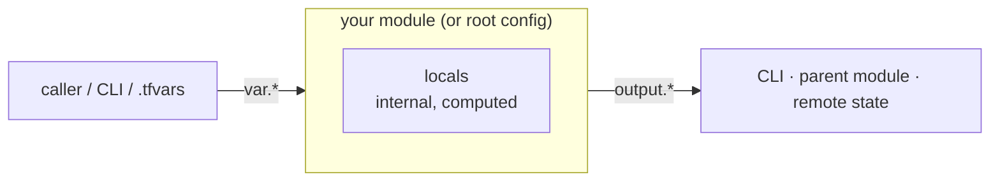

# Chapter 6 — Input variables, outputs & locals

## Learning outcomes

By the end of this chapter you can:

- Explain the **module-as-function** model — `variable` blocks are the parameters, `output` blocks are the return values, and `locals` are the internal working values.
- Declare an **input variable** with a type constraint, a description, a default, and a `validation` rule, and reference it as `var.NAME`.
- List the ways to **assign** a variable and put them in **precedence order**, and use a per-environment `.tfvars` file to deploy one configuration to two environments.
- Compute intermediate values with **`locals`**, know why a local may be dynamic where a variable default may not, and use the `merge()` pattern to enforce a required set of tags.
- Expose data with **`output`** blocks, read them with `terraform output` / `-raw` / `-json`, and state exactly when `sensitive` does and does not redact a value.

## The problem: every config so far is frozen

You have already *met* all three blocks in this chapter's title. Chapter 4 introduced `variable`, `locals`, and `output` as three of the twelve block types, and showed `var.region` and `local.tags` as reference strings. Chapter 2 used `.tfvars` files and `TF_VAR_` to inject a secret, and even sketched the precedence order. So the raw syntax is not new.

What you have *not* seen is the whole model — and that gap is where real configurations go wrong. So far a variable has been "a knob you can reference." This chapter makes it a **contract**: a typed, validated, documented input with a defined assignment order; an `output` with its own type and redaction rules; a `locals` block that does more than hold a tag map. The three blocks together form a module's **interface** — the knobs a caller turns from outside and the values it reports back, without anyone editing the source. Chapter 4 named the pieces; this chapter is where you learn to *design* the interface, and use it to make one configuration serve many environments.

They map cleanly onto something you already know:



Read it left to right. Data enters the module from the left: a **caller** — the CLI, a `.tfvars` file, or a parent module — sets **input variables**, which the module reads as `var.*`. Inside the box, **locals** compute intermediate values from those inputs (and from resource attributes); they never cross the boundary in either direction. Data leaves on the right: the module publishes **output values** (`output.*`) to whatever consumes it — the CLI after `apply`, a parent module, or another configuration via remote state. So the three blocks are three positions relative to that boundary: variables cross **inward**, outputs cross **outward**, locals stay **inside**.

- **`variable`** — an **input**. The caller sets it; inside the module you read `var.name`. This is a function parameter.
- **`output`** — a **return value**. The module computes it and exposes it to the CLI, a parent module, or another configuration. This is a function's return.
- **`locals`** — an **internal** named value. Computed inside the module, invisible outside. This is a local variable.

!!! note "One word, three roles — and none of them are runtime variables"
    HashiCorp's own umbrella term is *values*: input variables send data **in**, output values expose data **out**, local values stay **within** their scope. Hafner's *Terraform in Depth* (TID Ch 3 §3.2) frames the same split as "three things Terraform calls variables," separated by how each interacts with a module — argument, return value, local variable. The word "variable" is a false friend, though. Unlike a variable in Python or Go, a Terraform variable **does not change during a run**. Its value is fixed before `plan` begins and holds constant through `plan`, `apply`, and `destroy`. You customize by assigning *different* values between runs, not by reassigning mid-run. Terraform is declarative; there is no moment where a value is mutated.

The milestone for this chapter is the concrete payoff: parameterize a project so the **same config deploys to two environments by swapping only a `.tfvars` file**. We build to exactly that.

---

## Part 1 — Input variables

### Declaring a variable

A `variable` block defines one input. By convention they live in a file named `variables.tf` so a reader can find a module's whole interface in one place, though Terraform accepts them anywhere.

```hcl
# variables.tf
variable "instance_type" {
  type        = string
  description = "EC2 instance type for the web server."
  default     = "t2.micro"
}
```

Three arguments carry most of the weight, and you should set all three on nearly every variable:

- **`type`** — a type constraint on the value (below). Without one the variable accepts *any* type.
- **`description`** — documents the variable's purpose. Write it from the **consumer's** point of view — this is public interface text, not a maintainer's comment.
- **`default`** — a fallback value. Its presence is what makes the variable **optional**.

Reference a variable anywhere in the module with `var.<NAME>`:

```hcl
resource "aws_instance" "web" {
  ami           = data.aws_ami.ubuntu.id
  instance_type = var.instance_type
}
```

!!! warning "A variable with no `default` is required — and will stop a non-interactive run"
    Terraform has no concept of an unassigned variable. If a variable has no `default` and no value is supplied any other way, Terraform **prompts** for it in an interactive session — and **errors** in automation (CI, `-input=false`). Give every optional input a `default`; leave it off only when you genuinely want to force the caller to decide.

### The full argument surface

`type`, `description`, and `default` are the everyday three. The complete set — all optional, none mutually exclusive — is worth knowing because several solve specific problems:

| Argument | Purpose | Since |
|---|---|---|
| `type` | Type constraint (`string`, `list(string)`, `object({…})`, …) | — |
| `default` | Fallback value; makes the variable optional. **Must be a literal** — no references or expressions | — |
| `description` | Consumer-facing documentation | — |
| `validation` | Custom rule beyond the type constraint (repeatable) | — |
| `sensitive` | Redact the value from CLI output | 0.15 |
| `nullable` | Whether the caller may assign `null` (default `true`) | 1.1 |
| `ephemeral` | Omit the value from state and plan files | 1.10 |
| `const` | Allow use during `init` (module `source`/`version`) | 1.15 |
| `deprecated` | Deprecation message shown to callers | 1.15 |

The variable's **label** (`variable "instance_type"`) must be unique in the module and cannot be one of Terraform's reserved words: `source`, `version`, `providers`, `count`, `for_each`, `lifecycle`, `depends_on`, or `locals`.

### Types make the interface self-documenting

A type constraint tells the caller what shape of value the variable expects, and lets Terraform reject a wrong one with a clear error instead of a confusing failure deep in a resource. Terraform's types come in three families:

- **Primitive** — `string`, `number`, `bool`.
- **Collection** — `list(T)` (ordered, indexable), `map(T)` (string keys → values of type `T`), `set(T)` (unordered, unique). Every element is the same type `T`.

!!! note "Map keys are always strings, and the type never says so"
    `T` in `map(T)` constrains the **values**. Keys have no type parameter because there is nothing to choose: they are strings, always. `type(tomap({ a = 1 }))` is `map(number)`, and `keys()` on any map returns a `list(string)`.

    A numeric-looking key is not a number. `tomap({ 10 = "x", 2 = "y" })` has the keys `"10"` and `"2"`, so they sort as text and `"10"` comes before `"2"`. Verified on Terraform 1.15.8.
- **Structural** — `object({ name = string, port = number })` and `tuple([string, number])`, which hold a **fixed** shape of mixed types.

**Constraints nest.** The `T` in `list(T)`, `map(T)`, or `set(T)` is itself a type, so it can be a structural one. `map(object({ cidr_block = string }))` reads outside in: a map with string keys, each value an object carrying a `cidr_block` string.

```hcl
vpcs = {
  prod    = { cidr_block = "10.0.0.0/16" }
  staging = { cidr_block = "10.1.0.0/16" }
}
```

That combination is worth recognising on sight. It is the standard input shape for `for_each` (Chapter 10), where the map's keys become the resource instance keys and the object supplies each instance's arguments.

```hcl
variable "subnet_cidr_blocks" {
  type    = list(string)
  default = ["10.0.1.0/24", "10.0.2.0/24"]
}

variable "resource_tags" {
  type    = map(string)
  default = { project = "alpha", environment = "dev" }
}
```

!!! note "Terraform converts types when it safely can"
    Assign `"2"` (a string) to a `number` variable and Terraform converts it to `2`. This flexibility is convenient, but declaring the *right* type still matters: it documents intent for the caller and catches genuine mistakes early. Prefer the most specific type the value can take.

### Validation: catch bad input before the plan

A `validation` block enforces a rule the type system can't express — a length limit, a naming pattern, an allowed set. It runs **while Terraform builds the plan**; a failing rule stops the operation with your error message, long before any infrastructure is touched. A single variable may carry **several** `validation` blocks.

```hcl
variable "resource_tags" {
  type = map(string)

  validation {
    condition     = length(var.resource_tags["environment"]) <= 8 && length(regexall("[^a-zA-Z0-9-]", var.resource_tags["environment"])) == 0
    error_message = "The environment tag must be ≤ 8 characters, and only letters, numbers, and hyphens."
  }
}
```

`regexall(pattern, string)` returns the list of all matches; the class `[^a-zA-Z0-9-]` matches any character that is *not* a letter, digit, or hyphen, so requiring **zero** matches forbids illegal characters. Pairing that with a length check keeps a value (here, an AWS resource name) inside a service's naming rules. The condition can be any expression returning a bool — Chapter 7 covers the full toolkit (`contains`, `can`, `for` + `alltrue`).

The `error_message` deserves more care than it usually gets — it is the only thing the caller sees, and by then they are already blocked. HashiCorp's guidance is to write it as *"one or more full sentences in a style similar to Terraform's own error messages"*: capitalized, punctuated, and stating **what is allowed** rather than what went wrong. The message above names the limit and the character set; `"Invalid tag."` would not.

!!! info "Cross-object validation (Terraform 1.9+)"
    A `validation` condition may reference **other** variables, locals, and data sources — not just the variable being validated. Before 1.9 a rule could only see its own variable. This lets you validate one input against another (e.g. a CIDR against a declared VPC range).

### The specialist arguments

Four arguments solve narrower problems. Know they exist; two get their full treatment in later chapters.

**`nullable`** controls whether the caller may pass `null`. It defaults to `true`. Set `nullable = false` to forbid a null value — and note that when it's `false`, a `null` supplied to a *defaulted* variable falls back to the default instead of erroring.

!!! warning "`default = null` does **not** mean *optional*"
    A common trap: writing `default = null` to make a variable optional. It doesn't do what people expect. It makes `null` the variable's default **value**, which your configuration then has to handle everywhere it reads `var.name`. An unset reference becomes `null`, not a sensible fallback. If you want *optional with a real fallback*, give a real default (`default = "t2.micro"`). Optional *attributes inside an object type* are a different feature — `optional()` — covered with complex types in [Chapter 12](ch12-dynamic-blocks-complex-types.md).

**`sensitive`** redacts the value from CLI output; a plan shows `(sensitive value)` instead of the secret, and any expression referencing a sensitive variable becomes sensitive too. It is **hiding, not protection** — the value is still written to state in plaintext. Full secrets handling, including `ephemeral` and write-only arguments, is A6.

**`ephemeral`** (1.10+) goes further than `sensitive`: the value is available during a run but **omitted from state and plan files** entirely — for short-lived tokens and session credentials. Also an A6 topic.

**`const`** (1.15+) makes a variable available at **`init`**, before a plan exists. Most variables are evaluated at plan time; a `const` variable is restricted to a known, constant value so it can be used in a module or provider **`source` / `version`** attribute, which Terraform must read at init.

**`deprecated`** (1.15+) attaches a deprecation message shown to callers when they set the variable — the mechanism for evolving a published module's interface without breaking consumers overnight (I5).

---

## Part 2 — Assigning values and precedence

A variable is declared once but can be *assigned* many ways. This is the machinery behind the milestone, so it's worth knowing precisely.

The ways to set a root-module variable, and the **order of precedence** when the same variable is set more than once — **highest wins**:

| # | Source | Notes |
|---|---|---|
| 1 | `-var` / `-var-file` on the CLI, and HCP Terraform variables | applied in the order given |
| 2 | `*.auto.tfvars` / `*.auto.tfvars.json` | loaded automatically, in lexical filename order |
| 3 | `terraform.tfvars.json` | loaded automatically |
| 4 | `terraform.tfvars` | loaded automatically |
| 5 | `TF_VAR_<name>` environment variables | e.g. `export TF_VAR_instance_type=t3.medium` |
| 6 | the variable's `default` | lowest — the last resort |

!!! note "Which `.tfvars` files load on their own"
    Terraform auto-loads exactly four names from the working directory: `terraform.tfvars`, `terraform.tfvars.json`, and anything matching `*.auto.tfvars` or `*.auto.tfvars.json`. Any **other** name — `dev.tfvars`, `prod.tfvars` — is loaded only when you name it explicitly with `-var-file`. That distinction is what makes the two-environment pattern below work.

A `.tfvars` file is just variable assignments in HCL (or JSON):

```hcl
# prod.tfvars
instance_type  = "t3.large"
instance_count = 5
resource_tags  = { project = "alpha", environment = "prod" }
```

!!! info "Undeclared variables are handled three different ways"
    Assign a value to a variable that has no matching `variable` block, and Terraform's reaction depends on *how* you assigned it: an unmatched `TF_VAR_` environment variable is **silently ignored**; an unmatched entry in a `.tfvars` file produces a **warning** (which catches typos); and an unmatched `-var` on the CLI is an **error**.

### The milestone: one config, two environments

Put those rules together and the milestone falls out. Write the configuration once with variables for everything that differs between environments, then keep one `.tfvars` file per environment and select it at apply time:

```hcl
# dev.tfvars
instance_type  = "t2.micro"
instance_count = 1
resource_tags  = { project = "alpha", environment = "dev" }
```

```hcl
# prod.tfvars
instance_type  = "t3.large"
instance_count = 5
resource_tags  = { project = "alpha", environment = "prod" }
```

```shell
terraform apply -var-file="dev.tfvars"     # stand up dev
terraform apply -var-file="prod.tfvars"    # same config, prod sizing
```

The `.tf` files never change between the two. Only the swapped file does. That is the whole point of parameterizing a configuration — and it's the milestone made concrete.

!!! tip "This is *parameterization*, not *isolation*"
    Swapping a `.tfvars` file changes the **inputs**, but both applies still target the same state. Real dev/prod separation also needs **separate state** so a prod apply can't touch dev — that is environment *isolation*, an A7 topic (workspaces vs directory-per-env vs HCP workspaces). For now: one config, many inputs. Just don't mistake it for a blast-radius boundary.

---

## Part 3 — Local values

An input variable comes from *outside*. A **local value** is computed *inside* the module — a name assigned to an expression, so you can reuse it instead of repeating the expression.

```hcl
locals {
  name_suffix = "${var.project_name}-${var.environment}"
}
```

Define locals in a `locals` block (plural); reference them with the **singular** `local.<NAME>`:

```hcl
resource "aws_s3_bucket" "site" {
  bucket = "site-${local.name_suffix}"
}
```

A few rules give locals their shape:

- A local's value can be **any expression**, and may reference variables, resource attributes, function results, and **other locals**.
- Locals are **module-scoped** — visible only inside the module that defines them. To share one with a child module, pass it as an argument.
- You can write **multiple `locals` blocks**; Terraform merges them as if they were one, even across files. Split them only to group related values readably. Because they merge, a **name may be defined only once** across all of them — a duplicate is an error, not an override.
- Locals **cannot form a cycle**. `local.a` may reference `local.b`, but not if `local.b` reaches back to `local.a`. Terraform resolves locals through the same dependency graph it builds for resources (Chapter 5), and a cycle there is a hard error.

The `locals` block is also the odd one out syntactically: it takes **no label**, and each argument inside it declares one independent value. No other block type behaves that way.

!!! note "A local may be dynamic where a variable default may not"
    This is the sharp distinction between the two. A `variable`'s `default` must be a **literal** — it cannot reference another object. A **local** has no such limit: it's built to hold the result of an expression, including references to resources and data sources. So when you need a computed value, that's a local's job; when you need an external knob, that's a variable's.

### The `merge()` pattern: required plus optional

Locals shine at combining inputs. A frequent need: guarantee every resource carries a baseline set of tags, while still letting a caller add their own. `merge()` combines maps, and **later arguments win** on key collisions:

```hcl
variable "resource_tags" {
  type    = map(string)
  default = {}                      # caller's extra tags (optional)
}

locals {
  required_tags = {
    project     = var.project_name
    environment = var.environment
  }
  tags = merge(var.resource_tags, local.required_tags)   # required wins
}
```

Because `local.required_tags` is the **second** argument, a caller can *add* tags through `var.resource_tags` but can never override or drop `project` and `environment`. Point every resource at `tags = local.tags`.

!!! tip "Use a local for reuse or complexity — not for everything"
    Locals reduce duplication and give a meaningful name to a gnarly expression. They also have a cost: they add a layer of indirection that can obscure where a value actually comes from. Reach for a local when you reuse one value in many places (so you change it in one spot) or when the value is a complex expression worth naming. Don't launder every literal through a local.

!!! note "For AWS tags specifically, prefer the provider's `default_tags`"
    The hand-rolled `merge()` tag pattern is a great teaching example, and portable across providers. But the AWS provider has a built-in **`default_tags`** block that applies a set of tags to every resource it manages, without threading `local.tags` through each block. Use it for global AWS tagging; keep the `merge()` technique for the general problem of combining required and optional maps.

---

## Part 4 — Output values

If variables are a module's inputs, **outputs** are its return values. An `output` block exposes a piece of data — on the CLI, to a parent module, or to another configuration entirely. Outputs serve four purposes:

1. A **child module** exposes a resource attribute to its parent (the *only* way data leaves a child module).
2. A **root module** displays values on the CLI after `apply` (and in the HCP Terraform UI).
3. Another configuration reads a root output through the **`terraform_remote_state`** data source (B9/I6).
4. A run **passes a value to an automation tool**.

### Defining and reading outputs

By convention outputs live in `outputs.tf`. `value` is the only required argument and can be any expression:

```hcl
# outputs.tf
output "lb_url" {
  description = "URL of the load balancer."
  value       = "http://${module.elb_http.elb_dns_name}/"
}

output "web_server_count" {
  description = "Number of web servers provisioned."
  value       = length(module.ec2_instances.instance_ids)
}
```

Outputs are stored in **state**, so a newly added output only appears after you `apply` — even when no infrastructure changes, the plan will show `Changes to Outputs`. A parent module reads a child's output as `module.<CHILD_NAME>.<OUTPUT_NAME>`.

Query outputs from the CLI:

```shell
terraform output                 # all outputs, human-readable
terraform output lb_url          # one output (strings quoted since 0.14)
terraform output -raw lb_url     # unquoted, for piping: curl $(terraform output -raw lb_url)
terraform output -json           # machine-readable; each entry carries sensitive/type/value
```

### Sensitive outputs redact *narrowly* — know the matrix

Mark an output `sensitive = true` and Terraform redacts it as `<sensitive>` in the aggregate output. But the redaction is narrower than it looks, and the gaps are where secrets leak:

| Terraform **redacts** | Terraform does **not** redact |
|---|---|
| `plan` / `apply` / `destroy` | `terraform output <name>` (querying **by name**) |
| `terraform output` (all outputs) | `terraform output -json` |
| the HCP Terraform UI | `terraform output -raw` |
| | a child module's output used in the root |

!!! warning "An output derived from a sensitive value **must** be marked sensitive"
    Sensitivity propagates, and at an output Terraform enforces it. If an output's `value` derives in any way from a sensitive variable or attribute and the output is **not** marked `sensitive = true`, Terraform neither redacts it nor leaks it — it refuses to proceed:

    ```
    Error: Output refers to sensitive values

    Expressions used in outputs can only refer to sensitive values if the
    sensitive attribute is true.
    ```

    The fix is to mark the output, or to stop returning that value. This is the one place where propagation is a rule you must satisfy rather than a behavior you observe.

!!! danger "`terraform output db_password` prints the secret in the clear"
    Two facts combine into a real exposure. First, querying a sensitive output **by name** is *not* redacted — `terraform output db_password` prints `notasecurepassword` verbatim, as do `-json` and `-raw` (they exist to feed automation, so they bypass redaction by design). Second, sensitive values are stored as **plaintext in state** — `grep outputs terraform.tfstate` shows them. `sensitive` prevents *accidental* console disclosure; it is not a protection boundary. To keep a secret out of state entirely you need `ephemeral` and write-only arguments (A6). The full state-security treatment is A6/I6.

### The rest of the output argument surface

Beyond `value`, `description`, `sensitive`, and `ephemeral`, an `output` block accepts:

- **`type`** (1.15+) — a type constraint on the output, the mirror of a variable's `type`. Typing module outputs improves matching across validation, plan, and apply. Prefer typing the outputs of any module others consume: the constraint is checked, and a consumer reads your interface without reading your implementation.
- **`precondition`** — validate the value **before** exposing or storing it. It's the output-side counterpart to a variable's `validation` block: a `condition` that must hold and an `error_message`. Useful to assert an invariant about what you're returning (A2).
- **`depends_on`** — an explicit dependency, rarely needed; when you add one, comment *why*.
- **`deprecated`** (1.15+) — like the variable argument, but on the output side it's **child-modules-only** and only *consumers* see the warning, not the defining module. Suppress nested warnings on a module call with `ignore_nested_deprecations`.

```hcl
output "instance_public_ip" {
  value       = aws_instance.web.public_ip
  description = "Public IP of the instance."

  precondition {
    condition     = length([for r in aws_security_group.web.ingress : r if r.to_port == 80 || r.to_port == 443]) > 0
    error_message = "Security group must allow HTTP or HTTPS ingress before exposing this IP."
  }
}
```

!!! info "OpenTofu — no typed outputs"
    `type` on an `output` block is **Terraform 1.15+ only**. OpenTofu rejects it outright as of 1.12.4: `An argument named "type" is not expected here.` A module written to run under both tools cannot use the argument at all, so its outputs stay untyped and the interface is documented by `description` alone. The other arguments here are portable: OpenTofu supports `sensitive`, `ephemeral`, `depends_on`, and `deprecated` on outputs, and `const`, `deprecated`, `nullable`, and `ephemeral` on variables.

!!! warning "An output whose value is `null` is not stored at all"
    Terraform does not write a null-valued output to state, and the omission is total rather than cosmetic. There is no `"value": null` entry to find.

    Measured on **1.15.8**, with a declared `output "plain"` whose value evaluated to `null`:

    ```
    $ terraform output plain

    Error: Output "plain" not found

    The output variable requested could not be found in the state file.
    ```

    `terraform output -json` omits the key entirely, and the apply summary skips the output rather than printing it as `null`. A consumer script that does `terraform output -json | jq .plain.value` gets `null` from *jq* for a missing key, so the two cases look identical from outside and only one of them is a configuration you can debug. If a downstream step needs to distinguish "absent" from "explicitly nothing", emit a sentinel string rather than relying on the key existing.

!!! note "Typed outputs also change the shape of `module.<NAME>` — treat that as a curiosity"
    There is a second-order effect worth knowing and not worth chasing. When a child module's outputs are **fully** typed, a `count`/`for_each` reference to that module produces a real `list`/`map`; when any output is untyped it produces a `tuple`/`object` instead. Terraform branches on exactly that condition internally, so the mechanism is real — but callers almost never notice, because a tuple splats, converts, and satisfies a `list(object(…))` constraint just as a list does. **Resources have no such switch and are always structural.** So type your outputs for the checked, self-documenting interface, which is reason enough; the collection shape is a consequence of the uniformity guarantee, not a benefit stacked on top. Chapter 7 §3 has the machinery.

---

## 🧪 Lab: one config, two environments

The milestone is to deploy one configuration to two environments by swapping only a `.tfvars` file. This lab does exactly that against the free local **AWS emulator** (Ch1's [lab setup](ch01-iac-fundamentals.md#lab-setup-a-free-local-aws-docker) — Floci, MiniStack, or LocalStack). We use S3, which every emulator mocks reliably.

**Start the emulator** (from the repo root; skip if already running):

```shell
docker compose -f labs/docker-compose.yml up -d      # start the emulator on :4566, detached
curl -s http://localhost:4566/_floci/health     # wait until the services read "running"
```

Write a small parameterized configuration — a uniquely-named bucket, tagged, whose count and name come from variables:

```hcl
# terraform.tf
terraform {
  required_version = ">= 1.15"
  required_providers {
    aws    = { source = "hashicorp/aws",    version = "~> 6.0" }
    random = { source = "hashicorp/random", version = "~> 3.0" }
  }
}
```

```hcl
# providers.tf — plain AWS block; tflocal points it at the emulator
provider "aws" {
  region = "us-east-1"
}
```

```hcl
# variables.tf — the interface
variable "environment" {
  type        = string
  description = "Deployment environment name."

  validation {
    condition     = contains(["dev", "staging", "prod"], var.environment)
    error_message = "environment must be one of: dev, staging, prod."
  }
}

variable "bucket_count" {
  type        = number
  description = "How many buckets to create."
  default     = 1
}

variable "extra_tags" {
  type        = map(string)
  description = "Additional tags to merge onto the required set."
  default     = {}
}
```

```hcl
# main.tf — locals compute the merged tags and name; a variable drives the count
locals {
  required_tags = {
    project     = "learn-b6"
    environment = var.environment
  }
  tags = merge(var.extra_tags, local.required_tags)   # required wins
}

resource "random_id" "suffix" {
  byte_length = 4
}

resource "aws_s3_bucket" "env" {
  count  = var.bucket_count
  bucket = "learn-b6-${var.environment}-${count.index}-${random_id.suffix.hex}"
  tags   = local.tags
}
```

```hcl
# outputs.tf
output "bucket_names" {
  description = "Names of the buckets created for this environment."
  value       = aws_s3_bucket.env[*].bucket
}

output "applied_tags" {
  description = "The effective tag set (required + extra)."
  value       = local.tags
}
```

Now the two environment files — the *only* thing that differs between deployments:

```hcl
# dev.tfvars
environment  = "dev"
bucket_count = 1
```

```hcl
# prod.tfvars
environment  = "prod"
bucket_count = 3
extra_tags   = { owner = "platform-team" }
```

Init, then deploy **dev** by naming its file:

```shell
tflocal init
tflocal apply -var-file="dev.tfvars"      # review the plan, type yes
tflocal output                            # bucket_names = ["learn-b6-dev-0-…"]; applied_tags shows environment=dev
awslocal s3 ls                            # one learn-b6-dev-… bucket
```

Now deploy **prod** — same `.tf` files, different file:

```shell
tflocal apply -var-file="prod.tfvars"     # plan: destroy the 1 dev bucket, create 3 prod buckets
tflocal output                            # three prod bucket names; applied_tags has owner=platform-team
awslocal s3 ls                            # three learn-b6-prod-… buckets
```

Prove the interface holds the line. Try an environment the validation forbids, and try to override a required tag:

```shell
tflocal plan -var="environment=qa"        # Error: environment must be one of: dev, staging, prod
tflocal plan -var-file="prod.tfvars" -var='extra_tags={environment="hacked"}'
# applied_tags still shows environment=prod — required_tags wins the merge
```

Read a specific output for automation, then tear down:

```shell
tflocal output -json bucket_names         # machine-readable list
tflocal destroy -var-file="prod.tfvars"
```

!!! warning "Emulation proves the workflow, not AWS fidelity"
    A green `apply` here proves your variables, precedence, `merge()`, and outputs behave — nothing about real AWS. S3 is mocked; bucket-name global uniqueness and real IAM are not enforced. Validate any load-bearing configuration against real free-tier AWS before trusting it.

!!! note "`count` here, `for_each` later"
    This lab uses `count = var.bucket_count` because the buckets are index-identical — a simple N-of-the-same. For a *named* set of resources (one per environment, one per region) `for_each` is the right tool, because deleting a middle element doesn't reindex the survivors. That distinction, and the full `count`/`for_each`/`depends_on` treatment, is I1.

## Common pitfalls

- **`default = null` to mean "optional."** It makes `null` the default value your code must handle, not an absent-with-fallback input. Use a real default, or `optional()` inside an object type ([Ch 12](ch12-dynamic-blocks-complex-types.md)).
- **A `.tfvars` file that isn't auto-loaded.** Only `terraform.tfvars`, `*.auto.tfvars` (and their `.json` forms) load automatically. `dev.tfvars` does nothing unless you pass `-var-file="dev.tfvars"`.
- **Expecting `sensitive` to protect a secret.** It redacts aggregate CLI output only. Querying by name, `-json`, `-raw`, and the state file all show it in plaintext. Use `ephemeral` / write-only args (A6) to keep it out of state.
- **A variable `default` that references another object.** Defaults must be literals. Move the computed value into a `locals` block instead.
- **Forgetting a required variable in CI.** No default plus `-input=false` is an error, not a prompt. Supply every input in automation, or give it a default.
- **Overusing locals.** A local for every literal adds indirection that hides where values come from. Reserve locals for reuse and genuinely complex expressions.
- **Treating a swapped `.tfvars` as environment isolation.** Same state, same blast radius. Real isolation needs separate state (A7).
- **Returning a sensitive-derived value from an unmarked output.** Terraform errors rather than redacting. Mark the output `sensitive = true`, or stop returning the value.
- **Reusing a local's name in a second `locals` block.** The blocks merge, so that's a duplicate definition, not an override — it errors.
- **A misspelled variable name in a `.tfvars` file.** It's only a *warning*, easy to miss. The intended variable silently keeps its default. Read the warnings.

## Exercises

1. **Recall** — Which of the three value blocks is set by the module's caller, which is computed inside and invisible outside, and which is the only way data leaves a child module?
2. **Precedence** — `region` is set by `TF_VAR_region=us-east-1`, by `region = "eu-west-1"` in `terraform.tfvars`, and by `-var="region=ap-south-1"` on the command line. Which value applies, and why?
3. **Types & validation** — Write a `variable "port"` constrained to a `number`, defaulting to 8080, with a `validation` rule that rejects any value outside 1024–65535.
4. **Locals vs variables** — You need `name = "${var.project}-${var.env}"` in six places. Should that be a variable or a local? Why can't it be a variable's `default`?
5. **Sensitive outputs** — You mark `db_password` as `sensitive`. A teammate runs `terraform output db_password` and sees the password. Explain why, and name the mechanism that would actually keep it out of state.
6. **Milestone** — Sketch the files needed so `terraform apply -var-file="staging.tfvars"` deploys a staging copy of a config that otherwise serves prod, changing only instance sizing and tags.

## Summary

- A module has a **function-shaped interface**: `variable` blocks are inputs (parameters), `output` blocks are return values, `locals` are internal working values. None are runtime variables — every value is fixed before `plan` and constant through the run.
- Declare a variable with **`type`, `description`, `default`**; a missing default makes it **required** (a prompt interactively, an error in CI). The full surface adds `validation`, `sensitive`, `nullable`, `ephemeral`, `const`, and `deprecated`. A `default` must be a **literal**.
- A variable can be assigned by **`-var` / `-var-file`, auto-loaded `*.tfvars`, `TF_VAR_` env vars, or its default**, in that **precedence order** (CLI wins, default loses). Only specific `.tfvars` names auto-load; others need `-var-file`. That is the mechanism for **one config, many environments**.
- **Locals** name an expression for reuse; they are module-scoped, may be **dynamic** (unlike a variable default), merge across every `locals` block (so names must be unique and cannot cycle), and combine inputs cleanly — `merge(var.tags, local.required)` enforces required-plus-optional.
- **Outputs** expose data four ways (child→parent, CLI, remote state, automation); read them with `terraform output` / `-raw` / `-json`. `sensitive` redacts **narrowly** — not by-name, not `-json`/`-raw`, and never in state — and an output deriving from a sensitive value must carry the flag or Terraform errors. The full argument set adds `type` (Terraform-only; OpenTofu rejects it), `precondition`, `depends_on`, and `deprecated`.

---

**Next: B7 — Expressions, operators & built-in functions.** You can now parameterize a configuration and expose its results. The `validation` conditions, the `merge()` call, the `length()` and `regexall()` you met here are all *expressions* — and Terraform has a whole language of them: conditionals, `for` comprehensions, splat, string templates, and a library of ~150 built-in functions. Next you'll learn to compute with them.

## References

- [TID Ch 3 — Terraform variables and modules](../books/tid/chapters/03-variables-modules.md) §3.2–3.7 (the three "variables" as a function, parameter vs argument, sensitive propagation, locals scope, validation)
- [Input Variables — Use variables (HCDocs)](../sources/terraform-docs/tf-input-variables.md) — define/reference, precedence, `sensitive`/`ephemeral`, `const`, undeclared-variable behavior
- [`variable` block reference (HCDocs)](../sources/terraform-docs/tf-block-variable.md) — full argument surface, reserved names, `nullable`, `validation`, `deprecated`
- [Local Values — Use locals (HCDocs)](../sources/terraform-docs/tf-locals.md) · [`locals` block reference (HCDocs)](../sources/terraform-docs/tf-block-locals.md) — module scope, multiple blocks, referenceable constructs
- [Output Values — Use outputs (HCDocs)](../sources/terraform-docs/tf-outputs.md) · [`output` block reference (HCDocs)](../sources/terraform-docs/tf-block-output.md) — four purposes, `type`/`precondition`/`depends_on`/`deprecated`
- [Customize configuration with variables (HCTut)](../sources/terraform-tutorials/tut-variables.md) — types walkthrough, `.tfvars`, `terraform console`, `slice`/`regexall`
- [Simplify configuration with locals (HCTut)](../sources/terraform-tutorials/tut-locals.md) — the `merge()` required-tags pattern, dynamic-vs-literal contrast
- [Output data from Terraform (HCTut)](../sources/terraform-tutorials/tut-outputs.md) — `terraform output` flags, the sensitive-redaction matrix
- [Manage infrastructure — AWS Get Started (HCDocs)](../sources/terraform-tutorials/tf-aws-manage.md) — variables + outputs introduced on a real `aws_instance`
- [Manage sensitive data (HCDocs)](../sources/terraform-docs/tf-manage-sensitive-data.md) — `sensitive` vs `ephemeral`, why neither is state security (A6 preview)
- [Version & Certification Facts](../research-cache/version-facts.md)
- 🧪 Lab: [Floci Facts](../research-cache/floci-facts.md) · [MiniStack Facts](../research-cache/ministack-facts.md) · [LocalStack Facts](../research-cache/localstack-facts.md) (Docker setup, `tflocal` — verified 2026-07-09)
