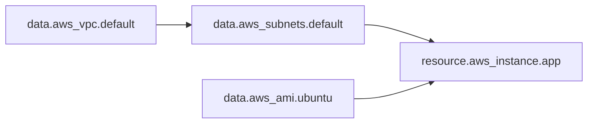
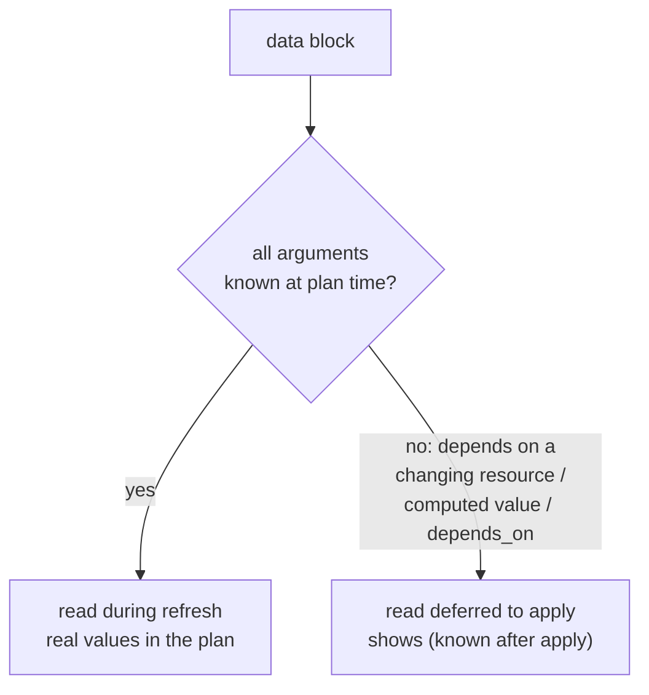

# Chapter 8 — Data sources

## Learning outcomes

By the end you can:

- Explain what a `data` block does and how it differs from a `resource` — it **reads**, it never creates, updates, or destroys.
- Declare a data source, constrain the query, and reference its attributes with `data.<TYPE>.<NAME>.<ATTRIBUTE>`.
- Chain data sources so one lookup feeds the next, and feed a lookup into a managed resource.
- Predict **when** a data source is read — refresh (plan-time) versus deferred to apply — and read the `(known after apply)` signal in a plan.
- Put `count`, `for_each`, `depends_on`, `provider`, and `precondition`/`postcondition` on a data block, and know which of those forces an apply-time read.
- Recognise specialized local-only data sources (`aws_iam_policy_document`, `template_file`, `local_file`) and read another configuration's outputs with `terraform_remote_state`.
- **Look up a resource you didn't create — the latest AMI, the default VPC, an existing bucket — and wire it into a resource you do manage.**

---

## 1. Why data sources: not everything is yours to create

Chapter 5 taught you to *create* infrastructure with `resource` blocks. But real configurations never own everything they touch. Your application instance has to land in a subnet somebody else provisioned. It needs the *latest* Ubuntu AMI, whose ID changes every time Canonical republishes. It needs the account ID and region it happens to be running in. None of that is yours to create — it already exists, and you just need to *read* it.

The naive fix is to hard-code the values:

```hcl
resource "aws_instance" "app" {
  ami           = "ami-04d29b6f966df1537"   # only valid in us-east-1, stale within weeks
  subnet_id     = "subnet-0e9855907f0bab6f4" # tied to one account
  instance_type = "t3.micro"
}
```

Two problems, both fatal to reuse. The AMI ID pins you to one region *and* one point in time — the moment Canonical publishes a patched image, your code is out of date, and republishing means editing HCL. The subnet ID ties the code to exactly one account's network, so it can never deploy anywhere else. A configuration full of hard-coded IDs is a configuration that runs in exactly one place, once.

A **data source** dissolves both problems. It is a read-only block that queries a provider — or another Terraform state — and exposes the result as attributes you reference like any other value. Swap the literals for lookups and the same code deploys the newest image into whatever account and region it is pointed at:

```hcl
resource "aws_instance" "app" {
  ami           = data.aws_ami.ubuntu.id      # always the latest, in this region
  subnet_id     = data.aws_subnets.default.ids[0]  # whatever subnet exists here
  instance_type = "t3.micro"
}
```

That is the whole point of the chapter: **read what you don't own, so your configuration stays portable and current.**

---

## 2. The `data` block

A data source is the read-only counterpart to a resource. It has the same shape — a type, a name, a body of arguments, and exported attributes — but Terraform can only ever *read* it. It never appears in the create/update/destroy columns of a plan.

```hcl
data "<TYPE>" "<NAME>" {
  # provider-specific query arguments
}
```

- **`<TYPE>`** — the data source type, defined by a provider (`aws_ami`, `aws_vpc`, `azurerm_resource_group`). Which types exist depends entirely on which providers you've installed; the provider docs are the source of truth for every argument and attribute. Terraform itself contributes exactly one built-in type, `terraform_remote_state` (§8).
- **`<NAME>`** — a local label you choose. The `<TYPE>` + `<NAME>` pair must be unique, and it's how you refer back to the result.

You reference the fetched data with the `data.` prefix:

```
data.<TYPE>.<NAME>.<ATTRIBUTE>
```

So `data.aws_ami.ubuntu.id` is the `id` attribute of the `aws_ami` data source named `ubuntu`. That prefix is the only thing distinguishing a data-source reference from a resource reference (`aws_instance.app.id` has no prefix). Both are ordinary values — usable in resource arguments, locals, outputs, function calls, and meta-arguments, exactly like the expressions of Chapter 7.

!!! note "Read-only means read-only"
    A data source performs **only read operations**. There is no such thing as a data source that creates a side effect on your infrastructure. If you find yourself wanting one to *do* something, you want a `resource` (or, rarely, a provisioner — Chapter 18). The mental split is clean: `resource` = "I manage this," `data` = "I just need to look at this."

### Constraining the query

The body of a data block holds provider-specific arguments that narrow *which* object you get back. For a singular lookup, the query must resolve to exactly one object. For `aws_ami`, `most_recent = true` plus owner and name filters pin it down:

```hcl
data "aws_ami" "ubuntu" {
  owners      = ["099720109477"]   # Canonical's AWS account
  most_recent = true               # newest match wins

  filter {
    name   = "name"
    values = ["ubuntu/images/hvm-ssd/ubuntu-focal-20.04-amd64-server-*"]
  }

  filter {
    name   = "virtualization-type"
    values = ["hvm"]
  }
}
```

The `filter` blocks are a repeatable sub-block specific to the AWS provider — stack as many as you need. Any expression from Chapter 7 is legal here; the query can itself be computed.

---

## 3. Chaining lookups: data feeds data feeds resource

Data sources compose. To find the default subnet you first need the default VPC's ID, so one lookup feeds the next, and the last feeds your managed resource. This *cascade* — "to look up A you need B, and B needs C" — is the everyday shape of real configurations:

```hcl
data "aws_vpc" "default" {
  default = true
}

data "aws_subnets" "default" {
  filter {
    name   = "vpc-id"
    values = [data.aws_vpc.default.id]   # the VPC lookup feeds the subnet lookup
  }
}

data "aws_ami" "ubuntu" {
  owners      = ["099720109477"]
  most_recent = true
  filter {
    name   = "name"
    values = ["ubuntu/images/hvm-ssd/ubuntu-focal-20.04-amd64-server-*"]
  }
}

resource "aws_instance" "app" {
  ami           = data.aws_ami.ubuntu.id
  subnet_id     = data.aws_subnets.default.ids[0]   # aws_subnets returns a list; take the first
  instance_type = "t3.micro"
}
```

Notice `data.aws_subnets.default.ids[0]`. Some data sources return a *singular* object (`aws_vpc`, `aws_ami`), others return a *plural* set (`aws_subnets` exposes an `ids` list). Reach into a plural result by index or with the collection expressions of Chapter 7.

The reference `data.aws_vpc.default.id` inside the subnet filter is not just a value — it is a **dependency edge**, exactly as with resources. Terraform builds the same dependency graph over data sources it builds over resources, so it reads the VPC before the subnet, and reads both before it plans the instance. You never order these by hand; the references do it.



!!! tip "Discover a data source's attributes without leaving your terminal"
    You don't have to visit the registry to see what a data source exports. After `init`, dump the provider schema:

    ```shell
    terraform providers schema -json | jq '.provider_schemas' 
    ```

    Or, faster for one value, read it live in the REPL: `terraform console` then `data.aws_ami.ubuntu` prints the whole object with every attribute filled in.

---

## 4. When is a data source read? Plan vs apply

This is the one genuinely subtle thing about data sources, and the source of nearly every surprise. **A data source is normally read during the refresh that precedes planning** — so its real values appear in the plan, and the diff shows what actually changed. But Terraform will *defer* the read to the apply phase under specific conditions, and when it does, you get `(known after apply)` instead of a value.

The rule: **Terraform reads the data source at plan time when all of its arguments are already knowable, and defers to apply when any argument depends on something that isn't known yet.**

An argument is "not known yet" when:

- it references a **managed resource attribute that will change in the current plan** (you can't read against a subnet that this same apply is about to recreate);
- it references any other value that is itself `(known after apply)`;
- the data block has a **custom condition** that depends on such a value;
- the data block has a **`depends_on`** pointing at a resource changing in this plan (see the pitfall in §9 — this is the most common accidental cause).

When the read is deferred, every attribute of that data source shows as computed in the plan, and *anything downstream* of it also can't be finalised until apply. The plan literally tells you:

```
  # data.aws_ami.ubuntu will be read during apply
  # (config refers to values not yet known)
```



!!! note "Why the default is a pre-plan refresh"
    By default Terraform refreshes state before generating a plan. Reading independent data sources during that refresh means the fetched values are available *for* planning and the diff shows the genuine result — not a placeholder. That's what you want almost always: a plan you can actually review. Deferral is the exception Terraform falls back to only when it truly can't know the answer yet.

---

## 5. Meta-arguments on data blocks

A `data` block accepts a subset of the same built-in **meta-arguments** as a resource — the arguments that control *how Terraform processes the block* rather than what it queries. They are provider-independent and built into the language.

| Meta-argument | Effect on a data block | Notes |
|---|---|---|
| `count` | Read N instances; index with `data.<NAME>[<index>]` | Mutually exclusive with `for_each` |
| `for_each` | Read one instance per collection entry; key with `data.<NAME>[<key>]` | Accepts a **map or a set of strings**; mutually exclusive with `count` |
| `depends_on` | Force the read to wait for an upstream resource | **Defers the read to apply** — use sparingly (§9) |
| `provider` | Query through an aliased provider configuration | `provider = aws.west` |
| `lifecycle` | Only `precondition` / `postcondition` — no destroy-side rules | Read-only, so `create_before_destroy`/`prevent_destroy`/`ignore_changes` have no meaning |

Multiplying a lookup with `for_each` reads and indexes each instance separately:

```hcl
data "aws_ami" "by_channel" {
  for_each = toset(["focal", "jammy"])

  owners      = ["099720109477"]
  most_recent = true
  filter {
    name   = "name"
    values = ["ubuntu/images/hvm-ssd/ubuntu-${each.value}-*"]
  }
}

# reference: data.aws_ami.by_channel["jammy"].id
```

!!! info "The `count` index is 0-based (mind the doc)"
    HashiCorp's data-sources page states the `count` key "starts at 1" — that contradicts every other use of `count` in Terraform, where `count.index` and the index key are **0-based**. Treat the doc line as a slip: `data.aws_ami.example[0]` is the first instance. When you need stable string keys instead of fragile positions, use `for_each` (the same lesson as Chapter 7).

### Custom conditions on a data source

The `lifecycle` block on a data source supports **only** `precondition` and `postcondition` — assertions Terraform checks around the read. A `postcondition` is the natural place to validate that what you fetched is what you expected, and to fail early and *in context* if not:

```hcl
data "aws_ami" "app" {
  owners      = ["099720109477"]
  most_recent = true
  filter {
    name   = "name"
    values = ["app-base-*"]
  }

  lifecycle {
    postcondition {
      condition     = self.architecture == "x86_64"
      error_message = "Selected AMI ${self.id} is not x86_64."
    }
  }
}
```

`self` inside the condition refers to the data source's own attributes. A failed postcondition halts the plan with your message rather than surfacing as a confusing type error three resources downstream.

!!! warning "Conditions take literal expressions, evaluated early"
    Configuration inside `lifecycle` is processed *before* Terraform evaluates arbitrary expressions for the run, because it affects how the dependency graph is built and traversed. Keep conditions to expressions Terraform can evaluate at that stage.

---

## 6. Specialized (local-only) data sources

Most data sources hit a provider's API. A handful are **local-only utilities**: they generate data that exists only during the Terraform operation and is recomputed on every plan. They query nothing remote — they're just a convenient, validated way to build a value.

- **`aws_iam_policy_document`** — assembles an IAM policy as JSON from HCL blocks, so you never hand-write policy JSON. This is the idiomatic replacement for a `jsonencode` policy literal.
- **`template_file`** *(legacy)* — renders a template from a file. Superseded by the `templatefile()` function of Chapter 7; you'll still see it in older code.
- **`local_file`** — reads a file from disk into a value.

`aws_iam_policy_document` is the one you'll actually reach for. It builds the policy, and its `.json` attribute feeds straight into a managed resource:

```hcl
data "aws_iam_policy_document" "read_bucket" {
  statement {
    actions   = ["s3:GetObject", "s3:ListBucket"]
    resources = ["arn:aws:s3:::my-data", "arn:aws:s3:::my-data/*"]
  }
}

resource "aws_iam_policy" "read_bucket" {
  name   = "read-bucket"
  policy = data.aws_iam_policy_document.read_bucket.json   # data source -> resource
}
```

That last line is the milestone in miniature: a data source (here a local-only one) producing a value that a managed resource consumes.

---

## 7. Reading another configuration's outputs: `terraform_remote_state`

Sometimes the thing you need to read isn't in a cloud API at all — it's the **output of a different Terraform configuration**. A network team manages the VPC in one workspace; your application config, in another, needs that VPC's subnet and security-group IDs. The built-in `terraform_remote_state` data source reads the *root-level outputs* of another configuration straight from its state backend:

```hcl
data "terraform_remote_state" "vpc" {
  backend = "local"
  config = {
    path = "../vpc/terraform.tfstate"
  }
}

provider "aws" {
  region = data.terraform_remote_state.vpc.outputs.aws_region
}

module "app" {
  security_groups = data.terraform_remote_state.vpc.outputs.lb_security_group_ids
  subnets         = data.terraform_remote_state.vpc.outputs.public_subnet_ids
}
```

The `backend` can be `local` (a tfstate file on disk, as above) or `remote` (HCP Terraform, S3, Consul, etc.), with the connection details in `config`.

!!! warning "It reads root outputs only — and it's a security boundary"
    `terraform_remote_state` exposes **only the root-level `output` values** of the source configuration, not its resources or module internals. To share a value, the source config must publish a matching `output`. And crucially: anyone who can read those outputs can read the *entire* state snapshot by direct backend requests — state stores every attribute in plaintext. Don't route sensitive data through it. The full treatment — the security case against it, and the `tfe_outputs` alternative on HCP Terraform — is Chapter 15 (I6, Remote state & backends). Here it's enough to know the mechanism: outputs in, no secrets.

---

## 🧪 Lab: read a resource you didn't create, and wire it in

The milestone made concrete. You'll create an S3 bucket **out-of-band** (as if a colleague made it — your config does *not* manage it), then use data sources to look it up, read your own account identity and region, build an IAM policy that references the bucket, and apply that managed policy. Everything runs against the free local **AWS emulator** (Chapter 1's [lab setup](ch01-iac-fundamentals.md#lab-setup-a-free-local-aws-docker) — Floci, MiniStack, or LocalStack). S3, STS, and IAM are all on the reliable free surface.

**Start the emulator** (from the repo root; skip if already running):

```shell
docker compose -f labs/docker-compose.yml up -d      # start the emulator on :4566, detached
curl -s http://localhost:4566/_localstack/health     # wait until services read "available"
```

**Create the unmanaged bucket** — this is the "resource you didn't create":

```shell
awslocal s3 mb s3://legacy-data-bucket
```

Now the configuration. Note it contains **no `resource "aws_s3_bucket"`** — that bucket is not ours; we only read it.

```hcl
# terraform.tf
terraform {
  required_version = ">= 1.15"
  required_providers {
    aws = { source = "hashicorp/aws", version = "~> 6.0" }
  }
}
```

```hcl
# providers.tf — plain AWS block; tflocal points it at the emulator
provider "aws" {
  region = "us-east-1"
}
```

```hcl
# main.tf

# --- three lookups, nothing created ---
data "aws_caller_identity" "current" {}   # who am I (STS)
data "aws_region" "current" {}            # where am I

data "aws_s3_bucket" "legacy" {           # the bucket a colleague made
  bucket = "legacy-data-bucket"
}

# --- a local-only data source that references the lookups ---
data "aws_iam_policy_document" "read_legacy" {
  statement {
    sid       = "ReadLegacyBucket"
    actions   = ["s3:GetObject", "s3:ListBucket"]
    resources = [
      data.aws_s3_bucket.legacy.arn,
      "${data.aws_s3_bucket.legacy.arn}/*",
    ]
  }
}

# --- the one managed resource: consumes all of the above ---
resource "aws_iam_policy" "read_legacy" {
  name   = "read-legacy-${data.aws_region.current.name}"
  policy = data.aws_iam_policy_document.read_legacy.json

  tags = {
    Account = data.aws_caller_identity.current.account_id
  }
}

output "policy_arn" {
  value = aws_iam_policy.read_legacy.arn
}

output "resolved_bucket_arn" {
  value = data.aws_s3_bucket.legacy.arn
}
```

Apply it with `tflocal`, which targets the emulator and leaves the `.tf` files portable to real AWS:

```shell
tflocal init
tflocal plan       # note: the three data sources read during refresh, values already present
tflocal apply -auto-approve
```

In the plan you'll see the data sources resolve to real values (the bucket ARN, your account ID, the region) *before* the single `aws_iam_policy.read_legacy` shows as `+ create` — proof the reads happened at refresh time, not apply. Verify:

```shell
tflocal output resolved_bucket_arn          # the ARN of the bucket we never managed
awslocal iam list-policies --scope Local     # our new policy exists
tflocal destroy -auto-approve                # removes only the policy; the bucket is not ours to destroy
```

Notice the destroy removes the IAM policy but leaves `legacy-data-bucket` untouched — Terraform never managed it, only read it. Clean up the bucket yourself if you like: `awslocal s3 rb s3://legacy-data-bucket`.

!!! warning "Emulation is not AWS"
    A green `apply` here proves your **HCL, data-source wiring, and workflow** are correct — not that the config behaves identically on real AWS. The emulator mocks the S3/STS/IAM API surface, not every semantic (real IAM evaluation, cross-account ARNs, bucket-name global uniqueness). Validate any load-bearing config against real free-tier AWS before trusting it. In particular, the `aws_ami`/EC2 examples earlier in the chapter are **mocked** on the emulator — read them, but exercise them on real AWS, not here.

---

## Common pitfalls

- **`depends_on` on a data source, added carelessly.** It forces the read to the **apply** phase, turning every attribute into `(known after apply)` and cascading that uncertainty into every resource downstream — sometimes triggering spurious re-creation. Only add `depends_on` to a data block when you genuinely must read *after* a resource is built; otherwise let attribute references order things.
- **Expecting plan-time values from a dependent lookup.** If a data source's arguments reference a resource changing in this plan, you *cannot* see its values at plan time — that's the deferral rule, not a bug. Restructure so the lookup doesn't depend on unbuilt infrastructure, or accept the apply-time read.
- **A singular data source that matches zero or many.** Most singular lookups (`aws_ami`, `aws_vpc`) **error and halt the plan** on no match or multiple matches. Tighten filters (and `most_recent = true` for images). Plural sources (`aws_subnets`) instead return an empty list — guard with `length(...)` before indexing `[0]`.
- **Indexing a plural result blindly.** `data.aws_subnets.default.ids[0]` blows up if the list is empty. Check `length(data.aws_subnets.default.ids) > 0` or use `try(...)`.
- **Secret material through a data source.** If a data source returns a plaintext secret, that value lands in **state, plan output, and logs**. Mark it `sensitive`, and prefer ephemeral/secret-manager patterns (Chapter 23) over reading raw secrets.
- **`terraform_remote_state` for values that aren't root outputs.** It can only read the source config's declared `output`s — not its resources. If you need a value, add an `output` to the source configuration.
- **The external data source has no timeout.** `data "external"` (running a script) will hang Terraform indefinitely if the script does; there is no built-in timeout. Prefer a real provider data source; reach for `external` only as a last resort (Chapter 18).
- **Reusing `template_file`.** It's the legacy path — use the `templatefile()` function (Chapter 7) instead; it needs no extra provider.

---

## Exercises

1. **Recall.** What is the one thing a `data` block can never do that a `resource` block can, and what prefix distinguishes a data-source reference from a resource reference?
2. **Recall.** A plan prints `# data.aws_ami.ubuntu will be read during apply`. Name two distinct configuration situations that produce this, and what it implies for resources that reference the AMI.
3. **Apply.** Rewrite a hard-coded `subnet_id = "subnet-0abc..."` on an `aws_instance` so it instead lands in the first subnet of the account's default VPC. (Two data sources, one cascade.)
4. **Apply.** You have `data "aws_ami" "app"` and want to fail the plan early if its `root_device_type` isn't `"ebs"`. Write the `lifecycle` block.
5. **Extend.** Two teams each output a `subnet_ids` list from separate configs. Using `for_each` over a set of the two state-file paths, read both with `terraform_remote_state` and produce a single flattened list of all subnet IDs. What must each source config declare for this to work?
6. **Debug.** After adding `depends_on = [aws_vpc.main]` to a `data "aws_subnet"` block "to be safe," a colleague's previously-stable plan now wants to replace three downstream resources. Explain the mechanism and give the fix.

---

## Summary

- A **data source reads**; it never creates, updates, or destroys. Same shape as a resource, referenced with the `data.<TYPE>.<NAME>.<ATTRIBUTE>` prefix.
- Data sources exist to **read what you don't own** — the latest AMI, the default VPC, an existing bucket — so your configuration stays portable and current instead of pinned to hard-coded IDs.
- References between data sources (and into resources) are **dependency edges**: Terraform orders the reads via the same graph it uses for resources. You never sequence them by hand.
- **Read timing is the subtle part.** A data source is read at **refresh** (plan-time) when all its arguments are known, and **deferred to apply** — showing `(known after apply)` — when any argument depends on a changing resource, a computed value, a custom condition on such a value, or `depends_on`.
- Data blocks take `count`, `for_each`, `depends_on`, `provider`, and a read-only `lifecycle` (only `precondition`/`postcondition`). `depends_on` forces an apply-time read — reach for it rarely.
- **Local-only** data sources (`aws_iam_policy_document`, `template_file`, `local_file`) generate data without a remote call; `aws_iam_policy_document.json` → a managed policy is the common wiring.
- **`terraform_remote_state`** reads another configuration's **root outputs only** and is a security boundary — no secrets through it (full treatment in Chapter 15).

Chapter 9 turns to **state** — the file `terraform_remote_state` reads from, the record of everything Terraform manages, and the thing that makes plan, apply, and every refresh in this chapter possible.

## References

- HashiCorp Docs — [Query infrastructure data](https://developer.hashicorp.com/terraform/language/data-sources) · [`data` block reference](https://developer.hashicorp.com/terraform/language/block/data) · [Query data sources tutorial](https://developer.hashicorp.com/terraform/tutorials/configuration-language/data-sources) · [`terraform_remote_state`](https://developer.hashicorp.com/terraform/language/state/remote-state-data)
- Reading notes: [[tf-data-sources]] (plan-vs-apply deferral, custom conditions), [[tf-block-data]] (argument catalog), [[tut-data-sources]] (the region/AZ/AMI + remote-state hands-on), [[tf-remote-state-data]] (root-outputs limit + the security case) · *Terraform in Depth* Ch 2 §2.6 ([[02-hcl-components]], the cascade example and failure behavior)
- Current pitfalls verified 2026-07-22 — [HashiCorp: data-source read-during-apply](https://developer.hashicorp.com/terraform/language/data-sources) · [Sander Knape — "read during apply" messages](https://sanderknape.com/2024/11/terraform-data-source-read-during-apply-messages-fix/) · [Spacelift — Terraform data sources](https://spacelift.io/blog/terraform-data-sources-how-they-are-utilised)
- Version facts: [[version-facts]] (Terraform 1.15.8 / OpenTofu 1.12.4; AWS provider `~> 6.0`)
- 🧪 Lab: [Floci Facts](../research-cache/floci-facts.md) · [MiniStack Facts](../research-cache/ministack-facts.md) · [LocalStack Facts](../research-cache/localstack-facts.md)
