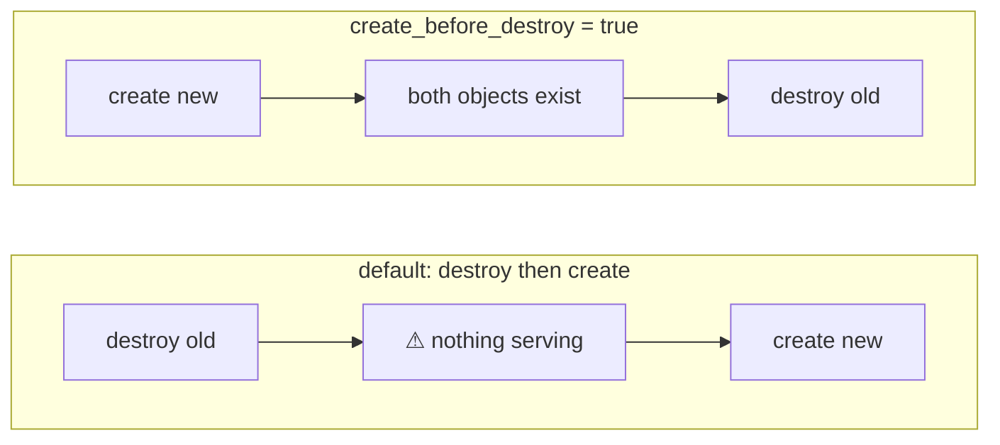

# Chapter 11 — The `lifecycle` meta-argument

## Learning outcomes

By the end you can:

- Say what the `lifecycle` block controls, and why it is a **subblock** rather than a set of top-level arguments.
- Explain why every rule in it takes **literal values only**, from the mechanism rather than the slogan.
- Name the one lifecycle rule Terraform records in **state**, and why the other six being absent is the single most important fact in this chapter.
- Protect a resource with `prevent_destroy`, **predict the hole in it**, and close that hole properly.
- Configure a **zero-downtime replacement** with `create_before_destroy`, read the plan symbol that proves it is active, and recognise the resource types where it cannot work.
- Predict that `create_before_destroy` **propagates to every resource upstream of it**, and find the evidence.
- Stop Terraform reverting out-of-band drift with `ignore_changes`, and say precisely when the ignored attribute still applies.
- Force a replacement from something that is not a resource, using `replace_triggered_by` and `terraform_data`.

---

## 1. Replacement is the dangerous default

Chapter 10 gave you `count`, `for_each`, and `depends_on`. All three answer questions about *shape*: how many objects, addressed how, built in what order. None of them says anything about what happens when an object that already exists has to change.

That gap is where the outages live.

Terraform's apply loop does five things. It creates resources in the configuration that have no object in state. It destroys objects in state that are no longer in the configuration. It updates in place where the provider can. It **destroys and re-creates** where the provider cannot update in place. And, since 1.14, it invokes actions attached to those events.

The fourth one is the problem. A change to a single argument can force a replacement, and the default replacement order is **destroy first, then create**. For a load balancer, a database, or anything serving traffic, that order is a gap in service that nothing in the configuration warned you about.

Two other failure modes come from the same place. A resource you never wanted touched gets destroyed because a plan swept it up. A resource keeps flapping because some other system edits it out of band and Terraform keeps changing it back.

`lifecycle` is the answer to all three. HashiCorp's [`lifecycle` reference](https://developer.hashicorp.com/terraform/language/meta-arguments/lifecycle) puts the framing better than most: *"Instead of Terraform managing operations in the built-in dependency graph, lifecycle arguments help minimize potential downtime based on your resource needs as well as protect specific resources from changing or impacting infrastructure."*

### The shape of the block

`lifecycle` is a **subblock**, declarable once per resource, holding rules rather than arguments of its own.

```hcl
resource "aws_db_instance" "main" {
  identifier     = "app-prod"
  engine         = "postgres"
  instance_class = "db.t4g.micro"

  lifecycle {
    prevent_destroy = true
  }
}
```

The subblock is deliberate. Resource arguments come from the provider, and the provider chose those names. If `prevent_destroy` were a top-level argument, then the day some provider shipped a resource with an argument called `prevent_destroy` the two would collide. Putting the rules inside a namespaced block means Terraform can add new ones for years without ever colliding with a vendor name.

That is not a hypothetical. It has happened twice. The block began with four rules and now has seven.

!!! tip "Where the block goes in a resource"
    HashiCorp's [style guide](https://developer.hashicorp.com/terraform/language/style) fixes the order inside a block: meta-*arguments* such as `count` and `for_each` come first, then normal arguments, then nested blocks, and meta-argument *blocks* such as `lifecycle` come **last**. Following it means a reader can find the lifecycle rules in the same place in every resource you write, which matters more here than for most conventions, because these rules change behaviour that the rest of the block does not hint at.

| Rule | What it changes |
|---|---|
| `create_before_destroy` | replacement order: create the new object before destroying the old |
| `prevent_destroy` | rejects any plan that would destroy this object |
| `ignore_changes` | stops Terraform planning updates for the listed attributes |
| `replace_triggered_by` | replaces this resource when another one changes |
| `precondition` | a condition checked before the resource is planned |
| `postcondition` | a condition checked after the resource is applied |
| `action_trigger` | invokes a provider action on a lifecycle event |

This chapter teaches the first four. The last three are named here so the list is complete, and each is picked up where it belongs: `precondition` and `postcondition` in Chapter 19, where validation is the subject, and `action_trigger` in Chapter 18, alongside provisioners and the other escape hatches.

There is an eighth rule, `destroy`, which is legal only inside a `removed` block. It appears in section 4 because it is the fix for `prevent_destroy`'s biggest weakness, and it belongs properly to Chapter 17.

### Why every rule takes literals

Try to drive a lifecycle rule from a variable and Terraform stops you. Measured on **1.15.8**:

```hcl
variable "protect" {
  type    = bool
  default = true
}

resource "terraform_data" "db" {
  input = "pretend-database"

  lifecycle {
    prevent_destroy = var.protect      # rejected
  }
}
```

```
Error: Variables not allowed

  on main.tf line 11, in resource "terraform_data" "db":
  11:     prevent_destroy = var.protect

Variables may not be used here.
```

The reference page gives the reason in one sentence: *"All lifecycle settings affect how Terraform constructs and traverses the dependency graph. As a result, only literal values can be used because the processing happens too early for arbitrary expression evaluation."*

Read that as a claim about ordering, not about types. The dependency graph has to exist before any expression can be evaluated, because evaluating an expression means resolving references, and resolving references *is* the graph. A lifecycle rule is an **input** to graph construction. It cannot depend on anything graph construction produces.

!!! note "The same rule you already met, stated with its mechanism"
    Chapter 10 said meta-arguments are processed before the graph exists, which is why `count` and `for_each` values must be known ahead of any remote operation. `lifecycle` is the strictest case of that rule. `count` at least accepts an expression over known values. `prevent_destroy` accepts the token `true` or the token `false` and nothing else.

---

## 2. The fact that governs everything else: lifecycle rules are not in state

Before any individual rule, one property of the whole block. From the reference page:

> "Except for `create_before_destroy`, Terraform does not explicitly record a resource's lifecycle rule to state."

Nothing else in this chapter matters as much. The lifecycle rules live in the configuration file and nowhere else. They are instructions to the planner, read fresh on every run. They are not properties of the object.

Three consequences follow directly.

**Deleting a resource block deletes its guard.** Not "removes the resource and keeps the protection". The protection was a line in the block you just deleted. Section 4 measures exactly this.

**A resource inherited from someone else has no guard until you write one.** Importing an object into state imports the object, not a policy about it.

**Condition results are the partial exception.** Terraform records the *results* of `precondition` and `postcondition` checks to state, but not the contents of the checks. That is why `terraform show` can tell you a check passed without telling you what it checked.

### Why `create_before_destroy` is exempt

One rule survives in state, and the reason is not arbitrary. It is visible in the Terraform source. `states.ResourceInstanceObject` carries the field, and its comment explains itself (read at tag **v1.15.8**, `internal/states/instance_object.go:52`):

```go
// CreateBeforeDestroy reflects the status of the lifecycle
// create_before_destroy option when this instance was last updated.
// Because create_before_destroy also effects the overall ordering of the
// destroy operations, we need to record the status to ensure a resource
// removed from the config will still be destroyed in the same manner.
```

It is serialised into state format v4 as `create_before_destroy` (`internal/states/statefile/version4.go:719`).

So the exception exists precisely for the case that breaks `prevent_destroy`. When a resource's configuration is gone, Terraform still has to destroy the object in the right order, and the configuration is no longer there to say what that order is. The other six rules have nothing to do once the config is gone, so nothing is stored.

---

## 3. `prevent_destroy` — and the hole in it

Set it and any plan that would destroy the object fails.

```hcl
resource "aws_s3_bucket" "audit_logs" {
  bucket = "example-audit-logs"

  lifecycle {
    prevent_destroy = true
  }
}
```

Run `terraform destroy` against that and Terraform builds the whole destroy plan, then refuses it. Measured on **1.15.8**:

```
Plan: 0 to add, 0 to change, 1 to destroy.

Error: Instance cannot be destroyed

  on main.tf line 23:
  23: resource "aws_s3_bucket" "audit_logs" {

Resource aws_s3_bucket.audit_logs has lifecycle.prevent_destroy set, but the
plan calls for this resource to be destroyed. To avoid this error and
continue with the plan, either disable lifecycle.prevent_destroy or reduce
the scope of the plan using the -target option.
```

Three things in that output are worth reading closely.

**It is an error, not a prompt.** There is no `--force` and no confirmation to type through. The only two documented ways past it are editing the configuration and narrowing the plan.

**Terraform's own suggested escape is `-target`.** That is unusual. `-target` is normally the flag the docs steer you away from, because a targeted plan is a partial plan. Here it is the sanctioned way to destroy everything else while the protected object stays.

**The rejection happens at plan time.** The plan was fully rendered before the error appeared. Nothing was destroyed and then rolled back, because nothing had started.

### The hole

Now delete the resource block instead of running destroy. Same state, same object, no `lifecycle` line anywhere, because you deleted the block that carried it.

```
  # aws_s3_bucket.audit_logs will be destroyed
  # (because aws_s3_bucket.audit_logs is not in configuration)

Plan: 0 to add, 0 to change, 1 to destroy.
```

No error. Apply it and the bucket is gone. Measured on 1.15.8 in this chapter's lab.

This is section 2 playing out. `prevent_destroy` was never a property of the object. It was a line in a block, and the block is gone.

!!! danger "Commenting out a resource block removes its destroy protection"
    The failure mode is not "someone deliberately deleted the protected resource". It is *commenting out a block while debugging something else*, running `apply` to see what happens, and destroying a production database that had `prevent_destroy = true` on it the whole time. Terraform will not warn you, because from its point of view there is no protected resource in the configuration at all.

    Treat `prevent_destroy` as a guard against **an accidental plan**, never as a guard against **an accidental edit**.

### Closing the hole properly

If the real intent is "stop managing this object, do not delete it", the tool is a `removed` block, and it needs an explicit `lifecycle`:

```hcl
removed {
  from = aws_s3_bucket.audit_logs

  lifecycle {
    destroy = false      # omit this line and the object IS destroyed
  }
}
```

`destroy` defaults to **`true`**. A bare `removed` block destroys the object. With `destroy = false`, the plan reports `0 to destroy` and warns that the object "will no longer be managed by Terraform, but will not be destroyed."

Chapter 17 covers the whole `removed` / `moved` / `import` family. It appears here because it is the only correct answer to the question `prevent_destroy` makes people ask.

### What it costs

TID's Chapter 2 recommends using `prevent_destroy` *exceedingly rarely*, and gives three reasons that all hold up:

- It takes only literal values, so one module cannot protect production while leaving development destroyable. Section 8 shows how OpenTofu removes exactly this limitation.
- It blocks destroy plans outright, which breaks any workflow that stands up and tears down temporary environments.
- The guard dies with the block, as measured above.

The reference page adds a fourth: enabling it "makes certain configuration changes impossible to apply." Any change that would force replacement is now an error, not a replacement.

Its honest use case is narrower than "protect the database". It protects against a **replacement** you did not intend, on an object that is expensive or impossible to reproduce. Compliance-retained logs are the clean example. For everything else, section 5 has a better tool.

---

## 4. `create_before_destroy` — zero-downtime replacement

When a change forces replacement, Terraform destroys the old object and then creates the new one. `create_before_destroy` inverts that.

```hcl
resource "aws_s3_bucket" "app" {
  bucket = "example-app-v3"

  lifecycle {
    create_before_destroy = true
  }
}
```

The two orders, and the window each one opens:



The default is the safe one for a different reason than it looks. Many remote object types carry a unique identifier that cannot be duplicated. Two IAM roles cannot share a name. Two EC2 instances cannot hold one Elastic IP. Creating first would simply fail. That is why the behaviour is opt-in, and why the reference page warns that some resource types offer a random-suffix option to avoid collisions but *"Terraform CLI cannot automatically activate such features"*. Checking whether your resource type can tolerate two live objects is your job, not Terraform's.

### The plan symbol is the proof

Nothing in a plan announces "create_before_destroy is active" in words. The symbol is the announcement. Measured on 1.15.8, the same forced replacement, first without the rule and then with it:

```
  ~ update in-place
-/+ destroy and then create replacement

  # aws_s3_bucket.app must be replaced
-/+ resource "aws_s3_bucket" "app" {
      ~ bucket = "ch11-cbd-app-v1" -> "ch11-cbd-app-v2" # forces replacement
```

```
  ~ update in-place
+/- create replacement and then destroy

  # aws_s3_bucket.app must be replaced
+/- resource "aws_s3_bucket" "app" {
      ~ bucket = "ch11-cbd-app-v2" -> "ch11-cbd-app-v3" # forces replacement
```

Read the symbol literally. It is the operation order, left to right. `-/+` destroys then creates; `+/-` creates then destroys. The legend text is generated straight from that (`internal/command/jsonformat/plan.go:688` at tag v1.15.8).

Both plans end `Plan: 1 to add, 0 to change, 1 to destroy.` A replacement is always two numbers in the summary for one resource, whichever order it happens in.

### The apply log, and the deposed object

```
aws_s3_bucket.app: Creating...
aws_s3_bucket.app: Creation complete after 0s [id=ch11-cbd-app-v3]
aws_s3_bucket.app (deposed object 6fc41790): Destroying... [id=ch11-cbd-app-v2]
aws_s3_bucket.app: Destruction complete after 0s
```

That parenthesis is not an instance index. During a create-before-destroy replacement, the old object cannot simply stay at `aws_s3_bucket.app`, because the new object needs that address. Terraform moves the old one aside in state under a generated **deposed key**, then destroys it.

!!! warning "A failed apply leaves the deposed object in state"
    The deposal is the reason `create_before_destroy` has an operational cost that neither the reference page nor the tutorial mentions. If the apply dies between the create and the destroy, the deposed object survives in state and in the cloud. It shows up in `terraform state list`, and the next plan will try to destroy it again.

    That is recoverable, and Chapter 17 covers the recovery. It is worth knowing before you turn the rule on across a codebase, because the failure mode is "an orphaned object you are still paying for" rather than "an error message".

!!! warning "A destroy-time provisioner on the resource stops running"
    The reference page states it in one clause and it is easy to miss: when a resource contains a provisioner that runs during destroy, setting `create_before_destroy = true` "also prevents the provisioner from running."

    So turning the rule on silently disables any drain, deregister, or backup step you had attached to the teardown. If the resource has destroy-time work, that work has to move somewhere the replacement order cannot suppress it. Chapter 18 covers provisioners and the alternatives.

### It propagates, and you cannot turn it off

This is the part that surprises people, and it is measurable.

Take two resources where one depends on the other. Put `create_before_destroy` on the dependent only. The dependency declares no `lifecycle` block at all:

```hcl
resource "aws_s3_bucket" "config" {
  bucket = "example-config"
}

resource "aws_s3_bucket" "app" {
  bucket = "example-app-v3"

  tags = {
    config_bucket = aws_s3_bucket.config.id      # this reference is the edge
  }

  lifecycle {
    create_before_destroy = true
  }
}
```

Apply that, then read the state file. Measured on 1.15.8:

```
aws_s3_bucket.app    -> create_before_destroy = True
aws_s3_bucket.config -> create_before_destroy = True
```

`aws_s3_bucket.config` acquired the rule and had it written to state, despite never mentioning it. Terraform propagates `create_before_destroy` along dependency edges, upward from the resource that declared it.

The reason is graph-shaped. A create-before-destroy node destroys its old object *after* creating the new one, which reverses the direction of its destroy edges. If its dependency still destroyed first, the two orderings would demand a cycle. Rather than fail, Terraform upgrades the dependency to match. The pass has a name and says so in the log (`internal/terraform/transform_destroy_cbd.go`, tag v1.15.8):

```go
// If this isn't naturally a CBD node, this means that an descendant is
// and we need to auto-upgrade this node to CBD. We do this because
// a CBD node depending on non-CBD will result in cycles.
```

It runs **in the plan graph builder**, before planned changes are constructed. The propagation is therefore visible in the plan, not an apply-time surprise.

!!! danger "Writing `create_before_destroy = false` on the dependency does nothing, silently"
    The documentation says you cannot override the propagated value back to `false`. "Cannot" sounds like an error. It is not one.

    Measured on **Terraform 1.15.8** and **OpenTofu 1.12.4**: adding `lifecycle { create_before_destroy = false }` to the dependency plans and applies with **no error and no warning**. Terraform reads your `false`, forces it back to `true`, and says nothing. The only place it admits this is a trace log:

    ```
    ForcedCBDTransformer: "aws_s3_bucket.config (expand)" has CBD descendant "aws_s3_bucket.app (expand)"
    ForcedCBDTransformer: forcing create_before_destroy on for "aws_s3_bucket.config (expand)"
    ```

    So the practical rule is stronger than the documented one. Turning `create_before_destroy` on for one resource turns it on for **everything that resource depends on**, transitively, and no configuration you write can opt any of them out.

Which leads to the real risk. `create_before_destroy` is opt-in because it is unsafe on resource types whose old and new objects cannot coexist. Propagation applies it to resources you did not choose it for. If one of those upstream resources has a fixed unique name and later needs replacing, the apply fails on a collision, in a resource you never edited.

### When it cannot work

Make that concrete. A DynamoDB table's name is fixed by the configuration, and changing its `hash_key` forces replacement. With `create_before_destroy = true`, Terraform tries to create the replacement while the original still holds the name.

The plan is clean:

```
+/- create replacement and then destroy

  # aws_dynamodb_table.sessions must be replaced
+/- resource "aws_dynamodb_table" "sessions" {
      ~ hash_key = "session_id" -> "tenant_id" # forces replacement

Plan: 1 to add, 0 to change, 1 to destroy.
```

The apply is not:

```
aws_dynamodb_table.sessions: Creating...

Error: creating AWS DynamoDB Table (ch11-sessions): operation error DynamoDB:
CreateTable, https response error StatusCode: 400, ResourceInUseException:
Table already exists: ch11-sessions
```

Two lessons. First, **a valid plan is not proof that `create_before_destroy` is safe** for a resource type. Terraform cannot know whether the remote API tolerates two objects; it finds out when the API says no. Second, this particular failure is clean. State was unchanged and no deposed object was left behind, because the create failed before anything was deposed. Failures later in the sequence are messier.

The fix for a resource like this is to make the name derivable rather than fixed, using a random suffix or a `name_prefix` argument where the provider offers one. If the name cannot move, `create_before_destroy` is not available and the downtime is real.

---

## 5. `ignore_changes` — sharing a resource with something else

The most-used rule of the four, and the one whose semantics are most often assumed rather than known.

Its purpose is drift you want to keep. Something outside Terraform edits an attribute of a managed object. On the next plan Terraform notices the difference and proposes to change it back. Sometimes that is exactly right. Sometimes the other system is the authority for that attribute, and Terraform reverting it is the bug.

```hcl
resource "aws_s3_bucket" "reports" {
  bucket = "example-reports"

  tags = {
    owner = "data-team"
  }

  lifecycle {
    ignore_changes = [tags]
  }
}
```

Measured on 1.15.8. With the tag changed out of band to `platform-team` and no `ignore_changes`, the plan wants it back:

```
  # aws_s3_bucket.reports will be updated in-place
  ~ resource "aws_s3_bucket" "reports" {
      ~ tags = {
          ~ "owner" = "platform-team" -> "data-team"
        }

Plan: 0 to add, 1 to change, 0 to destroy.
```

Add the rule and apply, and the plan is empty:

```
Apply complete! Resources: 0 added, 0 changed, 0 destroyed.
```

Now read the state:

```
    tags = {
        "owner" = "platform-team"
    }
```

The configuration says `data-team`. State and reality say `platform-team`. Terraform is content, and will stay content.

!!! note "`ignore_changes` suppresses the plan, not the read"
    Terraform still refreshes the attribute and still records the real value in state. What it stops doing is proposing an update. The consequence is that configuration and state legitimately disagree from then on, and `terraform state show` is the source of truth for what is actually there.

### Considered on create, ignored on update

The rule that makes the whole feature make sense, stated exactly by the reference page:

> "Terraform considers the arguments corresponding to the given attribute names when planning a **create** operation, but are ignored when planning an **update** operation."

So the ignored attribute is not dead. It still applies the first time the object is built. It stops mattering from the second plan onward.

This is the mechanic behind the canonical AMI example. An instance is built from the AMI the configuration looked up. Later AMI releases would otherwise force a replacement of a perfectly healthy server, so you ignore the attribute. But if that instance is ever replaced for some other reason, it comes back on whatever the configuration says at that moment, not on the value that had drifted.

### What you can put in the list

Entries are **relative addresses of attributes**, and index notation works:

```hcl
lifecycle {
  ignore_changes = [
    tags["LastScanned"],       # one key, rest of the map still managed
    ebs_block_device[0].size,
  ]
}
```

Two limits, both measured on 1.15.8.

**Only attributes the resource type defines.** You cannot ignore a meta-argument, and you cannot ignore `lifecycle` itself:

```
Error: Unsupported attribute

  on main.tf line 12, in resource "terraform_data" "x":
  12:     ignore_changes = [count]

This object has no argument, nested block, or exported attribute named
"count".
```

**`all` is a bare keyword and takes no brackets.** Sources describe this loosely enough to be worth pinning down. All three forms were run:

| Written as | Result on 1.15.8 |
|---|---|
| `ignore_changes = all` | valid |
| `ignore_changes = [all]` | `Error: Unsupported attribute … no … attribute named "all"` |
| `ignore_changes = ["all"]` | valid, with a *"Quoted references are deprecated"* warning |

`all` means Terraform can create and destroy the object but will never propose an update to it.

!!! warning "`ignore_changes = all` is a bigger commitment than it looks"
    It does not mean "ignore the noisy attributes". It means the configuration stops being the source of truth for this object entirely, forever, including for changes you make deliberately. Editing an argument and seeing an empty plan is a confusing afternoon. Prefer naming the attributes.

### Using it to stop a replacement

TID's Chapter 5 arrives at `ignore_changes` from a completely different direction, and the framing is worth keeping. When a plan shows a resource being replaced and you cannot see why, the per-attribute `# forces replacement` marker names the culprit. Add that attribute to `ignore_changes` and the replacement stops being proposed.

That makes `ignore_changes` a better accidental-destruction guard than `prevent_destroy` in most cases. It targets the specific attribute that triggers the rebuild, it still allows every other update to proceed, and it does not break `terraform destroy` when you genuinely want the resource gone.

---

## 6. `replace_triggered_by` — rebuilding on someone else's change

The inverse rule. Instead of suppressing a replacement, force one.

```hcl
resource "aws_appautoscaling_target" "ecs_target" {
  # ...
  lifecycle {
    replace_triggered_by = [aws_ecs_service.svc.id]
  }
}
```

What counts as a trigger depends on what you reference, and the three cases are not uniform:

| Reference is to | Replacement triggers when |
|---|---|
| a resource with multiple instances | a plan to update **or replace any instance** |
| a single resource instance | a plan to update or replace **that** instance |
| a single attribute of an instance | **any change to the attribute value** |

The first two watch a *planned action*. The third watches a *value*. That distinction explains the rule's main restriction.

### Why a variable is illegal, and how to use one anyway

```
Error: Invalid reference in replace_triggered_by expression

  on main.tf line 38, in resource "aws_s3_bucket" "cache":
  38:     replace_triggered_by = [var.revision]

Only resources, count.index, and each.key may be used in
replace_triggered_by.
```

The reason is not the literal-only rule from section 1. It is that replacement is decided from the **planned operations** of the referenced objects, and a variable has no planned operation. There is nothing to inspect.

`terraform_data` is the documented way around it. It is a built-in resource with no provider behind it, and it plans an operation whenever its `input` changes:

```hcl
variable "revision" {
  type    = number
  default = 1
}

resource "terraform_data" "revision" {
  input = var.revision
}

resource "aws_s3_bucket" "cache" {
  bucket = "example-cache"

  lifecycle {
    replace_triggered_by = [terraform_data.revision]
  }
}
```

Bump `revision` and the bucket is rebuilt. Measured on 1.15.8:

```
  # aws_s3_bucket.cache will be replaced due to changes in replace_triggered_by
-/+ resource "aws_s3_bucket" "cache" {

  # terraform_data.revision will be updated in-place
  ~ resource "terraform_data" "revision" {

Plan: 1 to add, 1 to change, 1 to destroy.
```

Two details in that output pay for themselves.

**The plan names the reason.** `will be replaced due to changes in replace_triggered_by` is a distinct message from `must be replaced`. When a rebuild you did not expect shows up, that line tells you which mechanism caused it.

**An in-place update is enough to trigger it.** `terraform_data.revision` was only *updated*, not replaced, and the bucket was still replaced. That is the table above in action: a plan to update the referenced instance counts.

!!! note "`input` versus `triggers_replace` on `terraform_data`"
    Both arguments just store a value. Changing `input` updates the resource in place, which is enough to fire a `replace_triggered_by` pointed at it. Changing `triggers_replace` replaces the `terraform_data` resource itself, which is what you want when it is hosting a provisioner that must re-run. Chapter 18 uses the second form.

`replace_triggered_by` is the newest of the four rules, and it exists because providers kept inventing the same feature. The `null` provider had `triggers`; the `random` provider had `keepers`. Terraform promoted the idea into core so it works for every resource type.

---

## 7. Where each rule is legal

`lifecycle` is the only meta-argument reference page with **no applicability table at all**. Its "Supported constructs" section contains one sentence telling you to consult the block's own documentation, and nothing else.

Chapter 10 spent a section on how unreliable those tables are for `count`, `for_each`, and `depends_on`. Here there is nothing to be unreliable. The only applicability data is a scattered line under each rule, saying which blocks accept it. Reassembled:

| Rule | Blocks that accept it |
|---|---|
| `create_before_destroy`, `prevent_destroy`, `ignore_changes`, `replace_triggered_by`, `action_trigger` | `resource` |
| `precondition`, `postcondition` | `data`, `ephemeral`, `resource` |
| `destroy` | `removed` |

Unusually, this one holds up. The `data` block reference independently documents that a `data` block's `lifecycle` supports only `precondition` and `postcondition`, which is the same split reached from the other side. The reason is straightforward: a data source is a read. There is nothing to create before destroying, nothing to prevent the destruction of, and no update to ignore.

The standing advice from Chapter 10 still applies to anything outside those rows. Write the two lines and run `terraform validate`.

---

## 8. OpenTofu

`create_before_destroy`, `ignore_changes`, and `replace_triggered_by` behave identically on both tools. The propagation measurement in section 4 was re-run under **OpenTofu 1.12.4** and produced the same forcing behaviour, from the same transformer, with the same silence.

`prevent_destroy` is where they part company.

!!! info "OpenTofu — dynamic `prevent_destroy` (1.12)"
    The literal-only restriction is exactly what OpenTofu 1.12 lifted for this one rule. The same configuration that Terraform rejects with *"Variables not allowed"* validates cleanly under `tofu`. Measured on **Terraform 1.15.8** versus **OpenTofu 1.12.4**:

    ```hcl
    variable "prevent_database_deletion" {
      type    = bool
      default = true
    }

    resource "aws_db_instance" "main" {
      # ...
      lifecycle {
        prevent_destroy = var.prevent_database_deletion
      }
    }
    ```

    That removes the first of TID's three objections. A module can protect its database by default and let a development caller switch the protection off:

    ```hcl
    module "database" {
      source                    = "./modules/database"
      prevent_database_deletion = false
    }
    ```

    The other two objections stand on both tools. It still blocks destroy plans, and it still dies with the block.

!!! info "OpenTofu — `destroy = false` on the resource itself (1.12)"
    Terraform's "forget without destroying" lives in a separate `removed` block, as section 3 showed. OpenTofu also accepts it as one line inside the **resource's own** `lifecycle`, which means the intent stays next to the resource instead of moving to a different block at the moment you delete it.

!!! info "OpenTofu — `enabled` (1.11)"
    Chapter 10 left the `count = var.enabled ? 1 : 0` idiom as the only way to make a single resource optional in Terraform, with the cost that the address gains a permanent `[0]`. OpenTofu's replacement is an argument **inside the `lifecycle` block**, not a top-level meta-argument:

    ```hcl
    resource "aws_s3_bucket" "optional" {
      bucket = "example-optional"

      lifecycle {
        enabled = var.create_bucket
      }
    }
    ```

    Measured on OpenTofu 1.12.4: the address stays `aws_s3_bucket.optional` with no index, and a disabled resource evaluates to **`null`** rather than an empty collection. So a reference to a disabled resource fails with *"Attempt to get attribute from null value"* rather than silently yielding `[]`. Guard with `aws_s3_bucket.optional == null ? … : …`.

    Terraform 1.15.8 has no equivalent, in `lifecycle` or anywhere else.

---

## 🧪 Lab: protect a bucket, replace one with no downtime, and keep someone else's drift

This is the milestone made concrete. You will guard a bucket and then watch the guard fail in the way that matters. You will force a replacement in both orders and read the symbol that tells them apart. You will prove that `create_before_destroy` propagates to a resource that never asked for it, then break it on a resource whose name cannot move. Finally you will let an outside process win an argument with Terraform.

Everything runs against the free local **AWS emulator** from [Chapter 1's lab setup](ch01-iac-fundamentals.md#lab-setup-a-free-local-aws-docker). S3 and DynamoDB are both on the reliable free surface.

**Start the emulator** (from the repo root; skip if already running):

```shell
docker compose -f labs/docker-compose.yml up -d      # start the emulator on :4566, detached
curl -s http://localhost:4566/_floci/health          # wait until the services read "running"
```

### Part A — the guard, and the hole in it

The configuration is committed at `labs/chapter11/lab1`:

```hcl
# main.tf
terraform {
  required_version = ">= 1.15"
  required_providers {
    aws = { source = "hashicorp/aws", version = "~> 6.0" }
  }
}

provider "aws" {
  region = "us-east-1"
}

resource "aws_s3_bucket" "audit_logs" {
  bucket = "ch11-audit-logs"

  lifecycle {
    prevent_destroy = true
  }
}

output "bucket" {
  value = aws_s3_bucket.audit_logs.bucket
}
```

```shell
tflocal init
tflocal apply -auto-approve
tflocal destroy
```

The destroy is rejected, after a fully rendered plan:

```
Plan: 0 to add, 0 to change, 1 to destroy.

Error: Instance cannot be destroyed

  on main.tf line 23:
  23: resource "aws_s3_bucket" "audit_logs" {

Resource aws_s3_bucket.audit_logs has lifecycle.prevent_destroy set, but the
plan calls for this resource to be destroyed. To avoid this error and
continue with the plan, either disable lifecycle.prevent_destroy or reduce
the scope of the plan using the -target option.
```

Now do what someone debugging would do, and delete the block. `main.tf.removed` is the same file with the resource gone:

```shell
cp main.tf.removed main.tf
tflocal plan
```

```
  # aws_s3_bucket.audit_logs will be destroyed
  # (because aws_s3_bucket.audit_logs is not in configuration)

Plan: 0 to add, 0 to change, 1 to destroy.
```

No error this time.

```shell
tflocal apply -auto-approve
```

```
aws_s3_bucket.audit_logs: Destroying... [id=ch11-audit-logs]
aws_s3_bucket.audit_logs: Destruction complete after 0s

Apply complete! Resources: 0 added, 0 changed, 1 destroyed.
```

The protected bucket is gone, and Terraform never mentioned that it had been protected. Restore the original file before moving on.

### Part B — both replacement orders, and the propagation

`labs/chapter11/lab2` has two buckets. Renaming the app bucket forces its replacement, and a tag reference makes it depend on the config bucket.

```hcl
resource "aws_s3_bucket" "config" {
  bucket = "ch11-cbd-config"
}

resource "aws_s3_bucket" "app" {
  bucket = "ch11-cbd-app-${var.suffix}"

  tags = {
    config_bucket = aws_s3_bucket.config.id
  }
}
```

```shell
tflocal init
tflocal apply -auto-approve
tflocal plan -var suffix=v2
```

```
-/+ destroy and then create replacement

  # aws_s3_bucket.app must be replaced
-/+ resource "aws_s3_bucket" "app" {
      ~ bucket = "ch11-cbd-app-v1" -> "ch11-cbd-app-v2" # forces replacement

Plan: 1 to add, 0 to change, 1 to destroy.
```

```shell
tflocal apply -var suffix=v2 -auto-approve
```

```
aws_s3_bucket.app: Destroying... [id=ch11-cbd-app-v1]
aws_s3_bucket.app: Destruction complete after 0s
aws_s3_bucket.app: Creating...
aws_s3_bucket.app: Creation complete after 1s [id=ch11-cbd-app-v2]
```

Destroy first. Now switch to `main.tf.cbd`, which is the identical configuration with `create_before_destroy = true` on the **app** bucket only:

```shell
cp main.tf.cbd main.tf
tflocal plan -var suffix=v3
```

```
+/- create replacement and then destroy

  # aws_s3_bucket.app must be replaced
+/- resource "aws_s3_bucket" "app" {
      ~ bucket = "ch11-cbd-app-v2" -> "ch11-cbd-app-v3" # forces replacement

Plan: 1 to add, 0 to change, 1 to destroy.
```

Same counts. Different symbol. Different order:

```shell
tflocal apply -var suffix=v3 -auto-approve
```

```
aws_s3_bucket.app: Creating...
aws_s3_bucket.app: Creation complete after 0s [id=ch11-cbd-app-v3]
aws_s3_bucket.app (deposed object 6fc41790): Destroying... [id=ch11-cbd-app-v2]
aws_s3_bucket.app: Destruction complete after 0s
```

Now the propagation. The **config** bucket has no `lifecycle` block anywhere in the file:

```shell
python -c "
import json; d = json.load(open('terraform.tfstate'))
for r in d['resources']:
    for i in r['instances']:
        print(r['type'] + '.' + r['name'], '->', i.get('create_before_destroy'))
"
```

```
aws_s3_bucket.app -> True
aws_s3_bucket.config -> True
```

Try to opt it out. `main.tf.override` adds `lifecycle { create_before_destroy = false }` to the config bucket:

```shell
cp main.tf.override main.tf
tflocal plan -var suffix=v4
```

The plan succeeds with no error and no warning. The only evidence is in a trace:

```shell
TF_LOG=trace TF_LOG_PATH=trace.log tflocal plan -var suffix=v4
grep -o "ForcedCBDTransformer:.*" trace.log | sort -u
```

```
ForcedCBDTransformer: "aws_s3_bucket.config (expand)" has CBD descendant "aws_s3_bucket.app (expand)"
ForcedCBDTransformer: forcing create_before_destroy on for "aws_s3_bucket.config (expand)"
```

Your `false` was read and discarded. Clean up with `tflocal destroy -auto-approve -var suffix=v4`.

### Part C — where create-first cannot work

`labs/chapter11/lab3` is a DynamoDB table whose name is fixed and whose `hash_key` forces replacement, with `create_before_destroy = true`.

```shell
tflocal init
tflocal apply -auto-approve
tflocal apply -var hash_key=tenant_id -auto-approve
```

The plan is clean and the apply is not:

```
aws_dynamodb_table.sessions: Creating...

Error: creating AWS DynamoDB Table (ch11-sessions): operation error DynamoDB:
CreateTable, https response error StatusCode: 400, ResourceInUseException:
Table already exists: ch11-sessions
```

Check what survived:

```shell
tflocal state list
```

```
aws_dynamodb_table.sessions
```

One entry, no deposed object, state unchanged. The create failed before anything could be deposed, so this particular failure is clean. Tear down with `tflocal destroy -auto-approve`.

### Part D — let the other system win

`labs/chapter11/lab4` is one bucket tagged `owner = "data-team"`.

```shell
tflocal init
tflocal apply -auto-approve
awslocal s3api put-bucket-tagging --bucket ch11-drift \
  --tagging 'TagSet=[{Key=owner,Value=platform-team}]'
tflocal plan
```

```
  # aws_s3_bucket.reports will be updated in-place
  ~ resource "aws_s3_bucket" "reports" {
      ~ tags = {
          ~ "owner" = "platform-team" -> "data-team"
        }

Plan: 0 to add, 1 to change, 0 to destroy.
```

Terraform wants to revert it. Switch to `main.tf.ignore`, which adds `ignore_changes = [tags]`:

```shell
cp main.tf.ignore main.tf
tflocal apply -auto-approve
tflocal state show aws_s3_bucket.reports
```

```
Apply complete! Resources: 0 added, 0 changed, 0 destroyed.
```

```
    tags = {
        "owner" = "platform-team"
    }
```

The configuration still says `data-team`. State and reality say `platform-team`. Nothing is broken; the two are allowed to disagree now. Clean up with `tflocal destroy -auto-approve` after restoring `main.tf`.

!!! note "`awslocal` is the wrapper; the long form works too"
    `awslocal <cmd>` is `aws --endpoint-url http://localhost:4566 <cmd>` with throwaway credentials preset. If you skipped the wrapper in Chapter 1, use the long form with `AWS_ACCESS_KEY_ID=test AWS_SECRET_ACCESS_KEY=test AWS_DEFAULT_REGION=us-east-1` in the environment.

### Part E — replace on a variable

`labs/chapter11/lab5` drives a bucket replacement from a number.

```shell
tflocal init
tflocal apply -auto-approve
tflocal plan -var revision=2
```

```
  # aws_s3_bucket.cache will be replaced due to changes in replace_triggered_by
-/+ resource "aws_s3_bucket" "cache" {

  # terraform_data.revision will be updated in-place
  ~ resource "terraform_data" "revision" {

Plan: 1 to add, 1 to change, 1 to destroy.
```

Point `replace_triggered_by` straight at `var.revision` instead and Terraform tells you why that is not allowed:

```
Error: Invalid reference in replace_triggered_by expression

Only resources, count.index, and each.key may be used in
replace_triggered_by.
```

Finish with `tflocal destroy -var revision=2 -auto-approve`.

!!! warning "Emulation is not AWS"
    A green apply here proves your HCL and your understanding of the workflow. It does not prove AWS fidelity. The emulator's DynamoDB refused a duplicate table name exactly as the real service does, which is the point of Part C, but not every service enforces every constraint the same way. Validate anything load-bearing against real free-tier AWS before trusting it.

!!! note "If every provider suddenly fails to load"
    On a machine where security software intercepts loopback TLS, every Terraform command that loads a provider can fail with `Failed to load plugin schemas`. That is the plugin mTLS channel being intercepted, not a problem with the provider or the emulator. Exclude `terraform.exe` and `.terraform/providers/**` from the security product's *network/SSL inspection*. As a scoped fallback for one command, `TF_DISABLE_PLUGIN_TLS=1` works, but never set it persistently: it makes the Terraform-to-plugin channel plaintext for every provider, and credentials cross that channel.

---

## Common pitfalls

- **Trusting `prevent_destroy` to survive an edit.** It guards against an unintended plan, not against deleting or commenting out the block. Use a `removed` block with `destroy = false` when the intent is "stop managing this".
- **Writing a bare `removed` block.** `destroy` defaults to `true`. Omitting the `lifecycle` line destroys the object.
- **Turning on `create_before_destroy` without checking the resource type.** If the object has a fixed unique name, creating the replacement first collides. The plan will not tell you; the apply will.
- **Forgetting that `create_before_destroy` propagates.** Every resource upstream of the one you edited gets it too, transitively, written to state, and cannot be opted out.
- **Reading a `false` you wrote as a `false` Terraform honoured.** `create_before_destroy = false` on a propagated resource is silently discarded. Only a trace log shows it.
- **Assuming `ignore_changes` freezes the attribute.** It suppresses updates only. Creation still uses the configured value, so a later replacement resets whatever had drifted.
- **Reaching for `ignore_changes = all`.** It ends the configuration's authority over the object permanently, including for changes you intend. Name the attributes.
- **Bracketing the `all` keyword.** `ignore_changes = all` is valid; `[all]` is an error.
- **Trying to `ignore_changes` a meta-argument.** Only attributes the resource type defines are addressable.
- **Putting a variable in `replace_triggered_by`.** It has no planned action to inspect. Wrap it in a `terraform_data`.
- **Expecting a lifecycle rule to be visible in state.** Only `create_before_destroy` is recorded. Everything else exists solely in the configuration.

---

## Exercises

1. **Recall.** Without looking: which lifecycle rule is written to state, and what would break if it were not?
2. **Predict.** A plan shows `+/-` for a resource whose name is fixed by the configuration. Will the apply succeed? What determines the answer, and where would you check?
3. **Apply.** Take Part B's configuration and add a third bucket that the *config* bucket depends on. Predict whether it acquires `create_before_destroy`, then check the state file. Explain the direction propagation travels.
4. **Apply.** Reproduce Part C's collision, then fix it. Give the table a name built from a `random_id` suffix so the replacement can hold a different name, and confirm the apply now succeeds. Note what happens to the old table.
5. **Apply.** Using Part D's bucket, drift the tag out of band and then *deliberately* change the configured tag as well. With `ignore_changes = [tags]` in place, predict the plan before running it, then destroy and re-apply and explain why the tag comes back as the configured value.
6. **Extend.** Build the two-tool comparison from section 8 for real: one configuration with `prevent_destroy = var.protect`, validated under both `terraform` and `tofu`. Then convert it to a form that works on both tools, and say what you gave up.

---

## Summary

- **`lifecycle` is a subblock holding seven rules**, four of which change plan behaviour for managed resources. It is a subblock so new rules can be added without colliding with provider argument names, which has already happened twice.
- **Every rule takes literal values only.** Lifecycle settings are inputs to dependency-graph construction, and the graph must exist before any expression can be evaluated.
- **Lifecycle rules are not recorded in state, except `create_before_destroy`.** They are instructions in the configuration, read fresh each run. That single fact explains why deleting a block deletes its protection.
- **`prevent_destroy` rejects a destroy plan with an error, and dies with the block that carries it.** It is a guard against an unintended plan, never against an unintended edit. The real "stop managing, do not delete" tool is a `removed` block with `destroy = false`.
- **`create_before_destroy` flips the replacement order**, which the plan announces only through the `+/-` symbol. The old object is deposed under a generated key before being destroyed, and survives a failed apply.
- **It propagates to every resource upstream, transitively**, is written to their state, and cannot be opted out. An explicit `false` is discarded without an error or a warning.
- **`ignore_changes` is honoured on create and ignored on update.** It suppresses the plan, not the read, so configuration and state legitimately diverge. `all` is a bare keyword and a much bigger commitment than a list.
- **`replace_triggered_by` watches planned actions, not values**, except for attribute references, which watch values. A variable has no planned action, so `terraform_data` is the documented bridge.
- **OpenTofu lifts the literal-only restriction for `prevent_destroy`**, accepts `destroy = false` on the resource itself, and offers `enabled` in place of the `count = cond ? 1 : 0` idiom. The other three rules behave identically on both tools.

---

## What's next

You can now control *when* a resource is rebuilt, in what order, and what changes Terraform is allowed to notice. Between Chapters 10 and 11 the whole meta-argument family is covered.

Chapter 12 turns from meta-arguments to the shape of the configuration itself: **dynamic blocks and complex types**. Where `for_each` multiplies whole resources, `dynamic` generates repeated *nested* blocks inside one resource, driven by a typed variable. It is the tool that lets a module accept a list of firewall rules and emit the right number of `ingress` blocks. That chapter also pins down `object`, `map`, `list`, `set`, and `tuple`, and the `optional()` attribute modifier that makes module inputs pleasant to use.

One connection worth carrying forward: a `dynamic` block **cannot generate a `lifecycle` block**. The reason is section 1 of this chapter. `lifecycle` is read before expressions are evaluated, so there is nothing there for `dynamic` to generate into.

---

## References

**HashiCorp docs** — [`lifecycle`](https://developer.hashicorp.com/terraform/language/meta-arguments/lifecycle) · [`resource` block reference](https://developer.hashicorp.com/terraform/language/block/resource) · [`removed` block reference](https://developer.hashicorp.com/terraform/language/block/removed) · [`terraform_data`](https://developer.hashicorp.com/terraform/language/resources/terraform-data) · [Remove a resource from state](https://developer.hashicorp.com/terraform/language/state/remove)

**HashiCorp tutorials** — [Manage resource lifecycle](https://developer.hashicorp.com/terraform/tutorials/state/resource-lifecycle)

**Reading notes** — [[tf-meta-lifecycle]] · [[tut-resource-lifecycle]] · [[tf-block-resource]] · [[tf-block-removed]] · [[tf-block-data]] · [[tf-terraform-data]] · [[tf-state-remove]] · [[02-hcl-components]] (TID Ch 2 §2.7.2) · [[05-terraform-plan]] (TID Ch 5 §5.7)

**Topic pages** — [Meta-arguments and `lifecycle`](../topics/meta-arguments-lifecycle.md) · [The dependency graph](../topics/dependency-graph.md)

**Verified facts** — [[opentofu-enabled-argument]] (OpenTofu `enabled` lives inside `lifecycle`; disabled means `null`) · [[version-facts]]

**OpenTofu** — [`lifecycle`](https://opentofu.org/docs/language/meta-arguments/lifecycle/) · [[ot-dynamic-prevent-destroy]]

🧪 **Lab** — [Floci Facts](../research-cache/floci-facts.md) · [MiniStack Facts](../research-cache/ministack-facts.md) · [LocalStack Facts](../research-cache/localstack-facts.md)
