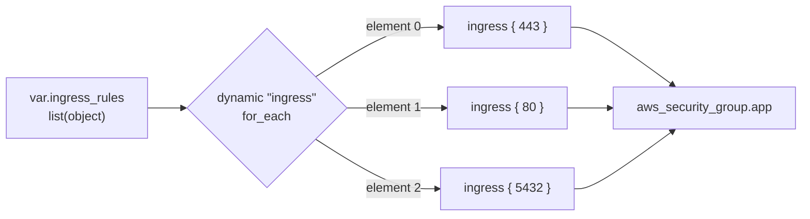

# Chapter 12 — Dynamic blocks & complex types

## Learning outcomes

By the end you can:

- Say what a **type constraint** does to a value at a module boundary, and name the three outcomes it can produce.
- Predict which attributes an `object(...)` constraint **silently discards**, and say what decides whether that discard is harmless or a silent misconfiguration.
- Explain why `optional(type, default)` carries a guarantee that a variable's `default` does not, from the mechanism rather than the slogan.
- Write a `dynamic` block, name its five parts, and say which temporary variable its body reads.
- Generate **zero or one** nested block, not just N, using two different idioms.
- Nest one `dynamic` block inside another and keep the two iterators straight.
- Name what a `dynamic` block **cannot** generate, and recognise the unhelpful error you get when you try.
- Decide when a `dynamic` block is the wrong answer, including the case where the provider has moved on.

---

## 1. Two interfaces: the shape coming in, and the blocks going out

Chapter 6 gave you input variables. Chapter 10 gave you `count` and `for_each`. Put them together and you can write a module that takes some values and stamps out N copies of a resource.

That is not enough to write a *good* module, because it only covers one direction.

A reusable module has an interface on the way **in**: the shape of the data a caller must supply. It has another on the way **out**: the shape of the configuration it produces for the provider. Both of those get harder the moment the module needs to be flexible.

"The way out" here is the resource configuration the module generates, not its `output` blocks. Chapter 6 covered those, and they return values to the caller rather than to the provider.

Take the standard example. You want a security group module. Callers need to specify their own inbound rules, and different callers need different numbers of them. One team needs HTTPS only. Another needs HTTPS, HTTP, and Postgres from a specific CIDR. A third needs those plus SSH, but only in the development account.

Start with the thing being aimed at. A security group holds its inbound rules as repeated `ingress` **blocks** inside the one resource, and written out by hand for two fixed rules it looks like this:

```hcl
resource "aws_security_group" "app" {
  name   = "app"
  vpc_id = "vpc-0a1b2c3d4e5f67890"

  ingress {
    from_port   = 443
    to_port     = 443
    protocol    = "tcp"
    cidr_blocks = ["0.0.0.0/0"]
  }

  ingress {
    from_port   = 80
    to_port     = 80
    protocol    = "tcp"
    cidr_blocks = ["0.0.0.0/0"]
  }
}
```

Every value in there is baked in, the VPC and the rule count alike. That block is exactly what one of those three callers needs and no use to the other two. The rest of this section is about the distance between it and a single module that can serve all three. Neither half of that distance is crossable with what you have so far.

Move it into a module and the two interfaces stop being an abstraction. They become two files:

```text
modules/security-group/
├── variables.tf    # the way in
├── main.tf         # the way out
└── outputs.tf      # values returned to the caller
```

`outputs.tf` is the part that needs nothing from this chapter:

```hcl
output "security_group_id" {
  value = aws_security_group.app.id
}
```

`variables.tf` is where a caller's rules arrive, and a first attempt looks reasonable enough:

```hcl
variable "name" {
  type = string
}

variable "vpc_id" {
  type = string
}

variable "ingress_rules" {
  type = list
}
```

`main.tf` is where it stalls:

```hcl
resource "aws_security_group" "app" {
  name   = var.name
  vpc_id = var.vpc_id

  # One ingress block per element of var.ingress_rules.
  # Nothing so far in this book can write that.
}
```

A caller then supplies the values that the hardcoded version had baked in:

```hcl
module "app_sg" {
  source = "./modules/security-group"

  name   = "app"
  vpc_id = aws_vpc.main.id

  ingress_rules = [ /* ... */ ]
}
```

In `variables.tf`, what should `ingress_rules` be declared as, so that a caller cannot supply something the module chokes on later? In `main.tf`, how does a fixed body turn N elements into N blocks? Those are the way in and the way out, and they are the two halves of this chapter.

On the way in, `type = list` is not a description of a rule. It says "a list of something", and a bare `list` means `list(any)`, so both of these callers satisfy it:

```hcl
ingress_rules = ["443", "80"]

ingress_rules = [
  { port = 443, protocol = "tcp", cidr_blocks = ["0.0.0.0/0"] },
  { port = 80, protocol = "tcp", cidr_blocks = ["0.0.0.0/0"] },
]
```

Only the second can produce an `ingress` block. A security group rule is not a port. Count the arguments in the resource above and every rule carries four of them: a `from_port`, a `to_port`, a `protocol`, and a set of `cidr_blocks`. All four have to reach the provider, and the first caller supplied one of them.

What happens next depends on how the module was written, and neither branch is good.

If it fills in what is missing, assuming `tcp` and assuming `0.0.0.0/0`, the apply succeeds and opens a port to the internet that the caller believed was internal.

If it fills in nothing, it fails. That is the better branch and still not a good one, because `list` lets the value through and the failure happens somewhere else entirely, at whichever expression inside the module first asks a string for a field it does not have. §2 shows exactly what that costs.

What `variables.tf` needs is a declaration that describes the *shape* of an element, not merely that elements exist. That is a **type constraint**, and §2 is about writing one that a caller cannot slip a bare string past.

That leaves `main.tf`, the harder of the two files. Two tools you already have look like they should cover it. Neither does, and they fail in different ways, which is worth watching before the answer turns up.

Go back to that resource. Two rules, so the block is written twice. Three rules, three times. The number of blocks is decided by **how many times you typed it**, which is fixed when you write the module. The caller's rule count is not known until they call it.

The obvious escape is `for_each`, from Chapter 10:

```hcl
resource "aws_security_group" "app" {
  for_each = var.ingress_rules
  # ...
}
```

`for_each` varies the number of **resources**, so at best that is three security groups holding one rule each, and what was wanted is one holding three. Here it does not even reach that, because `for_each` takes a map or a set of strings and a list of rule objects is neither. Measured on 1.15.8:

```text
Error: Invalid for_each argument

The given "for_each" argument value is unsuitable: the "for_each" argument
must be a map, or set of strings, and you have provided a value of type list
of object.
```

Convert the rules to a map and the error goes away, which is the trap. The configuration then works and still builds the wrong thing. The count that has to vary is inside one resource, and `for_each` cannot reach inside one.

The other instinct is to assign the rules the way you would assign anything else:

```hcl
ingress = var.ingress_rules         # treat the block like an argument
```

Here is the distinction the whole chapter rests on. `name = "app"` works because `name` is an **argument**, and an argument takes a value on the right of the `=`. `ingress { ... }` is a **block**. A block is not a value, so there is no expression whose result is "three blocks". Every function, `for` expression, and splat from Chapter 7 produces a value, and a value is not what is needed here.

So the repetition has to come from something that operates on blocks rather than on values. That something is `dynamic`.

!!! note "You will meet `ingress = [ ... ]` in older code, and it is not a counter-example"
    Terraform has a narrow legacy allowance called [attributes as blocks](https://developer.hashicorp.com/terraform/language/attr-as-blocks), where a handful of provider arguments accept **either** the block form **or** an `=` with a list of objects. It exists for compatibility, and HashiCorp is plain about the status: it is *"one necessary concession on the equivalence between native syntax and JSON syntax made pragmatically for compatibility with existing provider design patterns"*, and *"providers may phase out such patterns in future major releases."*

    It applies only to *"certain special arguments that were relying on this usage pattern prior to Terraform v0.12"*, so it is a property of a few specific old arguments rather than a general escape from the rule above. It also carries a sharp edge the block form does not have: with the `=` form, *"all of the arguments must be assigned a value, even if it's an explicit `null`"*, so you cannot leave optional fields out.

    Do not build a module on it. `dynamic` is the supported answer, works on every repeatable block regardless of the provider's age, and does not force you to spell out every optional field.

The two answers are **type constraints** and **`dynamic` blocks**. They are usually taught apart. They belong together, because a good module uses the first to describe what the second will iterate over.

Only the first is tied to a module boundary. A module is simply where both pressures happen to show up at once, which is why the chapter is framed around one. §4 returns to this with a root configuration that has no caller and still has to generate its blocks.

---

## 2. Type constraints — the interface on the way in

Chapter 7 §2 covered types from the **value** side: what a `tuple` is, how a `set` differs from a `list`, what `null` means. This section is the other half. A **type constraint** is not a type. It is a rule written in a `type =` argument that every incoming value must satisfy, and it actively changes the values that pass through it.

### Where a constraint is legal

Constraints look like expressions and are not. They are special syntax, valid in exactly three places:

- the `type` argument of an **input variable**,
- the `type` argument of a **module output** (Terraform 1.15+, covered in Chapter 6),
- a call to **`convert()`** (Terraform 1.15+, Terraform-only, see Chapter 7 §6).

Anywhere else, `string` and `list(string)` are not meaningful expressions.

### Keywords and constructors

HashiCorp's [Type Constraints](https://developer.hashicorp.com/terraform/language/expressions/type-constraints) page splits the syntax in two. A **type keyword** is a bare unquoted symbol naming one static type: `string`, `bool`, `number`, `any`. A **type constructor** is a symbol followed by parentheses carrying an argument: `list(string)`, `object({ name = string })`.

The distinction matters when the parentheses are missing. Two constructors tolerate that. `list` is shorthand for `list(any)` and `map` for `map(any)`, both kept for compatibility with configurations written before Terraform 0.12. `any` is not a type. It is a placeholder for a type yet to be decided, so `list(any)` accepts any element type as long as every element is the same type. That is almost never what you meant. Write the element type.

`set`, `object`, and `tuple` have no shorthand. Dropping the argument is an error: `The set type constructor requires one argument specifying the element type.`

### What a constraint actually does

This is the part that is easy to skim past. A constraint is not a gate that accepts or rejects. It is a **conversion step**, and it has three possible outcomes.

It can **convert** the value. It can **discard** part of the value. Or it can **reject** the value with an error.

Only one of those three is loud.

```hcl
variable "unify" {
  type    = list(any)
  default = ["a", 1, true]
}

variable "cfg" {
  type    = object({ name = string })
  default = { name = "n", extra = "dropped", another = 5 }
}
```

Measured on **1.15.8**, `terraform validate` on that configuration prints:

```
Success! The configuration is valid.
```

And the values that come out the other side are:

```
unify = tolist([
  "a",
  "1",
  "true",
])
cfg = {
  "name" = "n"
}
```

Two things happened without a word of complaint. The `list(any)` constraint **unified** three different types into `string`, rewriting `1` as `"1"` and `true` as `"true"`. The `object` constraint **deleted** two attributes.

!!! danger "An `object(...)` constraint silently deletes undeclared attributes"
    The discard itself is unconditional and always silent. Measured at a module boundary on **1.15.8**, with a module declaring `object({ name = string })` and a caller passing `name` plus `enable_https`:

    ```
    Success! The configuration is valid.
    ```

    The module receives `{ "name" = "kept" }`. The extra attribute is simply gone.

    HashiCorp's Type Constraints page states the rule plainly, in a sentence worth reading twice: *"values with additional attributes are also acceptable, but the extra attributes are discarded during type conversion."* The behavior is intentional. It exists so that a whole resource object can satisfy a narrow constraint, which is genuinely useful. The cost is that it cannot tell that use from a misspelling.

    A misspelled attribute is undeclared too, so it takes the same exit. Whether the caller ever learns of it is decided by something this chapter has not covered yet, and §3 comes back to it.

!!! info "OpenTofu — it warns, and Terraform does not"
    That discard is silent on Terraform. It is not silent on OpenTofu. Same `object({ name = string })` constraint, same caller passing `name` and `enable_https`, same resulting value, different diagnostics. OpenTofu **1.12.4** reports the dropped attribute and Terraform **1.15.8** says nothing. Part D of this chapter's lab names the module `typo`, because the mechanism that discards a spare attribute is the one that discards a misspelled one.

    ```
    Warning: Object attribute is ignored

      on main.tf line 90, in module "typo":
      88:   cfg = {
      89:     name         = "kept"
      90:     enable_https = true
      91:   }

    The object type for input variable "cfg" does not include an attribute named
    "enable_https", so this definition is unused.
    ```

    The resulting value is identical in both tools. Only the warning differs, which makes this a pure developer-experience divergence rather than a behavioral one.

    Measured boundary, because it is narrower than it first looks. OpenTofu warns when the extra attribute is written in a **module call** or in a **variable `default`**. It stays silent when the same value arrives from a **`.tfvars` file**, which is where a lot of real input comes from. Do not treat it as complete coverage. Both measurements are in `labs/chapter12/lab4`.

The third outcome, rejection, happens only when no conversion exists at all. Both of these declare a constraint their own default cannot satisfy:

```hcl
variable "bad_unify" {
  type    = list(any)
  default = ["a", [], "b"]
}

variable "tup" {
  type    = tuple([string, number])
  default = ["a", 1, true]
}
```

`terraform validate` on **1.15.8** rejects both:

```text
Error: Invalid default value for variable

  on main.tf line 3, in variable "bad_unify":
   3:   default = ["a", [], "b"]

This default value is not compatible with the variable's type constraint: all
list elements must have the same type.

Error: Invalid default value for variable

  on main.tf line 8, in variable "tup":
   8:   default = ["a", 1, true]

This default value is not compatible with the variable's type constraint:
tuple required.
```

`bad_unify` fails because `list(any)` still has to settle on one element type, and no single type holds both a string and a tuple. `tup` fails because a `tuple` constraint fixes the element count as well as the types, and its declaration allows exactly two while the default supplies three. The terse "tuple required" is Terraform saying the value cannot be made into *that* tuple.

A missing object attribute is rejected the same way. Every attribute an `object(...)` constraint declares is **required**, unless it is wrapped in the `optional()` modifier that §3 covers:

```hcl
variable "rule" {
  type    = object({ port = number, protocol = string })
  default = { port = 443 }
}
```

```text
Error: Invalid default value for variable

  on main.tf line 3, in variable "rule":
   3:   default = { port = 443 }

This default value is not compatible with the variable's type constraint:
attribute "protocol" is required.
```

That completes the object rule, which is strict in both directions and loud in only one. An attribute the constraint does not declare is dropped without a word. An attribute it does declare cannot be left out.

### The fourth case: nothing happens at all

Rejection is what most people picture a constraint doing, and it is the rarest of the three outcomes. A loose enough constraint produces none of them.

That is §1's `type = list` on `ingress_rules`. A caller passing `["443", "80"]` loses no element, has nothing discarded, and is rejected over nothing. The two strings already share a type, so the only conversion is the tuple-to-list one every list constraint performs, and it changes nothing the module can see. The value arrives intact and unusable.

Stripped of the module and the provider, the whole failure fits in one file:

```hcl
variable "ingress_rules" {
  type    = list
  default = ["443", "80"]
}

output "ports" {
  value = [for r in var.ingress_rules : r.port]
}
```

`terraform plan` on **1.15.8** gives:

```text
Error: Unsupported attribute

  on main.tf line 7, in output "ports":
   7:   value = [for r in var.ingress_rules : r.port]

Can't access attributes on a primitive-typed value (string).
```

Two details in that error are the whole argument for writing the element type out. It names the line that *read* the attribute rather than the line that supplied the value, so the same mistake inside a module points at a file the caller may never have opened. And `terraform validate` passes this configuration, because validation does not resolve what a caller will pass, so the error waits for `plan`.

A constraint that described the element would have converted, discarded, or rejected at the boundary, and the diagnostic would have named the caller's own value. `list(any)` did none of the three.

### Choosing the constraint: collection or structural

The choice that decides how well a module interface behaves is collection versus structural.

A **collection** type takes one element type and applies it to every element. `list(string)`, `set(number)`, `map(string)`. The number of elements is free and their type is fixed.

A **structural** type takes a schema. `object({ name = string, port = number })`, `tuple([string, number])`. The shape is fixed and each position or key carries its own type.

The pair that gets confused is `map` and `object`, because both are keyed by strings and the docs often use the words interchangeably. They differ on exactly the thing this chapter cares about. A **map** fixes the value type and leaves the key set open, so arbitrary keys are all kept. An **object** fixes the key set and lets each key have its own type, so keys it does not declare are dropped. That is why `map(string)` is right for tags and `object({...})` is right for a rule.

Sets have a similar catch on the way through a constraint. Converting a list or tuple to a `set` discards duplicates and loses ordering. A `set` constraint on a module input therefore throws away the caller's ordering permanently. Use `list` when order carries meaning, such as a sequence of rules evaluated top to bottom.

Converting back out of a set gives an order you did not choose. For a set **of strings** that order is lexicographical, which is at least predictable. For a set of anything else there is no rule you can rely on, and that is the case you will actually meet, because many provider schemas declare a repeated nested block as a set of objects. Part A of this chapter's lab declares its rules as 443, 80, 5432 and the plan renders them 80, 443, 5432. Not lexicographical, not the input order, just the provider's.

For module inputs the practical rule is short. Use `object` inside a `list` or `map` whenever an element has more than one field. That is the shape this entire chapter runs on:

```hcl
variable "ingress_rules" {
  type = list(object({
    port        = number
    description = optional(string, "Managed by Terraform")
    protocol    = optional(string, "tcp")
    cidr_blocks = optional(list(string), ["0.0.0.0/0"])
  }))
}
```

Every element is checked. A caller who forgets `port` gets an error naming the attribute. A caller who passes `port = "443"` gets it converted to a number. A caller who passes nothing else gets three defaults.

What no constraint checks is how many elements arrive. That variable accepts zero rules as readily as fifty. No collection constructor takes a count, and the only type that fixes one is `tuple`, which does it by pinning every position's type as well. The `tup` example earlier in this section is that rejection, and its "tuple required" is all the caller gets. For a rule list you want a count rule and a message, which means a `validation` block:

```hcl
variable "ingress_rules" {
  type    = list(object({ port = number }))
  default = []

  validation {
    condition     = length(var.ingress_rules) > 0
    error_message = "ingress_rules must contain at least one rule."
  }
}
```

Chapter 6 introduced `validation` for a value's content. Used on `length()` it covers the arity the type system cannot express: a minimum, a maximum, or a range. It also fires in a different phase from everything else in this section, which is worth knowing before you rely on it. A type constraint that its own default cannot satisfy is caught by `terraform validate`, as the `tup` transcript above shows. A `validation` block on that same default is not. Measured on **1.15.8**:

```text
$ terraform validate
Success! The configuration is valid.

$ terraform plan
Error: Invalid value for variable

  on main.tf line 1:
   1: variable "ingress_rules" {
    ├────────────────
    │ var.ingress_rules is empty list of object

ingress_rules must contain at least one rule.

This was checked by the validation rule at main.tf:5,3-13.
```

An empty default sitting three lines above the rule that forbids it, and `validate` still passes. This is the same lesson as the `list(any)` error in the previous subsection, from the other direction: `validate` checks what it can see statically, and a great deal of what a module promises its callers is not that.

!!! warning "`list(any)` unifies, it does not mix"
    `any` in an element slot does not mean "each element can be whatever it likes". Terraform must still find **one** element type, so it looks for a type every element converts to.

    `["a", "b", "c"]` gives `list(string)`. `[1, 2, 3]` gives `list(number)`. `["a", 1, true]` gives `list(string)` **and rewrites the values**, because numbers and bools convert to strings. `["a", [], "b"]` fails outright, because nothing is both a string and a tuple.

    If you genuinely need different types per position, that is what `tuple` and `object` are for.

!!! tip "`any` is for pass-through, and almost nothing else"
    The honest use for `type = any` is a value the module never inspects. It accepts it and hands it to something else.

    ```hcl
    variable "settings" {
      type = any
    }

    resource "aws_s3_object" "example" {
      # Reasonable: the module writes the data as JSON and never reads inside it.
      content = jsonencode(var.settings)
    }
    ```

    The moment any part of the module reads an attribute, indexes an element, or expects a string, `any` is the wrong constraint. Write the real one. Omitting `type` entirely is the same as writing `any`, which is why an untyped variable is a worse interface than it looks.

!!! tip "Precise is not the same as elaborate"
    Everything above argues for describing input precisely, and that argument has a limit. A deeply nested object with five levels and a dozen optional attributes is precise and nearly unusable. Callers cannot see the shape without reading the module source, and the error messages get long enough to be useless.

    When an input grows that complex, split it into several simpler inputs instead. Two flat variables beat one nested object most of the time.

---

## 3. `optional()` — and the trap in the word "default"

An object constraint normally requires every declared attribute. Marking one `optional` lets the caller leave it out.

```hcl
variable "site" {
  type = object({
    name  = string                        # required
    index = optional(string, "index.html") # optional, with a default
    error = optional(string)               # optional, no default
  })
}
```

The modifier takes the attribute's type, and optionally a default. With no default, an absent attribute becomes `null`. Note that this is a **typed** null, not an untyped hole. It prints as `tostring(null)`, because the constraint still knows what the attribute would have been.

`optional(type, default)` graduated from experiment to stable in **Terraform 1.3**. Every transcript here runs on **1.15.8**, and OpenTofu forked from Terraform 1.5.x, so both tools have had it since well before the versions this chapter measures.

### The asymmetry worth memorising

Terraform uses the word "default" for two different mechanisms, and they disagree about `null`.

A **variable's `default`** is a fallback for absence only. If the caller explicitly passes `null`, that is a real value and Terraform keeps it, because `nullable` defaults to `true`.

An **`optional()` attribute's default** is applied for absence *and* for an explicit `null`. It behaves the way `nullable = false` behaves, and there is no way to opt out.

Measured on **1.15.8**, passing an explicit `null` to all three:

| Declaration | Caller passes | Result |
|---|---|---|
| `default = "fallback"` | `null` | `null` — the default does **not** apply |
| `default = "fallback"`, `nullable = false` | `null` | `"fallback"` |
| `optional(string, "fallback")` | `null` | `"fallback"` |

This is why the docs can promise something about `optional()` that they cannot promise about a variable default. HashiCorp's Type Constraints page puts it as a guarantee: an optional attribute with a non-null default *"is guaranteed to never have the value null within the receiving module."* Your code does not need a null check on it. That is a real simplification, and it comes from the substitution happening in both cases rather than one.

!!! note "The corollary, which is easy to miss"
    `optional(string)` **without** a default has no such guarantee. It is `null` when the caller omits it, and still `null` when the caller passes `null` explicitly, since there is no default to substitute in either case. Only the two-argument form buys you the never-null promise.

### Defaults apply top-down

When optional attributes nest, the outer default is applied first, and then the inner defaults are applied to the result. That ordering is what makes an empty default object useful. This declaration and the next one both live in `./modules/buckets`, the module being called:

```hcl
variable "buckets" {
  type = list(object({
    name    = string
    enabled = optional(bool, true)
    website = optional(object({
      index_document = optional(string, "index.html")
      error_document = optional(string, "error.html")
      routing_rules  = optional(string)
    }), {})
  }))
}
```

A caller who omits `website` entirely gets `{}` from the outer default. The inner defaults are then applied to that empty object, so they arrive fully populated:

```hcl
{
  "enabled" = false
  "name" = "archived"
  "website" = {
    "error_document" = "error.html"
    "index_document" = "index.html"
    "routing_rules" = tostring(null)
  }
}
```

Reverse the order and `{}` would stay empty. The top-down rule is what turns `optional(object({...}), {})` into "give me the whole default sub-object".

### Leaving one attribute unset, conditionally

Because a non-null default is substituted for an explicit `null`, `null` becomes usable as "let the default apply". That gives a clean conditional. This one is the other side of the boundary, the calling module rather than `./modules/buckets`:

```hcl
module "buckets" {
  source = "./modules/buckets"

  buckets = [
    {
      name = "maybe_legacy"
      website = {
        error_document = var.legacy_filenames ? "ERROR.HTM" : null
        index_document = var.legacy_filenames ? "INDEX.HTM" : null
      }
    },
  ]
}
```

With `legacy_filenames = true` the names written here in the `module` block win, and `./modules/buckets` receives `INDEX.HTM` and `ERROR.HTM`. With `false`, both arms deliver `null`, the `optional()` defaults declared inside the module take over, and it behaves as though the attributes were never written.

### The typo that §2 left hanging

§2 ended its discard discussion on an open question. An `object(...)` constraint deletes undeclared attributes silently, and a misspelled attribute is undeclared, so it goes the same way. What it did not yet have the vocabulary to say is what decides whether the caller finds out. It is `optional()`.

A caller writes `enable_https = true`. The module declared `enabled_https`, one letter apart. The caller's spelling is discarded either way. What happens to the *declared* spelling is what differs:

- If `enabled_https` is **required**, the value that survives the discard is missing a required attribute, and Terraform rejects the call by name. Measured on 1.15.8:

    ```
    Error: Invalid value for input variable

    The given value is not suitable for module.typo_optional.var.cfg declared
    at mod-optional\main.tf:3,1-15: attribute "enabled_https" is required.
    ```

- If `enabled_https` is **`optional(bool, false)`**, nothing is missing. The default fills the hole, the apply succeeds, and the module quietly does the opposite of what the caller asked. Measured on the same version, the module receives:

    ```
    {
      "enabled_https" = false
      "name" = "a"
    }
    ```

So the two halves of this chapter combine into a footgun neither has alone. The object constraint removes the caller's attribute; `optional()` removes the evidence. That is not an argument against `optional()`, which is genuinely useful. It is a reason to keep an eye on which attributes of a widely-used module interface are optional, because those are the ones where a caller's typo can pass review, pass `validate`, pass `plan`, and provision the wrong thing.

---

## 4. `dynamic` blocks — the interface on the way out

Now the other half. A `dynamic` block generates repeated nested blocks from a collection.

```hcl
resource "aws_security_group" "app" {
  name   = var.name
  vpc_id = var.vpc_id

  dynamic "ingress" {
    for_each = var.ingress_rules
    content {
      description = ingress.value.description
      from_port   = ingress.value.port
      to_port     = ingress.value.port
      protocol    = ingress.value.protocol
      cidr_blocks = ingress.value.cidr_blocks
    }
  }
}
```

Three rules in the variable produce three `ingress` blocks. Four produce four. The resource body does not change.

The mental model that makes this click: a `dynamic` block is to nested blocks what a `for` expression is to values. Both iterate a collection. `for` produces a complex typed value. `dynamic` produces blocks, which are not values and cannot be produced any other way.



### The five parts

| Part | Required | What it is |
|---|---|---|
| **label** | yes | The kind of nested block to generate. `dynamic "ingress"` generates `ingress` blocks. |
| **`for_each`** | yes | The collection to iterate. Any collection or structural value. |
| **`content`** | yes | The body of each generated block. |
| **`iterator`** | no | Renames the temporary variable. Defaults to the label. |
| **`labels`** | no | A list of strings giving the generated blocks' own labels, in order. |

`dynamic` is supported inside `resource`, `data`, `provider`, and `provisioner` blocks.

### It is not a module feature

Every example so far has read `var.ingress_rules`, and §1 built the whole case around a module with callers. That is where a `dynamic` block pays off. It is not where one is allowed, and the difference is worth stating outright, because a feature met only in module examples starts to look like a module feature.

A **type constraint** does mostly sit on a boundary. Two of the three places §2 listed are edges of a configuration: an input variable is where a value arrives, and a module output is where one leaves. The third place is `convert()`, an ordinary function call in the middle of an expression, so even constraints are not strictly boundary-only.

A **`dynamic` block** has no connection to a boundary at all. The four containers above are resources, data sources, providers, and provisioners. None of them requires a `variable` block, a caller, or a `module` block anywhere in the configuration. A root configuration you apply directly can use one:

```hcl
# root main.tf, applied directly. No variables, no modules, nothing calls this.

data "aws_subnets" "private" {
  filter {
    name   = "tag:Tier"
    values = ["private"]
  }
}

data "aws_subnet" "private" {
  for_each = toset(data.aws_subnets.private.ids)
  id       = each.value
}

resource "aws_security_group" "db" {
  name = "db"

  dynamic "ingress" {
    for_each = data.aws_subnet.private
    content {
      description = "Postgres from ${ingress.key}"
      from_port   = 5432
      to_port     = 5432
      protocol    = "tcp"
      cidr_blocks = [ingress.value.cidr_block]
    }
  }
}
```

One ingress rule per private subnet. The `dynamic` block is not a convenience here. Hand-written `ingress` blocks cannot express this at all, and no caller is involved. The subnet count is not written anywhere in the file. It is whatever the account and region return when the data source reads them at plan time, and it changes when somebody adds a subnet.

That is the actual trigger. Writing a module is not what forces you to reach for a `dynamic` block. A count that does not exist yet is. If you cannot write down how many copies you need at the moment you write the file, something has to produce them for you. Whether that something is a `dynamic` block or a separate resource with `for_each` is a second question, and §8 answers it.

Contrast a hardcoded `local` holding three rules. A `dynamic` block over it works and reads better than three pasted blocks, but you could count those rules by hand and type them out. There, `dynamic` is a convenience. The data source above admits no such alternative.

A count you cannot write down has three common sources: a caller's variable, a data source, and a remote state lookup. The caller is the only one that forces the issue on *every* call rather than sometimes, which is why §1 used a module and why the rest of this chapter keeps doing so.

### The iterator is named after the label

A `dynamic` block does not use `each` or `count`. It **invents a new temporary variable named after its own label**. Inside `dynamic "ingress"`, that variable is `ingress`. Inside `dynamic "setting"`, it is `setting`.

The variable has exactly two attributes:

- **`value`** — the current element.
- **`key`** — the map key or the list index of the current element.

!!! warning "For a set, `key` is the element itself"
    HashiCorp's [dynamic blocks](https://developer.hashicorp.com/terraform/language/expressions/dynamic-blocks) page states the caveat directly: *"If the `for_each` expression produces a set value then `key` is identical to `value` and should not be used."*

    A set has no indices and no order, so there is no meaningful key to hand you. Terraform gives you the value twice rather than failing. Code that reads `.key` on a set-driven dynamic block is usually a bug wearing a working disguise, because it looks like it is reading an identifier and is actually reading the whole element.

    If you need a key, iterate a **map**. The map key is then a stable name you chose, which is the same argument Chapter 10 made for `for_each` over `count`.

    A map buys ordering as well as identity. `for_each` over a map iterates in **sorted key order**, deterministically. Measured in the lab: a map declared `logs`, `tmp`, `everything` generates its blocks as `everything`, `logs`, `tmp`, the same way every run. A list feeding a nested block whose provider schema is a **set** gives you no such guarantee, and the lab shows that too.

### The body must sit in `content`

The second thing everyone gets wrong. Arguments go inside a `content { }` sub-block, not directly under `dynamic`. *Terraform in Depth* is blunt about the ergonomics here, and it is right: this is the most confusing syntax in the language, and experienced users still look it up.

### Renaming the iterator

The optional `iterator` argument replaces the label-derived name. It takes an **unquoted** name, not a string.

```hcl
dynamic "setting" {
  for_each = var.settings
  iterator = s
  content {
    namespace = s.value.namespace
    value     = s.value.value
  }
}
```

You need this when nested `dynamic` blocks would otherwise share a label, so the inner one shadows the outer one's variable. Section 6 shows that case.

### The `labels` argument, and why you have probably never used it

Most nested block types take no label. `ingress {}`, `setting {}`, `rule {}`. For those, `labels` is meaningless and you omit it.

It matters only when the block type you are generating expects a label of its own, as in `equal "contents" { ... }`. Then `labels` supplies one per iteration:

```hcl
data "testing_assertions" "terraform_disco" {
  subject = "Terraform discovery document"

  dynamic "equal" {
    for_each = local.test_assertions
    labels   = [equal.key]
    content {
      statement = equal.value.statement
      got       = equal.value.got
      want      = equal.value.want
    }
  }
}
```

`[equal.key]` is three separate things stacked in one short expression, and it is worth taking them apart.

`equal` is the iterator. It is named after the block label on `dynamic "equal"`, by the rule the previous section gave. It is not a keyword and not a reference to anything declared elsewhere in the configuration.

`.key` is the map key of the current element, because `local.test_assertions` is a map. If `for_each` were fed a set instead, `.key` would hand back the whole element and the generated label would be an object rendered as a string, which is the failure the warning above describes.

The square brackets make it a **list** because a block type can require more than one label. `equal` requires one, so the list holds one element. A block type taking two would get `labels = [thing.key, "fixed"]`, supplied in schema order.

Given this input:

```hcl
locals {
  test_assertions = {
    modules_url = { statement = "modules.v endpoint", got = "...", want = "..." }
    login_url   = { statement = "login.v endpoint", got = "...", want = "..." }
  }
}
```

Terraform generates two labeled blocks, in sorted key order:

```hcl
equal "login_url" {
  statement = "login.v endpoint"
  got       = "..."
  want      = "..."
}

equal "modules_url" {
  statement = "modules.v endpoint"
  got       = "..."
  want      = "..."
}
```

The part worth carrying away is that the iterator is live in `labels`, not only inside `content`. That is what makes each generated block's label differ per iteration rather than repeating one fixed string. `equal.key` and `equal.value.statement` are the same temporary variable read twice, once for the block's name and once for its body.

---

## 5. Generating zero or one block

`for_each` over a three-element list gives three blocks. The more common need in a real module is **zero or one**, which is how you make an optional block optional.

There are two idioms and they are worth knowing both, because they read differently.

**The toggle.** Switch `for_each` between an empty collection and a one-element one. The element's value is never read, so it can be anything:

```hcl
dynamic "ingress" {
  for_each = var.enable_ssh ? [1] : []
  content {
    description = "SSH"
    from_port   = 22
    to_port     = 22
    protocol    = "tcp"
    cidr_blocks = ["10.0.0.0/8"]
  }
}
```

Only the length matters. An empty collection generates no block at all, which is different from generating an empty one.

"Anything" is meant literally, and it is worth seeing how far it goes, because the same values are errors one meta-argument over. Measured on Terraform 1.15.8 with AWS provider 6.58.0 against `labs/chapter12/lab5`, swapping only the `for_each` expression:

| `for_each` | dynamic block | the same value on a resource's `for_each` |
|---|---|---|
| `[null]` | one block | `Invalid for_each set argument` — *"`for_each` sets must not contain null values"* |
| `[sensitive(1)]` | one block | `Invalid for_each argument` — *"Sensitive values, or values derived from sensitive values, cannot be used as `for_each` arguments"* |
| `[aws_s3_bucket.b.id]` (unknown element, known length) | one block | `Invalid for_each argument` — *"known only after apply"* |
| `split(",", aws_s3_bucket.b.id)` (unknown length) | plan renders `+ rule (known after apply)` | same error |

Read the first row carefully: `[null]` generates **one** block, not zero. The null is the element, not the collection, and a one-element tuple has length one whatever is in it. Emptiness is the only thing that produces no block. `null`, `[]`, `[null]` and `[null, null]` give 0, 0, 1 and 2 blocks respectively — the count of elements, every time. This is also why the splat idiom below works: `var.logging[*]` on a null yields the **empty** tuple, not `[null]`.

The asymmetry has a reason, and it is the same reason that runs through Chapter 10. A resource's `for_each` value **becomes part of the instance address** — `aws_s3_bucket.r["a"]` — so Terraform has to know it before apply, has to be able to print it, and cannot let it be `null`. HashiCorp's [for_each](https://developer.hashicorp.com/terraform/language/meta-arguments/for_each) page states the consequence under Limitations on values: *"Terraform uses the value in `for_each` to identify the resource instance and always discloses it in UI output."* A dynamic block's `for_each` names nothing. It decides how many copies of one argument block to emit, and the last row is what that costs when even the count is unknown: Terraform defers the whole set of blocks rather than failing.

!!! tip "Which literal to use for the toggle"
    Since the value is free, pick one that says *toggle* to the next reader. `[1]` is the common idiom and reads as "one of these". Avoid `[true]`, which invites the misreading that Terraform is interpreting the boolean, and avoid `[var.something]`, which invites the misreading that the value reaches the block body.

**The splat.** When the block should appear exactly when an optional input was supplied, splat does the null check for you. Chapter 7 §8 introduced the behavior: `[*]` on a non-list wraps it in a one-element tuple, and on `null` it yields an **empty** tuple.

```hcl
variable "logging" {
  type    = object({ target_bucket = string })
  default = null
}

dynamic "logging" {
  for_each = var.logging[*]         # [] when null, [obj] when set
  content {
    target_bucket = logging.value.target_bucket
  }
}
```

That reads better than `var.logging == null ? [] : [var.logging]` and means the same thing. It is the idiom to reach for when the variable is a nullable object.

!!! tip "Shaping `for_each` before it reaches the block"
    `for_each` accepts any collection or structural value, so a `for` expression or a splat can reshape a collection on the way in. When the blocks come from a nested structure or from combinations across several structures, derive the flat collection first.

    `flatten` collapses nesting into one list. `setproduct` builds every combination of two collections. Both are the standard answer to "I have a map of groups each holding a list, and I need one block per (group, item) pair". Section 6 shows the alternative, which is to nest the dynamic blocks instead.

!!! info "OpenTofu — provider-defined functions in `for_each` needed 1.12"
    If the expression feeding `for_each` calls a **provider-defined** function, OpenTofu rejected it before **1.12.0**. The fix is listed under that release's bug fixes: *"`for_each` arguments in `dynamic` blocks can now call provider-defined functions."* ([opentofu#3429](https://github.com/opentofu/opentofu/issues/3429))

    This is parity restored rather than a divergence, so it only matters if you are pinned below OpenTofu 1.12. Provider-defined functions themselves arrived in Terraform 1.8 and OpenTofu 1.7; Chapter 7 §6 covers them.

---

## 6. Nesting one `dynamic` inside another

Some resource types nest blocks several levels deep. You generate those by putting a `dynamic` block inside the `content` of another one.

```hcl
variable "load_balancer_origin_groups" {
  type = map(object({
    origins = set(object({
      hostname = string
    }))
  }))
}
```

```hcl
dynamic "origin_group" {
  for_each = var.load_balancer_origin_groups
  content {
    name = origin_group.key

    dynamic "origin" {
      for_each = origin_group.value.origins
      content {
        hostname = origin.value.hostname
      }
    }
  }
}
```

Both iterators are live inside the inner `content`. `origin_group.value` is the outer element and `origin.value` is the inner one. The outer variable stays reachable, which is the whole reason the iterator is named after the label instead of being a fixed `each`.

The failure mode is a name collision. If a nested block type shares a name with its parent, the inner `dynamic` shadows the outer variable and the outer element becomes unreachable. That is what `iterator` is for.

Some schemas nest a block type inside itself. A `rule` containing a `rule`, say. Written the obvious way, the inner block's iterator is also called `rule`, so `rule.value` inside it means the inner element and the outer one can no longer be named at all:

```hcl
dynamic "rule" {
  for_each = var.rules
  content {
    name = rule.key

    dynamic "rule" {
      for_each = rule.value.sub_rules   # still the outer `rule` here
      content {
        name = rule.value.name          # but this is the INNER one — the outer is gone
      }
    }
  }
}
```

Rename one of them and both stay addressable:

```hcl
dynamic "rule" {
  for_each = var.rules
  iterator = group                      # unquoted
  content {
    name = group.key

    dynamic "rule" {
      for_each = group.value.sub_rules
      content {
        name   = rule.value.name
        parent = group.key              # the outer element is reachable again
      }
    }
  }
}
```

Renaming the outer one reads better than renaming the inner one, because the inner block is the one whose label you are most likely to be reading against the provider's documentation.

---

## 7. What a `dynamic` block will not do

Two limits, one of which produces a genuinely unhelpful error.

**It cannot generate meta-argument blocks.** `lifecycle` and `provisioner` are processed before it is safe to evaluate expressions, so they cannot be produced by something that requires evaluation. HashiCorp's dynamic blocks page states this outright.

What it does not tell you is that Terraform does not explain itself when you try. Measured on **1.15.8** and identical on **OpenTofu 1.12.4**:

```
Error: Unsupported block type

  on probe.tf line 7, in resource "terraform_data" "limit":
   7:   dynamic "lifecycle" {

Blocks of type "lifecycle" are not expected here.
```

Now compare that with a plain typo, `dynamic "nonexistent"`:

```
Error: Unsupported block type

  on probe.tf line 7, in resource "terraform_data" "limit":
   7:   dynamic "nonexistent" {

Blocks of type "nonexistent" are not expected here.
```

The two are the same error. Nothing distinguishes "this block type does not exist" from "this block type exists and may never be generated". A reader who hits the second one will go looking for a misspelling that is not there. Knowing the rule in advance is the only thing that saves the time.

**It cannot generate arguments.** A `dynamic` block produces blocks, not `name = value` assignments. If the thing you want to repeat is an argument, the answer is a `for` expression building a collection, not a `dynamic` block.

---

## 8. When not to reach for it

HashiCorp's own guidance on `dynamic` is unusually discouraging for a feature page, and it is worth taking seriously: *"Overuse of dynamic blocks can make configuration hard to read and maintain, so we recommend using them only when you need to hide details in order to build a clean user interface for a re-usable module. Always write nested blocks out literally where possible."*

Two tests follow from that.

**Is this a reusable module?** In a root module, where you know the rules, three literal `ingress` blocks are clearer than a `dynamic` block plus a variable holding three rules. The indirection buys nothing.

**Is the module still an abstraction?** If you find yourself generating most of a resource's blocks from directly-corresponding input attributes, the module has become a pass-through with extra steps. The Type Constraints page's advice applies: it may be better for the calling module to define the resource itself and pass information into yours.

### The case where the provider moved on

There is a third test, and it is newer than most of the material teaching this feature.

The security group is *the* canonical `dynamic` block example. It is what *Terraform in Depth* uses. It is what this chapter opened with. And the AWS provider now recommends against the inline blocks it generates.

The AWS provider's own `aws_security_group` documentation, read at tag **v6.54.0**, opens with the discouragement: *"Avoid using the `ingress` and `egress` arguments of the `aws_security_group` resource to configure in-line rules, as they struggle with managing multiple CIDR blocks, and, due to the historical lack of unique IDs, tags and descriptions."* It then names the replacement: *"To avoid these problems, use the current best practice of the `aws_vpc_security_group_egress_rule` and `aws_vpc_security_group_ingress_rule` resources with one CIDR block per rule."*

The recommended shape is now one resource per rule, iterated with `for_each`:

```hcl
resource "aws_vpc_security_group_ingress_rule" "app" {
  for_each = { for r in var.ingress_rules : "${r.port}-${r.cidr}" => r }

  security_group_id = aws_security_group.app.id
  description       = each.value.description
  from_port         = each.value.port
  to_port           = each.value.port
  ip_protocol       = each.value.protocol
  cidr_ipv4         = each.value.cidr
}
```

That is Chapter 10's tool, not this chapter's. Resource iteration replaced block iteration for this resource type, and it brought Chapter 10's benefits with it. Each rule gets its own address, its own identity in state, and its own line in the plan. A rule removed from the middle of the list no longer rewrites the whole security group.

!!! danger "Never mix the two shapes on one security group"
    The provider warns about this explicitly, and it is a real outage rather than a style point: *"You should not use the `aws_security_group` resource with in-line rules (using the `ingress` and `egress` arguments of `aws_security_group`) in conjunction with the `aws_vpc_security_group_egress_rule` and `aws_vpc_security_group_ingress_rule` resources or the `aws_security_group_rule` resource. Doing so may cause rule conflicts, perpetual differences, and result in rules being overwritten."*

    Pick one shape per security group. The inline blocks own the entire rule set, so a separate rule resource pointing at the same group gets deleted on the next apply.

Inline blocks are still supported, so existing modules are not broken. But the lesson generalises past AWS. **When a provider splits a repeated nested block into a first-class resource, the `for_each` version is the better answer.** `dynamic` remains the only answer where the provider has not done that, which is still most places: S3 lifecycle rules, IAM policy statements, DynamoDB attributes and indexes, Elastic Beanstalk settings.

---

## 🧪 Lab: drive nested blocks from a typed variable

You will build the milestone module, nest a `dynamic` block inside another, and then watch Terraform refuse to generate the two block types it reserves for itself. The last part needs no provider at all.

Everything runs against the free local **AWS emulator** from [Chapter 1's lab setup](ch01-iac-fundamentals.md#lab-setup-a-free-local-aws-docker).

**Start the emulator** (from the repo root; skip if already running):

```shell
docker compose -f labs/docker-compose.yml up -d      # start the emulator on :4566, detached
curl -s http://localhost:4566/_floci/health          # wait until the services read "running"
```

Every transcript below was captured on **Terraform 1.15.8** with **AWS provider 6.58.0** against Floci. Long outputs are trimmed to the lines that carry the point, and nothing is paraphrased.

!!! info "OpenTofu — Parts A and B were re-run and match"
    Both parts were run again under **OpenTofu 1.12.4** (AWS provider 6.57.1, which is what `~> 6.0` resolves to on OpenTofu's registry). Every result in this section reproduced: the same three generated blocks with the same `optional()` defaults, the same reordering through the provider set, the same sorted-key order from the map, and the same 55-second create. There is no divergence to report for block generation, so read the transcripts as applying to both tools.

    Do not try to share the lab directory between them, though. `.terraform.lock.hcl` is keyed by the fully-qualified provider address, so Terraform's lock names `registry.terraform.io/hashicorp/aws` and OpenTofu refuses it with `Inconsistent dependency lock file`. Chapter 2 has the detail. Use a separate directory, or `tofu init -upgrade`.

### Part A — one rule list, one block per rule

`labs/chapter12/lab1` holds a security group whose `ingress` blocks come from a `list(object(...))` with three optional attributes and one required one. It also carries a second `dynamic "ingress"` block driven by the zero-or-one toggle, and a literal `egress` block, to show that all three coexist in one resource.

```shell
cd labs/chapter12/lab1
tflocal init
tflocal apply -auto-approve
```

Three rules in, three blocks out. Measured on **1.15.8** with AWS provider **6.58.0**:

```
      + ingress                = [
          + {
              + cidr_blocks      = [ + "0.0.0.0/0" ]
              + description      = "HTTP from anywhere"
              + from_port        = 80
              + protocol         = "tcp"
              + to_port          = 80
            },
          + {
              + cidr_blocks      = [ + "0.0.0.0/0" ]
              + description      = "HTTPS from anywhere"
              + from_port        = 443
              + protocol         = "tcp"
              + to_port          = 443
            },
          + {
              + cidr_blocks      = [ + "10.0.0.0/8" ]
              + description      = "Postgres from the VPC"
              + from_port        = 5432
              + protocol         = "tcp"
              + to_port          = 5432
            },
        ]
```

Read the defaults doing their work. Only the Postgres rule declared `cidr_blocks`, so the other two got `["0.0.0.0/0"]` from `optional(list(string), ["0.0.0.0/0"])`. None of the three declared `protocol`, so all three got `"tcp"`. The variable in the lab supplies one required attribute per rule and the constraint filled in the rest.

!!! note "The order you wrote is not the order you get"
    The variable lists the rules as 443, 80, 5432. The plan renders them 80, 443, 5432.

    Nothing reordered your variable. `ingress` is a **set** in the provider's schema, not a list, so it has no order to preserve and the provider renders it in its own. The same reordering happens under OpenTofu, so this is the provider's doing rather than either CLI's. This is the constraint-side fact from section 2 showing up in practice: a set discards ordering permanently, and no amount of care in the input list gets it back.

    It matters more than it looks for a `dynamic` block, because it means you cannot use position to identify a generated block. If you need stable identity per rule, that is the argument for the `for_each`-over-resources shape in section 8, where each rule gets its own address.

Now the toggle. Flip `enable_ssh` to `true` and plan again:

```shell
tflocal plan -var enable_ssh=true
```

```
  # aws_security_group.app will be updated in-place
  ~ resource "aws_security_group" "app" {
        id                     = "sg-92dae2458b4843099"
      ~ ingress                = [
          + {
              + cidr_blocks      = [ + "10.0.0.0/8" ]
              + description      = "SSH"
              + from_port        = 22
              + protocol         = "tcp"
              + to_port          = 22
            },
            # (3 unchanged elements hidden)
        ]
    }

Plan: 0 to add, 1 to change, 0 to destroy.
```

That is the zero-or-one idiom working exactly as advertised. One block appears. The other three are untouched, which is what `# (3 unchanged elements hidden)` is telling you. The resource is updated in place rather than replaced.

```shell
tflocal destroy -auto-approve
```

!!! note "This part uses the EC2 surface"
    Security groups are EC2, which the emulator mocks more shallowly than S3. Verified working on **Floci**, including the `data "aws_vpc" "default"` lookup that resolves to `vpc-default`. MiniStack and LocalStack may not run it. Part B is pure S3 and is portable across all three.

### Part B — a dynamic block inside a dynamic block

`labs/chapter12/lab2` builds an S3 lifecycle configuration from a **map** of rules. The map key becomes the rule id. Each rule carries its own list of storage-class transitions, which the inner `dynamic "transition"` iterates. `filter` and `expiration` use the zero-or-one idiom, because each is a single optional block rather than a repeated one.

```shell
cd labs/chapter12/lab2
tflocal init
tflocal apply -auto-approve
```

The plan is the whole lesson in one screen:

```
  + resource "aws_s3_bucket_lifecycle_configuration" "archive" {
      + rule {
          + id     = "everything"
          + status = "Enabled"

          + transition {
              + days          = 180
              + storage_class = "GLACIER"
            }
        }
      + rule {
          + id     = "logs"
          + status = "Enabled"

          + expiration {
              + days                         = 365
              + expired_object_delete_marker = false
            }

          + filter {
              + prefix = "logs/"
            }

          + transition {
              + days          = 30
              + storage_class = "STANDARD_IA"
            }
          + transition {
              + days          = 90
              + storage_class = "GLACIER"
            }
        }
      + rule {
          + id     = "tmp"
          + status = "Enabled"

          + expiration {
              + days                         = 7
              + expired_object_delete_marker = false
            }

          + filter {
              + prefix = "tmp/"
            }
        }
    }
```

Three outer blocks from a map of three. Inside them, **two** `transition` blocks for `logs`, **one** for `everything`, and **none** for `tmp`, each count coming from that rule's own list. The zero-or-one blocks behave the same way: `everything` declared no `prefix` and no `expire_days`, so it has neither a `filter` nor an `expiration` block, while the other two have both.

Confirm the emulator agrees:

```shell
awslocal s3api get-bucket-lifecycle-configuration --bucket ch12-archive
```

```json
{
    "Rules": [
        {
            "ID": "everything",
            "Filter": {},
            "Status": "Enabled",
            "Transitions": [ { "Days": 180, "StorageClass": "GLACIER" } ]
        },
        {
            "Expiration": { "Days": 365 },
            "ID": "logs",
            "Filter": { "Prefix": "logs/" },
            "Status": "Enabled",
            "Transitions": [
                { "Days": 30, "StorageClass": "STANDARD_IA" },
                { "Days": 90, "StorageClass": "GLACIER" }
            ]
        },
        {
            "Expiration": { "Days": 7 },
            "ID": "tmp",
            "Filter": { "Prefix": "tmp/" },
            "Status": "Enabled"
        }
    ]
}
```

Read the config and confirm which iterator each expression uses. `rule.key` names the rule. `rule.value.transitions` feeds the inner block. `transition.value.days` is the inner element.

!!! note "A map iterates in sorted key order, and that is the point"
    The variable declares its rules in the order `logs`, `tmp`, `everything`. Every output above lists them `everything`, `logs`, `tmp`.

    That is not the arbitrary reordering Part A showed. `for_each` over a **map** iterates in **sorted key order**, deterministically, every run, and identically under OpenTofu 1.12.4. Compare the two parts directly. Part A's rules went through a provider **set** and came back in an order you neither chose nor can predict from the input. Part B's went through a **map** and came back sorted, which is a rule you can state in advance.

    This is the same argument Chapter 10 made for `for_each` over `count`, applied one level down. A map key is a name you chose, so it survives, sorts predictably, and identifies the block. A set element is only itself.

```shell
tflocal destroy -auto-approve
```

!!! note "The lifecycle configuration is slow on the emulator"
    Measured at **55 seconds** to create, against 3 seconds for the bucket, with `Still creating...` ticking every 10 seconds. Nothing is wrong. The emulator is slower than S3 here, and the resource is one of the ones where it shows. Do not read the delay as a problem with the configuration.

### Part C — what will not be generated

No provider, no emulator, no network. `terraform_data` is built into the CLI.

```shell
cd labs/chapter12/lab3
terraform init
terraform validate                    # Success!
cp main.tf.lifecycle probe.tf
terraform validate
```

```
Error: Unsupported block type

  on probe.tf line 7, in resource "terraform_data" "limit":
   7:   dynamic "lifecycle" {

Blocks of type "lifecycle" are not expected here.
```

Now the typo, which is the point of the exercise:

```shell
cp main.tf.typo probe.tf
terraform validate
rm probe.tf
```

```
Error: Unsupported block type

  on probe.tf line 7, in resource "terraform_data" "limit":
   7:   dynamic "nonexistent" {

Blocks of type "nonexistent" are not expected here.
```

Identical in form. The error never says "this block type may not be generated dynamically". Verified the same on OpenTofu 1.12.4.

### Part D — what the constraint did to your input

Also provider-free. `labs/chapter12/lab4` passes an explicit `null` to three differently-declared inputs, hands an object constraint two attributes it never declared, and gives `list(any)` three different types.

```shell
cd labs/chapter12/lab4
terraform init
terraform apply -auto-approve
```

```
cfg = {
  "name" = "kept"
}
not_nullable = "fallback"
site = {
  "error" = tostring(null)
  "index" = "index.html"
  "name" = "explicit-null"
}
unify = tolist([
  "a",
  "1",
  "true",
])
```

Four findings in one screen. `cfg` lost two attributes. `not_nullable` replaced an explicit null with its default. `site.index` did the same because `optional()` always does, while `site.error` stayed a typed null because it has no default. `unify` became three strings.

The `plain` output is missing from that list, and its absence is itself a finding. It evaluated to `null`, and Terraform does not write a null output to state at all:

```shell
terraform output plain
```

```
Error: Output "plain" not found

The output variable requested could not be found in the state file.
```

Now compare the two tools on the silent drop:

```shell
terraform validate      # Success! The configuration is valid.
tofu init
tofu validate
```

```
Warning: Object attribute is ignored

  on main.tf line 90, in module "typo":
  88:   cfg = {
  89:     name         = "kept"
  90:     enable_https = true # the module declares no such attribute
  91:   }

The object type for input variable "cfg" does not include an attribute named
"enable_https", so this definition is unused.
```

Note which one warned and which did not. Then note that OpenTofu stayed silent about the identical mistake in `terraform.tfvars`, three lines above the module call, and only caught the one written in the module block.

Finally, the case that decides whether any of this bites. The lab calls `./mod-optional`, which declares `enabled_https = optional(bool, false)`, and misspells it as `enable_https`. The apply succeeds and the module gets the opposite of what the caller asked:

```
typo_optional = {
  "enabled_https" = false
  "name" = "a"
}
```

Now make that attribute required and run the same configuration:

```shell
cp main.tf.required mod-optional/main.tf
terraform validate
```

```
Error: Invalid value for input variable

  on main.tf line 109, in module "typo_optional":
 109:   cfg = {
 110:     name          = "a"
 111:     enable_https  = true # typo: the module declares enabled_https
 112:   }

The given value is not suitable for module.typo_optional.var.cfg declared at
mod-optional\main.tf:3,1-15: attribute "enabled_https" is required.
```

One word of difference in the module's declaration, and the same typo goes from shipped to rejected by name. Restore the file with `git checkout mod-optional/main.tf` when you are done.

### Part E — how little the toggle's value matters

`labs/chapter12/lab5` is one bucket and one `aws_s3_bucket_lifecycle_configuration` whose single `rule` block comes from a `dynamic` block. Each probe is a one-line edit to `for_each`, then a plan. This is where section 5's table was measured.

```shell
cd labs/chapter12/lab5
tflocal init
tflocal plan                          # for_each = [1]
```

Change the line to `[null]`, then to `[sensitive(1)]`, then to `[aws_s3_bucket.b.id]`. All three plan clean and all three generate exactly one block:

```
      + rule {
```

Now take the length away as well, with `for_each = split(",", aws_s3_bucket.b.id)`. Still no error, but the plan can no longer show you the block:

```
  + resource "aws_s3_bucket_lifecycle_configuration" "l" {
      + bucket                                 = (known after apply)
      + id                                     = (known after apply)

      + rule (known after apply)
    }
```

Then hand the same three values to a resource's `for_each` and watch every one of them fail:

```shell
cp contrast.tf.resource contrast.tf
tflocal plan
```

```
Error: Invalid for_each argument

  on contrast.tf line 6, in resource "aws_s3_bucket" "r":
   6:   for_each = toset([aws_s3_bucket.b.id]) # known only after apply
    ├────────────────
    │ aws_s3_bucket.b.id is a string, known only after apply
```

Swap the comment marker to the next line for the sensitive case:

```
Sensitive values, or values derived from sensitive values, cannot be used as
for_each arguments. If used, the sensitive value could be exposed as a
resource instance key.
```

And to the third for the null one, which fails under a differently-named error, `Invalid for_each set argument`:

```
The given "for_each" argument value is unsuitable: "for_each" sets must not
contain null values.
```

Three values, three refusals, all of them accepted a few lines up in the same file. Clean up with `rm contrast.tf` and `tflocal destroy -auto-approve`.

!!! warning "Emulation is not AWS"
    A green `apply` here proves your **HCL, expressions, and workflow** are correct. It does not prove the configuration behaves identically on real AWS. The emulator mocks the API surface, not every semantic, and the EC2 surface Part A uses is mocked more shallowly than S3. Validate any load-bearing configuration against real free-tier AWS before trusting it.

---

## Common pitfalls

- **Trusting `object(...)` to catch a typo in a caller's input.** It does the opposite. The undeclared attribute is discarded and nothing is reported. You are saved only when the attribute the caller meant was **required**, which fails by name; an `optional()` one absorbs the mistake silently. OpenTofu warns for module calls and variable defaults; Terraform never does, and neither warns about `.tfvars`.
- **Writing `default = null` on a variable and expecting the default to apply.** It applies only to absence. An explicit `null` is kept unless you add `nullable = false`. Inside an object type, `optional()` behaves the other way and always substitutes.
- **Reading `.key` on a set-driven `dynamic` block.** For a set, `key` is the whole element. Iterate a map when you need a real key.
- **Assuming generated blocks keep the order you wrote them in.** They keep it only when the provider's schema is a list. Where the schema is a set, the order is the provider's. A map-driven `dynamic` block is the predictable case: sorted key order, every run.
- **Putting arguments directly under `dynamic`** instead of inside `content { }`.
- **Quoting the `iterator` name.** It is an unquoted symbol. `iterator = s`, not `iterator = "s"`.
- **Nesting two `dynamic` blocks with the same label** and losing access to the outer element. Rename one with `iterator`.
- **Reaching for `dynamic` in a root module.** Literal blocks are clearer wherever the set of blocks is known.
- **Using `type = list` or omitting `type`.** Both mean `any` somewhere, which means silent unification later.
- **Mixing inline `ingress` blocks with `aws_vpc_security_group_ingress_rule` resources.** The provider warns that rules get overwritten.

---

## Exercises

1. **Recall.** Name the five parts of a `dynamic` block. Which two are optional, and what does each do?
2. **Recall.** A caller passes `null` for an attribute declared `optional(number, 30)`. What does the module see? What if it were declared `optional(number)`?
3. **Apply.** Write a variable declaring a list of S3 CORS rules where `allowed_methods` is required, `allowed_origins` defaults to `["*"]`, and `max_age_seconds` is optional with no default. Generate the `cors_rule` blocks from it.
4. **Apply.** Convert `for_each = var.config == null ? [] : [var.config]` to the splat form, and say what makes them equivalent.
5. **Extend.** Take the map-of-groups-each-holding-a-list shape from section 6 and produce one **flat** list of blocks instead of nested ones, using `flatten`. When would you prefer that over nesting two `dynamic` blocks?
6. **Extend.** Rewrite the Part A security group using `aws_vpc_security_group_ingress_rule` with `for_each`. What does each rule gain in the plan output, and what key would you use to keep the addresses stable when a rule is removed from the middle?

---

## Summary

- A **type constraint** is a conversion step, not a gate. It can convert a value, discard part of it, or reject it. Only rejection is loud.
- `object(...)` **silently discards** undeclared attributes, always. Whether that matters depends on the attribute the caller *meant*: a **required** one then fails by name, an **`optional()`** one is filled by its default and the mistake ships. OpenTofu warns for module calls and variable defaults; Terraform does not warn at all; neither catches it in `.tfvars`.
- `list(any)` **unifies** rather than mixes. Three different types become one, with values rewritten. Use `tuple` or `object` when positions genuinely differ.
- `any` belongs on values the module never inspects. Omitting `type` means the same thing.
- **`optional(type, default)` and a variable `default` disagree about `null`.** The optional default is substituted for an explicit `null` as well as for absence, so a non-null optional default is guaranteed never `null` inside the module. A variable default is not, unless you add `nullable = false`.
- Nested optional defaults apply **top-down**, which is what makes `optional(object({...}), {})` deliver a fully populated sub-object.
- A **`dynamic` block** is to nested blocks what a `for` expression is to values. Label, `for_each`, `content` are required; `iterator` and `labels` are not.
- The iterator is **named after the label** and carries `key` and `value`. For a set, `key` is the element, so do not use it.
- **Zero or one** block comes from a toggle (`cond ? [1] : []`) or from splat on a nullable object (`var.x[*]`). Adding one is an **in-place update**, not a replacement.
- **Generated blocks do not keep your declaration order** unless the provider schema is a list. Through a provider **set** the order is the provider's. Through a **map**, iteration is sorted by key and predictable every run.
- `dynamic` blocks **nest**, and both iterators stay live. Rename one with `iterator` when labels collide.
- It **cannot** generate `lifecycle` or `provisioner`, and the error you get is indistinguishable from a typo.
- Use it to build a clean module interface, not to avoid typing. Where a provider has promoted a nested block to its own resource, **`for_each` on that resource is the better answer**.

---

## What's next

You can now describe a module's input precisely and generate its output blocks from that description. That is everything needed to write a module worth reusing, except the part where somebody else uses it.

Chapter 13 turns to **consuming modules**: where they come from, how `source` addresses resolve, how version constraints pin them, and what `module.<name>.<output>` gives you back. Chapter 14 then puts you on the authoring side, where the interface design in this chapter becomes the module's public contract.

---

## References

- HashiCorp, [dynamic Blocks](https://developer.hashicorp.com/terraform/language/expressions/dynamic-blocks) — anatomy, the set-key caveat, the meta-argument limitation, multi-level nesting, best practices.
- HashiCorp, [Type Constraints](https://developer.hashicorp.com/terraform/language/expressions/type-constraints) — keywords and constructors, conversion rules, `any`, optional attributes and top-down defaults.
- AWS provider, [`aws_security_group`](https://github.com/hashicorp/terraform-provider-aws/blob/v6.54.0/website/docs/r/security_group.html.markdown) at tag v6.54.0 — the guidance against inline rules and the warning against mixing shapes.
- Reading notes: [[tf-expr-dynamic-blocks]], [[tf-expr-type-constraints]], [[tf-expr-types]] (the value side), [[tf-expr-splat]] (splat on `null`), [[tf-expr-for]], [[tf-conditionals]], [[tf-block-variable]] (`nullable`, the full variable argument surface).
- *Terraform in Depth* Ch 3 §3.6 (value types, `optional()`, the `list(any)` unification warning) and Ch 4 §4.10 (dynamic blocks, the toggle idiom), captured as [[03-variables-modules]] and [[04-expressions-iterations]].
- Measurements: `docs/research-cache/dynamic-blocks-facts.md`, labs at `labs/chapter12/`.
- 🧪 Lab: [Floci Facts](../research-cache/floci-facts.md) · [MiniStack Facts](../research-cache/ministack-facts.md) · [LocalStack Facts](../research-cache/localstack-facts.md)
