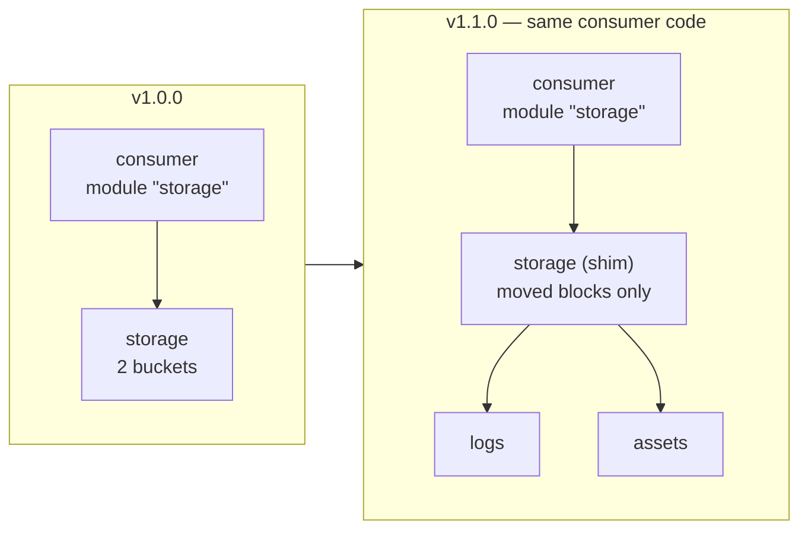

# Chapter 14 — Authoring modules

## Learning outcomes

By the end you can:

- Decide whether a grouping of resources should be a module at all, using two heuristics that catch opposite mistakes.
- Scope a module along the three axes that decide what belongs inside it, and say which two of them are blast-radius arguments.
- Design a module's interface as an API: which values become variables, which stay `locals`, and why a default can be a trap.
- Give a module's inputs and outputs type constraints, and say which of those constraints Terraform accepts and OpenTofu rejects.
- Lay a module out so the registry's tooling can read it, and name the file that decides whether a submodule is public.
- Explain why a reusable module must not contain a `provider` block, from the lifecycle reason rather than the meta-argument one.
- Compose modules by passing dependencies in rather than embedding them, and write a module that accepts either a resource or a data source.
- Write the `examples/` code before the module code, and say what that buys beyond testing.
- Evolve a published module's interface without breaking consumers, using `deprecated` to retire it and `moved` to re-shape it.
- Split a published module in two and leave existing consumers with an empty plan.

---

## 1. The problem: you have consumers now

Chapter 13 called a module from the outside. Everything in it was a decision about *someone else's* code: which version to pin, what the registry page promised, whether `init` would re-resolve the source. This chapter is the other side of that boundary, and the difference is not one of syntax. Nothing here is a new block type. What changes is that your configuration now has users, and a configuration with users is an API.

That reframing does most of the work. The moment somebody else calls your module, three things stop being free.

**Every input variable is a promise.** It has to keep working, keep meaning the same thing, and keep accepting the values it accepted last month. Removing one is a breaking change for every caller that set it.

**Every mistake is now multiplied.** A misconfigured bucket in a root module is one misconfigured bucket. The same mistake in a module used by nine teams is nine, and they arrive quietly, because each team believed the module had already made that decision correctly.

**Refactoring is no longer local.** Renaming a resource inside your own configuration is a two-minute job. Renaming a resource inside a published module rewrites every consumer's state, and Terraform's default reading of a changed address is *destroy the old thing and create a new one*.

Chapter 13's tutorial made the point in the other direction, and HashiCorp's [Build and use a local module](https://developer.hashicorp.com/terraform/tutorials/modules/module-create) tutorial states the authoring version of it plainly: *"we recommend that every Terraform configuration be created with the assumption that it may be used as a module, because doing so will help you design your configurations to be flexible, reusable, and composable."*

So this chapter is about the decisions that are cheap before you have consumers and expensive afterwards: whether to write the module, what goes in it, what its interface looks like, and how to change that interface later without breaking anybody.

!!! note "The running example"
    The lab builds a `hardened-bucket` module — an S3 bucket with versioning, ownership controls and public access blocked — then evolves its interface and finally splits it in two. It runs against the local emulator, so every plan and every warning in this chapter is something you can reproduce.

---

## 2. Should this be a module at all?

The first decision is whether to write one, and the honest answer is often no. HashiCorp's [Creating Modules](https://developer.hashicorp.com/terraform/language/modules/develop) page is unusually direct about it: *"In principle any combination of resources and other constructs can be factored out into a module, but over-using modules can make your overall Terraform configuration harder to understand and maintain, so we recommend moderation."*

That page also supplies the definition that makes "bad module" a meaningful phrase. Chapter 13 met two official definitions — a module is a set of configuration files in a directory (the mechanism), and a module is a collection of resources Terraform manages together (the unit). Here is the third:

> A module is a container for multiple resources that are used together. You can use modules to create lightweight abstractions, so that you can describe your infrastructure in terms of its architecture, rather than directly in terms of physical objects.

The first two definitions describe what a module *is*. Only this one describes what a module is *for*, and a purpose is the only thing you can fail.

### Two heuristics, opposite failure modes

Each of HashiCorp's two module-design documents supplies a one-line smell test, and they catch different errors.

**Not an abstraction.** From the same Creating Modules page: *"If you have trouble finding a name for your module that isn't the same as the main resource type inside it, that may be a sign that your module is not creating any new abstraction."* A module called `ec2-instance` that wraps one `aws_instance` and adds five variables has added a layer without adding a concept. Callers now have to learn your variable names *and* the resource's arguments.

**Too big.** From the [Module creation — recommended pattern](https://developer.hashicorp.com/terraform/tutorials/modules/pattern-module-creation) guide: *"If a module's function or purpose is hard to explain, the module is probably too complex."*

Hold both and the target sharpens: **a module should be nameable in a phrase that is neither a paragraph nor a resource type.** "Consul cluster on AWS" passes. "Bucket" fails one end; "our whole staging environment" fails the other.

!!! note "The heuristic is a smell detector, not a rule"
    `terraform-aws-modules/ec2-instance/aws` — the module Chapter 13 consumed — is named for the resource type it wraps, exactly what the naming test warns about. At v6.4.0 it also creates an IAM instance profile, a security group, an EIP and EBS volumes on demand, so it does add abstraction over the bare resource.

    Read a resource-shaped name as a prompt to check whether the module does anything the resource does not, rather than as a verdict.

### The three scoping axes

Once you have decided to write a module, the next question is which resources go in it. The recommended-pattern guide answers with three axes, and they are the most portable idea in HashiCorp's module material.

**Encapsulation — group infrastructure that is always deployed together.** The intuitive axis, and the guide is honest about its tension: *"Including more infrastructure in a module makes it easier for an end user to deploy that infrastructure but makes the module's purpose and requirements harder to understand."* Ease of consumption trades against comprehensibility.

**Privileges — restrict modules to privilege boundaries.** *"If infrastructure in the module is the responsibility of more than one group, using that module could accidentally violate segregation of duties."*

**Volatility — separate long-lived infrastructure from short-lived.** *"Database infrastructure is relatively static while teams could deploy application servers multiple times a day. Managing database infrastructure in the same module as application servers exposes infrastructure that stores state to unnecessary churn and risk."*

The first axis is about tidiness. The other two are about blast radius — who can break this, and how often is it touched — which is why they generalise past modules to state boundaries, the subject of Chapter 24.

*Terraform: Up & Running* arrives at the same place from a different direction, and more aggressively. Chapter 8 of that book states that *"large modules — modules that contain more than a few hundred lines of code or that deploy more than a few closely related pieces of infrastructure — should be considered harmful"*, and gives six reasons. Three are worth repeating because they are not the obvious ones: a large module is **insecure**, because changing anything in it requires permission to touch everything in it; it is **risky**, because a typo while editing a staging frontend can delete a production database; and it is **difficult to review**, because *"no one will notice that one little red line that means your database is being deleted"* in a several-thousand-line plan.

| Signal | What it suggests |
|---|---|
| Name matches the main resource type inside | No abstraction — use the resource directly |
| Purpose takes a paragraph to explain | Too big — split it |
| Two teams own different parts of it | Split on the privilege boundary |
| One part ships daily, another yearly | Split on the volatility boundary |
| `plan` takes minutes | Too big, measurably |

---

## 3. The interface is the module

A module's public surface is its input variables and its output values. Everything else — the resources, the locals, the file layout — is implementation you can change. That split is the whole reason modules are worth having, and it means interface design is the part worth slowing down for.

### Minimise inputs, maximise outputs

The recommended-pattern guide states a deliberate asymmetry, and it states it about a **module MVP**, borrowing the product term *minimum viable product*. That is the first version you ship to your early adopter, not a finished product. The guide sets the bar numerically: *"Always aim to deliver a module that works for at least 80% of use cases."* The other 20% is out of scope on purpose. Its framing for that is *"Modules, like any piece of code, are never complete"*, so shipping narrow is the first move rather than a compromise.

On inputs: *"The module should only expose the most commonly modified arguments as variables"*, *"Never code for edge cases in modules. An edge case is rare. A module should be a reusable block of code."*, and *"Avoid conditional expressions in an MVP. An MVP should have a narrow scope and should not do multiple things."*

On outputs, the opposite: *"Output as much information as possible from your module MVP even if you do not currently have a use for it. This will make your module more useful for end users who will often use multiple modules, using outputs from one module as inputs for the next."*

The asymmetry follows from what each one costs. An input is a promise you maintain, document, test and keep working across versions. An output is a value you have already computed, and exposing it is what lets your module compose with the next one.

!!! note "“Avoid conditional expressions in an MVP” is sequencing advice"
    It is not an argument against the `optional()` attributes and `dynamic` blocks of section 4. The MVP rule says do not build flexibility before a second real consumer has asked for it. Section 4's mechanism says that when one does ask, add it additively so the first consumer keeps working. Ship narrow, then grow — the two rules cover different halves of the same timeline.

!!! tip "A value your module's purpose fixes is not a variable"
    HashiCorp's local-module tutorial makes this concrete. Its module hosts a static website, so the bucket ACL must be `public-read` — and the tutorial deliberately does **not** expose the ACL as a variable. Making it configurable would let a caller produce a bucket that cannot do the one thing the module exists to do.

    *Terraform: Up & Running* Chapter 4 applies the same rule by example. Its `webserver-cluster` module exposes `cluster_name` and the remote-state coordinates, because the module is unusable twice in one account otherwise, and `instance_type`/`min_size`/`max_size`, because staging-versus-production cost is a real reason to vary them. Nothing else. That is minimise-inputs demonstrated rather than asserted.

### `locals` are the "no, you may not change this" mechanism

Chapter 6 introduced `locals` as a readability tool. Inside a module they do something stronger, and *Terraform: Up & Running* has the sharpest statement of it: *"You could extract values into input variables, but then users of your module will be able to (accidentally) override these values, which you might not want."*

A variable is not just a named value. **A variable is permission to change it.** A local is the same value with the permission withheld:

```hcl
locals {
  http_port    = 80
  any_port     = 0
  any_protocol = "-1"
  all_ips      = ["0.0.0.0/0"]
}
```

Those names are visible only inside the module, and no caller can reach them.

### Defaults decide required versus optional

The convention is mechanical: a variable with no `default` is a required argument; a variable with one is optional. That split *is* the module's contract, which makes choosing a default a design act rather than a convenience.

The recommended-pattern guide gives the test worth carrying:

> **Required inputs:** These variables should be a deliberate choice. The module will fail if they are not defined. Only set defaults for variables that should have them. For example `var.vpc_id` should never have a default because the value would be different every time you use the module.

**If the right value differs on every use, a default is a trap rather than a convenience.** A default `vpc_id` does not save the caller work; it silently deploys into the wrong network when they forget to set it. The lab's `name` variable has no default for exactly this reason — bucket names are globally unique, so no default can ever be right twice.

The same guide adds the counterpart for the other case: **advertise the default value** in your documentation, because an optional input whose default is invisible is one the caller cannot reason about.

### Outputs are the only way out

HashiCorp's local-module tutorial states this more strongly than anywhere else in the documentation: *"outputs are the only supported way for users to get information about resources configured by the module"*. There is no syntax for reaching into a child module's resources from outside it. If you did not export it, the caller cannot have it.

This is why "maximise outputs" is advice rather than clutter: an output you did not write is a value your consumer has to work around, usually by wrapping your module in something that re-derives it.

### Descriptions are the documentation

Every variable and output should carry a `description`. The [Standard Module Structure](https://developer.hashicorp.com/terraform/language/modules/develop/structure) page asks for *"one or two sentence descriptions that explain their purpose"*, and the reason is mechanical rather than stylistic: the registry builds the module's Inputs and Outputs tables from those `description` arguments.

!!! warning "Two HashiCorp pages disagree about README contents, and the reconciliation matters"
    The Standard Module Structure page says the README *"doesn't need to document inputs or outputs of the module because tooling will automatically generate this."* The recommended-pattern guide says to document required inputs, optional inputs and outputs in the README.

    Both want the same artifact by different routes. The registry generates those tables from your `description` arguments, so **writing good descriptions is documenting the interface**, and a hand-written table beside it is a copy that goes stale on the next variable you add.

    Read the guide as "your interface must be documented" and the structure page as "here is where that documentation comes from". If you want the tables in the README anyway, generate them — [`terraform-docs`](https://github.com/terraform-docs/terraform-docs) run from a `pre-commit` hook refreshes them on every commit, which is how the reference implementation [`terraform-aws-vpc`](https://github.com/terraform-aws-modules/terraform-aws-vpc) keeps its README honest.

---

## 4. Typing the interface

Chapter 12 covered type constraints and `optional()` as language features. Here they are interface-design tools, and two of the decisions are specific to module authoring.

### An object input is how an interface grows without breaking

HashiCorp's [Customize modules with object attributes](https://developer.hashicorp.com/terraform/tutorials/modules/module-object-attributes) tutorial gives the argument for object-typed inputs, and it is about versioning rather than tidiness: optional attributes *"make it easier for you to ship new module versions without changing the variables that module users need to define."*

The tutorial earns that claim with one refactor, and it is the shape every module that survives its first release eventually needs. The module provisions a public S3 static-website bucket and uploads a directory of local files into it. It starts with six flat variables, four of them about those files: `index_document_suffix`, `error_document_key`, `www_path` and `terraform_managed_files`. All four are deleted and replaced by one.

```hcl
variable "files" {
  description = "Configuration for website files."
  type = object({
    terraform_managed     = bool
    error_document_key    = optional(string, "error.html")
    index_document_suffix = optional(string, "index.html")
    www_path              = optional(string)
  })
}
```

Read the three tiers straight off that declaration. `terraform_managed` is not wrapped in `optional()`, so it is required, and because the variable itself has no `default` the whole `files` object is required too. `error_document_key` and `index_document_suffix` use `optional(type, default)`, so the module supplies the value when the caller omits it. Bare `optional(string)` on `www_path` means it arrives as `null`, which the module handles itself.

Now the versioning argument. Adding a new top-level variable is safe. Adding a new *required* one breaks every existing caller. Adding another `optional()` attribute to an object that already exists breaks nobody, because old callers keep sending exactly what they sent before and the new attribute arrives as its default. That makes the choice between four flat variables and one object a release-management decision rather than a matter of taste. The refactor itself costs nothing at apply time either: it changes the module's interface, not its resource addresses, so no resource is destroyed by it.

The payoff shows on the calling side, where one type accepts three quite different-looking calls:

```hcl
files = {
  terraform_managed = false
}
```

```hcl
files = {
  terraform_managed = true
  www_path          = "${path.root}/www"
}
```

```hcl
files = {
  terraform_managed     = true
  www_path              = "${path.root}/www"
  index_document_suffix = "main.html"
  error_document_key    = "error.html"
}
```

The minimum call is one attribute. Everything else is opt-in, and a caller who never needs `index_document_suffix` never learns that it exists.

!!! tip "`path.module` versus `path.root` is why `www_path` is worth exposing at all"
    Inside the module the fallback is `var.files.www_path != null ? var.files.www_path : "${path.module}/www"`, which resolves against the *module's own* directory and ships a placeholder page. The callers above pass `${path.root}/www`, which resolves against the *root configuration's* directory.

    The same variable therefore means a different directory depending on who sets it, and that is exactly the value a module cannot guess. Chapter 7 covers the full `path.*` set and why `path.module` is almost always the right one inside a module.

!!! tip "A qualifier baked into a variable name is a namespace you are hand-rolling"
    The refactor renames `terraform_managed_files` to `files.terraform_managed`. The `_files` suffix existed only because a flat namespace had nowhere else to say which group the variable belonged to. Once the object supplies the namespace, the suffix is noise.

    Read that as a smell, not a counting rule. The tell is a word inside a variable name whose only job is to mark membership of a group, and that word is the object you have not declared yet.

!!! danger "An object constraint discards undeclared attributes, silently"
    A caller who misspells an optional attribute gets no error. The object constraint drops the unknown key, `optional()` fills the declared attribute with `null` or its default, and `terraform validate` prints `Success!`. Chapter 12 measured this on 1.15.8.

    Run it against the `files` variable above. A caller who writes `wwwpath` instead of `www_path` has the unknown key dropped, `optional(string)` fills `www_path` with `null`, the `base_dir` ternary falls back to `${path.module}/www`, and the module deploys its own placeholder page instead of the caller's site. Nothing errors. Misspell the **required** `terraform_managed` and Terraform does reject the call by name, so it takes both halves to produce the footgun: the object constraint removes the attribute, and `optional()` removes the evidence.

    The same behaviour is a **feature** in section 7's conditional-creation pattern, where a deliberately partial object type is what lets one variable accept both a resource and a data source. Duck-typed inputs and typo detection are the same knob turned two ways, and you cannot have both. Know which one you are choosing.

    OpenTofu 1.12 emits `Warning: Object attribute is ignored` for module calls and Terraform emits nothing, so OpenTofu is slightly noisier for the pattern and slightly safer against the typo.

### A list of objects, and the resource it mirrors

The same tutorial then adds a second input in a different shape, for CORS rules:

```hcl
variable "cors_rules" {
  description = "List of CORS rules."
  type = list(object({
    allowed_headers = optional(set(string)),
    allowed_methods = set(string),
    allowed_origins = set(string),
    expose_headers  = optional(set(string)),
    max_age_seconds = optional(number)
  }))
  default = []
}
```

`default = []` makes the whole variable optional while every element that *is* supplied still has to carry `allowed_methods` and `allowed_origins`. Optionality at the variable level and requiredness at the element level are independent knobs, and this is the declaration that shows both at once.

Which attributes are required inside that object is not a free choice for the module author. It is copied from the resource the module wraps, and the tutorial says so outright: *"This matches the behavior of the `aws_s3_bucket_cors_configuration` resource you will use to configure CORS."* **Mirror the wrapped resource's own split**, because a module input that disagrees with the resource beneath it either rejects configurations the provider would have accepted or defers the error to apply.

The consumption side is where the optionality pays for itself:

```hcl
resource "aws_s3_bucket_cors_configuration" "web" {
  count = length(var.cors_rules) > 0 ? 1 : 0

  bucket = aws_s3_bucket.web.id

  dynamic "cors_rule" {
    for_each = var.cors_rules

    content {
      allowed_headers = cors_rule.value["allowed_headers"]
      allowed_methods = cors_rule.value["allowed_methods"]
      allowed_origins = cors_rule.value["allowed_origins"]
      expose_headers  = cors_rule.value["expose_headers"]
      max_age_seconds = cors_rule.value["max_age_seconds"]
    }
  }
}
```

Every attribute is assigned unconditionally, optional ones included, and the tutorial gives the reason: *"Since optional object attributes default to `null`, Terraform will not set values for them unless the module user specifies them."* A `null` argument is an unset argument. `optional()` plus unconditional assignment therefore replaces the five conditionals this block would otherwise need, which is the single most useful consequence of typed nulls for a module author.

Two mechanisms are stacked in that resource and they are worth keeping apart. `count` is a zero-or-one guard, because a CORS configuration with no rules is not the same thing as no CORS configuration at all. `dynamic` iterates *blocks* inside the one resource, not resources. Chapter 12 covers both.

### Typed outputs, and the engine that rejects them

Terraform **1.15** added `type` to the `output` block. For a module author the case is straightforward: a typed output is a checked promise, and a consumer can read your interface without reading your implementation.

```hcl
output "versioning_enabled" {
  description = "Whether object versioning is on. A guarantee the caller may rely on."
  type        = bool
  value       = aws_s3_bucket_versioning.this.versioning_configuration[0].status == "Enabled"
}
```

!!! info "OpenTofu — `type` on an output is a hard error, not a soft difference"
    Measured on **OpenTofu 1.12.5** against the lab's module, three outputs, three errors:

    ```
    Error: Unsupported argument

      on ../../modules/hardened-bucket/outputs.tf line 3, in output "name":
       3:   type        = string

    An argument named "type" is not expected here.
    ```

    This fails at `validate`, before anything is planned. A module that must work on both engines cannot use typed outputs at all — not "loses the checking", but does not load. The lab's Part A uses them deliberately so you can see the failure; drop the three `type` lines and the same module validates on both.

---

## 5. Structure the registry can read

The [Standard Module Structure](https://developer.hashicorp.com/terraform/language/modules/develop/structure) page opens with the reason it is a convention rather than a preference: *"Terraform tooling is built to understand the standard module structure and use that structure to generate documentation, index modules for the module registry, and more."*

It is machine-readable. That is also why the public registry's publishing bar includes adherence to it.

```text
minimal-module/
├── README.md
├── main.tf
├── variables.tf
├── outputs.tf
```

```text
complete-module/
├── README.md
├── main.tf
├── variables.tf
├── outputs.tf
├── modules/
│   ├── nested-a/
│   │   ├── README.md
│   │   ├── main.tf
│   │   ├── variables.tf
│   │   ├── outputs.tf
│   └── nested-b/
├── examples/
│   ├── basic/
│   │   └── main.tf
│   └── with-logging/
```

Everything except the root module is optional. The four rules below are the ones you cannot guess from the tree.

**Resources may be split across files; `module` blocks may not.** *"For a complex module, resource creation may be split into multiple files but any nested module calls should be in the main file."* A reader should be able to see the module's whole composition in one place.

**A submodule's `README.md` is its public/private marker.** *"Any nested module with a `README.md` is considered usable by an external user. If a README doesn't exist, it is considered for internal use only."* These are *"purely advisory"* — nothing stops a consumer sourcing `./modules/whatever` regardless — which produces an odd incentive: a submodule you consider private stays private by staying undocumented, and one you accidentally give a README to has been published.

**The two source-address rules point in opposite directions.** A root module calling its own nested module uses a **relative** path, *"so that Terraform will consider them to be part of the same repository or package, rather than downloading them again separately."* A `module` block inside `examples/` uses **the address an external caller would use**, because *"examples will often be copied into other repositories for customization."*

The distinguishing question is who the caller will be after the code moves. Nested calls never leave the package. Examples are expected to leave.

**`LICENSE` matters more than it looks.** *"Many organizations will not adopt a module unless a clear license is present. We recommend always having a license file, even if it is not an open source license."* Note that the page's own `minimal-module/` tree omits it while the prose insists on it; take the prose.

**Three things never belong in a module repository.** `terraform.tfstate` and its backup are state, not configuration. `.terraform/` is the providers and modules installed for one particular working directory. And `*.tfvars` files have no meaning for a module at all, because a module's inputs arrive as `module` block arguments — the only reason to keep one is if the directory doubles as a standalone root configuration. HashiCorp's local-module tutorial attaches a warning to all three: they *"will often include secret information such as passwords or access keys, which will become public if those files are committed to a public version control system."* Ship a `.gitignore` with the module.

!!! tip "Use commit-specific absolute URLs in a module README"
    The registry renders your README **outside** the repository, so a relative link resolves to nothing there. Worse, a branch-relative absolute URL silently describes a *different version* of the module than the one the reader is looking at. The page's instruction is to use a commit-specific absolute URL for anything you link to or embed.

    This is the same mutable-reference problem as a Git `?ref=<tag>` module source from Chapter 13, one layer up in the documentation.

**Examples for submodules go in the root `examples/` directory**, not beside the submodule. One place to look, whatever the example demonstrates.

!!! note "Nesting is two different trades wearing one name"
    A module you call can be an **external child module**, versioned and distributed separately, or an **embedded submodule** shipped inside your own package. The recommended-pattern guide names the cost of each, and they are opposites.

    An external child module *"can change behavior with no changes to the parent's calling code or version, thereby breaking the calling code's trust"* — an unpinned transitive dependency, which is Chapter 13's no-lock-file-for-modules hazard one level deeper: your caller pins your module, but nothing they can see pins what you call. An embedded submodule is released and tested with its parent so incompatibilities surface immediately, at the cost that it *"cannot be invoked by another module outside of the source tree"*, so reuse turns into duplication.

    Shared-and-drifting versus duplicated-and-locked-together. Pick knowingly.

!!! note "The root module is expected to be opinionated"
    *"This should be the primary entrypoint for the module and is expected to be opinionated… we expect that advanced users will use specific nested modules to more carefully control what they want."*

    That is a two-tier design stated in passing, and it is the structural answer to the MVP rule about serving 80% of use cases. The root takes the opinionated happy path; the other 20% assemble your nested modules themselves rather than forcing more options into the root's variable surface. It is also why nested modules should be *"composable by the caller, rather than calling directly to each other and creating a deeply-nested tree."*

---

## 6. Providers belong to the root, and the reason is not the one you have read

The rule is short. From [Providers Within Modules](https://developer.hashicorp.com/terraform/language/modules/develop/providers): *"A module intended to be called by one or more other modules must not contain any provider blocks."* Provider configurations *"can be defined only in a root Terraform module."*

Almost every tutorial explains this by pointing at `count`, `for_each` and `depends_on`, which a module carrying a nested provider configuration cannot use. That is the *enforcement*, added in v0.13, and it is not the reason.

The reason is a lifecycle one:

> because a provider configuration is required to destroy the remote object associated with a resource instance as well as to create or update it, a provider configuration must always stay present in the overall Terraform configuration for longer than all of the resources it manages.

!!! danger "A provider configuration must outlive every resource it manages"
    Terraform records in state which provider configuration most recently applied each resource, and that record is what locates the provider once the `resource` block itself is gone from the configuration. A module holding both its resources and their `provider` block breaks the constraint: deleting the `module` block removes the two simultaneously, leaving state entries pointing at a configuration that no longer exists, and planning errors until you put it back.

    Recovery order is: reintroduce the provider configuration, destroy the resources, then remove both.

    This generalises past modules. Never delete a `provider` block while anything in state still references it.

The mechanical enforcement is still worth being able to recognise, because it is the error you will actually hit:

```text
Error: Module does not support count

  on main.tf line 15, in module "child":
  15:   count = 2

Module "child" cannot be used with count because it contains a nested provider
configuration for "aws", at child/main.tf:2,10-15.

This module can be made compatible with count by changing it to receive all of
its provider configurations from the calling module, by using the "providers"
argument in the calling module block.
```

The legacy pattern still works for a `module` block that uses none of `count`, `for_each` or `depends_on` — which is why an old module can sit in a codebase for years and only break on the day somebody adds `for_each` to its call.

### What is inherited and what is not

| Thing | Inherited by a child module? |
|---|---|
| Default (unaliased) provider configuration | **Yes**, automatically |
| Aliased provider configuration | **Never** — pass it with the `providers` map |
| `source` and `version` requirements | **Never** — each module declares its own |

The third row is the one people get wrong. A child module that declares no `required_providers` still *works*, because the configuration it needs was inherited. What it loses is the **source address**, and for a non-HashiCorp provider Terraform then falls back to assuming `hashicorp/<name>` and either fails to find it or resolves a different provider with the same short name. The page is explicit that this is *"especially important for non-HashiCorp providers."*

So a module declares `required_providers` and omits `provider`. The lab's module does exactly that.

### Constrain the minimum only

> If you are writing a shared Terraform module, constrain only the minimum required provider version using a `>=` constraint.

The reasoning is that a ceiling in your module becomes a ceiling for the caller's whole configuration. A shared module sets a floor; a root module sets a floor and a ceiling. That is the reverse of the advice Chapter 13 gave for consuming modules, and both are right — which side of the call you are on decides.

### `configuration_aliases`, for a module that needs two of something

A module that spans two regions or two accounts declares the configuration *names* it expects to receive:

```hcl
terraform {
  required_providers {
    aws = {
      source                = "hashicorp/aws"
      version               = ">= 5.0"
      configuration_aliases = [aws.src, aws.dst]
    }
  }
}
```

and the caller maps its own configurations onto them:

```hcl
module "tunnel" {
  source = "./modules/tunnel"

  providers = {
    aws.src = aws.usw1
    aws.dst = aws.usw2
  }
}
```

The keys are the names the child expects; the values are configurations in the calling module.

!!! warning "One `module` block is one provider set, however many instances it has"
    *"Since the association between resources and provider configurations is static, module calls using `for_each` or `count` cannot pass different provider configurations to different instances."*

    So multi-region fan-out is one `module` block per region, by design rather than by omission. Two escapes exist and neither is the ordinary CLI: OpenTofu 1.9+ iterates provider configurations with `for_each`, and Terraform allows `for_each` on `provider` blocks only inside a Stack configuration (Chapter 27).

!!! info "OpenTofu — the no-code exception is not an exception"
    HCP Terraform's no-code modules *do* declare their own `provider` blocks, which looks like a violation of the rule above. It is not. The rule is about **position in the tree**, and HCP launches a no-code module *as* the root module of a generated workspace — a module nobody calls with a `module` block is a root module.

    HashiCorp's [Create and use no-code modules](https://developer.hashicorp.com/terraform/tutorials/modules/no-code-provisioning) tutorial states the reason the prohibition exists at all more clearly than the reference page does: *"Since users will not reference no-code modules in written configuration, there is no risk of this conflict."* The same page **tightens** the structure rule rather than relaxing it — *"No-code modules must follow standard module structure and define all resources in the root repository of the directory"* — and it is covered in Chapter 31.

---

## 7. Composition: pass dependencies in, do not embed them

[Best practices for composing modules](https://developer.hashicorp.com/terraform/language/modules/develop/composition) is the design reference for this chapter, and it is stricter than the guidance around it. Where the recommended-pattern guide says do not nest more than two deep, this page says:

> in most cases we strongly recommend keeping the module tree flat, with only one level of child modules, and use a technique similar to the above of using expressions to describe the relationships between the modules

```hcl
module "network" {
  source = "./modules/aws-network"

  base_cidr_block = "10.0.0.0/8"
}

module "consul_cluster" {
  source = "./modules/aws-consul-cluster"

  vpc_id     = module.network.vpc_id
  subnet_ids = module.network.subnet_ids
}
```

> Instead of a module embedding its dependencies, creating and managing its own copy, the module receives its dependencies from the root module, which can therefore connect the same modules in different ways to produce different results.

The refactoring payoff is the part worth keeping: the `consul_cluster` module *"doesn't know or care how those identifiers are obtained"*, so the same module accepts `module.network.vpc_id` today and `data.aws_vpc.main.id` after the network moves into its own configuration. No change to the module.

### Conditional creation: pass the object, do not detect it

The situation is common. Some environments already have the thing; others need it created.

> Rather than trying to write a module that itself tries to detect whether something exists and create it if not, we recommend applying the dependency inversion approach: making the module accept the object it needs as an argument, via an input variable.

```hcl
variable "ami" {
  type = object({
    # Declare only the subset of attributes the module needs. Terraform will
    # allow any object that has at least these attributes.
    id           = string
    architecture = string
  })
}
```

The caller then decides, and a `resource` or a `data` source satisfies the same variable:

```hcl
module "example" {
  source = "./modules/example"
  ami    = aws_ami_copy.example      # we manage it
}
```

```hcl
module "example" {
  source = "./modules/example"
  ami    = data.aws_ami.example      # it already exists
}
```

This is the deliberate use of the discard behaviour flagged as a footgun in section 4. Declaring only `id` and `architecture` gives structural typing: anything shaped enough to be an AMI passes. The mechanism is worth stating outright, because it is the only thing making one variable accept both branches.

A resource address written without an attribute is an object value. `aws_ami_copy.example` evaluates to an object whose attributes are that resource's schema attributes, and `data.aws_ami.example` does the same for the data source. The Type Constraints page names this case directly: `object({ id=string, cidr_block=string })` matches an `aws_vpc` reference, with the extra attributes discarded.

The variable's declared type is therefore a conversion target, not a shape the caller has to match exactly. Conversion succeeds when every attribute the *target* declares is present and convertible, and everything the target does not declare is dropped. A resource and a data source that both carry `id` and `architecture` converge on the same two-attribute object, which is what *"Terraform will allow any object that has at least these attributes"* means in practice.

Two consequences follow, both measured on **1.15.8**. The first is that the conversion has already happened by the time the module runs, so `var.ami` really does have two attributes and nothing else. Pass an object carrying `arn` and then read it inside the module:

```text
Error: Unsupported attribute

  on mod\main.tf line 13, in output "undeclared":
  13:   value = var.ami.arn
    ├────────────────
    │ var.ami is a object

This object does not have an attribute named "arn".
```

The caller supplied it. The type constraint removed it. Declare what the module needs and you do not get the rest back.

The second is that a *missing* attribute fails loudly, which is the opposite of the silent typo in section 4:

```text
Error: Invalid value for input variable

The given value is not suitable for module.example.var.ami declared at
mod\main.tf:1,1-15: attribute "architecture" is required.
```

The asymmetry is the useful part. Extra attributes are discarded in silence; absent required ones are named and rejected at the module call. That also makes adding a third required attribute to this type a breaking change for every caller whose object lacks it, so grow it with `optional()` exactly as section 4 does.

### Prefer separate resources to inline blocks

Some provider resources let you express the same thing two ways: an inline block inside the parent resource, or a separate resource that points back at it. `aws_security_group` with inline `ingress` blocks, or `aws_security_group` plus separate rule resources. *Terraform: Up & Running* Chapter 4 is blunt about the choice:

> If you try to use a mix of both inline blocks and separate resources … you will get errors where the configurations conflict and overwrite one another. Therefore, you must use one or the other. Here's my advice: when creating a module, you should always prefer using separate resources.

The reason is extensibility rather than correctness:

> The advantage of using separate resources is that they can be added anywhere, whereas an inline block can only be added within the module that creates a resource. So using solely separate resources makes your module more flexible and configurable.

Export the security group's id as an output and a caller can open an extra port for a load test without your module knowing the port exists. Had you written even one rule as an inline block, that would be impossible — the caller would have to fork the module or ask you for a variable.

!!! warning "The principle holds; the resource in the book's example does not"
    The AWS provider now documents a **third** shape and steers away from both of the book's options: *"use the current best practice of the `aws_vpc_security_group_egress_rule` and `aws_vpc_security_group_ingress_rule` resources with one CIDR block per rule"*, and warns against mixing those with either inline rules **or** the older `aws_security_group_rule`. Verified at provider v6.54.0.

    Substitute the current resources and the caller-extends-the-module trick works identically. Inline blocks are still supported, not deprecated.

### Assumptions and guarantees

The page names the two directions of a module's contract, and the names are worth adopting.

> **Assumption:** A condition that must be true in order for the configuration of a particular resource to be usable.
>
> **Guarantee:** A characteristic or behavior of an object that the rest of the configuration should be able to rely on.

An assumption belongs on an input, as a `validation` block. A guarantee belongs on an **output**, as a `precondition` — the module asserting something about what it hands back:

```hcl
output "api_base_url" {
  value = "https://${aws_instance.example.private_dns}:8433/"

  precondition {
    condition     = data.aws_ebs_volume.example.encrypted
    error_message = "The server's root volume is not encrypted."
  }
}
```

Note the pairing with type constraints: **an `object(...)` variable enforces shape, a `validation` block enforces content.** The `ami` variable above guarantees `architecture` exists; only a validation can require it to be `x86_64`. The full check surface is Chapter 19.

### Data-only modules, and the swap trick

A module may contain no resources at all — only data sources — provided it still raises the level of abstraction, *"in this case by encapsulating exactly how the data is retrieved."* The information might come from the AWS API, from Consul, or from another configuration's state, and *"the source of this information can change over time without updating every configuration that depends on it."*

Then the idea worth stealing:

> if you design your data-only module with a similar set of outputs as a corresponding management module, you can swap between the two relatively easily when refactoring.

A `join-network` module and a `create-network` module with matching outputs are interchangeable, so promoting an environment from "shares the shared network" to "owns its network" becomes a one-line `source` change. That is the most useful idea on the page for Chapter 24, and neither module tutorial mentions it.

### Multi-cloud abstractions are yours to build

> Terraform itself intentionally does not attempt to abstract over similar services offered by different vendors, because we want to expose the full functionality in each offering and yet unifying multiple offerings behind a single interface will tend to require a "lowest common denominator" approach.

The offered alternative is to make that trade deliberately, where vendors implement a shared concept: an agreed object type on the input side, a shared output name on the output side. **The abstraction is the agreed input/output type, not the module** — several Kubernetes cluster modules that differ entirely inside but all export `hostname` are interchangeable to everything downstream.

Which is also the limit of "mirror the wrapped resource's schema" from section 4: an interface meant to span vendors must deliberately *not* mirror any one of them.

---

## 8. Write the example first

A reusable module is not a root module. It has no `provider` block and usually has required inputs, so you cannot apply it directly. The standard answer is an `examples/` directory, and *Terraform: Up & Running* Chapter 8 argues that one small example does three jobs at once: a manual test harness you apply and destroy while developing, an automated test harness, and executable documentation a teammate can read *and* run.

Then it states the rule as a rule:

> Every Terraform module you have in the `modules` folder should have a corresponding example in the `examples` folder. And every example in the `examples` folder should have a corresponding test in the `test` folder.

And the practice worth adopting immediately:

> A great practice to follow when developing a new module is to write the example code first, before you write even a line of module code.

The reason is design, not testing. Start with the implementation and you surface with an API nobody wants; start with the example and you are writing the caller's experience first, then working backwards to satisfy it. It is the infrastructure form of test-driven development, and it is the single cheapest habit in this chapter.

!!! tip "A test is the second caller your module ever has"
    The first caller is your example. The second is the test, and second callers are what expose an interface that only works once — a hardcoded name, an output nobody can consume, a variable whose default is only right in your account.

    The native `terraform test` framework (Terraform 1.6+, `.tftest.hcl`) is what makes the "every example gets a test" half of that rule executable, and it is Chapter 19.

!!! warning "A module using `deprecated` outputs cannot be validated on its own"
    Measured on Terraform 1.15.8. Running `terraform validate` **inside** the lab's module directory, rather than through a caller, is an error rather than a warning:

    ```
    Error: Root module output deprecated

      on outputs.tf line 17, in output "bucket_id":
      17:   deprecated  = "Use the name output instead. This output is removed in v2.0.0."

    Root module outputs cannot be deprecated, as there is no higher-level module
    to inform of the deprecation.
    ```

    Terraform is right — a deprecation warning is addressed to a caller, and validating the module standalone means there is no caller to address. The practical consequence is that once you deprecate an output, `examples/` stops being merely good practice and becomes **the only way to validate your own module**. One more reason the example comes first.

---

## 9. Evolving an interface without breaking consumers

Everything so far assumes you are designing the interface. This section is about changing one that already has users, and Terraform gives you two mechanisms that solve two different halves of the problem.

**`deprecated` retires interface surface.** **`moved` re-shapes the structure behind it.** Together they are the whole toolkit.

### `deprecated`, for retiring a variable or an output

Terraform **1.15** added a `deprecated` argument to `variable` and `output` blocks. Set it to a message, and callers get a warning:

```hcl
variable "versioning" {
  description = "Whether to keep previous versions of every object."
  type        = bool
  default     = null
  deprecated  = "Set retention = { versioned = ... } instead. This variable is removed in v2.0.0."
}
```

The module keeps honouring the old variable while the message tells consumers what to do instead. That is what turns a breaking change into a migration: deprecate, warn, then remove in the next major version.

Measured on **Terraform 1.15.8**, from a caller that sets the deprecated variable and reads a deprecated output:

```text
Warning: Deprecated variable got a value

  on main.tf line 22, in module "logs":
  22:   versioning = true

Set retention = { versioned = ... } instead. This variable is removed in
v2.0.0.

Warning: Deprecated value used

  on main.tf line 26, in output "bucket_id":
  26:   value = module.logs.bucket_id

  The deprecation originates from module.logs.bucket_id

Success! The configuration is valid, but there were some validation warnings
as shown above.
```

Three properties to hold. The warning reaches the **consumer**, not the module that declares the deprecation. It fires at `validate`, so it costs nothing to surface in CI. And a consumer who is not ready can suppress nested warnings with `ignore_nested_deprecations` on the `module` block.

!!! info "OpenTofu — it had this first, and the wording and timing differ"
    OpenTofu shipped variable and output deprecation in **1.10** as experimental and made it stable in **1.11** — ahead of Terraform 1.15, not behind it.

    Measured on **OpenTofu 1.12.5** against the identical configuration. The messages differ:

    ```text
    Warning: Variable marked as deprecated by the module author
    ...
    Warning: Value derived from a deprecated source
    ...
    This value is derived from module.m.value, which is deprecated with the
    following message:
    ```

    And the **timing** differs for outputs. At `validate`, Terraform emitted two warnings and OpenTofu emitted one — the variable only. Both engines emitted both warnings at `plan`. Repeated twice with identical counts.

    So a cross-engine CI gate that runs only `tofu validate` will not see a deprecated *output* being used. Run `plan` if you want that signal on OpenTofu.

### `moved`, for re-shaping what is behind the interface

Renaming a resource inside your module is, to Terraform, an instruction to destroy the old object and create a new one. The [Refactor modules](https://developer.hashicorp.com/terraform/language/modules/develop/refactoring) page is the reference, and Chapter 25 covers the full mechanism. Two of its rules belong to authoring.

**Scoping is what makes refactoring an author's privilege.** Addresses in a `moved` block resolve relative to the module the block is written in, and *"a module may only make `moved` statements about its own objects and objects of its child modules."* So you can rename and re-shape internals across a version bump, ship the `moved` blocks with the module, and every consumer picks up the migration in their next plan without touching their own code. You can reach **down**, never up or sideways.

**The blocks are the upgrade path, not a courtesy changelog.** Chain them when the same object moves twice:

```hcl
moved {
  from = aws_s3_bucket.old
  to   = aws_s3_bucket.middle
}

moved {
  from = aws_s3_bucket.middle
  to   = aws_s3_bucket.current
}
```

Each block covers consumers arriving from a different starting version, which is why a published module's `moved` blocks accumulate the way database migrations do. Removal is safe only for a **private** module, once you are certain every consumer has applied.

### Splitting a published module: the shim

The hardest version of the problem is splitting one module into two without breaking anybody. The answer is that the original module is **not deleted**. It becomes a shim that calls the new modules and carries the `moved` blocks:



New consumers take `logs` and `assets` directly. Existing consumers upgrade the version they already reference and get an empty plan.

HashiCorp names the compromise rather than hiding it. The shim's blocks address resources *inside* child modules, which *"violates the typical rule that a parent module sees its child module as a 'closed box'"*, and the page attaches a precondition: *"all three of these modules are maintained by the same people and distributed together in a single module package."* That licence covers your own package and never someone else's module.

Part C of the lab measures both halves of this.

!!! note "The consumer's half of the same event"
    When a module author does **not** ship `moved` blocks, the cost lands on the consumer, who has to write `import` blocks against addresses inside your module to adopt the resources your new version created. HashiCorp's own validated pattern for upgrading modules states the acceptance criterion for that work: *"Imports are the only acceptable change to see in a speculative plan when upgrading to a newer module version."*

    Shipping `moved` blocks is what spares your consumers that. Chapter 25 covers it from their side.

---

## 10. Publishing, briefly

Getting a module into a registry is Chapter 21's subject, but two facts belong in an author's head while they are still writing code, because both are decided in the repository rather than in HCL.

**Your repository name is your module's identity.** The public registry requires `terraform-<PROVIDER>-<NAME>`, where `<PROVIDER>` is the provider that creates the infrastructure and `<NAME>` is the infrastructure type. Get this wrong and you cannot publish without renaming the repository.

**Your Git tags are your version numbers.** Semantic versioning, `x.y.z`, optionally prefixed `v`. Tags that do not match are ignored, and at least one is required to publish at all. So cutting a release is `git tag v1.4.0 && git push --tags`, and versioning is a release-process decision rather than an argument you write anywhere.

The registry's full bar is short: a public GitHub repository with that name, adherence to the standard module structure so the registry can generate documentation and parse submodules and examples, and at least one semver release tag.

!!! warning "The publishing requirements are not on the page called Publish modules"
    The Configuration Language sidebar has a **Publish modules** entry, and it contains none of the rules above — no naming rule, no tag rule, no structure requirement. Those live under the separate **Registry Publishing** section. A reader following the sidebar will not find them.

    What that page does supply is the cleanest one-line case for publishing at all: *"The alternative sources do not support the first-class versioning mechanism."* A registry module takes `version = "1.4.0"` as a real argument; a Git source forces a choice between a movable tag and a SHA that no update bot will bump for you.

    It also notes that a module distributed by Git should still follow the standard structure *"or be published on the registry at a later time"* — structure as a migration path, not just tidiness.

!!! note "Two smaller publishing facts worth knowing now"
    HCP Terraform's private registry offers a **branch-based** publishing workflow alongside the tag-based one, and it is the only workflow that supports **module testing** — which makes it the one to choose once `terraform test` is part of how you ship. And the public registry **hosts, it does not vet**: partner and community modules sit side by side, *"accessible to practitioners who can decide which modules best fit their requirements."* Curation is the consumer's job, which is what Chapter 13's review checklist was for.

---

## 🧪 Lab: author a module, evolve it, then split it

Three parts. Part A writes the example before the module and measures what each engine accepts. Part B evolves the interface with `deprecated` and measures who sees the warnings. Part C splits the module in two and proves the consumer's plan stays empty.

Start the emulator:

```shell
docker compose -f labs/docker-compose.yml up -d      # start the emulator on :4566
curl -s http://localhost:4566/_floci/health          # wait until the services read "running"
```

Set the lab environment once per shell:

```shell
source "$(git rev-parse --show-toplevel)/labs/lab-env.sh"
```

The configurations are committed at `labs/chapter14/`. Every part runs from the **example** directory, because a reusable module cannot be applied directly:

```shell
cd labs/chapter14/lab1
tflocal -chdir=examples/basic init
```

!!! note "Why `-chdir` instead of `cd examples/basic`"
    Both work when you run Terraform on the host. The `-chdir` form is here because it also works when you run Terraform in a container — the module lives one directory *above* the example, so the mount has to cover the lab root. If your machine needs the container route, `labs/README.md` has it, and the numbers below were produced that way.

### Part A — the example first, then the module

Open `lab1/examples/basic/main.tf` before you open the module. That is the order the files were written in, and it is the order to read them in: the example is the interface you wish you had, and the module is what satisfies it.

```hcl
module "logs" {
  source = "../../modules/hardened-bucket"

  name = "ch14-lab1-logs"

  tags = {
    Purpose = "book-lab"
  }
}
```

One required argument, no ACL knob, no versioning knob — versioning defaults to on because a bucket called *hardened* that keeps no history would be lying. Now apply it:

```shell
tflocal -chdir=examples/basic apply
```

```text
module.logs.aws_s3_bucket.this: Creation complete after 0s [id=ch14-lab1-logs]
module.logs.aws_s3_bucket_public_access_block.this: Creation complete after 0s [id=ch14-lab1-logs]
module.logs.aws_s3_bucket_ownership_controls.this: Creation complete after 0s [id=ch14-lab1-logs]
module.logs.aws_s3_bucket_versioning.this: Creation complete after 1s [id=ch14-lab1-logs]

Apply complete! Resources: 4 added, 0 changed, 0 destroyed.

Outputs:

bucket_arn = "arn:aws:s3:::ch14-lab1-logs"
bucket_name = "ch14-lab1-logs"
versioning_enabled = true
```

Four resources behind one `name`. That is the abstraction the module is selling, and it is why it passes the naming test: a caller who used `aws_s3_bucket` directly would have to know about the other three.

Now the engine difference. The module's outputs carry `type` constraints, which Terraform 1.15 accepts:

```hcl
output "versioning_enabled" {
  description = "Whether object versioning is on. A guarantee the caller may rely on."
  type        = bool
  value       = aws_s3_bucket_versioning.this.versioning_configuration[0].status == "Enabled"
}
```

Run the same configuration under OpenTofu 1.12.5 and it does not load:

```text
Error: Unsupported argument

  on ../../modules/hardened-bucket/outputs.tf line 3, in output "name":
   3:   type        = string

An argument named "type" is not expected here.
```

Three outputs, three errors, at `validate`. Delete the three `type` lines and the module validates on both engines. **A module intended for both cannot use typed outputs.**

```shell
tflocal -chdir=examples/basic destroy
```

### Part B — evolve the interface without breaking the caller

`lab2` is the same module one version later. The flat `versioning` boolean has been replaced by a `retention` object, and the old variable is kept and deprecated:

```hcl
variable "retention" {
  description = "How long object history is kept."
  type = object({
    versioned       = optional(bool, true)
    noncurrent_days = optional(number)
  })
  default = {}
}

variable "versioning" {
  description = "Whether to keep previous versions of every object."
  type        = bool
  default     = null
  deprecated  = "Set retention = { versioned = ... } instead. This variable is removed in v2.0.0."
}
```

The module honours whichever the caller used, so nobody is forced to migrate on this version:

```hcl
locals {
  versioned = var.versioning != null ? var.versioning : var.retention.versioned
}
```

The example still calls the module the old way, on purpose. Validate it:

```shell
tflocal -chdir=examples/basic init
tflocal -chdir=examples/basic validate
```

```text
Warning: Deprecated variable got a value

  on main.tf line 22, in module "logs":
  22:   versioning = true

Set retention = { versioned = ... } instead. This variable is removed in
v2.0.0.

Warning: Deprecated value used

  on main.tf line 26, in output "bucket_id":
  26:   value = module.logs.bucket_id

  The deprecation originates from module.logs.bucket_id

Use the name output instead. This output is removed in v2.0.0.
Success! The configuration is valid, but there were some validation warnings
as shown above.
```

Two warnings, no errors, and the configuration still works. That is the entire point of the mechanism.

Now try to validate the module **by itself**, the way you might in a module repository's CI:

```shell
tflocal -chdir=modules/hardened-bucket init -backend=false
tflocal -chdir=modules/hardened-bucket validate
```

```text
Error: Root module output deprecated

  on outputs.tf line 17, in output "bucket_id":
  17:   deprecated  = "Use the name output instead. This output is removed in v2.0.0."

Root module outputs cannot be deprecated, as there is no higher-level module
to inform of the deprecation.
```

An error, not a warning. Once your module deprecates an output, `examples/` is the only place it can be validated — which is section 8's argument arriving as a hard constraint rather than a recommendation.

!!! info "OpenTofu — one warning at `validate`, two at `plan`"
    Running the same lab under OpenTofu 1.12.5, `tofu validate` reported **one** warning where Terraform reported two: the deprecated variable, not the deprecated output. Both engines reported both at `plan`. Counts repeated across two runs each.

    The wording differs too — `Variable marked as deprecated by the module author` and `Value derived from a deprecated source`. If you grep CI logs for Terraform's exact strings, they will not match.

### Part C — split the module, keep the plan empty

`lab3` starts as one `storage` module holding two buckets, applied and in state:

```shell
cd ../lab3
tflocal -chdir=examples/basic init
tflocal -chdir=examples/basic apply
```

```text
Apply complete! Resources: 2 added, 0 changed, 0 destroyed.
```

Now the split. `modules/logs` and `modules/assets` each own one bucket, and `modules/storage` becomes a shim that calls both. **The consumer's code does not change at all** — `examples/basic/main.tf` still calls `module "storage"` with the same `prefix`.

Plan it *before* adding any `moved` blocks:

```text
  # module.storage.aws_s3_bucket.assets will be destroyed
  # (because aws_s3_bucket.assets is not in configuration)
  # module.storage.aws_s3_bucket.logs will be destroyed
  # (because aws_s3_bucket.logs is not in configuration)
  # module.storage.module.assets.aws_s3_bucket.this will be created
  # module.storage.module.logs.aws_s3_bucket.this will be created

Plan: 2 to add, 0 to change, 2 to destroy.
```

Two buckets destroyed and two created, from a refactor the consumer did not ask for and cannot see. Note the reason line — *"because aws_s3_bucket.assets is not in configuration"* — which is Terraform telling you it has lost track of an identity, not that anything about the bucket changed.

Now add the shim's `moved` blocks, which is the whole of its job:

```hcl
moved {
  from = aws_s3_bucket.logs
  to   = module.logs.aws_s3_bucket.this
}

moved {
  from = aws_s3_bucket.assets
  to   = module.assets.aws_s3_bucket.this
}
```

Re-plan:

```text
  # module.storage.aws_s3_bucket.assets has moved to module.storage.module.assets.aws_s3_bucket.this
  # module.storage.aws_s3_bucket.logs has moved to module.storage.module.logs.aws_s3_bucket.this

Plan: 0 to add, 0 to change, 0 to destroy.
```

`has moved to`, no action symbol, nothing destroyed. Apply it and the state addresses change with no API calls at all:

```text
Apply complete! Resources: 0 added, 0 changed, 0 destroyed.
```

```shell
tflocal -chdir=examples/basic state list
```

```text
module.storage.module.assets.aws_s3_bucket.this
module.storage.module.logs.aws_s3_bucket.this
```

Read the addresses in those `moved` blocks once more. They are written in `modules/storage`, and they name `module.logs.aws_s3_bucket.this` — a resource inside a child module. That is the closed-box exception from section 9, and it is legal here for exactly the reason the docs give: all three modules are yours and ship together.

Clean up:

```shell
tflocal -chdir=examples/basic destroy
```

!!! warning "Emulation is not AWS"
    A green apply here proves your HCL, your module boundary and your refactor are right. It does not prove AWS agrees — the emulator does not enforce bucket-name global uniqueness, IAM on the bucket policies, or the Block Public Access interactions that break HashiCorp's own static-website tutorial on a real account. Validate anything load-bearing against real free-tier AWS.

---

## Common pitfalls

**Wrapping one resource and calling it a module.** If the best name you can find for it is the resource type inside it, the caller has gained a layer and lost documentation. Use the resource directly.

**Exposing a value your module's purpose fixes.** Every variable is permission to change something. A module that lets a caller turn off the thing it exists to do has no purpose left.

**Defaulting a variable whose right value differs on every use.** `var.vpc_id` with a default does not save the caller work; it deploys into the wrong network the one time they forget.

**Putting a `provider` block in a reusable module.** It breaks `count`, `for_each` and `depends_on` on the module call, and underneath that it breaks the rule that a provider configuration must outlive its resources.

**Omitting `required_providers` from a child module because inheritance works.** Configurations are inherited; source addresses and versions are not. A non-HashiCorp provider then resolves as `hashicorp/<name>` or not at all.

**Pinning a maximum provider version in a shared module.** Your ceiling becomes your caller's ceiling for their whole configuration. Constrain the minimum with `>=` and let them move.

**Renaming a resource inside a published module without a `moved` block.** Every consumer's next plan proposes to destroy and recreate. You have the addresses and they do not — shipping the `moved` block is your job, not theirs.

**Removing a deprecated variable in a minor release.** Deprecation only works if the removal waits for a major version; otherwise the warning was decoration.

**Documenting inputs and outputs by hand in the README.** The registry generates those tables from your `description` arguments. A hand-written copy is stale after the next variable.

**Relative links in a module README.** The registry renders it outside the repository, so a relative link resolves to nothing. Use commit-specific absolute URLs.

**Typed outputs in a module that must also run on OpenTofu.** `type` on an `output` is a hard error on OpenTofu 1.12.5 — the module does not load.

---

## Exercises

1. Take the `hardened-bucket` module from Part A and apply the naming test to it. Then apply it to a module of your own that wraps a single resource. Write down the new concept each one names, or the fact that it names none.
2. Add a second example to `lab1/examples/` — `with-logging`, say — that calls the module twice and wires one bucket's output into the other's tags. Note which interface problems only appear on the second caller.
3. Add a `validation` block to the module's `name` variable enforcing the bucket-naming rules, and a `precondition` on an output asserting versioning is actually enabled. Say which one is an assumption and which is a guarantee.
4. Convert `lab1`'s flat `versioning` and `tags` variables into a single object input with `optional()` attributes, then deliberately misspell an attribute at the call site and run `validate`. Then run it under OpenTofu and compare.
5. Add a third bucket to `lab3`'s original module, apply, then move it into a *new* third child module using a `moved` block. Confirm the plan is empty and the consumer's file is untouched.
6. Chain a `moved` block: rename a resource inside one of `lab3`'s child modules twice, keeping both blocks, and explain which consumer each block serves.
7. Take a module you have written and answer the three scoping questions in writing — what is always deployed together, which privilege boundary it sits inside, and how often it changes. Split it if two answers disagree.

---

## Summary

Authoring a module is interface design. The resources are implementation you can change; the variables and outputs are a contract you cannot.

- Decide **whether** to write one first. A module should be nameable in a phrase that is neither a paragraph nor a resource type, and it should raise the level of abstraction rather than wrap a resource type.
- Scope it on **encapsulation, privileges and volatility**. The last two are blast-radius arguments and decide state boundaries as well as module boundaries.
- **Minimise inputs, maximise outputs.** Every input is a promise; every output is a value you already have. A value your purpose fixes is a `local`, not a variable, and a default is a trap when the right value differs on every use.
- Type the interface. **Object inputs with `optional()` grow additively**; typed outputs are checked promises on Terraform 1.15 and a hard error on OpenTofu 1.12.5.
- Follow the **standard module structure**, because the registry's tooling reads it. `module` blocks stay in `main.tf`, a submodule's README is its public marker, nested calls use relative paths and examples use the external address.
- **No `provider` block in a reusable module** — because a provider configuration must outlive every resource it manages, not merely because `count` would break. Declare `required_providers` anyway, and constrain only the minimum.
- **Compose flat.** Pass dependencies in rather than embedding them, accept an object so the caller can supply a resource or a data source, and put guarantees on outputs as preconditions.
- **Write the example first.** It is a manual harness, an automated harness and executable documentation — and once you deprecate an output, it is the only way to validate your own module.
- Evolve the interface with **`deprecated`** to retire surface and **`moved`** to re-shape structure. A split module keeps its original as a shim carrying the `moved` blocks, and the consumer's plan stays at `0 to add, 0 to change, 0 to destroy`.

Chapter 15 takes the state file remote, which is what makes any of this usable by more than one person: backends, locking, and reading one configuration's outputs from another.

---

## References

**Reading notes:** [[tf-modules-develop]] · [[tf-modules-structure]] · [[tf-modules-composition]] · [[tf-modules-providers]] · [[tf-modules-publish]] · [[tf-modules-refactoring]] · [[tut-module-create]] · [[tut-module-object-attributes]] · [[tut-pattern-module-creation]] · [[tut-no-code-provisioning]] · [[code-styling]]

**Books:** TUR Ch 4 [How to Create Reusable Infrastructure](../books/tur/chapters/04-reusable-modules.md) · TUR Ch 8 [Production-Grade Terraform Code](../books/tur/chapters/08-production-grade.md) · TID Ch 3 [Variables and modules](../books/tid/chapters/03-variables-modules.md)

**HashiCorp docs:** [Creating Modules](https://developer.hashicorp.com/terraform/language/modules/develop) · [Standard Module Structure](https://developer.hashicorp.com/terraform/language/modules/develop/structure) · [Providers Within Modules](https://developer.hashicorp.com/terraform/language/modules/develop/providers) · [Best practices for composing modules](https://developer.hashicorp.com/terraform/language/modules/develop/composition) · [Publish modules](https://developer.hashicorp.com/terraform/language/modules/develop/publish) · [Refactor modules](https://developer.hashicorp.com/terraform/language/modules/develop/refactoring) · [Publishing Modules (registry requirements)](https://developer.hashicorp.com/terraform/registry/modules/publish)

**Tutorials:** [Build and use a local module](https://developer.hashicorp.com/terraform/tutorials/modules/module-create) · [Customize modules with object attributes](https://developer.hashicorp.com/terraform/tutorials/modules/module-object-attributes) · [Module creation — recommended pattern](https://developer.hashicorp.com/terraform/tutorials/modules/pattern-module-creation) · [Create and use no-code modules](https://developer.hashicorp.com/terraform/tutorials/modules/no-code-provisioning)

**Topic page:** [Modules](../topics/modules.md)

🧪 **Lab:** configurations at `labs/chapter14/` · [Floci Facts](../research-cache/floci-facts.md) · [MiniStack Facts](../research-cache/ministack-facts.md) · [LocalStack Facts](../research-cache/localstack-facts.md)
