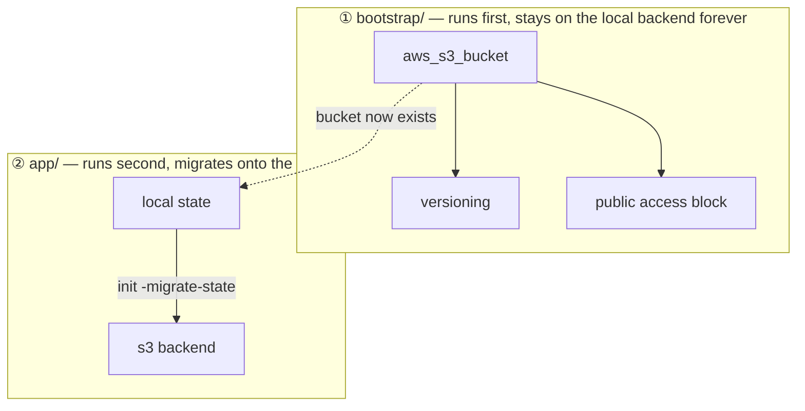
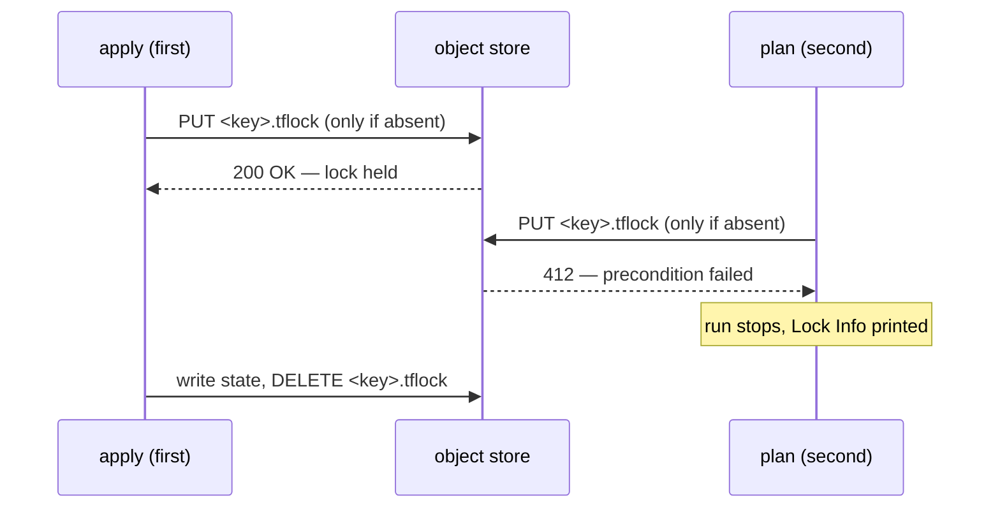

# Chapter 15 — Remote state & backends

## Learning outcomes

By the end you can:

- Name the three things local state cannot do for a team, and say which one is not a Git problem.
- Define a **backend** by its two responsibilities, and say which of the two is optional.
- Write a `backend` block, state its three limitations, and explain which one OpenTofu removed and when.
- Use **partial configuration** so the one argument that must differ per project is the only one in the repository.
- Bootstrap a state bucket from a second configuration, and explain why it cannot be the same one.
- Migrate a project onto a remote backend with `init -migrate-state`, and say what the migration leaves on local disk.
- Explain state **locking** as a conditional write on an object, and read both clouds' `412` refusals as the same mechanism.
- Configure the **`s3`** and **`gcs`** backends, and say why the workspace name appears in one object path and not the other.
- Recognise the rest of the built-in catalogue, including the one backend that is a protocol rather than a vendor.
- Read another configuration's outputs with `terraform_remote_state`, and say who else can read that state as a result.
- Harden a state backend on four properties, and name the two plaintext files that leak backend configuration.

---

## 1. The problem: your state lives on one laptop

Chapter 9 established what state is. Everything since has assumed it sits in `terraform.tfstate` next to your configuration, and for one person on one machine that works.

Add a second person and it stops working in three separate ways.

**Nobody knows whose copy is current.** Terraform reads state before it plans and writes state after it applies. If your colleague applied an hour ago and you did not receive their file, your plan is computed against a world that no longer exists. Terraform will propose to create things that already exist, and will do it confidently, because the state it consulted said they were absent.

The obvious objection is that Terraform refreshes before planning, so surely it notices. It does not, and the reason is in the scope of what refresh covers. HashiCorp's [Purpose of Terraform State](https://developer.hashicorp.com/terraform/language/state/purpose) page:

> For small infrastructures, Terraform can query your providers and sync the latest attributes from all your resources. This is the default behavior of Terraform: for every plan and apply, Terraform will sync all resources **in your state**.

The scope is in that last phrase. Refresh reconciles the objects your state already tracks. A resource that only exists in somebody else's state is not one of them, so there is nothing for refresh to look up and no way for it to discover the object.

!!! example "🧪 Verified — the second operator plans a create for something already owned"
    Terraform 1.15.8, refresh left at its default. Two directories with an identical configuration, and the second never receives the first's state file.

    ```
    alice applied. state binds terraform_data.thing -> id 2f7c566b-0c09-...
    ```

    Bob then plans, and the refresh does not save him:

    ```
      # terraform_data.thing will be created
    Plan: 1 to add, 0 to change, 0 to destroy.
    ```

    After his apply the two states bind the **same address to different objects**:

    ```
    alice: terraform_data.thing -> 2f7c566b-0c09-40e5-8a59-2b9a1e666e8a
    bob:   terraform_data.thing -> 492b0076-a29c-49e4-1f12-b3af4e21736a
    ```

    What this shows is the decision Terraform makes: a plan is computed from state, and an absent binding reads as "does not exist" no matter what is really out there. What it does not show is the damage, because `terraform_data` has no object in a cloud. With a real provider the same plan resolves one of two ways, decided by the resource type rather than by Terraform: either the create succeeds and you now own two of something you wanted one of, or it fails on a uniqueness collision such as a bucket name. Which one you get was not exercised here.

**Two runs can overlap.** Nothing stops both of you running `apply` at the same time. Both read the same prior state, both compute a plan against it, and both write a new state at the end. One of those writes silently discards the other. The resources it recorded are now real and unrecorded, which is the worst outcome state has: infrastructure that exists and that Terraform does not know about.

!!! danger "🧪 Verified — both applies succeed and one resource vanishes from state"
    Terraform 1.15.8, two working directories pointed at the **same** `key` on an `s3` backend with locking left off, each creating one resource, started two seconds apart and overlapping for about ten.

    Both reported success:

    ```
    alice:  Apply complete! Resources: 1 added, 0 changed, 0 destroyed.
    bob:    Apply complete! Resources: 1 added, 0 changed, 0 destroyed.
    ```

    The state afterwards holds one of them:

    ```
    serial   : 1
    resources: ['terraform_data.alice']
    ```

    Two resources created, one recorded. Neither run saw an error, and nothing in either transcript hints that anything went wrong. Note the serial too: both runs read an empty state, both computed serial 1, and the second write was accepted over the first. The lineage and serial guards that would reject exactly this mismatch are reached through `statemgr.Import` and `statemgr.Migrate`, and in the v1.15.8 source those two functions have exactly two callers between them: `terraform state push` and backend migration. Neither sits on the path an ordinary apply takes, which is why nothing here objected.

    This is engine-side, so it is not an artefact of the emulator. Terraform reads the whole state, computes against it, and writes the whole state back; anything that stores bytes will lose one of two overlapping writers.

**State is plaintext secrets.** This is not an inference from how state works. The providers say it themselves, in the documentation for the resources you are most likely to reach for.

The AWS provider on `aws_db_instance`:

> All arguments including the username and password will be stored in the raw state as plain-text.

And on `aws_iam_access_key`, whose `secret` attribute you cannot avoid generating:

> Note that this will be written to the state file. If you use this, please protect your backend state file judiciously.

There is no encryption and no redaction, and marking the input `sensitive` changes what appears in the CLI output rather than what is written to the file. That last sentence is the one people are surprised by, and section 10 shows it failing at a second boundary as well.

!!! info "There is a partial escape, and it arrived in Terraform 1.11"
    **Write-only arguments** are the exception to the paragraph above. HashiCorp's language documentation is unambiguous:

    > Write-only arguments let you securely pass temporary values to Terraform's managed resources during an operation without persisting those values to state or plan files.

    > Terraform does not store write-only arguments in state files, so Terraform has no way of knowing if a write-only argument value has changed.

    They need **Terraform 1.11 or later** and a resource that supports them. `aws_db_instance` does, as `password_wo` alongside the older `password`. So a master password can be kept out of state entirely now, which the flat claim "state holds your secrets" no longer covers without qualification. Chapter 23 owns the topic.

    ⚠️ The AWS provider's own page repeats *"Note that this may show up in logs, and it will be stored in the state file"* under **`password_wo`** as well as under `password`. Read against the language documentation above, that line is boilerplate carried over from the neighbouring argument and is wrong for the write-only one. Trust the language reference here, not the provider page.

    None of this rescues the general case. A great many attributes are provider-computed rather than supplied, `aws_iam_access_key`'s `secret` among them, and no write-only argument exists for a value the API hands back to you.

The obvious fix is to put the file in Git, and it fails on all three counts. Somebody will forget to pull before or push after, and it is only a matter of time. Version control offers no locking at all, so overlapping runs are unaffected. And committing state commits the database password to a repository that everyone on the team can read forever, including in its history after you delete it.

So the file has to live somewhere Terraform can read and write on every run, that can refuse a second concurrent writer, and that has its own access controls. That destination is a **backend**.

---

## 2. What a backend actually is

HashiCorp's [State Storage and Locking](https://developer.hashicorp.com/terraform/language/state/backends) page opens with the whole definition in two sentences:

> Backends are responsible for storing state and providing an API for state locking. State locking is optional.

So there are exactly two responsibilities:

1. **Store state.** Read it at the start of an operation, write it at the end.
2. **Provide a locking API.** Optional. Some backends do, some do not, and each backend's own documentation says which.

Holding on to how small that is prevents a lot of confusion later. A backend is not a runner. It does not execute anything, it does not hold your variables, and it has no opinion about your configuration beyond needing somewhere to put a JSON document, plus a way to say "somebody is working on this one".

!!! note "The `cloud` block is the thing that breaks this description, and it is not a backend"
    Every sentence above is false of HCP Terraform, Terraform Enterprise and the platforms compatible with them. Those *do* execute your runs, *do* hold your variables, and *do* have opinions about your configuration.

    That is not a backend behaving unusually. It is configured by a **`cloud` block** rather than a `backend` block, the two are mutually exclusive in one configuration, and section 9 covers what it changes. When this chapter says "backend" it means the thing this page defines, and the `cloud` block is named explicitly wherever it is meant.

The page's own examples of the storage half are worth keeping, because they are the two ends of the range: *"the `local` (default) backend stores state in a local JSON file on disk. The Consul backend stores the state within Consul. Both of these backends happen to provide locking: local via system APIs and Consul via locking APIs."*

The default backend is **`local`**, which writes `terraform.tfstate` in the working directory. Every chapter so far has used it without naming it. It also locks, through operating-system file-locking APIs, which is why two `terraform apply` runs in the same directory on the same machine already refuse to overlap.

!!! example "🧪 Verified — the default backend really does lock"
    Terraform 1.15.8, an apply held open for twenty seconds, and a `terraform plan` run in the same directory while it worked:

    ```
    Error: Error acquiring the state lock

    Error message: Failed to read state file: The state file could not be read:
    read terraform.tfstate: The process cannot access the file because another
    process has locked a portion of the file.
    ```

    A sidecar appears alongside the state for the duration, and is removed when the lock releases:

    ```
    .terraform.tfstate.lock.info    206 bytes
    ```

    Note what refuses the second run. It is not that file. The lock is a **byte-range lock taken on `terraform.tfstate` itself**, through `LockFileEx` on Windows and `fcntl` via `syscall.Flock_t` on Unix, so the wording above is literal rather than a metaphor. `.terraform.tfstate.lock.info` only carries the metadata that fills in the `Lock Info` block.

    The message quoted is Windows'. The mechanism is the same everywhere; the operating system's complaint is not.

    This is also why `force-unlock` cannot help here, as section 7 notes: a lock held by the kernel on behalf of a live process is not an object another process can delete.

Everything above the CLI is unchanged by the choice. The docs put it plainly:

> Despite the state being stored remotely, all Terraform commands such as `terraform console`, the `terraform state` operations, `terraform taint`, and more will continue to work as if the state was local.

That is the property worth holding on to: moving state to a bucket changes where bytes live and nothing about how you drive Terraform.

!!! warning "That sentence's own example is out of date"
    It names **`terraform taint`** among the commands that keep working. That command's own [reference page](https://developer.hashicorp.com/terraform/cli/commands/taint) states plainly that *"This command is deprecated. Instead, add the `-replace` option to your `terraform apply` command"*, and recommends the alternative *"For Terraform v0.15.2 and later"*.

    The reason it gives is worth carrying, because it is about review rather than tidiness:

    > We recommend the `-replace` option because the change will be reflected in the Terraform plan, letting you understand how it will affect your infrastructure before you take any externally-visible action. When you use `terraform taint`, other users could create a new plan against your tainted object before you can review the effects.

    `taint` marks the object in state immediately, so the mark is visible to everyone sharing that state before anybody has agreed to it. That is a remote-state concern, which is why it belongs in this chapter rather than only in a command reference.

    The claim around it still holds. Only the illustration has rotted.

!!! success "A remote backend keeps state off your disk entirely"
    HashiCorp's [State Storage and Locking](https://developer.hashicorp.com/terraform/language/state/backends) page states a guarantee that is easy to skim past:

    > When using a non-local backend, Terraform will not persist the state anywhere on disk except in the case of a non-recoverable error where writing the state to the backend failed.

    With secrets in state, that removes one whole copy of the plaintext: the laptop. It encrypts nothing. It simply means the file is not there.

    **The exception is the part to plan for**, and the page states both halves of it:

    > In the case of an error persisting the state to the backend, Terraform will write the state locally. This is to prevent data loss. If this happens, the end user must manually push the state to the remote backend once the error is resolved.

    That file has a name, **`errored.tfstate`**, and section 11 shows one being produced. Nothing pushes it back for you. A run that ends this way leaves exactly the plaintext the guarantee otherwise rules out, on whichever machine happened to be running, and section 11 covers what that means when the machine is a CI runner about to be deleted.

    **Two other local copies are outside this guarantee entirely**, which is worth separating so the promise is not read as wider than it is. Migrating onto a remote backend leaves the old state behind as `terraform.tfstate.backup` (section 6). And `.terraform/terraform.tfstate` is backend *configuration* rather than state, so it is unaffected by any of this and is its own disclosure problem (section 11). The guarantee covers where a working remote backend puts your state during ordinary runs. It is not a promise that no state-shaped file exists on the disk.

---

## 3. The `backend` block, and its three limitations

Configuration goes inside the `terraform` block, in the **root module**:

```hcl
terraform {
  required_version = ">= 1.10"

  backend "s3" {
    bucket       = "acme-tf-state"
    key          = "networking/terraform.tfstate"
    region       = "eu-central-1"
    use_lockfile = true
  }
}
```

The backend type is the block **label**. The arguments inside are specific to that type, and backends do not share a schema, which is why every one of them needs reading on its own terms.

!!! danger "🧪 Verified — a `backend` block in a child module is ignored, not rejected"
    "Root module" is usually stated as a rule, which invites the assumption that Terraform enforces it. Measured on 1.15.8, it does not.

    A `backend "local"` block was placed in a child module, pointing at `child-state/dev.tfstate`, with none in the root:

    ```
    $ terraform validate
    Success! The configuration is valid.

    $ terraform init
    Terraform has been successfully initialized!

    $ terraform apply -auto-approve
    Apply complete! Resources: 1 added, 0 changed, 0 destroyed.
    ```

    No error and no warning at any step. State landed at **`./terraform.tfstate`**, the root default, and the `child-state/` directory was never created. The block was read, accepted, and had no effect whatsoever.

    That is worth knowing because of how modules get made. Extracting a working root configuration into a module carries its `backend` block along, and nothing at all tells you the block stopped meaning anything.

Three limitations follow, and all three shape how real projects are laid out:

> - A configuration can only provide one backend block.
> - A backend block cannot refer to named values (like input variables, locals, or data source attributes).
> - You cannot reference values declared within backend blocks elsewhere in the configuration.

Named, so they can be referred to later rather than counted:

| | The rule | What it costs you |
|---|---|---|
| **One block per configuration** | A root module configures exactly one backend | No per-environment backend inside one directory; environments are separate root modules or separate `-backend-config` files |
| **The named-value ban** | Nothing inside the block may reference a variable, a local, or a data source | Every project repeats the same bucket and region literally, and `key` must still differ per project |
| **Nothing reads back out** | Values declared in the block are invisible to the rest of the configuration | You cannot reference the bucket name elsewhere; declare it again if you need it |

**The named-value ban is the one people hit first**, and it is worth seeing fail:

```
Error: Variables not allowed
  on main.tf line 8, in terraform:
   8:     bucket = var.state_bucket
Variables may not be used here.
```

That is a refusal before any backend work happens, and the reason is more absolute than "the value is not ready yet". The backend body is evaluated with **no scope at all**. HCL emits that diagnostic when it walks the evaluation context chain and finds no context defining any variables whatsoever, so `var.state_bucket` is not looked up and rejected. There is nothing to look it up in.

The companion error proves it. Put a function call in the same position and you get the matching complaint:

```
Error: Function calls not allowed
  on main.tf line 3, in terraform:
   3:   backend "local" { path = join("/", ["state", "dev.tfstate"]) }
Functions may not be called here.
```

No variable table and no function table. The backend block takes literals.

!!! warning "`const = true` does not open this door"
    Terraform **1.15.0** added `const` on an input variable, which makes it usable in a `module` block's `source` and `version`. (Version-gated from the source: the commit adding the attribute is first contained in tag `v1.15.0`.) Those arguments have a genuine *timing* problem: modules are installed at `init`, before plan-time evaluation exists, so a variable is only usable there if it is known during configuration loading. `const` is the marker that promises it is.

    It is reasonable to expect that to extend here, and it does not. Measured on Terraform 1.15.8:

    ```hcl
    terraform {
      backend "local" {
        path = var.state_path      # Error: Variables not allowed
      }
    }

    variable "state_path" {
      type    = string
      const   = true
      default = "state/dev.tfstate"
    }
    ```

    Routing it through a local fails identically, even though that indirection *is* allowed for `module` sources:

    ```hcl
    locals { state_path = "${var.state_dir}/dev.tfstate" }

    terraform {
      backend "local" { path = local.state_path }   # Error: Variables not allowed
    }
    ```

    The `const` variable itself is accepted in both cases. Only the reference from inside the backend block fails. The two restrictions look alike and are not the same thing: `const` answers *when is this value known*, while the backend block never gets an evaluation scope to ask the question in. Partial configuration remains the only answer on Terraform.

The consequence is more annoying than the rule. Every configuration in your organisation must repeat the bucket, the region and the locking setting verbatim, while **`key` must be unique per configuration** or one project silently overwrites another's state. You are asked to copy-paste everything except the single line you must not copy-paste. Section 4 is the sanctioned relief.

!!! info "OpenTofu — variables and locals *are* allowed in a `backend` block"
    OpenTofu **1.8.0** added early variable evaluation, listed in its changelog as *"Variables and Locals allowed in module sources and backend configurations (with limitations)"* ([#1718](https://github.com/opentofu/opentofu/pull/1718)). `var` and `local` references work inside `backend` blocks, resolved in a special phase during `tofu init` before the backend is initialised and before state exists.

    ```hcl
    locals {
      region = "us-east-1"
    }

    terraform {
      backend "s3" {
        region = local.region
      }
    }
    ```

    The restrictions match the reason it works: only variables and locals, nothing from state or from data sources, and everything must be statically determinable at `init`. OpenTofu's own guidance is still to keep credentials out of it, because backend configuration leaks the same way there as here (section 11).

    **No marker is required on the variable.** Measured on OpenTofu 1.12.5, an ordinary variable reached through a local works, and the state lands where the computed path says:

    ```hcl
    variable "state_dir" {
      type    = string
      default = "state"
    }

    locals { state_path = "${var.state_dir}/dev.tfstate" }

    terraform {
      backend "local" { path = local.state_path }
    }
    ```

    So the engines differ twice over. Terraform has no scope in a backend block at all and offers `const` only for module sources; OpenTofu gives the block a real early-evaluation scope and needs nothing declared on the variable. Do not use this in a configuration that must run on both engines.

**`backend` and `cloud` are mutually exclusive.** HCP Terraform, Terraform Enterprise, and compatible platforms are configured with a `cloud` block instead, and a configuration containing one cannot also contain a `backend` block. Section 9 covers what that block does differently.

**Backends are built in, and only built in.** The page is blunt about it: *"Terraform ships with several built-in backend types … You cannot load additional backends as plugins."* That is why the catalogue in section 9 is a finite list rather than a registry, and why *"The specified backend must be available in the version of Terraform you are using"* is a real constraint rather than a formality.

---

## 4. Partial configuration

Omit arguments from the block and supply them at `init` time. The minimum is an empty block naming the type:

```hcl
terraform {
  backend "s3" {}
}
```

Then put the rest in a file:

```hcl
# config.s3.tfbackend
bucket       = "acme-tf-state"
key          = "networking/terraform.tfstate"
region       = "eu-central-1"
use_lockfile = true
```

```shell
terraform init -backend-config config.s3.tfbackend
```

The file's format is the contents of the backend block as top-level attributes, with no wrapping `terraform` or `backend` block.

HashiCorp's own examples write this flag as `-backend-config=PATH`, and both forms work. The space form is used throughout this chapter because it is the one that survives every shell, for reasons the next warning makes concrete.

!!! tip "The documented filename convention is `*.<backendname>.tfbackend`"
    `config.s3.tfbackend`, `prod.gcs.tfbackend`, and so on. HashiCorp will not stop you using another name, and following the convention helps your editor understand the content.

    Plenty of material uses `backend.tfvars` instead. It works, and it is worse: `.tfvars` tells every reader and every editor that the file holds *variable* values, when it holds backend configuration, which is a different thing evaluated at a different time.

Two other ways to supply the values exist. Repeated `-backend-config="key=value"` flags work, with later flags overriding earlier ones. And Terraform *"will interactively ask you for the required values, unless interactive input is disabled"*, which it never prompts for optional ones. That caveat is the one CI depends on: `-input=false` turns a missing required value into a failure rather than a job that hangs until it times out, which is why every command in this chapter's pipeline lab passes it.

Prefer the file. The page's own reason for avoiding the flags is *"many shells retain command-line flags in a history file, so this isn't recommended for secrets"*.

!!! warning "🧪 In PowerShell, quote the argument — and the error will not tell you why"
    On PowerShell 7.6.5 an unquoted `-backend-config=config.s3.tfbackend` fails, and the message sends you somewhere unhelpful:

    ```
    Error: Too many command line arguments. Did you mean to use -chdir?
    ```

    Nothing is wrong with `-chdir`. The argument was split before Terraform ever saw it. Printing the real `argv` of a child process shows where:

    | Written | Received |
    | --- | --- |
    | `-backend-config=a.b` | `-backend-config=a` **and** `.b` |
    | `-backend-config=abc` | `-backend-config=abc` |
    | `-backend-config=bucket=a.b` | `-backend-config=bucket=a` **and** `.b` |
    | `"-backend-config=a.b"` | `-backend-config=a.b` |
    | `foo.bar` | `foo.bar` |

    The split happens at the **first dot after the `=`**, and only in a token that begins with `-` and contains an `=`. A dot in an ordinary argument is left alone, and a value with no dot survives unquoted, which is why `-backend-config=bucket=tf-state-lab` works and hides the problem until the day a filename or a region appears.

    Three forms avoid it, and all three were checked:

    ```powershell
    terraform init -backend-config config.s3.tfbackend     # space form, portable
    terraform init "-backend-config=config.s3.tfbackend"   # whole token quoted
    terraform init -backend-config="config.s3.tfbackend"   # value quoted
    ```

    The **space form** is the one this chapter uses, because it needs no quoting rules and reads the same in every shell.

    Bash and the other POSIX shells do not do this. If a documented command works for a colleague and fails for you with a message about `-chdir`, this is why.

!!! note "The block can be completely empty, and the page contradicts itself about it"
    The file section says the partial configuration *"must have a backend block containing keys set to empty values"*, and its example duly writes `bucket = ""`, `key = ""` and so on.

    Read a little further and the same page says the opposite: *"Terraform requires at a minimum that an empty backend configuration is specified in one of the root Terraform configuration files, to specify the backend type"* — followed by an example that is exactly `terraform { backend "consul" {} }`.

    Measured on Terraform 1.15.8, the empty block is what actually holds. `terraform { backend "s3" {} }` plus a `.tfbackend` file initialises and applies normally, which is the form every lab in this chapter uses. The empty-keys style is not wrong, just unnecessary.

This is what makes the **named-value ban** survivable. The repository holds the *shape* of the backend and nothing environment-specific. The values arrive at `init`, from a file that can differ per environment or be generated by CI.

---

## 5. The bootstrap, and why it takes two configurations

You cannot keep state in a bucket that does not exist. You also cannot create that bucket with the configuration whose state it will hold, because at the moment `init` runs the bucket must already be there. Terraform says so itself, and the wording is worth seeing because it is the whole reason this section exists:

```
Error: Failed to get existing workspaces: S3 bucket "acme-tf-state" does not exist.

The referenced S3 bucket must have been previously created. If the S3 bucket
was created within the last minute, please wait for a minute or two and try
again.
```

`init` fails before it can do anything else, so there is no order of operations inside one configuration that gets you out of this. Note the second sentence too: bucket creation is eventually consistent, so a bucket made moments ago can still produce this error.

So a remote-state setup starts with two configurations:



The bootstrap configuration creates the bucket and hardens it:

```hcl
resource "aws_s3_bucket" "state" {
  bucket = "acme-tf-state"

  lifecycle {
    prevent_destroy = true
  }
}

resource "aws_s3_bucket_versioning" "state" {
  bucket = aws_s3_bucket.state.id

  versioning_configuration {
    status = "Enabled"
  }
}

resource "aws_s3_bucket_public_access_block" "state" {
  bucket                  = aws_s3_bucket.state.id
  block_public_acls       = true
  block_public_policy     = true
  ignore_public_acls      = true
  restrict_public_buckets = true
}
```

Three things there are not decoration. `prevent_destroy` is a plan-time refusal to delete the bucket, from Chapter 11. The public-access block matters because the object you are about to store is a plaintext credential file.

**Versioning is the one both backend pages ask for in the same words**, and neither turns it on for you:

> Warning! It is highly recommended that you enable Bucket Versioning on the S3 bucket to allow for state recovery in the case of accidental deletions and human error.

The GCS page says the same thing with *Object Versioning* substituted. The reason they give is deletion and human error; this chapter adds a second one, since section 6 and section 11 both produce states that are truncated or half-written rather than deleted, and a previous version is the only way back from those too.

The bootstrap configuration keeps local state permanently. Its state is small, it changes almost never, and the alternative is the same problem one level down.

!!! note "The lab's copy of this leaves `prevent_destroy` out on purpose"
    `labs/chapter15/lab2/bootstrap/` is the configuration above with the `lifecycle` block removed, so the lab can be torn down with `tflocal destroy`. That is the right trade for a lab and the wrong one for a real state bucket, where losing the bucket loses every project's state at once. The lab file says so in a comment; put the block back when you copy it.

!!! tip "One bucket serves every configuration you own"
    The bootstrap is awkward, and it is also a once-per-account cost. Different projects share the bucket and differ only in `key`. That is the argument for treating `key` as the project's address rather than as a filename: `networking/terraform.tfstate`, `platform/eks/terraform.tfstate`, and so on, mirroring your repository layout.

---

## 6. Migration, and what it leaves behind

Adding a backend for the **first time** is the easy case. There is nothing recorded in `.terraform/` yet, so a plain `terraform init` finds the local state, prompts, and migrates it.

Every case after that is different. Once a backend has been recorded, changing it stops Terraform before it does anything else. Measured on Terraform 1.15.8:

```
Error: Backend configuration changed

A change in the backend configuration has been detected, which may require
migrating existing state.

If you wish to attempt automatic migration of the state, use "terraform
init -migrate-state".
If you wish to store the current configuration with no changes to the
state, use "terraform init -reconfigure".
```

That error is the interface for every subsequent move, and the two flags mean genuinely different things:

| Flag | What it does | When you want it |
|---|---|---|
| `-migrate-state` | Copies the current state into the new backend | Moving a live project to a new home |
| `-reconfigure` | Discards the association and starts fresh against the new backend | Pointing at a backend that already holds the right state, or deliberately starting empty |

Answer the migration prompt and the copy happens:

```
Do you want to copy existing state to the new backend?
  Pre-existing state was found while migrating the previous "local" backend to the
  newly configured "s3" backend. No existing state was found in the newly
  configured "s3" backend. Do you want to copy this state to the new "s3"
  backend? Enter "yes" to copy and "no" to start with an empty state.

  Enter a value: yes

Successfully configured the backend "s3"! Terraform will automatically
use this backend unless the backend configuration changes.
```

**Removing a backend is the same operation in reverse**, and it takes the flag too, because a backend was recorded. Delete the block, run `terraform init -migrate-state`, and Terraform offers to bring the state back down:

```
Terraform has detected you're unconfiguring your previously set "local" backend.
...
Successfully unset the backend "local". Terraform will now operate locally.
```

There is no separate command for removing a backend. The `init` prompt is the whole of it.

!!! note "The prompt appears; the flag decides whether you get to it"
    Measured on Terraform 1.15.8, the two cases behave differently and the difference is easy to misremember as "`init` offers to migrate". It does, **once**. On a first backend adoption a plain `init` prompts. On any later change, including deleting the block, a plain `init` errors and you have to say which of the two flags you meant. That is the safer design: the second case is the one where guessing wrong loses state.

!!! danger "Migration copies. It does not clean up."
    Measured on Terraform 1.15.8 across three runs, and once on OpenTofu 1.12.5, migrating a project from local state onto the `s3` backend leaves this in the working directory:

    ```
    terraform.tfstate            0 bytes
    terraform.tfstate.backup   922 bytes   <- the complete snapshot
    ```

    The working file is truncated. The **backup keeps every attribute**, including anything sensitive, in plaintext, and nothing warns you. Migrating in the other direction leaves the source file complete rather than truncated. Either way a full copy of the state you just moved somewhere safer is still sitting on the disk you moved it off.

    Delete it deliberately after you have confirmed the remote copy is good. The "state is never persisted to disk" guarantee in section 2 describes future runs, not the migration that got you there.

!!! warning "Only the current version migrates"
    If the old backend kept version history, migration copies the **latest** state and nothing else. Older versions have to be moved by hand if you want them. Take a backup before starting, which is advice HashiCorp gives in its own words: back up `terraform.tfstate` to another location before migrating to a new backend.

!!! note "Match the CLI version that wrote the state"
    HashiCorp's HCP migration tutorial states the constraint the S3 material does not: *"always use the same version of the Terraform CLI you used to create the resources. Using a newer version of Terraform may update the state file and cause state file corruption."* A newer CLI can rewrite the snapshot as it reads it, and the rewrite is what lands in the new backend.

`init` is where all of this lives. It is not only first-run setup. Over a project's life its backend flags are `-backend-config` for partial configuration, `-migrate-state` to move, `-reconfigure` to re-point, and `-upgrade` to re-resolve providers within their constraints.

---

## 7. Locking

Locking is **automatic, silent, and fatal**.

- **Automatic** — every operation that could write state takes a lock. That includes `plan`, which carries its own `-lock` and `-lock-timeout` flags.
- **Silent** — you see no message when it works. The docs say so directly: "You do not see any message that it happens." No output is not evidence that nothing locked.
- **Fatal** — "If state locking fails, Terraform does not continue." It is not a warning you can ignore.

The silence has a threshold rather than being absolute. `Acquiring state lock. This may take a few moments...` is emitted through a slow-message helper with `LockThreshold = 400 * time.Millisecond`, so it prints only when acquisition takes longer than 400 ms. A lock taken promptly says nothing at all; one you have to wait for announces itself. That is why seeing the message is already a signal that something else is holding it.

### The lock is a conditional write

Neither major cloud backend runs a lock service. Both do the same thing: write one object that must not already exist, and let the store refuse the second writer.



On `s3`, with `use_lockfile = true`, the refusal reads:

```
Error: Error acquiring the state lock

Error message: operation error S3: PutObject, https response error StatusCode: 412,
api error PreconditionFailed: At least one of the pre-conditions you specified did not hold
Lock Info:
  ID:        76be00ae-65dc-d086-f994-ef1ca2487028
  Path:      tf-state-lab/app/terraform.tfstate
  Operation: OperationTypeApply
  Who:       ARINDAM\arind@arindam
  Version:   1.15.8
  Created:   2026-07-30 09:05:40.678421 +0000 UTC
```

On `gcs`, which needs no argument at all:

```
Error message: writing "gs://tf-state-lab/terraform/state/default.tflock" failed:
googleapi: Error 412: ifGenerationMatch: 1787133258314 != 0, conditionNotMet
```

Two vendors, one idea, and both spell it **412**. `ifGenerationMatch: 0` is Google's way of saying "create only if this does not exist"; S3's if-none-match precondition says the same thing.

!!! note "Where these transcripts come from, and what they are evidence of"
    The two errors above were produced against **local emulators**, not against AWS or Google. That distinction matters more here than anywhere else in the chapter, because a lock is precisely the behaviour an emulator is most likely to approximate.

    Split the claim in two. The **request** Terraform sends is engine-side and an emulator cannot influence it. Read from the v1.15.8 source, `s3` issues a `PutObject` carrying `IfNoneMatch: "*"` and `gcs` writes with `If(storage.Conditions{DoesNotExist: true})`. Both are conditional writes, and that much is settled without any cloud at all.

    The **response** is the vendor's, so the emulator is only a witness and the documentation is the authority. Both vendors confirm it. Amazon: *"If there's an existing object, the write operation fails, resulting in a `412 Precondition Failed` response"*, and for the concurrent case, *"the first write operation to finish succeeds. Amazon S3 then fails subsequent writes with a `412 Precondition Failed` response."* Google: *"If there is a live version with the specified name, the request fails with a status code of `412 Precondition Failed`."*

    So the emulators agreed with the real services here. That is a result worth having stated rather than assumed, and it does not generalise to everything else they do.

!!! warning "S3 has a second failure the emulator will not show you"
    Amazon documents a case that only arises under real concurrency:

    > You can also receive a `409 Conflict` response in the case of concurrent requests if a delete request to an object succeeds before a conditional write operation on that object completes. When using conditional writes with `PutObject`, uploads may be retried after receiving a `409 Conflict` error.

    In lock terms that is one client releasing the lock at the moment another tries to take it. AWS's guidance is to retry.

    Terraform's `lockWithFile` does not distinguish status codes at all: any upload error is wrapped as a `statemgr.LockError` with whatever lock info can be read back. Its retry loop only continues when that error carries complete lock info, and in the 409 case the lock object has just been deleted, so reading it back is exactly what fails.

    > ❓ Unverified: whether that combination produces a spurious failure on real S3. It cannot be exercised against an in-memory emulator, and it is not reproduced here. Treat it as a thing to watch for under heavy concurrency rather than a known defect.

    Two smaller conditions from the same page, both invisible locally: `If-None-Match` requires **AWS Signature Version 4**, and on a versioned bucket the conditional write also succeeds when the current version is a **delete marker**.

The lock object's lifetime is visible from outside if you list the bucket during a held apply. Mid-run there is a `.tflock` and, on a first apply, no state object yet. After the run there is a state object and no `.tflock`. Lock first, write second, unlock third. Once you have seen that, "does this backend support locking" reduces to "does this store offer a conditional write", which is why the S3 backend no longer needs a DynamoDB table and why an S3-compatible store may or may not manage it.

### Waiting instead of failing

The default under contention is to fail immediately. Three behaviours are available:

| Flag | Behaviour |
|---|---|
| *(none)* | Fail as soon as the lock cannot be taken |
| `-lock-timeout=10m` | Retry for that long before giving up |
| `-lock=false` | Skip locking entirely |

The default is literally `-lock-timeout=0s`, which `terraform plan -help` prints. Give it a duration and the retry is an exponential backoff, starting at one second and doubling to a ceiling of sixteen, until the timeout expires. So a long `-lock-timeout` costs you nothing while the lock is free and polls politely while it is not.

Only the middle row is appropriate in a team. The refusal itself tells you about the third, and this is the CLI's own wording rather than the documentation site's:

> Terraform acquires a state lock to protect the state from being written by multiple users at the same time. Please resolve the issue above and try again. For most commands, you can disable locking with the "-lock=false" flag, but this is not recommended.

The one defensible use is a speculative plan you will certainly never apply.

### `force-unlock`

A crashed run can leave a lock held. `terraform force-unlock LOCK_ID` releases it, and the scoping is tighter than most people assume:

> Force unlock should only be used to unlock your own lock in the situation where automatic unlocking failed.

The lock ID is the guard rail. It acts as a **nonce** identifying one specific acquisition, so you cannot unlock blind, and an ID copied from an older failure will not release the current lock.

It is worth being precise about what "one acquisition" means, because the ID is easy to mistake for a run identifier. It is not one. Terraform mints a fresh ID every time it takes the lock, so a `plan` and the `apply` that follows it hold two different IDs. Retrying inside a single command is the opposite case: the backoff loop under `-lock-timeout` reuses the same lock info, so every attempt carries the ID the command started with. Nothing in the ID says which run you are, and there is no place to look one up. Who the run belongs to is carried by the other `Lock Info` fields, `Who`, `Operation`, `Version` and `Created`.

What that ID *is* differs by backend, which is worth seeing once. On `s3` it is a UUID that Terraform generates. On `gcs` it is the lock object's **generation number**, the same value that appears in the `ifGenerationMatch` comparison in the error. The nonce is not a Terraform-level abstraction bolted on top; on GCS it is the store's own optimistic-concurrency token, surfaced directly. This is why the `Lock Info` block above matters: it hands you the ID at exactly the moment you might need it, along with the holder, the operation and the start time, which is the evidence you need before deciding a lock is stale rather than live.

!!! warning "`-force` suppresses the prompt, not the lock ID"
    The command's single option is `-force`, described as "Don't ask for input for unlock confirmation". `LOCK_ID` remains a required positional argument with or without it. There is no blind-unlock form.

    Two more facts from the command reference. It *"does not modify your infrastructure"*, which is worth knowing before running it during an incident: the harm it can do is the second writer it permits, not anything it touches directly. And *"local state files cannot be unlocked by another process"* — the `local` backend locks through system APIs, so a stuck local lock is a process to deal with rather than a lock to break. This is a remote-backend command.

---

## 8. Two object stores, side by side

`s3` and `gcs` do the same job. Reading them against each other is what turns "the S3 backend" into a general model of what a backend is.

```hcl
terraform {
  backend "s3" {
    bucket       = "acme-tf-state"
    key          = "networking/terraform.tfstate"
    region       = "eu-central-1"
    use_lockfile = true
    encrypt      = true
  }
}
```

```hcl
terraform {
  backend "gcs" {
    bucket = "acme-tf-state"
    prefix = "networking"
  }
}
```

| | `s3` | `gcs` |
|---|---|---|
| Object path | `key`, verbatim, for the default workspace | no `key` — always `<prefix>/<workspace>.tfstate` |
| Other workspaces | `<workspace_key_prefix>/<name>/<key>`, prefix defaults to the literal `env:` | same rule as the default one |
| Locking | **opt-in**: `use_lockfile = true`, defaults to `false` | **on by default**, no argument to set or unset it |
| Lock mechanism | `<key>.tflock`, conditional PUT, `412 PreconditionFailed` | `<prefix>/<name>.tflock`, `ifGenerationMatch: 0`, `412 conditionNotMet` |
| Bucket | must pre-exist | must pre-exist |
| Versioning | recommended, not automatic | recommended, not automatic |
| Encryption | `encrypt`, `kms_key_id`, `sse_customer_key` | `kms_encryption_key` (migratable) or `encryption_key` (**not** migratable) |
| CI credentials | `assume_role_with_web_identity` | ADC, attached service account, or `impersonate_service_account` |
| IAM granularity | four statements, `s3:DeleteObject` on the `.tflock` but not on state | one line: **Storage Object Admin** on the bucket |

### Where the object lands

On `s3` the default workspace gets exactly `key`. Every other workspace is prefixed:

> Other workspaces are stored using the path `<workspace_key_prefix>/<workspace_name>/<key>`. The default workspace key prefix is `env:`

So workspace `development` with `key = networking/terraform.tfstate` lands at `env:/development/networking/terraform.tfstate`. A literal directory with a colon in it, inherited from the pre-1.0 name for workspaces, which is why a bucket that has seen workspaces looks so strange in the console.

On `gcs` there is no `key` at all. State is `<prefix>/<workspace>.tfstate`, so the default workspace lands at `networking/default.tfstate` and the workspace name is in **every** path rather than only the non-default ones.

!!! example "🧪 Verified — the same two workspaces on each backend"
    Terraform 1.15.8 against the lab emulators. One `default` workspace and one other, applied on each backend, then the bucket listed.

    `s3`, with `key = "wsverify/terraform.tfstate"`:

    ```
    wsverify/terraform.tfstate
    env:/development/wsverify/terraform.tfstate
    ```

    `gcs`, with `prefix = "wsverify"`:

    ```
    wsverify/default.tfstate
    wsverify/staging.tfstate
    ```

    Two things are visible here that the argument tables do not make obvious. The S3 default workspace's object has **nothing** in its path saying which workspace it belongs to, so a bucket tells you the names of every workspace except that one. And the `env:` segment really is a literal directory whose name ends in a colon, which is what makes these buckets look mangled in a console.

### The locking default is the trap

`use_lockfile` defaults to `false`. A perfectly valid `s3` backend block that omits it is an **unlocked backend that never warns you**, which is the exact failure this whole chapter exists to prevent. Set it. There is no cost and nothing to provision.

!!! danger "🧪 Verified — omitting it really does mean no lock at all"
    Terraform 1.15.8, a backend block with every other argument set and `use_lockfile` absent. An apply was held open for 25 seconds and the bucket listed while it ran.

    **No `.tflock` object was created.** Then a second command was run against the same state while the apply was still in flight:

    ```
    terraform plan -lock-timeout=3s
    ```

    It refreshed state and produced a plan. No refusal, no warning, no `Acquiring state lock` message, nothing in the output to suggest anything was wrong. Compare the same race in section 7 with `use_lockfile = true`, which fails on a 412 within milliseconds.

    That is what "silently unlocked" means, and it is why this argument is worth checking on every S3 backend block you inherit.

!!! warning "`dynamodb_table` is on its way out, on Terraform only"
    The S3 backend's original locking used a DynamoDB table. Terraform now deprecates it: `dynamodb_table` and `dynamodb_endpoint` *"will be removed in a future minor version"*, and both may be configured alongside `use_lockfile` purely as a migration path.

    By date rather than by version number, since both projects number releases `1.x` on different schedules: Terraform **1.10** (2024-11-27) introduced native locking as opt-in and took both locks when DynamoDB was also configured; Terraform **1.11** (2025-02-27) made it GA and deprecated the DynamoDB arguments; OpenTofu **1.10** (June 2025) shipped `use_lockfile` about seven months after Terraform's first release of it.

!!! info "OpenTofu — `dynamodb_table` carries no deprecation"
    Read from both backend schemas at their release tags. Terraform v1.15.8 marks the argument `Deprecated: true` and appends a runtime diagnostic pointing at `use_lockfile`. OpenTofu v1.12.5 declares it with a type, `Optional`, and a description, and nothing else.

    The absence is meaningful rather than an oversight in how OpenTofu writes schemas: the same file marks **23** other attributes deprecated, so the mechanism is in active use and `dynamodb_table` is deliberately not among them.

    "Migrate off DynamoDB" is therefore Terraform advice. On OpenTofu the table remains a fully supported option, even though `use_lockfile` is the better default there too.

### IAM, and the statement people forget

The S3 permission set is more specific than "read and write the bucket":

- `s3:ListBucket` on the **bucket**, at minimum able to list the path where state is stored.
- `s3:GetObject` and `s3:PutObject` on the **state object**.
- `s3:GetObject`, `s3:PutObject` **and `s3:DeleteObject`** on the **`.tflock` object**.

And the line that surprises people:

> `s3:DeleteObject` is not required on the state file, as Terraform does not delete it.

Terraform never removes a state object. Cleaning up old state is your process, not the tool's. The corollary is the failure mode: a bucket policy written before `use_lockfile` existed grants nothing on the lock object, so the run fails at lock acquisition rather than at write, which reads like an authentication problem and is not.

GCS asks for one line instead: **Storage Object Admin** on the bucket. There is no documented way to narrow below that role, and no separate lock-object permission to forget.

### The identity question

This is the difference that decides architecture rather than syntax.

On `s3`, the backend's credentials and the provider's credentials are separate by construction. The backend authenticates as one principal and `provider "aws"` can `assume_role` into another. HashiCorp's own multi-account pattern is built on that split: one administrative account holds the humans and the single state bucket, each environment account holds a role, and the provider assumes into the environment while the backend keeps writing state as the administrator.

On `gcs`, every option reads two environment variables, a backend-scoped `GOOGLE_BACKEND_*` name and a shared `GOOGLE_*` one, and the reference page warns:

> if using the Google Cloud Platform provider as well, it will also pick up the `GOOGLE_CREDENTIALS` environment variable.

Export the shared name and you have given one identity to the backend, to every `google` provider, and to any `terraform_remote_state` read in the configuration. Use `GOOGLE_BACKEND_CREDENTIALS` when the backend and the managed infrastructure should not be the same principal.

### Encryption asymmetry

Both backends can encrypt with a customer-managed KMS key or a customer-supplied key, and the two behave differently when you change them.

On `gcs`, a **KMS** key migrates automatically, but the change only takes effect on the **first write after** migration, so the old key has to outlive the migration. A **customer-supplied** key cannot be migrated at all: Google does not store it, so at migration time the backend has lost the old key's details and cannot use it. The object has to be rewritten out-of-band first to strip the old key.

On `s3`, the trap is where the key lives rather than how it migrates:

> This can also be sourced from the `AWS_SSE_CUSTOMER_KEY` environment variable, which is recommended due to the sensitivity of the value. Setting it inside a terraform file will cause it to be persisted to disk in `terraform.tfstate`.

A key written into configuration ends up inside the state it was meant to protect.

!!! note "A 403 straight after granting access may be nothing"
    The GCS page states something no other backend page does: *"IAM Changes to buckets are eventually consistent and may take upto a few minutes to take effect. Terraform will return 403 errors till it is eventually consistent."* Wait before you start debugging a policy that is probably correct.

---

## 9. The rest of the catalogue

Backends are built in, so the list is finite and version-bound. Read out of the Terraform v1.15.8 source, the registered names are:

`local` · `remote` · `azurerm` · `consul` · `cos` · `gcs` · `http` · `inmem` · `kubernetes` · `oci` · `oss` · `pg` · `s3` · `cloud`

Most of that list is chosen for you. The deciding factor is whatever your team already runs: AWS gives you `s3`, Azure gives you `azurerm`, GCP gives you `gcs`. This is not a decision worth agonising over.

A few entries earn a sentence:

- **`inmem`** is an in-memory backend used for testing. It is not documented as a user-facing choice, and Terraform will nonetheless configure it for you without complaint. See the warning below before going near it.
- **`pg`** puts state in PostgreSQL, and **`kubernetes`** puts it in a Secret. Both are reasonable if that is the durable, backed-up system you already operate.
- **`remote`** is the older HCP Terraform integration, superseded by the `cloud` block.

!!! info "OpenTofu — no `oci` backend"
    Terraform 1.12 added a native Oracle Cloud Object Storage backend. Checked against the OpenTofu v1.12.5 source, the name is registered nowhere and `internal/backend/remote-state/` has no `oci` directory. Every other name in the list above is present on both engines.

!!! danger "🧪 Verified — `inmem` initialises, applies, and forgets everything immediately"
    Terraform 1.15.8. `backend "inmem" {}` is accepted:

    ```
    Successfully configured the backend "inmem"! Terraform will automatically
    use this backend unless the backend configuration changes.
    ```

    `terraform apply` then reports `Resources: 1 added`. The next command is a new process, and the state is already gone:

    ```
    $ terraform state list
    No state file was found!

    $ terraform plan
      # terraform_data.p will be created
    Plan: 1 to add, 0 to change, 0 to destroy.
    ```

    Nothing is written to disk. So the resource is orphaned the instant the first apply finishes, and the next plan proposes to build it again. "Loses state when the process exits" undersells it: **every command is a new process**, so state never survives a single command boundary.

!!! note "Backends can be removed, and the message tells you which case you are in"
    Terraform keeps a list of names it used to support. Measured on 1.15.8, all three cases share the summary **`Unsupported backend type`**, and only the detail line distinguishes them:

    | Block | Detail |
    |---|---|
    | `backend "swift" {}` | The "swift" backend is not supported in Terraform v1.3 or later. |
    | `backend "azure" {}` | The "azure" backend name has been removed, please use "azurerm". |
    | `backend "nosuchbackend" {}` | There is no backend type named "nosuchbackend". |

    So scanning the bold summary alone tells you nothing; read the detail. The removed names as of v1.15.8 are `artifactory`, `azure`, `etcd`, `etcdv3`, `manta` and `swift`, all dropped in v1.3. Worth knowing before you copy a backend block out of anything written before 2022.

### `http` is a protocol, not a vendor

One entry in the list is different in kind. The `http` backend defines a small REST contract and lets anything implement it:

> Stores the state using a simple REST client. State will be fetched via GET, updated via POST, and purged with DELETE.

Locking is three status codes:

> The endpoint should return a **423: Locked** or **409: Conflict** with the holding lock info when it's already taken, **200: OK** for success.

That is the whole of state locking reduced to a wire format, and it is worth reading once, because it makes clear how little a backend has to be.

!!! danger "🧪 Verified — the `http` backend is unlocked unless you address it"
    `lock_address` and `unlock_address` both **default to disabled**. A minimal `http` backend with only `address` set will never lock and will never say so.

    Demonstrated against the lab's own server in `labs/chapter15/http-backend/`, run in its `--no-lock` mode so that it answers **405** to every `LOCK`. Two configurations, one server, and the only difference is whether the lock addresses are set:

    ```hcl
    # A — applies cleanly
    backend "http" { address = "http://127.0.0.1:8099/" }
    ```

    ```hcl
    # B — fails
    backend "http" {
      address        = "http://127.0.0.1:8099/"
      lock_address   = "http://127.0.0.1:8099/"
      unlock_address = "http://127.0.0.1:8099/"
    }
    ```

    ```
    # B
    Error: Error acquiring the state lock
    Error message: Unexpected HTTP response code 405
    ```

    A succeeds because Terraform never sends the request at all. The server's refusal is irrelevant to a configuration that was never going to ask. That also confirms the protocol's own rule, which is that any status other than 200, 423 or 409 is an error.

    Compare `s3`, where locking is also opt-in but at least sits behind a boolean with a descriptive name.

### The forge backends, and the one on your forge

**GitLab** stores Terraform state, and it is this backend rather than a type of its own: an empty `backend "http" {}` pointed at `/api/v4/projects/<ID>/terraform/state/<NAME>`, with the lock at that same path plus `/lock` and the protocol's `LOCK`/`UNLOCK` verbs replaced by `POST` and `DELETE`. Project roles replace bucket IAM, which is genuinely convenient and has one consequence that decides it for many teams:

> any user with the Developer role or higher can download and view Terraform state files for projects where they are members

There is no per-object policy to reach for. The mitigations GitLab offers are a custom role excluding `admin_terraform_state` (Ultimate only), OpenTofu's state encryption, or simply keeping state in a separate project with its own membership.

**GitHub and Bitbucket do not store Terraform state at all.** For those, and for most GitLab users, the arrangement is the one the lab in section 12 builds: repository and pipeline on the forge, state in an object store, and no long-lived cloud key in CI.

### The `cloud` block

HCP Terraform, Terraform Enterprise, Scalr, Env0 and the self-hosted Terrakube are configured with `cloud` rather than `backend`:

```hcl
terraform {
  cloud {
    organization = "acme-org"
    hostname     = "app.terraform.io"

    workspaces {
      name = "networking-prod"
    }
  }
}
```

It does more than store state. It **overrides `plan` and `apply` to run remotely** while you work locally, which is a different product from a bucket. No credentials appear in the block: `terraform login <hostname>` once, and the token is saved to disk.

**`hostname` is what makes the block portable.** It defaults to `app.terraform.io`, so a `cloud` block that omits it points at HashiCorp whether you meant to or not. Set it and the same configuration talks to Scalr, to Env0, or to a self-hosted **Terrakube**, all of which implement the same API. That one argument is the entire difference between the hosted product and an instance you run, and forgetting it is the first thing that goes wrong when adopting one of the alternatives.

!!! note "A platform is a layer on top of storage you still own"
    Terrakube is worth one paragraph because it makes the chapter's own definition concrete. It does not store state itself. It fronts an object store you provide, and its own docs say so while listing the options: after a migration you see the state *"in your storage backend (azure, aws, gcp or **minio**)"*.

    So the `cloud` block is not an alternative answer to "where does the JSON go". It is an answer to "who runs `apply`, and what do they have to approve first". The bucket is still yours, and the four hardening properties in section 11 still apply to it. MinIO in that list is also why a fully local, no-cloud-account deployment of this shape is possible at all.

!!! info "OpenTofu — the `cloud` block has no default vendor"
    Terraform defaults `hostname` to `app.terraform.io`. OpenTofu specifies no default, so `hostname` and `organization` must both be set explicitly. The HCL is otherwise identical.

**Migrating onto one of these is not always the `init` prompt.** Moving between two platforms that speak the same API is the ordinary `-migrate-state` path from section 6, with a `terraform login` against each host first. Moving *local state* into one can be a manual round-trip instead:

```shell
terraform state pull > tf.state
# add the cloud block, then
terraform login <hostname>
terraform init
terraform state push tf.state
```

`state pull` writes the current snapshot to stdout and `state push` writes one back. The push is guarded rather than blind: it is rejected if the two states have **differing lineage**, meaning they were created independently and you are probably overwriting the wrong one, or if the destination's **serial is higher**, meaning changes have happened since the snapshot you are holding. HashiCorp calls `state push` *"extremely dangerous and should be avoided if possible"*, and those two guards are the reason it is merely dangerous rather than routinely catastrophic.

!!! info "Coming: pluggable state stores — watch, do not adopt"
    The fixed catalogue has an exit under construction. A **`state_store` block** would let a *provider* supply state storage the way it supplies resources.

    It is really there. In the v1.15.8 parser the block is decoded only `if allowExperiments`, and the `else` branch raises `Unsupported block type`, so a release binary refuses it. `module.go` already carries the diagnostics for a duplicate `state_store` and for declaring more than one of `cloud`, `state_store` and `backend` together, which is more finished than "planned".

    Both engines reject it today with the **same** message, for different reasons: Terraform because the experiment is gated, OpenTofu because the block does not exist. You cannot tell from the error which situation you are in. It appears in no changelog. Nothing to do today; learn the name so you recognise it when it lands.

---

## 10. Reading another configuration's outputs

Remote state is also a read-only sharing channel. A core-infrastructure configuration owns the VPC and publishes its IDs; an application configuration consumes them without owning them.

```hcl
data "terraform_remote_state" "network" {
  backend = "s3"

  config = {
    bucket = "acme-tf-state"
    key    = "networking/terraform.tfstate"
    region = "eu-central-1"
  }
}

resource "aws_instance" "app" {
  subnet_id = data.terraform_remote_state.network.outputs.subnet_id
  # ...
}
```

The `config` object takes the same arguments as the equivalent `backend` block, with one syntactic difference: nested blocks become attributes with an `=`, so `workspaces = { name = "..." }` rather than `workspaces { ... }`.

**Only root-level outputs are readable.** Resource attributes are not exposed, and neither are outputs of nested modules unless the producing configuration re-exports them from its root:

```hcl
module "app" {
  source = "./modules/app"
}

output "app_value" {
  value = module.app.example
}
```

Sharing is opt-in at the root, which is a feature. It means a producing configuration decides what its interface is instead of leaking everything it happens to contain.

!!! example "🧪 Verified — what actually comes through"
    Terraform 1.15.8 against the lab emulator. A producer on the `s3` backend with three root outputs, one of them a passthrough of a child module's output, plus a second child output deliberately *not* re-exported. A separate consumer reads it.

    Everything declared at the root arrives:

    ```
    all_outputs = {
      "passthru"   = "exported-from-module"
      "plain"      = "top-value"
      "secret_val" = "hunter2"
    }
    ```

    The child output that was never re-exported does not exist as far as the consumer is concerned:

    ```
    Error: Unsupported attribute
    This object does not have an attribute named "inner_only".
    ```

    Neither do the resources:

    ```
    Error: Unsupported attribute
    This object has no argument, nested block, or exported attribute named "resources".
    ```

    **But now fetch the state object itself.** It is a plain `GET` away, and it contains what the data source refused to hand over:

    ```
    resource addresses: terraform_data.top, module.inner.terraform_data.inner
    ```

    The child module's resource is right there, module path and all. The language hides it; the bytes do not. That gap between what `terraform_remote_state` exposes and what the object holds is exactly the warning below, and it is worth seeing once rather than taking on trust.

!!! danger "Reading one output requires access to the entire state snapshot"
    > Although `terraform_remote_state` doesn't expose any other state snapshot information for use in configuration, the state snapshot data is a single object, and so any user or server which has enough access to read the root module output values will also always have access to the full state snapshot data by direct network requests. Don't use `terraform_remote_state` if any of the resources in your configuration work with data that you consider sensitive.

    The distinction is between what the *language* exposes and what the *reader's credentials* permit. Terraform hands your configuration only `outputs`. But the consumer had to be able to fetch the whole state object to get them, and nothing stops a person, or a compromised CI runner, from fetching it directly and reading every plaintext secret in it.

    Note also that the read uses the **consuming** configuration's backend credentials. There is no separate authentication here to scope down.

!!! danger "🧪 Verified — `sensitive` does not survive the round trip"
    The producer marked one output sensitive and Terraform redacted it there, printing `secret_val = <sensitive>`. The flag is genuinely recorded in the state object:

    ```json
    "secret_val": { "value": "hunter2", "type": "string", "sensitive": true }
    ```

    The consumer read it and printed it in the clear, both through the whole `outputs` map and through `outputs.secret_val` directly:

    ```
    direct_secret = "hunter2"
    ```

    No warning, and no error, **even though the consumer's own output block was not marked sensitive**. The control makes the point: referencing a locally-sensitive value from an unmarked output is a hard failure.

    ```
    Error: Output refers to sensitive values
    ... output containing sensitive data be explicitly marked as sensitive
    ```

    So sensitivity is enforced within a configuration and dropped across the state boundary. `terraform_remote_state` stores the flag and ignores it on read. A value the producing team was careful about becomes an ordinary string in the consumer, and the consumer has to know to re-mark it.

    This is the same lesson as Chapter 9's, one level out: `sensitive` is a display control inside one configuration, not a property that travels with the data.

Two alternatives are recommended, in this order:

**On HCP Terraform or Enterprise, use `tfe_outputs`.** It fetches outputs through an API and is *"more secure because it does not require full access to workspace state"*.

**Everywhere else, publish shared values explicitly** to a store with its own access controls. Any resource-and-data-source pair works: `aws_ssm_parameter`, `consul_key_prefix`, `kubernetes_config_map`, a DNS record, or an S3 object with `jsonencode`/`jsondecode`. This costs one more resource and buys two things. Access to the shared value is no longer access to the state, and **non-Terraform systems can read it too**, which `terraform_remote_state` can never offer.

Wrap the choice in a **data-only module** so the consuming configurations do not know which mechanism is in use, and you can change it later without touching them.

---

## 11. Hardening the backend

When a secret has to be in state, protect the file. Four properties matter, and no single setting delivers them:

| Property | On `s3` | On `gcs` |
|---|---|---|
| **Encrypted** | `encrypt = true`, `kms_key_id` with your own key | `kms_encryption_key` |
| **Versioned** | S3 Versioning on the bucket | Object Versioning on the bucket |
| **Locked** | `use_lockfile = true` | on by default |
| **Readable only by the run identities** | bucket IAM | Storage Object Admin, scoped to those principals |

Two of the four are backend-block settings and two live on the bucket, which is why the bootstrap configuration in section 5 is part of the security story rather than plumbing.

### Backend configuration leaks harder than provider configuration

This is the part that catches people who are otherwise careful.

> We recommend using environment variables to supply credentials and other sensitive data. If you use `-backend-config` or hardcode these values directly in your configuration, Terraform will include these values in **both the `.terraform` subdirectory and in plan files**. This can leak sensitive credentials.

Both files are plaintext, and both are easy to forget:

- **`.terraform/terraform.tfstate`** holds the resolved backend configuration for the working directory. Measured on Terraform 1.15.8 against the lab emulator, it contains the whole thing as JSON, `access_key` and `secret_key` included.
- **Every plan file** captures that same configuration as it stood at plan time, so a saved plan carries the credentials with it.

!!! danger "🧪 Verified — and grepping the plan file will not find it"
    A backend configured with the recognisable canaries `AKIALEAKCANARY01` and `s3cr3t-canary-value-9f2a`, then `terraform plan -out=tfplan` on 1.15.8.

    Searching the 2 KB file's bytes for either canary finds **nothing**, which is exactly the false negative that lets this go unnoticed. A plan file is a **zip**. Open it and the picture changes:

    | Entry | |
    | --- | --- |
    | `tfplan` | **contains both canaries** |
    | `tfstate` | clean |
    | `tfstate-prev` | clean |
    | `tfconfig/m-/main.tf` | clean |
    | `tfconfig/modules.json` | clean |
    | `.terraform.lock.hcl` | clean |

    The leak is in the `tfplan` entry, the msgpack plan itself, rather than in the state snapshots bundled beside it. Anyone auditing build artifacts for secrets needs to unzip before scanning, or they will clear a file that is carrying credentials.

!!! warning "Two files named `terraform.tfstate`, and they are unrelated"
    `.terraform/terraform.tfstate` is **backend configuration**. The `terraform.tfstate` holding your infrastructure's state is a different file, and with a remote backend it does not exist locally at all. HashiCorp says it plainly: *"The local backend configuration is different and entirely separate from the `terraform.tfstate` file that contains state data about your real-world infrastructure."*

    Never commit `.terraform/`.

There is an operational consequence beyond disclosure, and it is not obvious:

> When applying a plan that you previously saved to a file, Terraform uses the backend configuration **stored in that file** instead of the current backend settings. If that configuration contains time-limited credentials, they may expire before you finish applying the plan.

A saved plan carries its own frozen backend configuration. With short-lived credentials baked in, a slow review can make the plan unappliable. Environment variables are read fresh at apply time, which is the documented fix and the reason CI pipelines should pass credentials that way rather than through `-backend-config`.

### When the backend write fails, and why CI makes it worse

Section 2 noted the exception to the never-on-disk guarantee. It deserves its own treatment, because the recovery path assumes a workstation and an ephemeral runner breaks that assumption.

The apply has already happened at this point. Resources exist. What failed is the write of the new state, and Terraform has a three-tier fallback, read here from the v1.15.8 source:

1. Write the snapshot to **`errored.tfstate`** in the working directory.
2. If that write also fails, serialise the entire state and print it to **stderr**.
3. If serialisation fails too, give up with a fatal error.

Tier one is easy to confirm. Stop the backend seven seconds into an apply and the file is there when the command exits, holding the resource that was just created:

```
errored.tfstate     833 bytes
  serial     : 0
  resources  : 1
  addresses  : terraform_data.slow
```

The message on tier one is worth reading in full, because the second sentence is the trap:

```
The error shown above has prevented Terraform from writing the updated state to
the configured backend. To allow for recovery, the state has been written to the
file "errored.tfstate" in the current working directory.

Running "terraform apply" again at this point will create a forked state, making
it harder to recover.

To retry writing this state, use the following command:
    terraform state push errored.tfstate
```

On a laptop this works. The file is sitting there, you fix the credential or the bucket policy, you push it, and nothing is lost.

!!! danger "On a CI runner, tier one is written to a container that is about to be deleted"
    `errored.tfstate` goes to the job's working directory. The job then exits non-zero and the container is destroyed. Unless the pipeline was written in advance to capture that file, the only copy of the state describing the infrastructure you just created is gone.

    What remains is the worst outcome in this chapter: **real resources that no remote state records**. The next pipeline plans against the last successfully persisted snapshot, does not see them, and proposes to create them all again.

    And the retry button is exactly the wrong instinct. Terraform says so itself: running apply again "will create a forked state, making it harder to recover".

    Capture the file on failure, and treat the artifact as sensitive, because it is a complete state snapshot:

    ```yaml
    apply:
      script:
        - terraform apply -input=false tfplan
      artifacts:
        when: on_failure
        paths:
          - errored.tfstate
        expire_in: 1 week
        access: 'developer'
    ```

!!! danger "Tier two prints your entire state into the job log"
    If Terraform cannot write `errored.tfstate` either, it dumps the whole snapshot as JSON to **stderr** so you have some path to recovery. On a workstation that is an ugly but survivable last resort.

    In CI, stderr is the job log. That is a plaintext state file, every secret in it included, written into a log that is retained by default, frequently readable by more people than the state bucket is, and often forwarded to a log aggregator. The instruction printed alongside it asks you to copy the state "from the first `{` to the last `}`" into a file and push it, which tells you exactly how literal the dump is.

    A read-only runner filesystem is one way to arrive here, which is worth knowing before hardening a runner that way.

Two conditions make this failure more likely than it sounds, and both are already in this chapter. **Credentials that expire mid-run**, because a saved plan carries its own frozen backend configuration and applies with it. And **a policy or network change** between the plan job and a manual apply job that a human approved hours later.

!!! warning "🧪 Verified — when the backend is the problem, the unlock fails too"
    The unlock is deferred, so it always *runs*. Whether it *succeeds* is a different question, and when the thing that broke the state write is the backend itself, it does not.

    Measured on Terraform 1.15.8: an apply against the `s3` backend, with the emulator stopped seven seconds into the run. Terraform reported both failures. The state write went to `errored.tfstate`, and then:

    ```
    Error message: unable to retrieve file from S3 bucket 'tf-state-lab' with
    key 'errstate/terraform.tfstate.tflock': operation error S3: GetObject,
    exceeded maximum number of attempts, 5 ... connectex: No connection could
    be made because the target machine actively refused it.

    Terraform acquires a lock when accessing your state to prevent others
    running Terraform to potentially modify the state at the same time. An
    error occurred while releasing this lock. This could mean that the lock
    did or did not release properly. If the lock didn't release properly,
    Terraform may not be able to run future commands since it'll appear as if
    the lock is held.

    In this scenario, please call the "force-unlock" command to unlock the
    state manually.
    ```

    So the two failures compound rather than being alternatives. You can be left with **infrastructure created, state unpersisted, and a lock that may still be held**, and Terraform cannot tell you which of those last two happened. That is the situation `force-unlock` exists for, and it is also why the recovery order matters: get `errored.tfstate` to safety first, then deal with the lock.

    A stuck lock has a second, unrelated cause worth separating: the process dying without unwinding at all, which is what a job timeout, a cancelled pipeline, or an out-of-memory kill produces. There the `Lock Info` block will name the runner rather than a person.

!!! info "OpenTofu — both fallbacks are encrypted"
    OpenTofu passes its encryption layer into both paths: `statemgr.NewFilesystem("errored.tfstate", b.encryption)` for the file, and the state encryption into the console dump as well. With an `encryption` block configured, neither the emergency file nor the job-log dump is plaintext.

    This is the strongest practical argument for the feature, and it is not one the documentation makes. On Terraform both fallbacks are plaintext and always will be, because there is nothing to encrypt them with.

### Encryption before the backend sees it

!!! info "OpenTofu — client-side state and plan encryption"
    OpenTofu **1.7** added something Terraform has no equivalent of at any version: state and plan files encrypted by the CLI **before the backend ever sees them**, on any backend, including reads through `terraform_remote_state`.

    ```hcl
    terraform {
      encryption {
        key_provider "pbkdf2" "main" {
          passphrase = var.passphrase
        }

        method "aes_gcm" "main" {
          keys = key_provider.pbkdf2.main
        }

        state {
          method   = method.aes_gcm.main
          enforced = true
        }

        plan {
          method   = method.aes_gcm.main
          enforced = true
        }
      }
    }
    ```

    Four things to know before adopting it. The whole configuration can arrive through **`TF_ENCRYPTION`** instead, with the environment overriding code, and `enforced = true` is the guard that stops an unset variable silently writing plaintext. Migration is deliberately not seamless: OpenTofu *"will refuse to read plain text data"*, so an existing project needs the **`unencrypted`** method named temporarily in a `fallback` block. **Renaming a key provider breaks decryption**, because the encrypted data carries metadata keyed to the block name, and `encrypted_metadata_alias` is what makes a rename survivable. And key providers and methods are supported for only **+1 minor version**, so this is configuration you keep current rather than set and forget.

    Read its threat model too. It protects data at rest and explicitly *"does not protect against data loss … and it also does not protect against replay attack"*, nor against *"the person running the tofu command"*.

---

## 12. 🧪 Lab

Start the emulator:

```shell
docker compose -f labs/docker-compose.yml up -d      # start the emulator on :4566
curl -s http://localhost:4566/_floci/health          # wait until the services read "running"
```

Set the lab environment once per shell, which supplies dummy credentials and makes `tflocal` build a path-style S3 endpoint:

```shell
source "$(git rev-parse --show-toplevel)/labs/lab-env.sh"
```

Every configuration below tracks a `terraform_data` resource. It is built into Terraform, so nothing needs a provider plugin or a registry download. The one exception is the bootstrap, which genuinely has to create a bucket.

### Lab 1 — the local backend, said out loud

No emulator, no credentials, no network. `labs/chapter15/lab1/`:

```hcl
terraform {
  required_version = ">= 1.10"

  backend "local" {
    path = "state/dev.tfstate"
  }
}
```

```shell
cd labs/chapter15/lab1
terraform init
terraform apply
```

State appears at `state/dev.tfstate` rather than `./terraform.tfstate`. Then copy the sidecar `main.tf.default` over `main.tf`, which removes the backend block, and run `terraform init`. You get the "Backend configuration changed" error from section 6. Run `terraform init -migrate-state`, answer `yes`, and watch the state come back.

Look at `state/dev.tfstate` afterwards. It is still there, complete.

### Lab 2 — the `s3` backend: bootstrap, migrate, lock

`labs/chapter15/lab2/`. The bootstrap runs first and stays on the local backend forever:

```shell
cd labs/chapter15/lab2/bootstrap
tflocal init && tflocal apply       # creates tf-state-lab, versioned, public access blocked
```

Then the application configuration, which starts local so there is something to migrate:

```shell
cd ../app
terraform init && terraform apply
cp main.tf.s3 main.tf
terraform init -backend-config config.s3.tfbackend -migrate-state
```

Answer `yes`. Verify:

```shell
aws --endpoint-url http://localhost:4566 s3 ls s3://tf-state-lab --recursive
```

```
app/terraform.tfstate
```

Then check what stayed behind, which is the point of the section 6 warning:

```shell
ls -l terraform.tfstate terraform.tfstate.backup
```

Now the lock. Copy in a configuration that holds the apply open for thirty seconds, then race it from a second terminal:

```shell
cp slow.tf.lock slow.tf
terraform apply -auto-approve
# meanwhile, in another terminal:
terraform plan
```

The second command prints `Acquiring state lock. This may take a few moments...` and then the `412 PreconditionFailed` from section 7. Watch the bucket during the apply and you will see the `.tflock` object appear and disappear.

!!! note "`endpoints` is an attribute, not a block"
    `endpoints { s3 = "..." }` is a parse error: *"Blocks of type `endpoints` are not expected here. Did you mean to define argument `endpoints`?"* Write `endpoints = { s3 = "http://localhost:4566" }`. It is the first thing that goes wrong against any emulator or S3-compatible store, and the emulator-only lines in `config.s3.tfbackend` are marked as such so the rest stays portable to real AWS.

### Lab 3 — the `gcs` backend

The same shape against a different cloud. The AWS emulator cannot stand in: `gcs` speaks the Google JSON API at `/storage/v1/b`, so the labs start a GCP emulator behind a compose profile.

```shell
docker compose -f labs/docker-compose.yml --profile gcp up -d
cd labs/chapter15/lab3
./create-bucket.sh                  # .\create-bucket.ps1 on PowerShell
terraform init -backend-config config.gcs.tfbackend
terraform apply
```

The object lands at `terraform/state/default.tfstate` from `prefix = "terraform/state"`. Note what that name is made of: there is no `key` here, and `default` is the workspace. Race an apply the same way as lab 2 and the refusal names the mechanism in Google's spelling.

### Lab 4 — pipeline on the forge, state in the bucket

`labs/chapter15/gitlab/` runs a self-hosted GitLab and a runner, with a three-stage pipeline of `validate` → `plan` → manual `apply` writing to **the same bucket as lab 2**. It ends with two objects in one bucket:

```
app/terraform.tfstate     # applied from a workstation
ci/terraform.tfstate      # applied by a runner
```

The forge held the code and ran the job. The object store held the state. That is the arrangement to copy.

Two traps recorded there, each of which cost a failed pipeline. `gitlab/gitlab-runner:latest` was a pre-release, and the runner derives its helper image tag from its own version, so every job died in `prepare_executor` on a `manifest unknown`. Pin the runner to a released tag. And the runner needs an explicit `--clone-url`, because the URL GitLab advertises to a browser is not reachable from inside a job container.

The `access_key` and `secret_key` in the lab's backend file are emulator scaffolding. Against real AWS you delete both and let the job assume a role through OIDC, using the S3 backend's `assume_role_with_web_identity` block fed by the forge's identity token. Chapter 23 owns that.

!!! warning "Emulation is not AWS, and here is how to tell what transfers"
    A green apply here proves your HCL and your workflow. It does not prove AWS fidelity. HashiCorp offers support for S3-compatible providers as *"best effort"* and tests only against Amazon S3.

    The useful question is not "was this run against an emulator" but **"who decided the thing I am claiming"**. Ask that of every result:

    | If the behaviour is decided by | An emulator run is | Examples in this chapter |
    | --- | --- | --- |
    | **The CLI**, before or independent of any request | conclusive | the named-value ban, `init`'s migration flags, what migration leaves on disk, `errored.tfstate`, plan-file contents, `.terraform/terraform.tfstate`, which outputs `terraform_remote_state` exposes, the object path a workspace produces, whether a lock is attempted at all |
    | **The service**, in its response | a witness, not authority | the status code a held lock returns, what a versioned bucket does on overwrite, IAM enforcement, encryption-key migration |

    Everything in the first row is settled by the binary you already have, and the emulator is only standing in for somewhere to put bytes. Everything in the second row needs the vendor's documentation, or a real account, before it goes in your notes as fact. The 412 transcripts in section 7 are second-row claims, which is why they are quoted against Amazon's and Google's own pages there rather than left resting on the labs.

    The two things these labs genuinely cannot reach: **IAM** — the emulator authorises everything, so a policy that works here proves nothing — and **concurrency at scale**, which is where S3's documented `409 Conflict` lives. Validate anything load-bearing against real free-tier AWS.

Clean up:

```shell
tflocal destroy
docker compose -f labs/docker-compose.yml --profile gcp down
```

---

## 13. Common pitfalls

**Omitting `use_lockfile` on the `s3` backend.** It defaults to `false`, and an unlocked backend behaves exactly like a locked one until the day two runs overlap. There is no warning, ever.

**Copying `key` between projects.** Every argument in the block is meant to be identical across your organisation except this one. Two configurations sharing a `key` share a state file, and the second apply deletes everything the first one made.

**Leaving the local state file after migrating.** Measured: a complete plaintext snapshot survives as `terraform.tfstate.backup`. Delete it once the remote copy is verified.

**Committing `.terraform/`.** It holds the resolved backend configuration, credentials included.

**Passing backend credentials with `-backend-config`.** They land in `.terraform/` and in every plan file, and a saved plan then applies with its own frozen copy. Use environment variables.

**Assuming `terraform_remote_state` is a read-only view.** It is read access to the whole snapshot for whoever runs the consuming configuration, and a `sensitive` output arrives unmarked on the other side.

**Reaching for `force-unlock` on a colleague's stuck run.** It is for your own lock when automatic unlocking failed. The `Lock Info` block tells you whose it is.

**Treating a backend change as a code change.** Any edit to the block, including a `cloud` block edit, stops the next command until you re-`init`. Decide deliberately between `-migrate-state` and `-reconfigure`.

**Retrying a CI job that failed to persist state.** The apply already happened. Recover `errored.tfstate` first; a retry forks the state.

**Omitting `hostname` from a `cloud` block.** It defaults to `app.terraform.io`, so a configuration intended for a self-hosted platform silently points at HashiCorp instead.

**Reaching for `state push` as a migration tool.** It is the manual path, and it is guarded by lineage and serial for good reason. Use the `init` migration where the backends support it.

**Copying a backend block from anything written before 2022.** `endpoint`, `force_path_style`, `iam_endpoint`, `sts_endpoint`, `shared_credentials_file` and `dynamodb_table` are all deprecated on the S3 backend, and six names were removed from the catalogue entirely in v1.3.

---

## Exercises

1. Point a configuration at the `s3` backend without `use_lockfile`, then run two applies concurrently. Nothing stops you. Add the argument and repeat, and read the `Lock Info` block.
2. Migrate a project from local state to `s3`, then list every file left in the working directory. Say which of them you would be unhappy to see in a screen share.
3. Take the same configuration and put it on `gcs`. Write down, before you run it, where the object will land. Check.
4. Remove a backend block and reinitialise. Explain to somebody else why there is no `terraform backend remove` command.
5. Set up two configurations where the second reads the first's outputs with `terraform_remote_state`. Then answer: who in your organisation can now read the first configuration's database password?
6. Replace that `terraform_remote_state` read with an SSM parameter published by the first configuration and read by the second. Name two things you gained.
7. Write the IAM policy for a state bucket by hand, then check it against the four statements in section 8. Did you grant `s3:DeleteObject` on the lock object?
8. On OpenTofu, turn on state encryption over an existing unencrypted state. You will need the `unencrypted` method and a `fallback` block. Then remove them.

---

## Summary

A backend stores state and, optionally, provides a locking API. That is all it is, and everything in this chapter follows from how small that definition is.

- Local state fails a team three ways: **freshness**, **exclusion**, and **plaintext secrets in the repository**. Git fixes none of them. Two overlapping applies both report success and one resource disappears from state, because the lineage and serial guards do not run on an ordinary apply.
- The `backend` block lives in the root module, one per configuration. It **cannot reference variables**, which is why `key` is the one argument you must never copy and why **partial configuration** with a `*.tfbackend` file is the normal shape.
- The bucket must exist first, so remote state starts with **two configurations**: a bootstrap that stays local, and the project that migrates onto it.
- `init` is the backend's whole lifecycle: `-backend-config`, `-migrate-state`, `-reconfigure`. A changed backend **errors** rather than prompting, and removing a backend is just a migration in reverse.
- **Migration copies and does not clean up.** A complete plaintext snapshot stays on local disk as `terraform.tfstate.backup` on both engines.
- Locking is **automatic, silent, and fatal**. On both major clouds it is one conditional write on a `.tflock` object, and both refusals are a **412**. `use_lockfile` defaults to `false` on `s3`; `gcs` has no argument to set or unset.
- `s3` addresses by `key` and prefixes other workspaces with the literal `env:`; `gcs` addresses by `<prefix>/<workspace>.tfstate` and always has the workspace in the path. `s3` separates backend and provider identity by design; `gcs` shares an environment variable with the provider unless you use the backend-scoped one.
- The catalogue is **built in and finite**. `http` is the odd one out, a protocol anything can implement, which is what GitLab's state feature actually is.
- The **`cloud` block is a different product**, not a different bucket: it moves `plan` and `apply` off your machine, and platforms built on it still write to an object store you own. `hostname` is the one argument that decides whether you are talking to HashiCorp or to something you run.
- `terraform_remote_state` reads **root outputs only**, and grants the reader access to the **entire** snapshot. **`sensitive` does not cross that boundary** — the flag is stored in state and ignored on read, so a protected value arrives unmarked. Publish to a real store instead when the state holds anything you would not share.
- When the backend write fails the apply has already happened. Terraform writes **`errored.tfstate`**, and dumps the whole state to **stderr** if it cannot. On an ephemeral runner the first is deleted with the container and the second lands in the job log, so capture the file on failure and never hit retry first.
- Harden on four properties: **encrypted, versioned, locked, and readable only by the run identities**. Backend configuration leaks into `.terraform/` and into every plan file, so credentials come from the environment.

---

## What's next

You can now put state somewhere a team can share it, keep two runs from colliding, and read one configuration's outputs from another. Chapter 16 turns to the operations you perform *on* that state: `import` for adopting existing infrastructure, `moved` and `removed` for refactoring without destroying anything, and the recovery procedures for when state and reality disagree.

The isolation question this chapter kept deferring belongs to Chapter 24, which decides how many state files you should have and where the boundaries go. The credential half of the CI story is Chapter 23.

---

## References

**Reading notes:** [Backend block configuration](../sources/terraform-docs/tf-backend-configure.md) · [`local` backend](../sources/terraform-docs/tf-backend-local.md) · [S3 backend](../sources/terraform-docs/tf-backend-s3.md) · [gcs backend](../sources/terraform-docs/tf-backend-gcs.md) · [http backend](../sources/terraform-docs/tf-backend-http.md) · [State Storage and Locking](../sources/terraform-docs/tf-state-backends.md) · [Remote State](../sources/terraform-docs/tf-state-remote.md) · [State Locking](../sources/terraform-docs/tf-state-locking.md) · [`terraform force-unlock`](../sources/terraform-docs/tf-cmd-force-unlock.md) · [`terraform_remote_state`](../sources/terraform-docs/tf-remote-state-data.md) · [OpenTofu state and plan encryption](../sources/opentofu-docs/ot-state-encryption.md) · [OpenTofu early evaluation in backends](../sources/opentofu-docs/ot-early-eval-backend.md) · [GitLab Terraform state](../sources/gitlab-docs/gitlab-tf-state.md) · [Migrating to Terrakube](../sources/terrakube-docs/terrakube-migrating.md) · [Migrate state to HCP Terraform](../sources/terraform-tutorials/tut-cloud-migrate.md)

**Books:** TUR Ch 3 [How to Manage Terraform State](../books/tur/chapters/03-manage-state.md) · TID Ch 6 §6.4 [Storing state](../books/tid/chapters/06-state-management.md)

**HashiCorp docs:** [Backend block configuration overview](https://developer.hashicorp.com/terraform/language/backend) · [State Storage and Locking](https://developer.hashicorp.com/terraform/language/state/backends) · [Purpose of Terraform State](https://developer.hashicorp.com/terraform/language/state/purpose) · [`local`](https://developer.hashicorp.com/terraform/language/backend/local) · [`s3`](https://developer.hashicorp.com/terraform/language/backend/s3) · [`gcs`](https://developer.hashicorp.com/terraform/language/backend/gcs) · [`http`](https://developer.hashicorp.com/terraform/language/backend/http) · [State Locking](https://developer.hashicorp.com/terraform/language/state/locking) · [`terraform force-unlock`](https://developer.hashicorp.com/terraform/cli/commands/force-unlock) · [`terraform_remote_state`](https://developer.hashicorp.com/terraform/language/state/remote-state-data) · [Write-only arguments](https://developer.hashicorp.com/terraform/language/resources/ephemeral/write-only)

**Provider docs:** [`aws_db_instance`](https://registry.terraform.io/providers/hashicorp/aws/latest/docs/resources/db_instance) · [`aws_iam_access_key`](https://registry.terraform.io/providers/hashicorp/aws/latest/docs/resources/iam_access_key)

**Vendor docs (the cloud half of locking):** [Amazon S3 conditional writes](https://docs.aws.amazon.com/AmazonS3/latest/userguide/conditional-writes.html) · [Google Cloud Storage request preconditions](https://docs.cloud.google.com/storage/docs/request-preconditions)

**OpenTofu docs:** [State and Plan Encryption](https://opentofu.org/docs/language/state/encryption/)

**Topic page:** [State](../topics/state.md)

**🧪 Lab:** configurations at `labs/chapter15/` · [Conditional-write semantics](../research-cache/conditional-write-semantics.md) · [Floci Facts](../research-cache/floci-facts.md) · [MiniStack Facts](../research-cache/ministack-facts.md) · [LocalStack Facts](../research-cache/localstack-facts.md)
