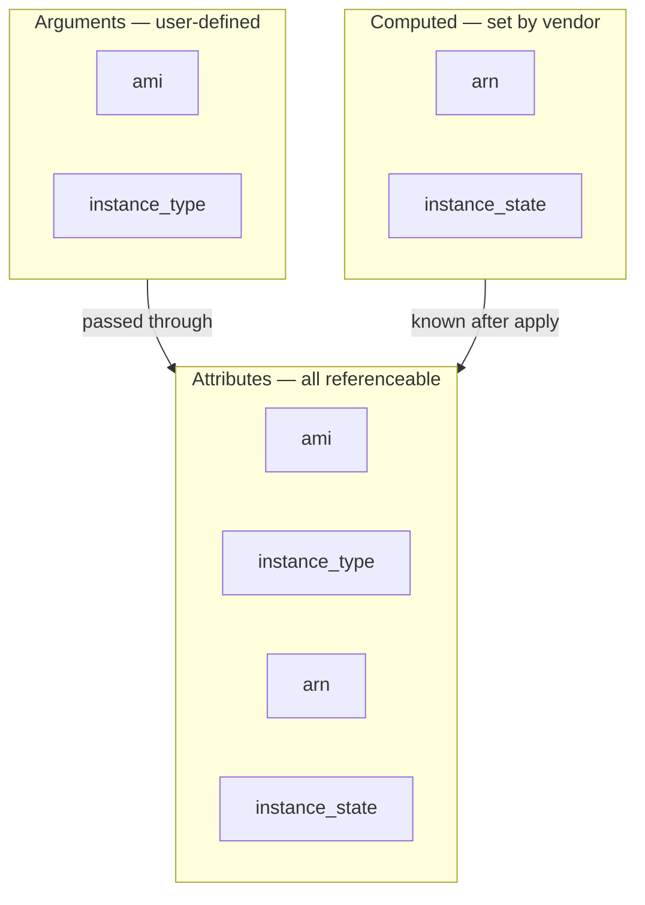

# Chapter 2 — Terraform HCL components

> *Source: Hafner (2025), **Terraform in Depth**, Chapter 2, pages 24–59.*
>
> The hands-on core of the book's foundation: build a real "Hello World" module that launches one AWS instance, then dissect every language construct that made it work — block syntax, the `terraform` settings block, providers, resources, data sources, meta arguments (lifecycle + `depends_on`), and a first look at modules and the refactoring blocks (`import`/`moved`/`removed`).
>
> 📌 **Notes adapted where version-bound.** Book written 2025; current stable is Terraform CLI **1.15.7** / OpenTofu **1.12.3** — see [[version-facts]]. Three drift points flagged inline: (1) the AWS provider is now on **major 6** (book shows `~> 4.0`/`~> 5.0`); (2) `terraform_data` (built-in, added 1.4) is the modern replacement for the `null_resource` used in the `replace_triggered_by` example; (3) "Terraform Cloud" is now branded **HCP Terraform** (the `cloud` block is unchanged). Conceptual content — blocks, meta arguments, lifecycle — is unaffected.

> 🔗 **See also:** [Providers](../../../topics/providers.md) (this chapter's §2.4 is the mechanical companion to Ch1's conceptual providers coverage) and [Core workflow](../../../topics/core-workflow.md) (§2.1.6 re-runs init/plan/apply hands-on).

---

## 2.1 Hello World

A full worked example: launch one AWS EC2 instance from scratch. The metaphor the chapter leans on — you are the **architect** writing the blueprint, Terraform is the **construction crew** that builds and updates from it.

### Research and design

Before writing code, figure out what you're launching and its dependencies. Three research sources:

- The **vendor's own docs** (AWS website) — the source of truth for the service.
- The **web console** — manual creation ("ClickOps") doesn't scale to production but is great for learning what a resource needs.
- The **Terraform provider documentation** — shows exactly which parameters a resource exposes and which are required.

For an `aws_instance`, the docs pin the minimum to three parameters:

- `ami` — the Amazon Machine Image (OS template AWS boots from).
- `instance_type` — the hardware profile (CPU/memory/features); AWS has hundreds.
- `subnet_id` — which network to launch in. *Optional* — omitting it drops the instance in the account's default subnet, which may not be where you want it.

### Creating the project

Standard project setup: a folder + `git init`, then a few `.tf` files. Terraform reads **every `.tf` file** in the directory when building a plan, so filenames are for humans, not Terraform. The book's convention:

- `providers.tf` — provider requirements + config.
- `lookups.tf` — data sources.
- `main.tf` — the bulk of the resource logic.

```bash
$ mkdir terraform_aws_modules && cd terraform_aws_modules
$ git init
$ touch {main,lookups,providers}.tf   # on Windows PowerShell use New-Item instead
```

> 💡 The book recommends WSL on Windows — many Terraform tools work best in a Linux environment.

!!! info "OpenTofu — file extensions"
    Project layout is identical, but OpenTofu adds file extensions Terraform doesn't have (OT 1.8+):

    - **`.tofu`** — read *instead of* a same-named `.tf` when present, so you can ship OpenTofu-only config (e.g. a `providers.tofu` that overrides `providers.tf`) without forking the whole project. Plain `.tf` still works and stays the portable default.
    - **`.tofurc`** — OpenTofu's CLI config file (Terraform's is `.terraformrc`); OpenTofu reads the same `TF_*` env vars as Terraform (no separate `TOFU_*` prefix — a compatibility point, not a divergence).

    `git init` and the project structure are otherwise unchanged. See [[version-facts]].

### Setup providers

HCL groups config under **blocks**; different block types configure different things. The `terraform` block configures Terraform itself (analogous to `package.json` / `pyproject.toml`). Its `required_providers` subblock declares dependencies; the separate `provider` block configures the provider.

```hcl
terraform {
  required_providers {
    aws = {
      source  = "hashicorp/aws"
      version = "~> 5.0"   # book vintage; new projects now pin ~> 6.0 (see version-facts)
    }
  }
}

provider "aws" {
  region = "us-east-1"   # typically a variable, not hardcoded
}
```

Key distinction, returned to in §2.4: **`required_providers` tells Terraform what to *install*; the `provider` block *configures* it.** You *can* skip `required_providers` for HashiCorp-namespace providers (Terraform infers them), but it's bad practice — without it you can't pin versions, so an upgrade can silently break your code.

!!! info "OpenTofu — same code, different registry & binary"
    This step is **byte-identical HCL** in OpenTofu — same `terraform` block (not renamed to `tofu`; there is no `tofu {}` block), same `required_providers`, same `provider` block. What changes:

    - **Default registry** — the shorthand `hashicorp/aws` resolves from **`registry.opentofu.org`** (OpenTofu's default host), not `registry.terraform.io`. Same short address; write the full `registry.terraform.io/hashicorp/aws` to force HashiCorp's registry.
    - **Commands** — `tofu init` / `tofu plan` / `tofu apply`.
    - **File extension** (optional) — `.tf` works in both; OpenTofu 1.8+ also reads `.tofu` files (loaded *instead of* a same-named `.tf`) for OpenTofu-only config.

    See [[version-facts]]. (Source: OpenTofu — Provider Requirements.)

### Getting our configuration values (data sources)

Of the three params, only `instance_type` is safely hardcoded (`t3.micro` — cheap, for dev). The other two should be **looked up, not hardcoded**:

- **AMI** — hardcoding pins you to a stale image; you want the newest (bug fixes, security patches) without republishing code each release.
- **Subnet** — hardcoding ties the code to one account's specific subnet, killing portability.

**Data sources** solve this: read-only blocks that look up and expose data, and can never make changes. Three used here, and they *cascade* (to look up a subnet you need a VPC — "to create A you need B, but B needs C"):

```hcl
data "aws_vpc" "default" {
  default = true
}

data "aws_subnets" "default" {
  filter {
    name   = "vpc-id"
    values = [data.aws_vpc.default.id]   # feeds the VPC id in
  }
}

data "aws_ami" "ubuntu" {
  owners      = ["099720109477"]   # Canonical's AWS account (Ubuntu publisher)
  most_recent = true               # always the latest published image
  filter {
    name   = "virtualization-type"
    values = ["hvm"]
  }
  filter {
    name   = "name"
    values = ["ubuntu/images/hvm-ssd/ubuntu-focal-20.04-amd64-server-*"]
  }
}
```

### Creating an instance

The `resource` block maps data-source attributes onto the instance's parameters:

```hcl
resource "aws_instance" "hello_world" {
  ami           = data.aws_ami.ubuntu.id
  subnet_id     = data.aws_subnets.default.ids[0]   # aws_subnets returns a list; take the first
  instance_type = "t3.micro"                        # cheapest option; overridable via variable in Ch3
}
```

Note `subnet_id` indexes `[0]` because `aws_subnets` returns a *list* of IDs. Instance-type default is kept cheap deliberately — infrastructure costs money, so a default shouldn't surprise anyone with a big bill.

### Running Terraform

Providers have **no standard config** — each uses its own system. The AWS provider reuses the standard AWS credential chain (same as Boto3 / the AWS CLI), so `aws configure` sets you up. Then the workflow:

```bash
$ terraform init    # downloads configured providers/modules, writes .terraform.lock.hcl
$ terraform plan -out plan.tfplan
$ terraform apply "plan.tfplan"
```

Plan-output semantics reinforced from Ch1: `+ create`, values shown as `(known after apply)` when they can't be resolved until the resource exists, and a final `Plan: 1 to add, 0 to change, 0 to destroy.` The payoff framing: the same single-instance script runs unchanged across regions/accounts, and the leap from one instance to a full stack (LBs, queues, CDN, DB) is *only* the time spent defining it — once written, it launches repeatedly the same way.

!!! info "OpenTofu — commands & the lock file"
    Substitute `tofu init` / `tofu plan` / `tofu apply` — same flags, same plan output. One real difference at `init`: OpenTofu **1.12** writes **full cross-platform provider checksums** into `.terraform.lock.hcl` automatically, so a lock generated on macOS won't break a teammate's Linux CI. Terraform records only your own platform's hashes unless you pre-seed them with `terraform providers lock -platform=…`. Both tools write the same `.terraform.lock.hcl` filename and share the state-file format. See [[version-facts]].

## 2.2 Block syntax

**Blocks are the nouns of Terraform** — concrete items (config or infrastructure). Almost all your time is spent creating nouns (blocks) and linking them. Every block shares one structure: an outer identifier layer, plus arguments and subblocks that modify behavior.

```hcl
type "label" {
  parameter1 = "value"    # strings
  parameter3 = true       # booleans
  parameter4 = 12         # numbers
  parameter5 = { key = "value" }   # objects
  parameter6 = null       # the null type

  subblock {              # subblocks have no label...
    sub_parameter1 = "value"
  }
  subblock { ... }        # ...and can repeat
}
```

The first word is the **block type** (defines how everything else is interpreted); quoted **labels** follow; arguments and subblocks live in the braces.

### 2.2.1 Block types

HCL is not Terraform-only — Packer, Consul, and Nomad each have their *own* flavor of HCL with different block types. You need none of that to use Terraform. At the time of writing, Terraform HCL has **12 block types**:

| Block | Purpose |
|---|---|
| `terraform` | Configure Terraform and the current workspace. |
| `provider` | Provider-specific settings. |
| `resource` | Create/update a piece of infrastructure (subtypes from providers). |
| `data` | Read-only lookup of existing infrastructure (subtypes from providers). |
| `variable` | External inputs into a program/module. |
| `locals` | Internal variables scoped to a module. |
| `module` | Reusable abstraction of HCL code. |
| `import` | Pull existing infrastructure into Terraform. |
| `moved` | Refactoring — rename/relocate resources. |
| `removed` | Mark an item removed *without* destroying it. |
| `check` | Validate deployed infrastructure. |
| `output` | Share data out of a module to other modules/workspaces. |

!!! info "Terraform 1.10 added a 13th: `ephemeral`"
    The book's list of 12 predates it. **Terraform 1.10** (Nov 2024) added the top-level **`ephemeral`** block (two labels, like `resource`/`data`) — a temporary resource whose data is **never written to state or plan files**, for short-lived secrets/tokens. So current Terraform has **13** top-level block types. OpenTofu added ephemeral resources in **1.11**.

`terraform` + `provider` are set once when starting a project; **`resource` blocks are the most important** — everything else supports them (supplying config values or organizing them into reusable components).

### 2.2.2 Labels and subtypes

Labels are the biggest differentiator between block types. Three strategies:

- **No labels** — `terraform` and `locals`. There's only one `terraform` block per module, so nothing to distinguish.
- **Single label** (user-chosen) — `variable`, `provider`, `output`, `module`. Exception: a `provider` block's label must map back to a name in `required_providers`.
- **Subtype + label** — `data` and `resource`. First label is the **subtype** (e.g. `aws_instance`) which ties the block to a provider and says what it does; second label is a unique **identifier**.

Block type + labels combine into a **unique reference string** used to pass attributes between blocks:

| Block type | Subtype / 1st label | 2nd label | Full reference |
|---|---|---|---|
| `resource` | `aws_instance` | `hello_world` | `resource.aws_instance.hello_world` |
| `data` | `aws_vpc` | `default` | `data.aws_vpc.default` |
| `variable` | `instance_type` | — | `var.instance_type` |

Sometimes the leading block-type word is **dropped** — for arguments that only accept one block type. E.g. `depends_on` takes resource references with the `resource.` prefix omitted.

### 2.2.3 Arguments and subblocks

If blocks are nouns, **arguments and subblocks are adjectives** — they modify behavior.

- **Arguments** — `name = value` assignments. An argument name can appear **only once** per block. The value can be any Terraform expression (more in Ch4).
- **Subblocks** — nested blocks, **no labels**, and (unlike arguments) can **repeat**. Common for stacking `filter`s on a data source, or firewall rules on a GCP firewall.

!!! warning "Subblock vs. object-valued argument — the confusing case"
    They look alike. The tells: an **argument** uses `=` and can appear once; a **subblock** has *no* assignment character and can appear many times.

    ```hcl
    parameter5 = { key = "value" }   # argument with object value — has '=', once only
    filter { name = "x"  values = [...] }   # subblock — no '=', repeatable
    ```

Repeatable subblocks serve **two distinct purposes** in practice:

- **Multiple configs of the same type** — a `google_compute_firewall` stacks several `allow` subblocks, one per rule:

    ```hcl
    resource "google_compute_firewall" "example" {
      name    = "example-firewall"
      network = google_compute_network.example.name
      allow { protocol = "icmp" }
      allow { protocol = "tcp"  ports = ["80", "443"] }
      allow { protocol = "udp"  ports = ["53"] }
      source_ranges = ["0.0.0.0/0"]
    }
    ```

- **Namespacing / future-proofing** — the `lifecycle` subblock (§2.7.2) groups related settings so Terraform can add new arguments later without colliding with vendor-provided arguments.

Resource/data arguments come from the *provider*; module arguments are defined by the *module author*; built-in blocks have a more consistent, fixed set.

### 2.2.4 Attributes

Blocks **export attributes** — this is what lets one block feed another (a data source's subnet ID → a resource's `subnet_id`). Two sources of attributes:

- Most blocks (incl. `data`/`resource`) **auto-expose all their arguments** as attributes.
- Plus **read-only computed attributes** that only exist after a plan/apply reads results back from the provider (e.g. `aws_instance` exposes `arn` and `instance_state` only after creation).

The `aws_instance` attribute set is the union of both sources — the arguments you set *plus* the values the vendor computes (recreation of the book's Fig 2.1):



!!! note "Subblocks are not attributes"
    Arguments pass through as attributes, but **anything inside a subblock is not accessible as an attribute.**

!!! tip "Inspecting a block's arguments & attributes — `terraform providers schema -json`"
    To see every argument and attribute a resource/data source exposes (offline, no registry visit), dump the provider schema after `init`:

    ```bash
    terraform init
    terraform providers schema -json \
      | jq '.provider_schemas["registry.terraform.io/hashicorp/aws"].resource_schemas.aws_instance.block'
    ```

    The flags map onto this section's argument/attribute split:

    | Schema flag | This chapter's term |
    |---|---|
    | `required` / `optional` | **argument** (input you set) |
    | `computed` only | read-only **attribute** (`(known after apply)`) |
    | `optional` + `computed` | settable, else provider-filled |
    | `block_types` | **subblocks** (§2.2.3) |

    `-json` is the only output format. The human equivalent is the resource's Registry docs (*Argument Reference* / *Attribute Reference*). (`ephemeral_resource_schemas` in the output needs Terraform ≥1.10 / OpenTofu ≥1.11 — see [[version-facts]].)

### 2.2.5 Ordering

**Block order is meaningless.** Unlike an imperative language where statements run top-to-bottom, Terraform blocks can be written in any order, any file, without changing the plan. During `plan`, Terraform builds a **DAG** by inspecting which attributes exposed by one block are used as arguments in another — that reference *is* the dependency edge. (`depends_on` handles the case where a dependency exists but no attribute is shared — see §2.7.)

### 2.2.6 Style

Terraform has an opinionated style; it's **advisory** (ignoring it won't break plans) but makes code readable:

1. **Meta arguments** at the top.
2. **Block-specific arguments** next (groups separated by a single blank line).
3. **Block-specific subblocks** next.
4. **Meta-argument subblocks** (e.g. `lifecycle`) at the **end**.

Also: align the `=` signs within an argument group. `terraform fmt` auto-applies the formatting rules — **but it does *not* reorder arguments.** The official [Style Guide](https://developer.hashicorp.com/terraform/language/style) is the reference.

> 💡 Inside an object value, both `key : "value"` and `key = "value"` are valid separators — the book notes `=` is considered best practice.

## 2.3 Terraform settings

The `terraform` block is the container for Terraform-specific settings:

- **`required_providers`** — the dependency list (§2.4.2).
- **`backend` / `cloud`** — centralized state config for team workspaces (§2.3.1).
- **`experiments`** — opt into unstable in-progress features (§2.3.2).
- **Version requirements** — pin which Terraform versions the code supports, so it won't run on a version missing required features.
- **Provider metadata** — only relevant to provider *distributors*; you'll likely never touch it.

### 2.3.1 Backend and cloud blocks

Both configure where **state** is stored so a team can share one workspace. If neither is set, Terraform uses the **local backend** (state as a JSON file on disk) — fine for dev, never for production.

- **`backend`** — the long-standing block; supports S3, GCS, AzureRM, Consul, and more. Includes the "enhanced" `remote` backend that adds functionality beyond state storage (deep dive in Ch6).
- **`cloud`** — newer block, used *instead of* `backend`, for HCP Terraform / self-hosted Terraform Enterprise. Ch2 presents it as HCP-Terraform-only with others possibly adopting it later; **the book's own Ch6 overtakes that** — §6.4 describes the block as a standard third parties implement and names **Scalr and Env0** as having adopted it ([Ch6 notes](06-state-management.md)). Read the Ch2 framing as the introductory version.

!!! note "Backends are hardcoded into Terraform"
    Unlike providers, you **can't write a custom backend** directly. The escape hatch is the generic **`http` backend** — implement a simple REST API and Terraform will use it. Rarely needed. Only *one* of `backend` or `cloud` may be set.

!!! info "OpenTofu differences — state & backends"
    Three divergences here (see [[version-facts]]):

    - **`cloud` block — correction (2026-08-13): OpenTofu has one too.** This note previously said the block was Terraform-only and that OpenTofu projects must use `backend`. That is wrong. `internal/configs/cloud.go` exists in OpenTofu, `parser_config.go` decodes a `cloud` block from the schema, and the 1.6 changelog discusses its behaviour. The real divergence is smaller and is about defaults: Terraform's `cloud` block defaults the hostname to `app.terraform.io`, while **OpenTofu requires `hostname` to be set explicitly** and errors with *"Hostname is required for the cloud backend"* (`internal/cloud/backend.go`) if it is not. So OpenTofu can drive HCP Terraform or any TFE-compatible endpoint; what it will not do is silently assume HashiCorp's SaaS. What OpenTofu genuinely lacks is a hosted service of its own, not the block.
    - **State encryption is OpenTofu-only** (OT 1.7) — encrypt state *and* plan files at rest natively. Terraform has no built-in equivalent. This is the biggest backend-chapter gap between the tools.
    - **Early variable evaluation** (OT 1.8) — OpenTofu can reference `var`/`local` **inside** `backend` blocks (resolved at `tofu init`). Terraform requires backend config to be literals. See [[ot-early-eval-backend]].

### 2.3.2 Experiments

An **experiment** is a new feature not yet production-ready — shipped but disabled by default, opted in via `experiments = [...]`. Their APIs can change or be removed between versions, so a project using one is **locked to a specific Terraform version** and can't safely auto-upgrade. Terraform warns whenever experiments are enabled. Great for kicking the tires and giving feedback; avoid in production.

> 📌 **Version note** — the book's example enables `module_variable_optional_attrs`, which it flags as "no longer active." That experiment graduated into the stable `optional()` modifier for object type constraints (Ch3/Ch4 territory). Check your version's changelog for currently-available experiments.

## 2.4 Providers

Terraform core is just an engine for ordering create/update operations — it has **no idea what the components are**. Providers supply that. Mental model: **providers are like vendor SDKs** in other languages — you install one at a chosen version, configure it with credentials, and it exposes the vendor's building blocks (here: resources + data sources rather than functions/classes). Each provider is tied to a single vendor; you can run **multiple instances** of one provider (like multiple SDK clients) via aliases (§2.4.4).

### 2.4.1 Provider registry

Public providers live on the **Terraform Registry** (`registry.terraform.io/browse/providers`). `terraform init` downloads the workspace's providers from there and configures them locally. The registry also hosts provider **docs**, which are extensive — the author's tip: when learning an unfamiliar service, browse its provider's resource list first to build a mental model.

### 2.4.2 Required providers

The `required_providers` subblock (inside `terraform`) declares which providers are needed:

```hcl
terraform {
  required_providers {
    aws = {
      source  = "hashicorp/aws"   # public registry, HashiCorp namespace
      version = "~> 4.0"          # latest in the 4.x line (book vintage — now ~> 6.0)
    }
  }
}
```

**Provider inference:** if a resource/data source has no matching entry, Terraform guesses — it assumes the first part of the resource type is the provider's local name and the namespace is `hashicorp`. So `random_id` → `hashicorp/random`, `aws_instance` → `hashicorp/aws`. Convenient but discouraged — always declare providers explicitly so you can pin versions.

### 2.4.3 Provider configuration

Requirements live in `terraform`; the actual config lives in a **separate `provider` block**. Config generally serves two purposes — **authentication** and **scoping**:

```hcl
variable "cloudflare_api_token" {}

provider "cloudflare" {
  api_token = var.cloudflare_api_token   # auth
}

provider "aws" {
  region = "us-west-2"          # scoping — where to operate
}

provider "google" {
  project = "example_project"   # GCP scopes by project...
  region  = "us-central1"       # ...and region
}
```

Every provider has its own config system, and many also read from **files or environment variables** — so a `provider` block isn't always required (the Hello World AWS provider gets credentials from the env/AWS config files, and only sets `region` in code). Always read the provider docs for a new provider.

!!! note "Provider blocks are root-module only"
    You can only define `provider` blocks in the **root module** — the directory you run `terraform`/`tofu` from. Providers are configured for the whole workspace at that level.

### 2.4.4 Provider aliases

To connect to the same vendor with **different settings** (multiple regions, multiple accounts), define multiple `provider` blocks distinguished by an **`alias`**. One block is the default (no alias); each alias is a named alternate. Data/resource blocks then select an alias via the `provider` argument:

```hcl
provider "aws" {                 # default
  region = "us-east-1"
}
provider "aws" {
  alias  = "west"                # non-default; used only when named
  region = "us-west-2"
}

data "aws_vpc" "backup" {
  provider = aws.west            # explicitly use the alias
  default  = true
}
```

This is a preview of the `provider` **meta argument** (§2.7.1) — the mechanism that tells a block which alias to use.

!!! info "OpenTofu difference — provider `for_each`"
    Ch2's aliases are **static** — one hand-written `provider` block per connection. OpenTofu (1.9) adds **provider `for_each`**: instantiate an aliased provider config from a map/set, e.g. one AWS provider per region without copy-pasting blocks. Terraform's open-source CLI has no equivalent. See [[ot-provider-for-each]].

## 2.5 Resources

Resources are the **whole reason Terraform exists**; everything else just makes managing them easier. Each `resource` block represents one real piece of infrastructure to launch and manage. Its **type** maps, through a provider, to a specific infrastructure kind (a DNS provider might have domain + record resources; a Git host might have org/repo/PR resources; big clouds expose *thousands*).

### 2.5.1 Resource usage

A resource = type + identifier + arguments (arguments are type-specific):

```hcl
resource "aws_instance" "hello_world" {
  ami           = data.aws_ami.ubuntu.id
  subnet_id     = data.aws_subnets.main.ids[0]
  instance_type = var.instance_type
}
```

Type + name form a **unique identifier** within a module/workspace: two resources can't share both type *and* name, but two *different* types can share a name. Overwhelming as "hundreds of thousands of resources" sounds, once you know your vendors and roughly what you're building, the list narrows fast — architect the system before coding it.

## 2.6 Data sources

The read-only counterpart to resources: same shape (types, identifiers, arguments, attributes) but they **never create or modify** — they search/filter and expose data. The Hello World example's three (`aws_vpc`, `aws_subnets`, `aws_ami`) show the range: simple single-argument lookups up to multi-`filter` searches.

**Failure behavior depends on the data source.** Most (e.g. `aws_ami`) **throw an error and halt the plan** when no match is found. Others tolerate it: data sources that look up a *dynamic number* of resources can return **zero results** — `aws_subnets`, for instance, can return an empty `ids` list.

## 2.7 Meta arguments

Regular arguments change the *infrastructure* (they map to vendor config fields). **Meta arguments change how *Terraform* processes a block** — they're built into HCL, universal to a block type, and independent of the provider. They exist purely to give Terraform planning instructions (ignore certain changes, reorder creation, force replacement).

!!! warning "Meta arguments must be known early"
    They're processed **very early** in planning, so many require **literal** values (or at least values known at plan time). A `true`/`false` meta argument must be *literally* `true`/`false` — not an expression that resolves to one, and never a value that depends on an attribute only known post-apply. (This is exactly the limitation OpenTofu's [[ot-dynamic-prevent-destroy]] lifts for `prevent_destroy`.)

### 2.7.1 provider

The `provider` meta argument selects which **alias** a block uses when you have multiple configs for one vendor (multiple AWS accounts / GCP projects). Optional — Terraform always has one default provider per type, so you only need it to pick a non-default alias. (Shown in §2.4.4.)

### 2.7.2 lifecycle

A **subblock** (declarable **once** per resource) holding arguments that change how Terraform manages the resource. It's a subblock deliberately: new options can be added over time without colliding with vendor-provided arguments.

**`create_before_destroy`** — by default Terraform **destroys then creates** on replacement (safer default: many resources have unique identifiers that can't be duplicated — two IAM roles can't share a name, two instances can't share an Elastic IP, so create-first would error). Set `true` to flip it for **high-availability** cases where even brief loss hurts:

```hcl
lifecycle {
  create_before_destroy = true
}
```

**`prevent_destroy`** — set `true` and any plan that would destroy the resource **fails**. Use *exceedingly rarely* — three problems:

- Only takes **literal** values → can't enable for prod while disabling for dev.
- Blocks destroy plans → breaks spinning up/tearing down temporary environments.
- **Deleting the `resource` block removes the setting too** — one of the most common destroy paths, and the guard vanishes with the block.

Better to guard against accidental destruction with `ignore_changes`. (`prevent_destroy` earns its keep in narrow compliance cases, e.g. logs that mustn't be deleted.)

!!! info "OpenTofu differences — lifecycle"
    OpenTofu directly fixes the `prevent_destroy` limitation the book calls out:

    - **Dynamic `prevent_destroy`** (OT 1.12) — bind it to a **variable/expression**, so you *can* enable it for prod and disable it for dev. Terraform still requires a literal. See [[ot-dynamic-prevent-destroy]].
    - **`destroy = false`** (OT 1.12) — makes OpenTofu **stop managing** a resource without deleting the real thing. Normally, when Terraform decides a resource should go away, it destroys the actual cloud object. With `destroy = false`, OpenTofu just forgets the resource (drops it from state) and leaves the running object alone. Same outcome as Terraform's `removed` block (§2.9), but written as one line inside the resource's `lifecycle` instead of a separate top-level block. ⏳ **Converging:** Terraform **1.16** adds the identical resource-level argument, so this stops being a divergence once 1.16 is stable (rc1 as of 2026-08-13). Through 1.15 the `removed` block remains Terraform's only route.
    - **`enabled`** (OT 1.11) — a `lifecycle` argument that toggles a resource on/off, cleaner than the `count = 0` idiom.

    `create_before_destroy`, `ignore_changes`, and `replace_triggered_by` behave identically in both tools.

**`ignore_changes`** — probably the **most-used** lifecycle option. Takes a list of argument names; Terraform stops updating the resource when *only* those change (ignores them entirely after creation). Classic cases: the looked-up AMI updating (don't recreate a running instance on every new image), or orchestration systems (EKS/ECS) adding/removing tags out of band.

```hcl
lifecycle {
  ignore_changes = [ami]   # AMI change won't replace this instance
}
```

The special value **`all`** (note: **not** in brackets) ignores *every* change — Terraform creates the resource then never updates it (still reads it for attributes, but effectively read-only after launch). Often used to stop replacement: since only some fields force replacement, listing them in `ignore_changes` keeps the resource from being recreated while still allowing other updates — preferable to `prevent_destroy` since it doesn't block destroy plans.

**`replace_triggered_by`** — force a replacement when *another* resource changes. Takes a list of resource **references** (any change → replace) or specific **attribute** references (only that attribute's change → replace). Cannot be a variable — must be a resource or resource attribute.

```hcl
resource "terraform_data" "replace_instance" {   # book uses null_resource; terraform_data is the modern built-in
  triggers_replace = [var.instance_type]
}

resource "aws_instance" "hello_world" {
  ami           = data.aws_ami.ubuntu.id
  subnet_id     = data.aws_subnets.default.ids[0]
  instance_type = var.instance_type
  lifecycle {
    replace_triggered_by = [terraform_data.replace_instance]
  }
}
```

> 💭 (mine): the book's example uses `null_resource` with a `triggers` map. `terraform_data` (built-in since 1.4) does the same "state-only" job with no provider dependency and uses `triggers_replace` — prefer it for new code. See [[version-facts]].

`replace_triggered_by` is a newer language feature — an example of provider functionality (the `random` provider's `keepers`, the `null` provider's `triggers`, both covered in Ch8) getting promoted into Terraform core for all resources.

### 2.7.3 Explicit dependencies (`depends_on`)

Terraform maps most dependencies **implicitly** from attribute references. `depends_on` handles the case where two resources depend on each other but **share no attribute**. It takes a list of **block references** (the `resource.` prefix dropped, since only resources can be depended on):

```hcl
resource "aws_internet_gateway" "main" {
  vpc_id = aws_vpc.main.id
}

resource "aws_nat_gateway" "example" {
  subnet_id = aws_subnet.example.id
  depends_on = [aws_internet_gateway.main]   # no shared attribute, but NAT won't work until IGW is up
}
```

Canonical example: an AWS **NAT Gateway** needs the **Internet Gateway** up first, but takes no argument referencing it (there's only ever one IGW per VPC), so the ordering must be stated explicitly. Used in a `module` block, `depends_on` propagates to *all* resources in that module.

## 2.8 Modules

Modules are the primary reuse/sharing mechanism — a deep topic held for **Ch3**; here just the block. The `module` block resembles a resource and even accepts some of the same meta arguments, but its body is HCL written by a developer. Three module-specific meta arguments:

- **`source`** (required) — where to fetch the module: a registry URL, a local filesystem path, or a Git reference.
- **`version`** — allowed version range (registry sources only), so consumers control when they pick up updates.
- **`providers`** — which provider aliases from the caller get passed into the module.

```hcl
module "vpn" {
  source     = "tedivm/dev-vpn/aws"   # public registry module
  version    = "~> 1.0"
  identifier = "my-vpn"               # module's own arguments (from its variable blocks)
  subnet_ids = data.aws_subnets.default.ids
}
```

A module's arguments come from its `variable` blocks; its attributes come from its `output` blocks.

## 2.9 Import, moved, and removed

Three refactoring blocks (full treatment in Ch9), added over successive releases:

| Block | Added | Purpose |
|---|---|---|
| `import` | v1.5.0 | Bring existing (e.g. console-created) infrastructure under Terraform without recreating it. |
| `moved` | **v1.1.0** | Tell Terraform a resource moved/renamed in your code, re-associating existing state. (The book §2.9 says v1.5.0 — that's an error; `moved` shipped in **1.1**, only `import` was v1.5.0.) |
| `removed` | v1.7.0 | Take an item out of state, destroying the object **unless** you write `lifecycle { destroy = false }`. **⚠️ The book states this backwards — see the box below.** |

!!! warning "📌 Book error — `removed` has always destroyed by default"
    **Corrected 2026-08-21.** This box previously called the book stale, claiming `removed` was *forget-only* in v1.7 and gained `destroy` later. That is wrong, and the correction matters because it changes who is at fault.

    Verified in the source: `internal/configs/removed.go` at tag **`v1.7.0`**, the release the block shipped in, already declares `Destroy bool`, already parses `lifecycle { destroy }`, and already defaults it to **`true`**. The v1.7.0 CHANGELOG announces both directions, and the v1.7 docs already showed `destroy = false` in their only example.

    So there is **no version in which a bare `removed` block was safe**, and the book's "mark an item removed *without* destroying it" was imprecise when written rather than overtaken by a change. To get the behaviour the book describes you must write:

    ```hcl
    removed {
      from = aws_instance.legacy
      lifecycle { destroy = false }
    }
    ```

    Verified on **v1.15.6**: without `lifecycle`, `plan` reports `1 to destroy`; with `destroy = false` it reports `0 to destroy` and warns the object "will no longer be managed by Terraform, but will not be destroyed." The `destroy = true` form is also what lets a **destroy-time provisioner** inside a `removed` block execute. (See [[tf-block-removed]].)

**`import`** — the block form superseded the `terraform import` *command's* limitations: putting imports in code lets them be reviewed during `plan` and automated across environments. From **v1.6** the `id` can be a variable or data source (v1.5 required a hardcoded literal). Once imported, the blocks can be removed (they're ignored after doing their job) — but leaving them in makes the code harder to reuse in fresh environments with nothing to import.

```hcl
import {
  to = aws_instance.main
  id = "i-1234567890abcdef0"   # literal in v1.5; variables/attributes allowed from v1.6
}

resource "aws_instance" "main" {
  # required arguments
}
```

**`moved`** — associates existing state with a new location (renamed block, or code moved into a module) without recreation. **No downside to leaving it in place**: if Terraform finds nothing to move, it just creates a new resource as normal, so it's safe on new projects and safe inside **published modules**.

```hcl
moved {
  from = module.bad_unclear_name
  to   = module.better_name
}
```

!!! info "OpenTofu — all three identical, plus one shortcut"
    `import`, `moved`, and `removed` all work the **same** in OpenTofu (same syntax; `import` supports `id`/`identity`, `count`/`for_each`). OpenTofu adds one alternative to the `removed` block: put **`destroy = false`** directly in a *resource's* `lifecycle` (OT 1.12) to forget it from state without destroying the real object — see §2.7.2. ⏳ Terraform **1.16** adds the same argument, closing this gap. Verified against OpenTofu docs; see [[version-facts]], [[release-feature-map]].

---

## Summary

- The Terraform language is centered on **blocks** (nouns), modified by **arguments/subblocks** (adjectives), which **export attributes** that wire blocks together.
- The `terraform` **settings** block configures providers, backend/`cloud` state storage, version requirements, and experiments.
- **Data sources** are read-only lookups; **`resource` blocks** are the point of the whole tool — they create and manage infrastructure.
- **Meta arguments** (`provider`, `depends_on`, and the `lifecycle` subblock: `create_before_destroy`, `prevent_destroy`, `ignore_changes`, `replace_triggered_by`) change *how Terraform plans*, not the infrastructure itself, and mostly require plan-time-known literal values.
- **Modules** (Ch3) abstract resources/data sources into reusable units; **`import`/`moved`/`removed`** (Ch9) support refactoring — bringing infra in, relocating it, and dropping it from management without destroying it.

---

## References

- Terraform Style Guide: <https://developer.hashicorp.com/terraform/language/style>
- Meta arguments reference (`lifecycle`, `depends_on`, `provider`): <https://developer.hashicorp.com/terraform/language/meta-arguments/lifecycle>
- `terraform_data` (modern `null_resource` replacement): <https://developer.hashicorp.com/terraform/language/resources/terraform-data>

---
Related: informs [[providers]] (§2.4 — the mechanical "how to declare/configure/alias a provider" companion to Ch1's conceptual coverage) and [[core-workflow]] (§2.1.6 hands-on init/plan/apply). Feeds learning-path milestones **B2 — HCL & configuration language**, **B5 — Providers & resources**, and previews **B3 — Variables & modules** (Ch3) and refactoring in **I-series testing/refactoring** (Ch9). Version drift tracked in [[version-facts]].
