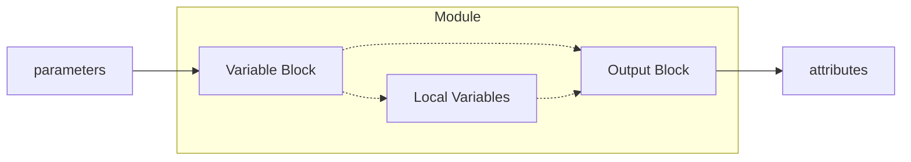

# Chapter 3 — Terraform variables and modules

> *Source: Hafner (2025), **Terraform in Depth**, Chapter 3, pages 60–87.*
>
> Reusability is IaC's big promise. This chapter delivers it: **modules** (the sharing unit), the **three "variables"** (input / output / local), Terraform's **type system**, **input validation**, **sensitive data**, and a full worked refactor of Ch2's Hello-World program into a reusable, published EC2 module.
>
> 📌 **Notes adapted where version-bound.** Book written 2025; current stable is Terraform CLI **1.15.7** / OpenTofu **1.12.3** — see [[version-facts]]. Drift points flagged inline: (1) the AWS provider now pins **`~> 6.0`** (book shows `~> 4.0`/`~> 5.0`); (2) the book's own claim "as of Terraform **1.9**, a `validation` condition can reference other variables" is still current (1.9 shipped Jun 2024, see [[feature-history]]); (3) `optional(type, default)` graduated from experimental in **1.3** and is stable. Conceptual content — modules, the variable trio, the type system — is unaffected.

> 🔗 **See also:** [Modules](../../../topics/modules.md) (backlog — this chapter is its full-treatment source) and [Providers](../../../topics/providers.md) (§3.8's provider/`required_providers` split continues Ch2's coverage).

---

## Intro — modules vs providers

Terraform promotes reusability through **modules**. Modules differ from providers:

- Modules are **pure HCL** — no Go plugin. A module **cannot define new resource types**; it composes the resources/data sources that providers supply.
- Modules are **not vendor-specific** — one module can mix resources from multiple providers.
- Providers expose **low-level** components (one resource ≈ one infra object); modules build **higher-level abstractions** over systems of many components (e.g. a "network stack" module, a "launch a Kubernetes cluster" module).

## 3.1 Modules

The standard way to share Terraform code between projects. Metaphor: a module is like a **package** (Python/JS) — a bundle of related, reusable code. Better metaphor: a **function** — inputs (parameters), internal logic, and outputs (return values).

!!! note "Definition"
    A module is a collection of data sources, resources, and assets (config files, templates) bundled into a reusable, distributable component.

Three flavors:

- **Root module** — where every project starts; configures providers and calls other modules. `terraform init` inside a root module creates a **workspace**. (Ch2's Hello World was a root module.)
- **Shared module** — pulled from Git or a **Terraform Module Registry**; public (third-party) or a private team registry.
- **Submodule** — distributed *inside* another module; usually coupled to its parent, so not shipped separately.

### 3.1.1 Module usage

Modules have their own block type, similar to `resource` and accepting some of the same meta arguments. Three **module-specific meta arguments**:

- **`source`** *(required)* — where to fetch the module: a registry address, a filesystem path, or a Git repo.
- **`version`** — allowed version range (registry sources only); lets you lock updates so upstream changes don't surprise you.
- **`providers`** — which provider aliases from the calling module get passed into the called module.

```hcl
module "vpn" {
  source  = "tedivm/cloudinit/general"   # download from the public registry
  version = "~> 1.0"                      # version-constrained, just like a provider

  services = ["consul", "nomad"]          # the module's own arguments
}
```

A module's **arguments come from its `variable` blocks**; its **attributes come from its `output` blocks** (the main topic of the rest of the chapter).

!!! info "OpenTofu — variables in `source` (early evaluation)"
    In Terraform the module `source` must be a **literal string** — you cannot interpolate a `var`/`local` into it. OpenTofu **1.8** added **early variable/locals evaluation**, so `source` (and `backend` config, and state-encryption blocks) *can* reference `var`/`local`, resolved at `tofu init`. Terraform 1.15 only partially closes this via `const` + dynamic module sources. See [[ot-early-eval-backend]] and [[version-facts]].

**Module file structure.** A module is several `.tf` files in one directory. The community-standard layout ([HashiCorp docs](https://developer.hashicorp.com/terraform/language/modules/develop/structure)) is a convention, not a technical requirement — one-file modules work fine.

| Path | Purpose |
|---|---|
| `variables.tf` | all module inputs |
| `outputs.tf` | all module outputs |
| `main.tf` | main entry point / resources (simple modules may only need this) |
| `*.tf` | additional resource files, grouped as the project sees fit |
| `README.md` | docs — pulled into the module registry page |
| `modules/` | submodules, each following this same structure |
| `templates/` | templates, if used |
| `examples/` | usage examples |

!!! note "(mine)"
    The book's Table 3.1 labels it `output.tf` (singular) but every listing uses **`outputs.tf`** (plural). The plural is the [Style Guide](https://developer.hashicorp.com/terraform/language/style) convention (see [[tf-style-guide]]). Use `outputs.tf`.

### 3.1.3 Root module

The **entry point**. When you run `terraform init`/`apply`, Terraform reads every `.tf` in the **current working directory** — those files are your root module. It's the **only** place you can configure providers (the `provider` block). A root module typically mixes resources and calls to other modules. (C/Java analogy: the `main` function.)

### Submodules

Modules that live *inside* a parent, stored in the parent's **`modules/`** directory (strong convention, not enforced). Used to split functionality into smaller pieces; follow the same file structure and can be tested individually. Submodules-of-submodules are technically possible but considered bad practice (complexity).

### Module registries

Modules can live in Git or on a filesystem, but a **registry** is far more common — registries tie into version control and cut a release on each Git **tag**.

- **Public** — the largest is [registry.terraform.io](https://registry.terraform.io/browse/modules) (~12,000 modules), alongside the provider registry. Vet a public module: update cadence, backward-compat commitment / upgrade docs, group-vs-individual maintenance, code quality.
- **Private** — run by companies for their teams; self-hosted or via services like HCP Terraform / Spacelift. `terraform login` stores a token to download; pushes are triggered by a Git tag.

## 3.2 Input, output, and local variables

Terraform has **three** things it calls "variables" — the difference is all about **how each interacts with a module** (the function metaphor):

| "Variable" | Role | Function analogy |
|---|---|---|
| **Input** (`variable` block) | data sent *into* a module | function argument |
| **Output** (`output` block) | data pulled *out of* a module | return value |
| **Local** (`locals` block) | internal-only value/logic | local variable inside the function |

The three wire together like a function: **parameters** flow in through the variable block, optionally pass through **local variables** for internal transforms, and leave through the output block as **attributes** (recreation of the book's Fig 3.1):



*Figure 3.1 — Module scope for inputs, outputs, and locals. Only `parameters` (inputs) and `attributes` (outputs) cross the module boundary; locals stay inside.*

Scope rule (Figure 3.1, above): from *outside* a module you can only set its **inputs** and read its **outputs**; **locals are invisible** outside the module. Like resources, locals **cannot have circular dependencies** (revisited Ch5).

!!! note "\"parameter\" vs \"argument\" — the figure conflates two sides"
    The figure's **parameters** box and the earlier "inputs (parameters)" metaphor use *parameter* loosely for a module's input variables. Strictly, the two words name opposite ends of the same wiring:

    - **Parameter** = the *declared* input slot — the `variable` block inside the module (name + type the module expects).
    - **Argument** = the *actual value* the caller supplies for that slot — the `name = value` line inside the `module` block.

    So Figure 3.1's **parameters** = the module's declared input variables; **attributes** = its `output` values, read back as `module.<name>.<output>`. In HCL docs, every `key = value` line inside *any* block is called an "argument" — the declared side is an "input variable."

    ```hcl
    variable "services" {}                 # parameter (declared slot)

    module "vpn" {
      source   = "tedivm/cloudinit/general"
      services = ["consul", "nomad"]       # argument (value supplied)
    }
    ```

!!! warning "All Terraform variables are constants"
    A variable's value is **set once per run and never changes** during that run. Terraform is **declarative**, not imperative — it executes by dependency order, not source order, so it couldn't know *when* to apply a mid-run reassignment. To do "logic/transforms," compute new **locals** rather than mutating an existing value (functions/expressions — Ch4).

## 3.3 Input variables

Defined with the `variable` block (its label is the variable's unique name). Arguments:

- **`description`** *(optional)* — documentation; tools like [terraform-docs](https://terraform-docs.io/) generate docs from it.
- **`type`** — restricts accepted values; defaults to **any**.
- **`default`** — value used when none is provided (makes the input optional).
- **`sensitive`** — hide the value in logs/plan output; defaults to `false`.
- **`nullable`** — whether the variable may be `null`; defaults to `true`.
- **`validation`** — subblock of extra checks (§3.7); repeatable.

```hcl
variable "instance_type" {
  type        = string
  description = "The type of instance to launch."
  default     = "t3.micro"
}
```

Reference an input with the **`var`** keyword: `var.instance_type`.

### 3.3.2 Marking variables as sensitive

Terraform is **loud** — it logs/prints parameter changes during planning. Great for review, dangerous for passwords/API keys. Mark an input **`sensitive = true`** and modern Terraform masks it in output.

```hcl
variable "logging_api_key" {
  description = "The API Key for our logging service."
  type        = string
  sensitive   = true
}
```

The `sensitive` flag **follows the value** — if a sensitive input feeds a resource argument or a local, that derived value stays masked too.

!!! danger "Sensitive ≠ secret in state"
    A sensitive value is **still stored in plaintext in the Terraform state file**. Masking only affects *display*, not storage — which is why state security matters (Ch6).

### Using types for robust code

`type` restricts a variable to a category of data. Wrong type → error at plan (e.g. a string where a bool is expected), with a message naming expected vs received. Types make code robust and self-documenting. A `type` argument takes a **type constraint** — simple ones are just a keyword (`string`), complex ones (objects) are richer (§3.6). Types are **optional** (Terraform is loosely typed at the module level) but a sign of quality code.

## 3.4 Outputs

The `output` block explicitly defines the values a module **returns**. Arguments (simpler than inputs):

- **`description`** *(optional)* — docs.
- **`value`** *(required)* — the returned value, usually a resource attribute or any expression.
- **`sensitive`** — mask in logs/CLI (still saved to state).
- **`depends_on`** — explicitly force a dependency on another object.

```hcl
output "aws_instance_arn" {
  description = "The AWS Resource Name for the instance."
  value       = aws_instance.hello_world.arn
}
```

Outputs need **no special keyword** to consume — a called module's outputs are read as **attributes of the `module` block**: `module.my_instance.aws_instance_ip`. That's the composition mechanism: take one module's output, feed it as another's input.

```hcl
resource "aws_vpc_security_group_ingress_rule" "allow_access" {
  # ...
  cidr_ipv4 = "${module.my_instance.aws_instance_ip}/32"   # module output → new string
}
```

### 3.4.2 Sensitive outputs

Mark an output **`sensitive = true`** to keep it out of logs/CLI (a module generating a password should). **Important:** if an output's value derives from a sensitive value, you **must** also mark the output sensitive — otherwise Terraform assumes accidental exposure and **errors**. (Still stored in state.)

### Output dependencies

An output already depends on its own value. `depends_on` adds an explicit dependency on *another* resource — e.g. don't return an instance until its firewall rules are attached. Edge case; you can go years without needing it.

```hcl
output "load_balanced_aws_instance" {
  value      = aws_instance.hello_world
  depends_on = [aws_lb_target_group_attachment.instance_attachement]
}
```

!!! note "Deferred to Ch10"
    Preconditions on outputs are mentioned as an advanced feature deferred to Ch10.

## 3.5 Locals

Local variables exist **only inside** the module that defines them (the "variables inside the function" of the metaphor). Use for internal processing/logic. To expose one, pass it as an output's value.

Defined with the **`locals`** block — a weird block:

- Takes **no label/name**.
- Can appear **any number of times** in a module (even across files); each argument inside is one independent local. No other block behaves like this.
- Locals **can reference other locals**.

```hcl
locals {
  alpha   = 1
  bravo   = "two"
  charlie = false
}

locals {
  hotel = local.bravo   # locals can reference other locals
}
```

Reference with the **`local`** keyword (singular): `local.alpha`. You **cannot reuse an argument name** across blocks — duplicate names error. Common pattern — a reusable tags object:

```hcl
locals {
  tags = { "Author" : "Rob", "ManagedBy" : "Terraform" }
}

resource "aws_instance" "first_instance" {
  # ...
  tags = local.tags
}
```

## 3.6 Value types

Every value has a type. Types catch errors early and give rich messages. Terraform's types:

### Primitives

| Type | Keyword | Notes |
|---|---|---|
| String | `string` | Unicode-encoded (emoji OK). Supports **interpolation**: `"${var.prefix}-service"`. |
| Number | `number` | **One** type for integers, floats, and negatives — rare among languages; can be an error source when a context needs an integer but gets a float. |
| Boolean | `bool` | `true` / `false`. |

### Collections & structural types

- **List** — `list(type)`, ordered, zero-indexed elements. **Every element must be the same type.** Bare `list` becomes `list(any)` for backward compat. Nestable (`list(list(string))`).
- **Set** — `set(type)`, like a list but **no duplicates** (dupes discarded) and **no order** (can't retrieve in insertion order). Use when you need uniqueness and don't care about order.
- **Tuple** — `tuple([type, type, …])`, **fixed length**, and **each element can be a different type**: `tuple([string, string, number])`.
- **Object** — `object({ key = type, … })`, keyed collection where **each key can be a different type**; the most complex constraint; supports nesting. Values declared with `{ }`.
- **Map** — `map(type)`, like an object *but* **all values share one type** and Terraform **does not enforce a fixed set of keys** (arbitrary keys allowed — ideal for `tags`). Objects drop keys not in their constraint; maps keep any. Docs use "map"/"object" interchangeably.

```hcl
variable "example_tuple" {
  type    = tuple([string, string, number])
  default = ["alpha", "bravo", 42]
}

variable "map_of_strings" {
  type = map(string)   # any number of keys, all string-valued
}
```

**Optional object attributes** — mark a key `optional(type)` or `optional(type, default)` so a missing key falls back to `null` or the given default:

```hcl
variable "optional_keys" {
  type = object({
    alpha   = string
    bravo   = optional(string)                  # → null if unset
    charlie = optional(string, "default_string") # → "default_string" if unset
  })
}
```

!!! info "Optional attrs — stable since Terraform 1.3"
    `optional(type, default)` graduated from the `module_variable_optional_attrs` experiment in **Terraform 1.3**; stable everywhere now (the experiment Ch2 §2.3.2 flagged as "no longer active"). See [[feature-history]].

!!! tip "Keep variables simple"
    Deep nesting / complex objects hurt readability. If an input gets very complex, split it into several simpler inputs.

### Special types

- **`null`** — the "not set" value. Common as an optional input's `default = null`, so a module can check `var.x != null` to tell whether the user set it. **`null` can't be used as a type constraint.**
- **`any`** — accepts any type; the **default** for untyped variables and for child-type slots (`list(any)`). Even under `any`, a list/map still requires all elements to share one type.

## 3.7 Validating inputs

Catch misconfigurations **early** — before a slow `plan`/`apply`, and before a bad value causes a hard-to-trace outage. The **`validation`** subblock lives inside `variable`, is repeatable, and has two fields:

- **`condition`** — must evaluate to `true`/`false`; the expression **must reference the variable being tested**.
- **`error_message`** — shown on failure; per the docs, "at least one full English sentence starting with an uppercase letter and ending with a period or question mark."

```hcl
variable "description" {
  type    = string
  default = ""
  validation {
    condition     = length(var.description) <= 125
    error_message = "The name can not be longer than 125 characters."
  }
}
```

!!! info "Cross-variable validation — Terraform 1.9"
    **Before Terraform 1.9.0**, a `validation` condition could reference **only the variable itself** — not other inputs, locals, or data sources. As of **1.9 (Jun 2024)** the condition can be almost any boolean expression (still must include the tested variable). This is current on 1.15. See [[feature-history]]. *(Not an OpenTofu divergence — both tools have it.)*

Multiple `validation` blocks stack (min length **and** regex **and** integer range, etc.):

```hcl
variable "my_integer" {
  type = number
  validation {
    condition     = var.my_integer <= 10
    error_message = "The value must not be greater than 10."
  }
  validation {
    condition     = can(parseint(tostring(var.my_integer), 10))
    error_message = "The value must be an integer."
  }
}
```

Typical checks: min length, regex match, integer-ness, numeric range. In-depth validation with clear messages is a hallmark of a great module.

## 3.8 A reusable instance module

The chapter's capstone: turn Ch2's single-instance root module into a **reusable, published** module. Requirements driving the refactor:

1. Let users pick a **subnet** (support custom VPCs) instead of always the default.
2. Make **instance type** selectable (different workloads need different machines) instead of hardcoded.
3. **Return metadata** (ID, IP) so callers can wire the instance into the rest of their system.

### 3.8.1 Refactoring into a module

A **root-level module** is the entry point Terraform starts from (the `main` analogy) — independent of where it sits in the repo. Converting to a reusable module: the `required_providers` block **stays** (a module must declare the providers it needs), but the **`provider` block is deleted** — provider config is root-module-only.

```hcl
terraform {
  required_providers {
    aws = {
      source  = "hashicorp/aws"
      version = "~> 5.0"   # book vintage; new projects pin ~> 6.0 — see version-facts
    }
  }
}

# provider "aws" { region = var.aws_region }   ← DELETE: only valid in the root module
```

!!! warning "Where does the provider come from after you delete the block?"
    The module keeps `required_providers` (what it *needs*) but drops the `provider` block (how it's *configured*). The configuration is supplied by the **calling root module** in one of two ways:

    - **Default (unaliased) provider — inherited automatically.** The child module silently uses the root's `provider "aws"`. Nothing to wire; this is the common case.
    - **Aliased providers — passed explicitly** with the `providers` meta-argument, because aliases are *never* inherited:

    ```hcl
    provider "aws" { region = "us-east-1" }
    provider "aws" { alias = "eu"  region = "eu-west-1" }

    module "eu_instance" {
      source    = "./modules/ec2_instance"
      providers = { aws = aws.eu }   # hand the module the EU config
    }
    ```

    The deeper reason a reusable module **must not** contain a `provider` block: a module that configures its own provider is **incompatible with `count`, `for_each`, and `depends_on`** on the `module` call. Provider config must be resolvable before the module is expanded, so Terraform forbids the combination. Keeping providers in the root is what makes the module callable N times.

### 3.8.2 Input variables to customize behavior

Add `instance_type` and `subnet_id` inputs so users configure the module without editing it. Constrain both to `string`, and add a `validation` on `subnet_id` (regex for the AWS `subnet-…` format — functions covered Ch4):

```hcl
variable "subnet_id" {
  type        = string
  description = "The ID of the Subnet to launch the instance into."
  validation {
    condition     = length(regexall("^subnet-[\\d|\\w]+$", var.subnet_id)) == 1
    error_message = "The subnet_id must match the pattern ^subnet-[\\d|\\w]+$."
  }
}
```

`instance_type` gets a **default**, which is what makes the input *optional* — a caller can adopt the module with only `subnet_id` and still get a sensible machine. Giving every non-essential input a default is the single biggest thing that makes a module easy to consume:

```hcl
variable "instance_type" {
  type        = string
  description = "EC2 instance type for the workload."
  default     = "t3.micro"   # cheap dev default; caller overrides for bigger workloads
}
```

Then wire both inputs into the resource. The AMI is still looked up (not an input) via the `data "aws_ami"` block carried over from Ch2, so the module stays portable across regions:

```hcl
# main.tf — the assembled module
resource "aws_instance" "hello_world" {
  ami           = data.aws_ami.ubuntu.id   # data source, not hardcoded
  instance_type = var.instance_type        # optional input (has a default)
  subnet_id     = var.subnet_id            # required, validated input
}
```

!!! note "The finished module — three files, no `provider` block"
    | File | Holds |
    |---|---|
    | `variables.tf` | `subnet_id` (required, validated) + `instance_type` (optional, default) |
    | `main.tf` | the `data "aws_ami"` lookup + the wired `aws_instance` + `terraform { required_providers { … } }` |
    | `outputs.tf` | `aws_instance_arn`, `aws_instance_ip`, `aws_instance` |
    | `README.md` | usage + inputs/outputs — the registry renders it as the module's docs page (auto-generate with [terraform-docs](https://terraform-docs.io/)) |

    Required input = no `default`; optional input = has a `default`. That split *is* the module's public contract.

### 3.8.3 Output variables to encourage reuse

Expose the created instance so callers can reference it:

```hcl
output "aws_instance_arn" { value = aws_instance.hello_world.arn }
output "aws_instance_ip"  { value = aws_instance.hello_world.private_ip }
output "aws_instance"     { value = aws_instance.hello_world }   # whole resource, not just an attribute
```

### 3.8.4 Testing our changes

Because the module no longer configures a provider and now requires inputs, you can't run it directly — build a small **`example/` root module** that configures the provider and *calls* the module with a **relative `source`**:

```hcl
# example/main.tf
data "aws_vpc" "default"  { default = true }
data "aws_subnets" "default" {
  filter { name = "vpc-id"  values = [data.aws_vpc.default.id] }
}

module "test_instance" {
  source    = "../"                              # relative path up to the module
  subnet_id = data.aws_subnets.default.ids[0]
}

output "aws_instance_arn" { value = module.test_instance.aws_instance_arn }
```

Then `terraform init` (turn the folder into a workspace) and `terraform apply`.

### 3.8.5 Publishing

Push the module to somewhere consumable — registry, filesystem, or Git host (GitHub/GitLab/Bitbucket). Best practice: name the repo **`terraform-<PROVIDER>-<NAME>`** (here `terraform-aws-in-depth`, holding several submodules). Consume it via a `module` block; `terraform init` downloads it. The **double-slash `//`** selects a submodule inside a repo:

```hcl
module "my_instance" {
  source        = "github.com/YOUR_USERNAME/terraform-aws-in-depth//modules/ec2_instance?ref=v1.4.0"
  subnet_id     = var.subnet_id
  instance_type = "t3.large"
}
```

!!! danger "Always pin the module version — an unpinned source is a moving target"
    The `?ref=v1.4.0` above is not optional. Omit it and every `terraform init` re-clones the module's **default branch** — a `main` push silently changes your infrastructure with no code change on your side. Pinning is how a module becomes reproducible across teammates and CI. The mechanism depends on the **source type**:

    | Source | How you pin | Example |
    |---|---|---|
    | **Registry** (public/private) | the `version` **argument** (only works for registry sources) | `source = "org/vpc/aws"` + `version = "6.0.1"` |
    | **Git / GitHub / GitLab** | `?ref=` query param (tag, branch, or commit SHA) | `source = "github.com/org/repo//mod?ref=v1.4.0"` |
    | **Local path** | *cannot be versioned* — it's the same working copy | `source = "../modules/ec2_instance"` |

    Registries cut a release on each Git **tag** (see §3.1), so publishing a versioned module is just `git tag v1.4.0 && git push --tags`. Prefer an **exact** pin (`version = "6.0.1"`, `?ref=v1.4.0`) in production; a range like `~> 6.0` can upgrade unexpectedly. Bump versions deliberately with `terraform init -upgrade`.

!!! info "OpenTofu — separate module registry"
    Source syntax, `//` submodules, and `?ref=` pinning are **identical** in OpenTofu. The one divergence: the *default public registry* is **`registry.opentofu.org`**, not `registry.terraform.io`. Shorthand registry sources (`org/name/provider`) resolve there under `tofu`; explicit Git/HTTP sources are unaffected. See [[version-facts]].

---

## Summary

- **Modules** are the primary way Terraform code is shared. They're pure HCL, compose provider resources, and behave like functions (inputs → logic → outputs). Flavors: root, shared, submodule.
- The three "variables" differ by module boundary: **inputs** go in (`var.`), **outputs** come out (`module.NAME.attr`), **locals** stay inside (`local.`). All are **constants** within a run.
- Mark inputs/outputs **`sensitive`** to hide them from logs — but they're **still plaintext in state**.
- Every value has a **type**: `string`, `number`, `bool`, `list`, `set`, `tuple`, `object`, `map`, plus `null` and `any`. Objects fix their keys and mix types; maps allow arbitrary keys of one type.
- **`validation`** subblocks (repeatable) catch bad inputs early; since **1.9** a condition can reference other variables.
- The capstone refactor: drop the `provider` block (the root supplies it — default providers are **inherited**, aliased ones passed via `providers = {}`; a provider block inside a module breaks `count`/`for_each`/`depends_on`), add inputs + validation + outputs, test via an `example/` root module, and publish as `terraform-<PROVIDER>-<NAME>` (submodules via `//`).
- **Always pin the consumed module version** — `version = "x.y.z"` for registry sources, `?ref=vX.Y.Z` for Git; local paths can't be versioned. An unpinned source silently tracks the default branch.

---

## References

- Standard module structure: <https://developer.hashicorp.com/terraform/language/modules/develop/structure>
- Terraform type constraints: <https://developer.hashicorp.com/terraform/language/expressions/type-constraints>
- Custom variable validation: <https://developer.hashicorp.com/terraform/language/values/variables#custom-validation-rules>
- terraform-docs (generate module docs): <https://terraform-docs.io/>
- Public module registry: <https://registry.terraform.io/browse/modules>

---
Related: full-treatment source for [[modules]] (topic, backlog) — builds on TID Ch2 §2.8's `module` block and [[tf-aws-manage]]'s hands-on module consumption. The type system feeds Ch4 (expressions/iterations), which adds the functions used in `validation`. Version drift tracked in [[version-facts]]; style conventions in [[tf-style-guide]]. Feeds learning-path **B4** (types), **B6** (inputs/outputs/locals), and **I4** (modules).
