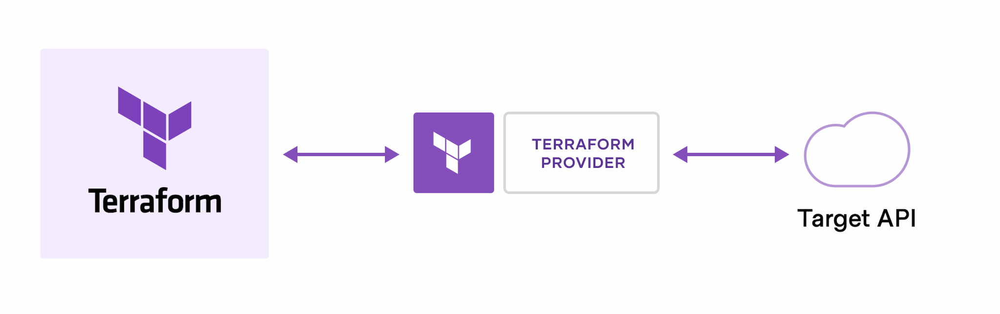
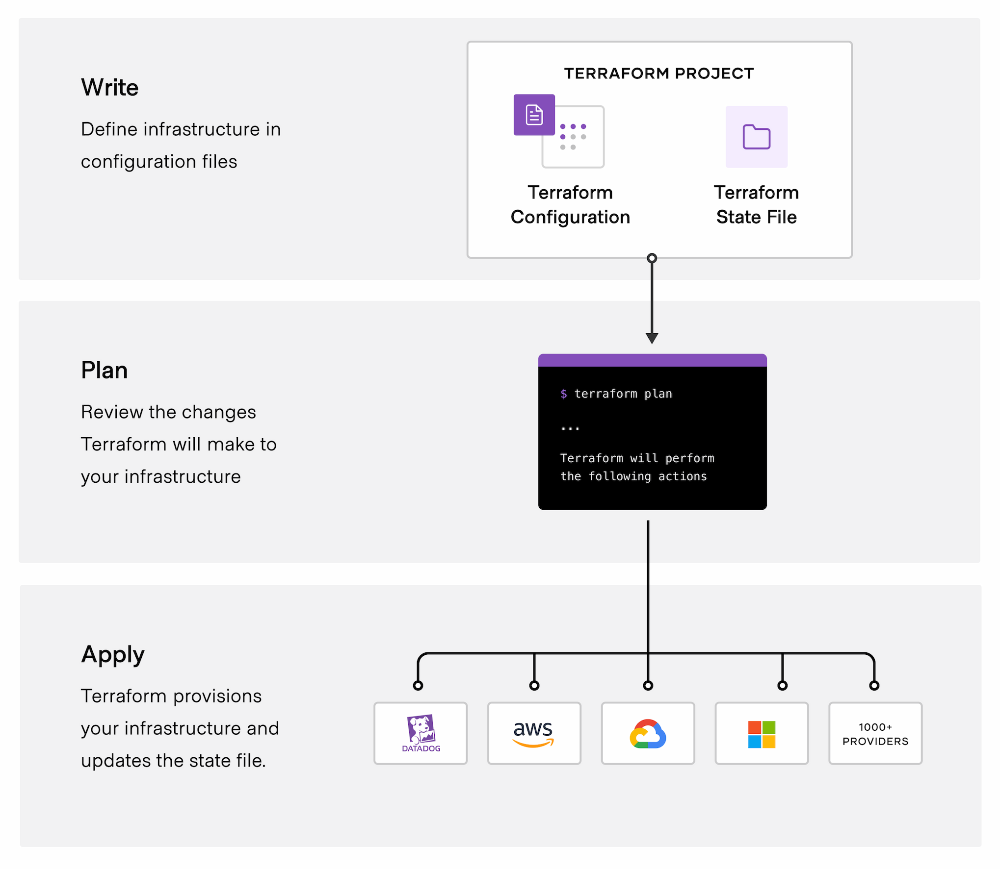

# What is Terraform? (Intro / Overview)

> **Source:** [developer.hashicorp.com/terraform/intro](https://developer.hashicorp.com/terraform/intro)
> **Added:** 2026-07-02
> **Source updated:** covers Terraform v1.15.x (latest at capture)
> **Tags:** iac, terraform, providers, workflow, state, modules
> **Type:** documentation

The official one-page framing of Terraform: what it is, how the provider/API model works, the Write→Plan→Apply loop, and the five reasons to use it.

## What is Terraform?

Terraform is an **infrastructure as code (IaC)** tool for building, changing, and versioning cloud and on-prem resources safely and efficiently.

- You define resources — cloud and on-prem — in **human-readable configuration files** that can be versioned, reused, and shared.
- A **consistent workflow** provisions and manages infrastructure across its whole lifecycle.
- Scope spans low-level components (compute, storage, networking) and high-level ones (DNS entries, SaaS features).

> HashiCorp co-founder Armon Dadgar narrates a short "how Terraform solves infrastructure challenges" video on the page.

## How does Terraform work?

Terraform creates and manages resources on cloud platforms and other services through their **APIs**. **Providers** are the plugins that let Terraform talk to virtually any platform or service with an accessible API.

*Terraform creates and manages cloud platforms and services through their APIs.*

- HashiCorp and the community have written **thousands of providers**; all public ones live in the **Terraform Registry**.
- Examples: AWS, Azure, GCP, Kubernetes, Helm, GitHub, Splunk, DataDog, and many more.

**The core workflow has three stages:**

- **Write** — define resources, possibly spanning multiple providers/services (e.g. an app on VMs inside a VPC with security groups and a load balancer).
- **Plan** — Terraform builds an execution plan of what it will create, update, or destroy, by diffing existing infrastructure against your configuration.
- **Apply** — on approval, Terraform performs the operations in dependency-correct order. E.g. if you change a VPC's properties *and* the VM count inside it, Terraform recreates the VPC before scaling the VMs.

*The three-step Write → Plan → Apply workflow.*

## Why Terraform?

Define and manage infrastructure in a consistent, repeatable way with versionable, shareable config files. Five pillars:

- **Manage any infrastructure** — providers for platforms you already use (or write your own). Terraform takes an **immutable** approach, reducing the complexity of upgrades/modifications.
- **Track your infrastructure** — plan + approval before any change; a **state file** records real infrastructure and acts as the source of truth Terraform diffs against.
- **Automate changes** — config is **declarative** (describes the end state, not step-by-step instructions). Terraform builds a **resource graph** for dependencies and creates/modifies non-dependent resources in **parallel**.
- **Standardize configurations** — reusable components called **modules** package configurable collections of infrastructure; use Registry modules or write your own.
- **Collaborate** — commit config to a VCS; **HCP Terraform** runs Terraform in a consistent environment with shared state, secret data, RBAC, and a private registry for modules and providers.

## Community

Questions in HashiCorp Discuss; contributions via the contributing guide; bugs/features via GitHub issues.

---
Related: informs the **B1 — Infrastructure as Code** milestone in the [learning path](../../learning-path.md); the Write/Plan/Apply loop underpins the core-workflow topic; state, providers, and modules each get their own later topics.
