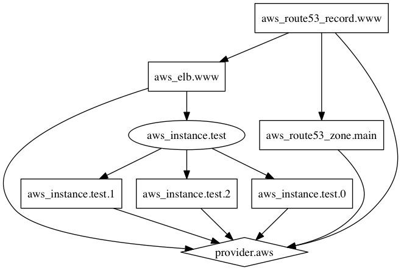
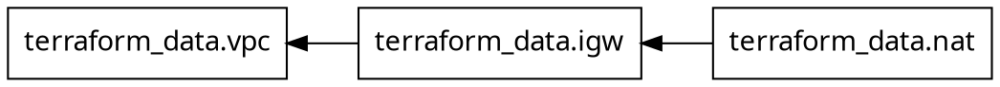

# `terraform graph` command

> **Source:** [developer.hashicorp.com/terraform/cli/commands/graph](https://developer.hashicorp.com/terraform/cli/commands/graph)
> **Added:** 2026-07-10
> **Source updated:** undated CLI reference; captured 2026-07-10 against v1.15.x (latest), re-fetched 2026-07-30 and byte-identical
> **Tags:** cli, graph, dag, dot, graphviz, cycles, dependencies
> **Type:** documentation

*Developer › Terraform › Terraform CLI › Inspecting Infrastructure › `graph` · v1.15.x*

Generates a visual representation of a configuration or execution plan in the **DOT language** (from Graphviz). The one command that shows you the dependency graph Terraform actually built. Referenced from [[tf-cli-commands]], captured here in full.

## Usage

```
terraform graph [options]
```

> "By default the result is a **simplified graph** which describes only the dependency ordering of the resources (`resource` and `data` blocks) in the configuration."

The `-type=...` option selects other graph types "which have more detail, at the expense of also exposing some of the **implementation details of the Terraform language runtime**."

## Options

| Option | Effect |
|---|---|
| `-type=...` | Show a specific operation graph instead of the simplified resources-only one. One of `plan`, `plan-refresh-only`, `plan-destroy`, `apply`. |
| `-plan=tfplan` | Graph the application of a saved plan file. Implies `-type=apply`. |
| `-draw-cycles` | Highlight cycles with colored edges. Helps diagnose cycle errors. **Only supported with an explicit `-type=...`.** |
| `-var 'NAME=VALUE'` | Set one root input variable. Repeatable. |
| `-var-file=FILENAME` | Set variables from a `.tfvars` file. Repeatable. |

## Rendering

DOT is machine-readable, not a picture. Pipe it to Graphviz:

```shell
terraform graph -type=plan | dot -Tpng >graph.png
```

Third-party online DOT renderers work too.

The page's own example of the result:

[](assets/tf-cmd-graph/01-plan-graph-example.png)
*The page's example plan graph, rendered with `dot`. Worth reading for the **shapes**, which the docs never explain: the diamond is the provider, the ellipse `aws_instance.test` is the resource's **expand** node, and the three boxes below it are its `count` instances `.0`/`.1`/`.2`. Everything points at `provider.aws`, which is the provider-configuration ordering the default resources-only graph omits entirely.*

## Verified behavior

Run locally against Terraform **v1.15.6** on a four-resource `terraform_data` config (no provider plugin needed).

**Default output** — resources only, one edge per dependency, `rankdir="RL"`:



Both edge kinds render identically. The graph does not distinguish an implicit reference edge from a `depends_on` edge.

**`-type=plan`** adds runtime nodes the default graph hides — the provider itself, `(expand)` nodes for each resource (where `count`/`for_each` fan out), and provider open/close ordering:

```dot
"[root] provider[\"terraform.io/builtin/terraform\"]" [label = "...", shape = "diamond"]
"[root] terraform_data.igw (expand)" [label = "terraform_data.igw", shape = "box"]
"[root] terraform_data.vpc (expand)" -> "[root] provider[\"terraform.io/builtin/terraform\"]"
```

!!! note "The `-type=` graphs use a different DOT dialect"
    The default graph writes `[label="x"]`; the `-type=` graphs write `[label = "x"]` with spaces, inside a `subgraph "root"`. Grepping for `label=` against a `-type=plan` graph silently matches nothing.

**`-draw-cycles`** on a two-resource cycle marks the offending edges red:

```dot
"[root] terraform_data.a (expand)" -> "[root] terraform_data.b (expand)" [color = "red", penwidth = "2.0"]
"[root] terraform_data.b (expand)" -> "[root] terraform_data.a (expand)" [color = "red", penwidth = "2.0"]
```

Terraform already refuses the plan with `Error: Cycle: terraform_data.a, terraform_data.b`. The flag matters on a large graph, where the error names the members but not which edges close the loop.

!!! warning "`-draw-cycles` without `-type=` is silently ignored"
    The docs say it "is supported only when selecting one of the real graph operation types." What that means in practice, verified on v1.15.6: passing `-draw-cycles` alone produces **no warning and exit 0**, and the default resources-only graph renders only **one** of the two cycle edges:

    ```dot
    "terraform_data.b" -> "terraform_data.a";   # the a -> b edge is simply absent
    ```

    So on the default graph a cycle is not merely un-highlighted — it is **invisible**. Always pair `-draw-cycles` with `-type=plan` (or another operation type).

!!! warning "The graph shows what Terraform knows, not what's true"
    Deleting a `depends_on` silently deletes its edge. Nothing warns; `terraform validate` still returns `Success! The configuration is valid.` A resource with a missing hidden dependency is indistinguishable from a resource that genuinely has none. Use `graph` to **confirm** a suspected edge, never to **discover** a missing one. See [[dependency-graph]] and [[tf-meta-depends-on]].

---
Related: [[dependency-graph]] — the topic page on investigating the DAG, including the state-file route. · [[tf-meta-depends-on]] — the edges you have to draw by hand. · [[tf-cli-commands]] — the command index that lists `graph` under Inspecting Infrastructure.
