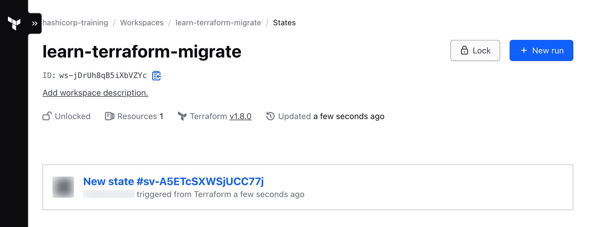
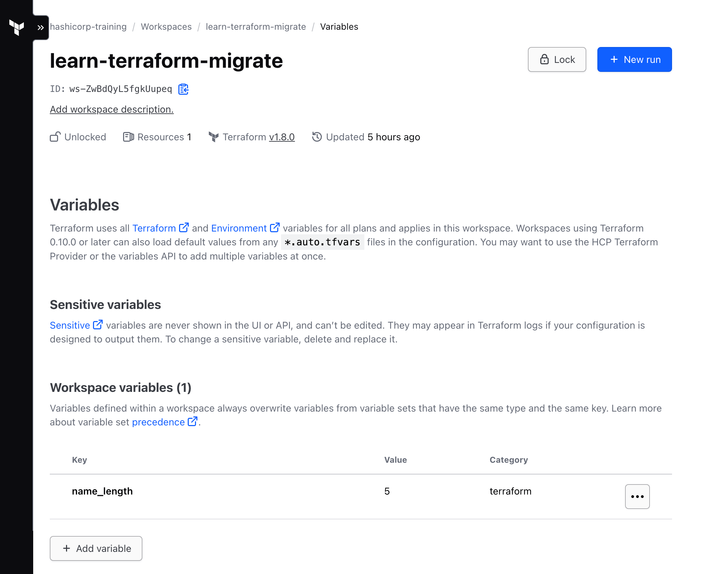
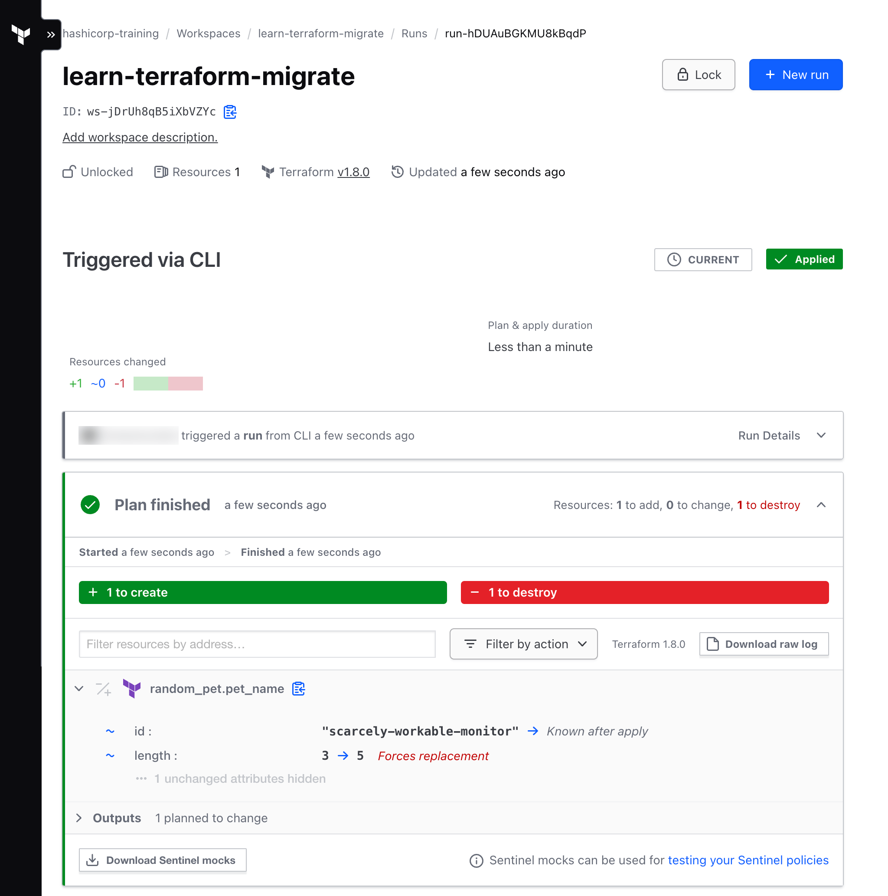

# Migrate state to HCP Terraform

> **Source:** [developer.hashicorp.com/terraform/tutorials/state/cloud-migrate](https://developer.hashicorp.com/terraform/tutorials/state/cloud-migrate)
> **Added:** 2026-08-18
> **Source updated:** undated tutorial (9 min); captured 2026-08-18
> **Tags:** state, migration, hcp-terraform, cloud-block, terraform-login, remote-operations, workspaces, init
> **Type:** documentation

Second tutorial in the **State** collection (sidebar: between *Import Terraform configuration* and *Manage resources in Terraform state*). The shortest end-to-end statement of the local-to-remote migration: write a `cloud` block, re-`init`, answer the copy-state prompt, delete the local file.

Two things make it unusually cheap to run. The example provisions a **`random_pet`**, so no cloud provider credentials are needed — only an HCP Terraform account. And the whole exercise is nine minutes. It is the hands-on counterpart to [[tf-state-remote]]'s argument for going remote, and to the `cloud` block reference in [[06-state-management]] §6.4.5.

Repo: `github.com/hashicorp-education/learn-state-migration`.

!!! warning "Match the CLI version that created the state"
    > "When uploading a state file to HCP Terraform using the steps in this tutorial, always use the same version of the Terraform CLI you used to create the resources. Using a newer version of Terraform may update the state file and cause state file corruption."

    This is the one constraint the tutorial states that the longer S3-backend material does not. A newer CLI may rewrite the snapshot on read, and the rewrite lands in the remote store.

## Prerequisites

- Terraform CLI **1.1 or higher**
- An HCP Terraform account

!!! note "Below 1.1 the block is different"
    > "Terraform versions older than 1.1 use the `remote` backend block to configure the CLI workflow and migrate state."

    So `cloud` is a 1.1-era replacement for `backend "remote"`, not a separate feature. [[tf-backend-configure]] records the other half of that relationship: `backend` and `cloud` are mutually exclusive in one configuration.

## Create state

The starting configuration — one `random_pet`, one input variable, one output:

```hcl
terraform {
  required_providers {
    random = {
      source  = "hashicorp/random"
      version = "3.3.2"
    }
  }
  required_version = ">= 1.1.0"
}

variable "name_length" {
  description = "The number of words in the pet name"
  default     = "3"
}

resource "random_pet" "pet_name" {
  length    = var.name_length
  separator = "-"
}

output "pet_name" {
  value = random_pet.pet_name.id
}
```

`terraform init` then `terraform apply`, confirming with `yes`. The apply creates the pet and prints it as an output. At this point state is local, in `terraform.tfstate`.

## Configure HCP Terraform integration

Add a `cloud` block, replacing `ORGANIZATION-NAME`:

```hcl
terraform {
  cloud {
    organization = "ORGANIZATION-NAME"
    workspaces {
      name = "learn-terraform-migrate"
    }
  }

  required_version = ">= 1.1.0"

  required_providers {
    random = {
      source  = "hashicorp/random"
      version = "3.3.2"
    }
  }
}
```

Three conditions stated in one sentence, all of them worth keeping:

> "While the organization defined in the `cloud` stanza must already exist, the workspace does not have to; HCP Terraform will create it if necessary. If you use an existing workspace, it must not have any existing states."

So the organization is a precondition, the workspace is created on demand, and an already-populated workspace is a hard stop rather than a merge.

!!! note "HCP workspaces are not CLI workspaces"
    > "Terraform CLI workspaces allow multiple state files to exist within a single directory, letting you use one configuration for multiple environments. HCP Terraform workspaces contain everything needed to manage a given set of infrastructure, and function like separate working directories."

    The same distinction [[tf-state-workspaces]] draws from the CLI side, and the [[workspaces]] topic page holds in full — including the `tags`-versus-`name` choice this tutorial does not exercise, since pinning `name` is what disables `terraform workspace` entirely.

## Authenticate with HCP Terraform

```shell
terraform login
```

The prompt spells out where the credential lands:

> "If login is successful, Terraform will store the token in plain text in the following file for use by subsequent commands: `/Users/username/.terraform.d/credentials.tfrc.json`"

Plain text, on disk, in the home directory. Confirm with `yes`.

## Migrate the state file

Re-run `terraform init`. Terraform detects the new backend and asks:

```
Initializing HCP Terraform...
Do you wish to proceed?
  As part of migrating to HCP Terraform, Terraform can optionally copy your
  current workspace state to the configured HCP Terraform workspace.

  Answer "yes" to copy the latest state snapshot to the configured
  HCP Terraform workspace.

  Answer "no" to ignore the existing state and just activate the configured
  HCP Terraform workspace with its existing state, if any.

  Should Terraform migrate your existing state?

  Enter a value: yes
```

Read the "no" branch carefully. It is not "cancel". It activates the workspace and adopts whatever state that workspace already holds, which may be none. That is the useful answer when the remote workspace is already authoritative and the local file is stale.

!!! tip "The tutorial skips the backup step the docs insist on"
    [[tf-backend-configure]] is explicit: **"Before migrating to a new backend, we strongly recommend manually backing up your state by copying your `terraform.tfstate` file to another location."** This tutorial never says it, and later tells you to `rm terraform.tfstate` outright. Copy the file somewhere first.

    That page also documents the non-interactive path, `-migrate-state` and `-reconfigure`, covered in [[06-state-management]] §6.4.6. This tutorial only ever shows the interactive prompt.

## Configure the HCP Terraform workspace

In the web UI, the workspace's **States** page lists the migrated state.

[](assets/tut-cloud-migrate/01-states-tab.png)
*The migrated snapshot appears as the workspace's current state.*

Then the **Variables** page: create a Terraform variable `name_length` with value `5`.

[](assets/tut-cloud-migrate/02-variables-tab.png)
*Input variables move from the CLI to the workspace once runs are remote.*

> "If the configuration relied on a cloud provider, you would set the provider credentials on this page as well."

That one line is the whole credential story for remote operations. The runner has no access to your local environment, so provider credentials become workspace variables.

## Initiate a run in the new workspace

Delete the local state file, then apply:

```shell
rm terraform.tfstate
```

```shell
terraform apply
```

The apply now runs remotely and streams back:

```
Running apply in HCP Terraform. Output will stream here. Pressing Ctrl-C
will cancel the remote apply if it's still pending. If the apply started it
will stop streaming the logs, but will not stop the apply running remotely.
```

`Ctrl-C` is therefore two different actions depending on timing. Before the apply starts it cancels the run; after it starts, it only detaches your log stream.

Because `name_length` is now `5` rather than the default `3`, the plan replaces the resource:

```
  # random_pet.pet_name must be replaced
-/+ resource "random_pet" "pet_name" {
      ~ id        = "ghastly-supreme-tuna" -> (known after apply)
      ~ length    = 3 -> 5 # forces replacement
        # (1 unchanged attribute hidden)
    }

Plan: 1 to add, 0 to change, 1 to destroy.
```

The confirmation prompt itself changes shape once runs are remote. It names the workspace:

```
Do you want to perform these actions in workspace "learn-terraform-migrate"?
```

[](assets/tut-cloud-migrate/03-remote-run.png)
*The same run visible in the UI while it waits for approval — the run-lifecycle queue [[tf-state-remote]] separates from ordinary state locking.*

## Destroy your infrastructure

`terraform destroy` runs remotely too, with its own workspace-named prompt:

```
Do you really want to destroy all resources in workspace "learn-terraform-migrate"?
```

Deleting the workspace afterwards is optional and lives in its settings page.

## Next steps

The tutorial points onward to migrating state from **multiple local workspaces**, connecting workspaces with **run triggers**, and **managing permissions** in HCP Terraform.

!!! warning "📌 Version note — old transcripts, stitched from several runs"
    The configuration pins `hashicorp/random` **3.3.2** (2022) and the remote run reports **Terraform v1.2.2**; current CLI is 1.15.x. Nothing about the `cloud` block or the migration prompt has changed, but the transcripts do not line up with each other, let alone with a current run:

    - the first `init` installs random **v3.3.2**, while the migration `init` reports "Using previously-installed hashicorp/random **v3.0.1**";
    - the pet id is `mostly-joint-lacewing` after the first apply but `ghastly-supreme-tuna` when the remote plan refreshes it.

    Read them as illustrations, not as a reproducible sequence.

!!! note "`rm terraform.tfstate` leaves the backup behind"
    Terraform also writes `terraform.tfstate.backup` locally. The tutorial removes only the primary file, so a stale copy of the pre-migration snapshot stays in the directory. Harmless, but it is not "the local state is gone".

---
Related: [[tf-state-remote]] — the conceptual case for remote state, and HCP's run queue as a stronger thing than a state lock. · [[tf-backend-configure]] — the backup precaution this tutorial omits, the `backend`/`cloud` exclusion, and the flag-driven migration path. · [[06-state-management]] — TID Ch 6 §6.4.5 for the `cloud` block reference and §6.4.6 for `-migrate-state`/`-reconfigure`. · [[tf-state-workspaces]] — CLI workspaces, the thing HCP workspaces are explicitly not. · [[workspaces]] — the topic page holding both models side by side. · [[tf-state-backends]] — what a backend owes you once state is remote.
