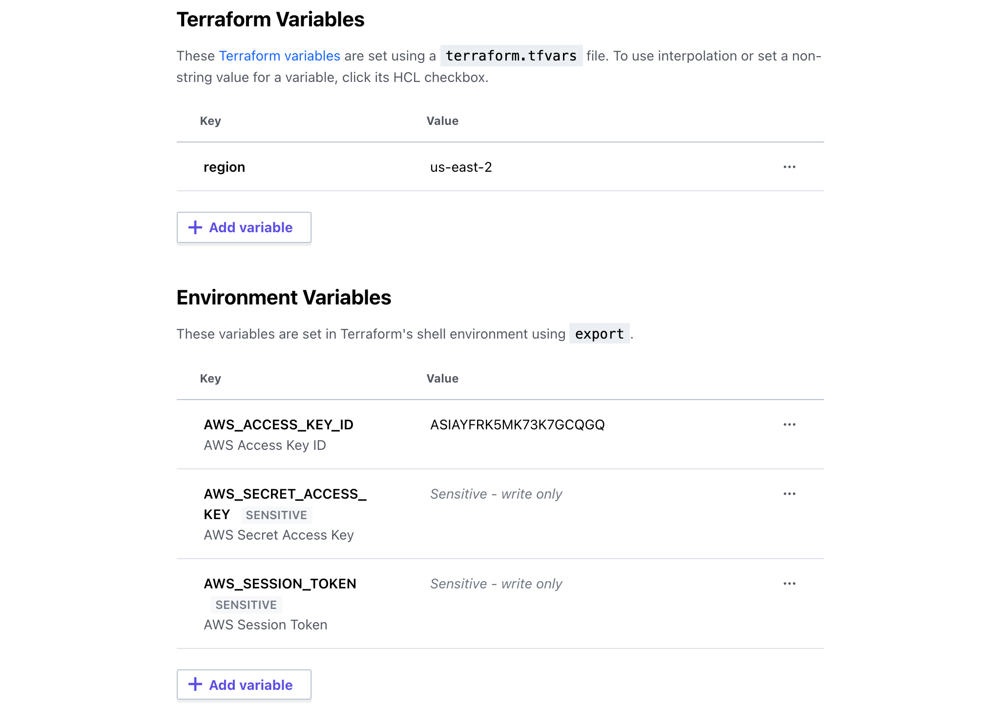
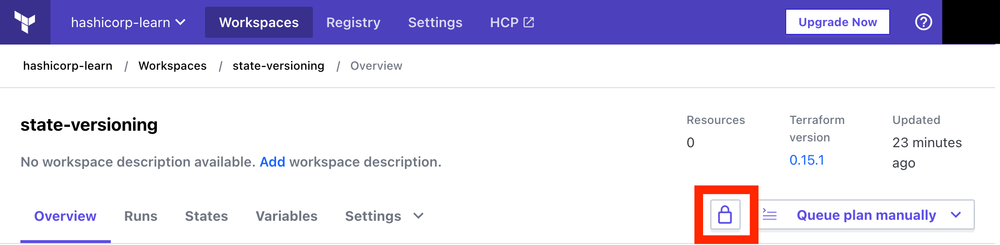
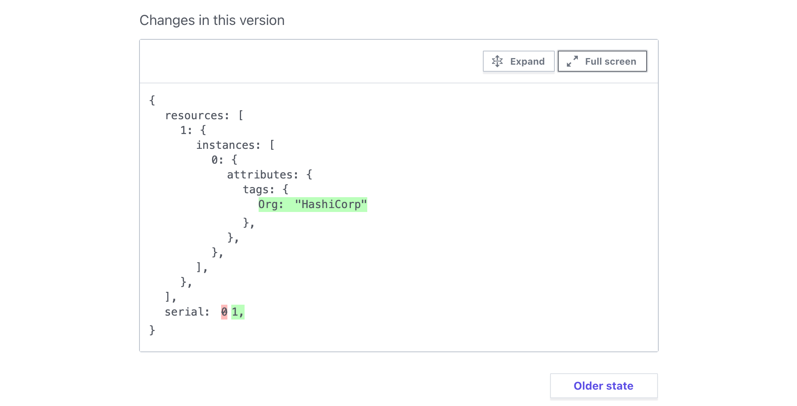

# Version remote state with the HCP Terraform API

> **Source:** [developer.hashicorp.com/terraform/tutorials/state/cloud-state-api](https://developer.hashicorp.com/terraform/tutorials/state/cloud-state-api)
> **Added:** 2026-08-18
> **Source updated:** undated tutorial (13 min); captured 2026-08-18
> **Tags:** state, hcp-terraform, api, state-versions, serial, lineage, md5, workspace-lock, disaster-recovery, drift, no-op-apply
> **Type:** documentation

Eighth tutorial in the **State** collection (sidebar: between *Manage resource lifecycle* and *Refresh state*). The disaster-recovery half of remote state, and the only piece of the collection that edits a state file on purpose.

The premise is worth keeping in full, because it is the argument for remote state that has nothing to do with collaboration:

> "Although Terraform takes steps to prevent state errors, your state file can get corrupted due to partial apply operations or incorrectly running `terraform import` or `terraform taint`. Using the HCP Terraform API, you can safely download, modify, and upload your state file to an HCP Terraform workspace."

So this is the repair path. [[tut-cloud-migrate]] gets state *into* HCP; this one changes what is already there, by creating a **new state version** through the API rather than by pushing a file with the CLI.

Repo: `github.com/hashicorp-education/learn-tfc-state-api`. Unlike [[tut-cloud-migrate]], this one costs real money and needs a real cloud account.

!!! warning "Editing state is a last resort, and the tutorial says so mid-exercise"
    > "We discourage directly editing state files. In production environments, you should only use this method as a last resort."

    The same position [[tf-state-backends]] takes about `terraform state push` — "extremely dangerous and should be avoided if possible."

## Prerequisites

- Terraform CLI **0.15.0+**
- Access to HCP Terraform or Terraform Enterprise
- An **AWS account** with credentials configured, plus the `awscli`
- `jq`

!!! note "Windows needs WSL"
    > "Windows users must install Windows Subsystem for Linux and start this tutorial in the Linux terminal."

    The helper scripts are bash and the payload builder shells out to `md5`/`md5sum` and `base64`. That is the real constraint, not the CLI itself.

## Clone and configure

The configuration is an EC2 instance plus a security group opening port 8080. The interesting file is `terraform.tf`, which points the directory at a workspace:

```hcl
terraform {
  required_version = "~> 1.10"

  required_providers {
    aws = {
      source  = "hashicorp/aws"
      version = ">= 5.82.2"
    }
  }

  cloud {
    organization = "<ORGANIZATION_NAME>"
    workspaces {
      name = "learn-terraform-state-api"
    }
  }
}
```

Then `terraform login` (same plaintext-token prompt [[tut-cloud-migrate]] records) and `terraform init`.

## Add AWS credentials to workspace variables

`region` goes in as a **Terraform variable**; `AWS_ACCESS_KEY_ID` and `AWS_SECRET_ACCESS_KEY` go in as **environment variables**, marked sensitive.

[](assets/tut-cloud-state-api/01-workspace-variables.png)
*Two different variable kinds on one page — Terraform variables feed `var.*`, environment variables feed the provider's credential chain.*

> "The `AWS_SESSION_TOKEN` is optional unless your organization requires it."

This is the concrete version of the one line [[tut-cloud-migrate]] states abstractly: once runs execute remotely, provider credentials are workspace configuration.

`terraform apply` then runs remotely and creates three resources. `terraform state list` confirms what landed:

```
data.aws_ami.ubuntu
aws_instance.example
aws_security_group.sg_web
aws_security_group_rule.sg_web
```

## Configure the workspace for API access

Two values, both exported as shell variables:

- **Workspace ID** — *Settings › General* in the workspace UI.
- **API token** — user icon › *Account Settings* › *Tokens* › *Create an API token*.

```shell
export WORKSPACE_ID=<YOUR-WORKSPACE-ID>
```

```shell
export TFC_TOKEN=<YOUR-TFC-TOKEN>
```

This is a **user** token, not the CLI credential from `terraform login`, and the distinction has teeth in the next step.

## Lock the workspace

[](assets/tut-cloud-state-api/02-lock-workspace.png)

Three separate facts in the tutorial's own sentences, all load-bearing:

> "Locking your workspace prevents other operations from running and potentially corrupting the state file you are going to download. **Your workspace needs to be locked before you can push a new state file via API.** You must lock the workspace **as the same user you generated the HCP Terraform token for** in the previous step."

So the lock is not merely good hygiene here. It is a precondition of the upload, and it is identity-scoped: a lock held by a different user blocks your token. That is a stricter thing than the state lock [[tf-state-locking]] describes, which is held by a command for the length of one operation rather than by a person across a manual editing session.

## Create the drift

The exercise deliberately changes AWS behind Terraform's back:

```shell
aws ec2 create-tags --region $(terraform output -raw region) --resources $(terraform output -raw instance_id) --tags Key=Org,Value=HashiCorp
```

> "Your new `Org` tag is set to HashiCorp in AWS, but your Terraform state file does not reflect this change."

Note what is *not* used to fix it. A refresh would reconcile this drift automatically. The tutorial reconciles it by hand instead, because the point is the API round-trip, not the drift.

## Download the state file

`helper_scripts/getstate.sh` is two calls — one to find the download URL, one to fetch it:

```bash
#!/bin/bash

HTTP_RESPONSE=$(curl \
     --header "Authorization: Bearer "$TFC_TOKEN"" \
     --header "Content-Type: application/vnd.api+json" \
     "https://app.terraform.io/api/v2/workspaces/"$WORKSPACE_ID"/current-state-version" | jq -r '.data | .attributes | ."hosted-state-download-url"')

curl -o state.tfstate $HTTP_RESPONSE
```

The state itself is not served inline. `current-state-version` returns metadata carrying a **`hosted-state-download-url`**, and that URL (an `archivist.terraform.io` object) is what holds the document.

> "If you are using Terraform Enterprise, change the URL from `app.terraform.io` to your personalized Terraform Enterprise domain."

## Modify and create the state payload

Two edits by hand. First, **increment `serial` by one**:

```diff
   "version": 4,
   "terraform_version": "1.10.3",
-  "serial": 0,
+  "serial": 1,
   "lineage": "b9b6c592-742c-c303-d1f7-8b2f8c935feb",
```

> "Terraform uses the serial to keep track of the changes made in each new state file and uses it to make sure your operations run against the correct known state file in the HCP Terraform workspace. In standard operations, Terraform updates the serial for you automatically. However, since you're pushing a new state version, you need to manually increment this value."

!!! note "This is the same +1 habit the docs and TID recommend, in a different clothing"
    [[tf-state-backends]] documents the two guards on a push — differing **lineage** is rejected, and a destination **serial** that is higher is rejected — and [[06-state-management]] §6.5.4 gives the safe restore habit: bump the backup's `serial` by 1 rather than reaching for `-force`, so every other check stays live. The API path here is that habit made mandatory, since nothing computes the value for you.

    What [[ch09-state-fundamentals]] adds, and neither the tutorial nor the docs say: `serial` counts **writes whose content differed**, not applies, so it is a reliable *ordering* key and nothing more. The tutorial's clean `0 → 1` is what a hand-edit looks like, not what a real run looks like.

Second, add the tag that AWS already has, in both `tags` and `tags_all`:

```diff
             "tags": {
-              "Name": "terraform-learn-state-versioning"
+              "Name": "terraform-learn-state-versioning",
+              "Org": "HashiCorp"
             },
             "tags_all": {
-              "Name": "terraform-learn-state-versioning"
+              "Name": "terraform-learn-state-versioning",
+              "Org": "HashiCorp"
             },
```

Then build the upload payload. The script differs by platform in exactly one line — the MD5 tool.

**macOS — `helper_scripts/createpayload.sh`**

```bash
#!/bin/bash

serial=$(cat state.tfstate | jq '.serial')
md5_compute=$(md5 -q state.tfstate)
md5=\"$md5_compute\"
lineage=$(cat state.tfstate | jq '.lineage')
base64_encode=$(base64 state.tfstate)
state=\"$base64_encode\"


echo "{
   \"data\": {
   \"type\": \"state-versions\",
     \"attributes\": {
       \"serial\": $serial,
       \"md5\": "$md5",
       \"lineage\": "$lineage",
       \"state\": "$state"
     }
   }
 }" > payload.json
```

**Windows or Linux — `helper_scripts/linux-createpayload.sh`**, identical except:

```bash
md5_compute=$(md5sum state.tfstate | awk '{print $1}')
```

The result is four attributes on a `state-versions` object:

```json
{
   "data": {
   "type": "state-versions",
     "attributes": {
       "serial": 1,
       "md5": "f51e44f5672b40725e283c1bd5556752",
       "lineage": "939c75bf-0872-6277-d273-3df86f7ac679",
       "state": "ewogICJ2ZXJzaW9uIjogNCwKICAidGVyc…"
     }
   }
}
```

`serial` and `lineage` are lifted out of the document *and* sent alongside it, which is how the server applies the same guards the CLI applies locally. The `md5` is an integrity check on the upload. `state` is the whole file, base64-encoded.

## Upload the new state version

```bash
#!/bin/bash

 HTTP_POST=$(curl \
     --header "Authorization: Bearer "$TFC_TOKEN"" \
     --header "Content-Type: application/vnd.api+json" \
     --request POST \
     --data @payload.json \
     "https://app.terraform.io/api/v2/workspaces/"$WORKSPACE_ID"/state-versions")

 echo $HTTP_POST
```

A successful POST returns the created version — `{"data":{"id":"sv-VBU3yeG5XMLgK5K6","type":"state-versions", …}}` — with its own `hosted-state-download-url`.

In the UI, the **States** tab shows the new version, and *Changes in this version* shows the diff.

[](assets/tut-cloud-state-api/03-state-changes.png)
*The workspace keeps every version, which is the fail-safe the tutorial opened with.*

Unlock the workspace afterwards.

## Update the configuration

State and reality now agree; the configuration does not. So add the tag there too:

```diff
   tags = {
     Name = "terraform-learn-state-versioning"
+    Org  = "HashiCorp"
   }
```

`terraform apply` then reports `No changes. Infrastructure is up-to-date.` — the tutorial names this a **"no-operation" or "no-op" apply**, and it is the proof that all three sides match.

Clean up the local copies afterwards, both of them:

```shell
rm helper_scripts/state.tfstate
```

```shell
rm helper_scripts/payload.json
```

> "Your `payload.json` file also contains an encrypted version of your state."

!!! danger "“Encrypted” is the wrong word here"
    `payload.json` holds the state **base64-encoded**, which is an encoding, not encryption — `base64 -d` reads it back with no key. Deleting the file is right; the reason given for it is not. Every plaintext value in the state is plaintext in that payload, which is the same exposure [[tf-manage-sensitive-data]] describes for state files generally.

## Destroy

Queue a destroy plan from *Settings › Destruction and Deletion*, confirm it, then delete the workspace from the same page.

## Next steps

Onward links: the HCP Terraform API documentation, the HCP Terraform Fundamentals tutorials, and the rest of the Terraform State tutorials.

!!! warning "📌 Version note — mixed vintages in the transcripts"
    `required_version` is `~> 1.10` and the downloaded state reports `terraform_version` **1.10.3**, but the final apply transcript prints **Terraform v0.15.1**, and the upload response is dated **2021-04-08**. The prerequisite is still stated as **0.15.0+**. The configuration was refreshed at some point and the surrounding output was not, so read the transcripts as illustrations. Current CLI is 1.15.x.

---
Related: [[tut-cloud-migrate]] — gets state into HCP in the first place; this is what you do to it afterwards. · [[tf-state-backends]] — the `lineage` and `serial` guards this payload feeds, and the CLI equivalent of what these scripts do by hand. · [[06-state-management]] — TID Ch 6 §6.3.3 for the anatomy of `serial`/`lineage`, §6.5.4 for the bump-by-one restore habit. · [[ch09-state-fundamentals]] — what `serial` actually counts, measured rather than described. · [[tf-state-locking]] — ordinary state locking, which the identity-scoped workspace lock here is stricter than. · [[tf-manage-sensitive-data]] — why the base64 payload is as sensitive as the state itself. · [[tf-cmd-refresh]] — the automatic way to reconcile the drift this tutorial fixes by hand.
