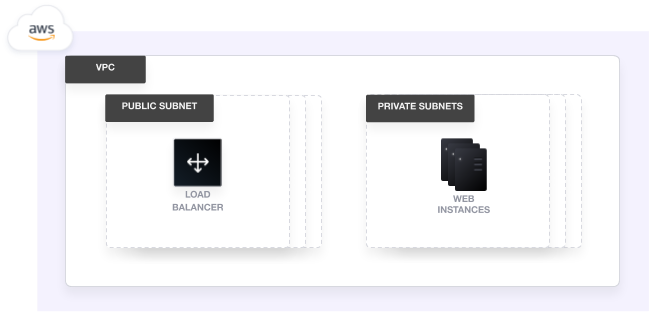

# Customize Terraform configuration with variables

> **Source:** [developer.hashicorp.com/terraform/tutorials/configuration-language/variables](https://developer.hashicorp.com/terraform/tutorials/configuration-language/variables)
> **Added:** 2026-07-13
> **Source updated:** undated tutorial (~20 min); captured 2026-07-13
> **Tags:** variables, types, list, map, tfvars, validation, interpolation, terraform-console, slice, regexall
> **Type:** documentation

Second **Configuration Language** tutorial, after [[tut-resource]]. The hands-on companion to the reference notes [[tf-input-variables]] and [[tf-block-variable]]: it walks every variable *type* on a real VPC + load balancer + EC2 stack, and — the part the reference pages don't show — uses **`terraform console`** to poke at values and functions (`slice`, `regexall`). Uses `git clone https://github.com/hashicorp-education/learn-terraform-variables`; needs Terraform 1.2+ and AWS credentials.

> Input variables are set **before** a run and don't change during `plan`/`apply`/`destroy` — they let users customize infrastructure safely instead of hand-editing config. Reference them as `var.<name>`; values must be **literal** — no resource attributes, expressions, or other variables.

[](assets/tut-variables/01-architecture.png)
*The deployed stack — a VPC with public/private subnets, a load balancer, and EC2 instances. Initial `apply` is 43 resources.*

## Parameterize an argument

Put declarations in `variables.tf` by convention. A `variable` block has three optional arguments the tutorial leans on: **`description`**, **`type`**, **`default`**. Recommendation: set description + type always, a default when practical. No default → a value is required (Terraform has no unassigned variables).

```hcl
variable "aws_region" {
  description = "AWS region"
  type        = string
  default     = "us-west-2"
}
```

Then swap the hard-coded value: `region = var.aws_region`. Re-`apply` shows **no changes** when the default equals the value it replaced.

## Variable types

The tutorial builds up the type system on real arguments:

- **`string`** — `aws_region`, `vpc_cidr_block`.
- **`number`** — `instance_count`. Terraform **converts types when possible**, so `"2"` (string) also works, but the correct type documents intent and catches errors early.
- **`bool`** — `enable_vpn_gateway` (true/false). Note the design point: leave some values hard-coded (`enable_nat_gateway = true`) and expose others — modules favor configurable, project configs may hard-code.

**Collection types** (multiple values of one type):

- **List** — ordered sequence, indexable from 0.
- **Map** — key→value lookup table (keys always strings).
- **Set** — unordered unique values.

**Structural types** (fixed shape, mixed types): **Tuple** (fixed-length typed sequence) and **Object** (fixed key set with typed values).

```hcl
variable "public_subnet_cidr_blocks" {
  description = "Available cidr blocks for public subnets."
  type        = list(string)
  default     = ["10.0.1.0/24", "10.0.2.0/24", "10.0.3.0/24", "…"]
}

variable "resource_tags" {
  description = "Tags to set for all resources"
  type        = map(string)
  default     = { project = "project-alpha", environment = "dev" }
}
```

List elements must share a type, but it can be complex (`list(list)`, `list(map)`).

## `terraform console` — inspect values and functions

`terraform console` opens an interactive REPL that evaluates expressions in the config's context — useful for debugging variables. (It **loads config only at startup** — exit and restart to pick up edits.)

```hcl
> var.private_subnet_cidr_blocks[1]          # index a list
"10.0.102.0/24"

> slice(var.private_subnet_cidr_blocks, 0, 3)  # slice(list, start, end-exclusive)
tolist(["10.0.101.0/24", "10.0.102.0/24", "10.0.103.0/24"])

> var.resource_tags["environment"]           # map key lookup
"dev"
```

`slice(list, start, end)` returns a new list from `start` up to (not including) `end`. Applied to the VPC module so users pick a subnet **count** without writing CIDRs:

```hcl
private_subnets = slice(var.private_subnet_cidr_blocks, 0, var.private_subnet_count)
public_subnets  = slice(var.public_subnet_cidr_blocks, 0, var.public_subnet_count)
```

## Assign values

Terraform requires a value for every variable. Ways to set them (last value wins by precedence — see the full order in [[tf-input-variables]]):

- **`-var` flag** — `terraform apply -var ec2_instance_type=t2.micro`. With Community Edition, Terraform **prompts** if a no-default variable isn't set.
- **`terraform.tfvars` / `*.auto.tfvars`** — auto-loaded from the working dir; HCL-like (or JSON) but no resource definitions.
- **`-var-file`** — name other files explicitly.
- **Environment variables** — `TF_VAR_*`.

```hcl
# terraform.tfvars
resource_tags = {
  project     = "project-alpha"
  environment = "dev"
  owner       = "me@example.com"
}
ec2_instance_type = "t3.micro"
instance_count    = 3
```

## String interpolation

Insert an expression into a string with `${…}` — variables, locals, function output:

```hcl
name = "web-sg-${var.resource_tags["project"]}-${var.resource_tags["environment"]}"
```

## Validate variables

A variable can carry **multiple `validation` blocks**. Here two rules keep the load-balancer name legal (AWS caps LB names at 32 chars, limited charset), using **`regexall()`** — takes a regex + string, returns the list of matches:

```hcl
variable "resource_tags" {
  type = map(string)
  default = { project = "my-project", environment = "dev" }

  validation {
    condition     = length(var.resource_tags["project"]) <= 16 && length(regexall("[^a-zA-Z0-9-]", var.resource_tags["project"])) == 0
    error_message = "The project tag must be no more than 16 characters, and only contain letters, numbers, and hyphens."
  }

  validation {
    condition     = length(var.resource_tags["environment"]) <= 8 && length(regexall("[^a-zA-Z0-9-]", var.resource_tags["environment"])) == 0
    error_message = "The environment tag must be no more than 8 characters, and only contain letters, numbers, and hyphens."
  }
}
```

The regex matches anything **other than** a letter/number/hyphen; requiring zero matches forbids invalid characters. A too-long value fails at plan with `Error: Invalid value for variable`, quoting the offending value and the rule's line. Validation catches config errors early.

`terraform destroy` tears down all 45 resources at the end.

---
Related: hands-on for [[tf-input-variables]] (assign/precedence) and [[tf-block-variable]] (types, `validation`) — this one adds the live `terraform console` workflow and the `slice`/`regexall` functions. Continues the Configuration Language collection from [[tut-resource]]. Feeds learning-path **B6** (variable types, `.tfvars`, validation) and **B7** (`terraform console`, `slice`, `regexall`, `${}` interpolation).
